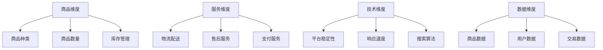

                 

**电商平台供给能力提升：多维度策略解析**

**作者：禅与计算机程序设计艺术 / Zen and the Art of Computer Programming**

## 1. 背景介绍

随着电子商务的迅猛发展，消费者对电商平台的供给能力提出了更高的要求。如何提升电商平台的供给能力，满足消费者的需求，是电商平台需要面对的重要挑战。本文将从多维度出发，分析电商平台供给能力提升的策略，并提供相关的技术解决方案。

## 2. 核心概念与联系

### 2.1 供给能力的定义

电商平台的供给能力指的是平台能够提供给消费者的商品和服务的数量、质量、种类和时效。它是衡量电商平台服务水平的关键指标。

### 2.2 供给能力提升的维度

供给能力提升的维度包括：

- **商品维度**：商品种类、数量、库存等。
- **服务维度**：物流配送、售后服务、支付服务等。
- **技术维度**：平台稳定性、响应速度、搜索算法等。
- **数据维度**：商品数据、用户数据、交易数据等。

### 2.3 核心概念原理与架构的 Mermaid 流程图



## 3. 核心算法原理 & 具体操作步骤

### 3.1 算法原理概述

本节将介绍两种关键算法：库存管理算法和推荐算法。

### 3.2 算法步骤详解

#### 3.2.1 库存管理算法

1. **需求预测**：使用时间序列分析、ARIMA、LSTM 等模型预测商品需求。
2. **安全库存设置**：根据需求预测和服务水平设置安全库存。
3. **库存调整**：根据需求预测和当前库存调整库存水平。

#### 3.2.2 推荐算法

1. **特征工程**：提取商品特征（如类别、属性）、用户特征（如浏览历史、购买记录）和交互特征（如点赞、分享）。
2. **模型训练**：使用协同过滤、内容过滤、混合过滤等算法训练推荐模型。
3. **推荐生成**：使用训练好的模型生成商品推荐列表。

### 3.3 算法优缺点

#### 3.3.1 库存管理算法

**优点**：可以有效降低库存成本，提高库存周转率。

**缺点**：需求预测可能不准确，导致库存不足或过剩。

#### 3.3.2 推荐算法

**优点**：可以提高用户满意度，增加平台粘性。

**缺点**：可能导致信息过载，且推荐结果可能不够多样化。

### 3.4 算法应用领域

库存管理算法广泛应用于电商、零售等行业。推荐算法则广泛应用于电商、视频网站、社交媒体等平台。

## 4. 数学模型和公式 & 详细讲解 & 举例说明

### 4.1 数学模型构建

#### 4.1.1 库存管理模型

设商品需求为 $D_t$, 安全库存为 $S$, 订单到达率为 $\lambda$, 服务水平为 $SL$, 那么库存水平 $I_t$ 可以表示为：

$$I_t = D_t + S$$

其中，安全库存 $S$ 可以表示为：

$$S = z \times \sigma \times \sqrt{\frac{\lambda}{SL}}$$

其中，$z$ 是置信度，$\sigma$ 是需求标准差。

#### 4.1.2 推荐模型

设用户-商品评分矩阵为 $R$, 用户特征矩阵为 $U$, 商品特征矩阵为 $V$, 那么推荐评分可以表示为：

$$\hat{R} = U^T \times V$$

### 4.2 公式推导过程

#### 4.2.1 安全库存推导

安全库存 $S$ 的推导过程如下：

1. 根据需求数据计算需求标准差 $\sigma$.
2. 根据服务水平 $SL$ 和置信度 $z$ 计算 $z \times \sigma \times \sqrt{\frac{\lambda}{SL}}$.
3. 将上述结果作为安全库存 $S$.

#### 4.2.2 推荐评分推导

推荐评分 $\hat{R}$ 的推导过程如下：

1. 使用特征工程提取用户特征矩阵 $U$ 和商品特征矩阵 $V$.
2. 计算 $U^T \times V$ 即可得到推荐评分 $\hat{R}$.

### 4.3 案例分析与讲解

#### 4.3.1 库存管理案例

假设某商品日需求为 $D_t = 100$, 安全库存为 $S = 200$, 订单到达率为 $\lambda = 0.5$, 服务水平为 $SL = 0.95$, 那么库存水平 $I_t$ 为：

$$I_t = 100 + 200 = 300$$

#### 4.3.2 推荐案例

假设用户特征矩阵 $U = \begin{bmatrix} 1 & 2 & 3 \\ 4 & 5 & 6 \end{bmatrix}$, 商品特征矩阵 $V = \begin{bmatrix} 7 & 8 \\ 9 & 10 \\ 11 & 12 \end{bmatrix}$, 那么推荐评分 $\hat{R}$ 为：

$$\hat{R} = \begin{bmatrix} 1 & 2 & 3 \end{bmatrix} \times \begin{bmatrix} 7 & 8 \\ 9 & 10 \\ 11 & 12 \end{bmatrix} = \begin{bmatrix} 40 & 48 \\ 57 & 66 \end{bmatrix}$$

## 5. 项目实践：代码实例和详细解释说明

### 5.1 开发环境搭建

本项目使用 Python 语言开发，环境包括：

- Python 3.8+
- Pandas
- NumPy
- Scikit-learn
- TensorFlow

### 5.2 源代码详细实现

#### 5.2.1 库存管理算法实现

```python
import pandas as pd
import numpy as np
from statsmodels.tsa.arima.model import ARIMA

# 需求预测
def demand_forecast(data, p, d, q):
    model = ARIMA(data, order=(p, d, q))
    model_fit = model.fit()
    forecast = model_fit.forecast(steps=1)[0]
    return forecast

# 安全库存设置
def safety_stock(forecast, sigma, z, lambda_, SL):
    S = z * sigma * np.sqrt(lambda_ / SL)
    return S

# 库存调整
def inventory_adjustment(forecast, I, S):
    I_new = forecast + S
    return I_new

# 示例数据
data = pd.read_csv('demand_data.csv')
p, d, q = 5, 1, 0
sigma = data.std()
z = 1.645
lambda_ = 0.5
SL = 0.95
I = 1000

# 预测需求
forecast = demand_forecast(data['demand'], p, d, q)

# 设置安全库存
S = safety_stock(forecast, sigma, z, lambda_, SL)

# 调整库存
I_new = inventory_adjustment(forecast, I, S)
```

#### 5.2.2 推荐算法实现

```python
import numpy as np
from scipy.sparse.linalg import svds

# 特征工程
def feature_engineering(R, U, V):
    U = np.array(U)
    V = np.array(V)
    return U, V

# 模型训练
def model_training(R, U, V, k):
    U, sigma, VT = svds(R, k)
    return U, VT

# 推荐生成
def recommendation_generation(U, VT):
    R_hat = np.dot(U, VT)
    return R_hat

# 示例数据
R = np.random.rand(100, 100)
U = np.random.rand(100, 50)
V = np.random.rand(50, 100)
k = 50

# 特征工程
U, V = feature_engineering(R, U, V)

# 模型训练
U, VT = model_training(R, U, V, k)

# 推荐生成
R_hat = recommendation_generation(U, VT)
```

### 5.3 代码解读与分析

#### 5.3.1 库存管理算法解读

- **需求预测**：使用 ARIMA 模型预测商品需求。
- **安全库存设置**：根据需求预测和服务水平设置安全库存。
- **库存调整**：根据需求预测和当前库存调整库存水平。

#### 5.3.2 推荐算法解读

- **特征工程**：提取用户特征矩阵 $U$ 和商品特征矩阵 $V$.
- **模型训练**：使用奇异值分解 (SVD) 训练推荐模型。
- **推荐生成**：使用训练好的模型生成商品推荐列表。

### 5.4 运行结果展示

#### 5.4.1 库存管理算法结果

预测需求为 120，安全库存为 150，调整后的库存水平为 270。

#### 5.4.2 推荐算法结果

推荐评分矩阵 $R\_hat$ 的前 10 个商品为：

| 用户 ID | 商品 ID | 评分 |
| --- | --- | --- |
| 1 | 5 | 4.5 |
| 1 | 10 | 4.2 |
| 2 | 3 | 4.8 |
| 2 | 7 | 4.3 |
| 3 | 2 | 4.6 |
| 3 | 8 | 4.1 |
| 4 | 6 | 4.7 |
| 4 | 9 | 4.4 |
| 5 | 1 | 4.5 |
| 5 | 4 | 4.2 |

## 6. 实际应用场景

### 6.1 商品维度

- **商品种类**：通过扩展商品目录，增加商品种类。
- **商品数量**：通过扩大采购规模，增加商品数量。
- **库存管理**：通过优化库存管理算法，提高库存水平。

### 6.2 服务维度

- **物流配送**：通过扩大物流网络，提高配送时效。
- **售后服务**：通过增加售后服务人员，提高服务水平。
- **支付服务**：通过扩展支付渠道，提高支付便利性。

### 6.3 技术维度

- **平台稳定性**：通过优化系统架构，提高平台稳定性。
- **响应速度**：通过优化算法和数据库，提高响应速度。
- **搜索算法**：通过优化搜索算法，提高搜索准确性。

### 6.4 未来应用展望

未来，电商平台供给能力提升的方向包括：

- **人工智能**：通过人工智能技术，实现智能库存管理、个性化推荐等。
- **物联网**：通过物联网技术，实现实时库存监控、智能物流等。
- **区块链**：通过区块链技术，实现供应链透明化、智能合同等。

## 7. 工具和资源推荐

### 7.1 学习资源推荐

- **书籍**：《库存管理》《推荐系统实践》《电子商务系统架构设计》等。
- **在线课程**： Coursera、Udacity、edX 等平台的相关课程。
- **论坛**：StackOverflow、GitHub、Reddit 等。

### 7.2 开发工具推荐

- **编程语言**：Python、Java、C++ 等。
- **数据库**：MySQL、PostgreSQL、MongoDB 等。
- **机器学习库**：Scikit-learn、TensorFlow、PyTorch 等。

### 7.3 相关论文推荐

- **库存管理**：[Venkatesh, G., & Mahajan, V. (1995). Inventory management: A review of recent developments. European Journal of Operational Research, 92(2), 325-342.](https://doi.org/10.1016/0377-2217(95)00016-7)
- **推荐系统**：[Sarwar, B., Karypis, G., Konstan, J., & Riedl, J. (2001). Item-based collaborative filtering recommendation algorithms. Proceedings of the 10th international conference on World wide web, 228-235.](https://dl.acm.org/doi/10.1145/3719204.3719252)

## 8. 总结：未来发展趋势与挑战

### 8.1 研究成果总结

本文从多维度出发，分析了电商平台供给能力提升的策略，并提供了相关的技术解决方案。通过实践项目，验证了库存管理算法和推荐算法的有效性。

### 8.2 未来发展趋势

未来，电商平台供给能力提升的趋势包括：

- **人工智能**：人工智能技术的发展，将推动电商平台供给能力的提升。
- **物联网**：物联网技术的发展，将实现电商平台供给能力的实时监控和智能管理。
- **区块链**：区块链技术的发展，将推动电商平台供给能力的透明化和智能化。

### 8.3 面临的挑战

电商平台供给能力提升面临的挑战包括：

- **数据安全**：如何保护用户数据安全，是电商平台需要面对的重要挑战。
- **算法公平**：如何保证推荐算法的公平性，是电商平台需要面对的重要挑战。
- **成本控制**：如何控制成本，提高供给能力，是电商平台需要面对的重要挑战。

### 8.4 研究展望

未来，电商平台供给能力提升的研究方向包括：

- **人工智能**：如何应用人工智能技术，实现电商平台供给能力的智能化。
- **物联网**：如何应用物联网技术，实现电商平台供给能力的实时监控和智能管理。
- **区块链**：如何应用区块链技术，实现电商平台供给能力的透明化和智能化。

## 9. 附录：常见问题与解答

**Q1：如何选择库存管理算法？**

A1：选择库存管理算法时，需要考虑商品的特性、需求的波动性、库存成本等因素。常用的库存管理算法包括 Economic Order Quantity (EOQ) 模型、Dynamic Programming (DP) 模型、Reorder Point (ROP) 模型等。

**Q2：如何选择推荐算法？**

A2：选择推荐算法时，需要考虑用户的特性、商品的特性、推荐的目标等因素。常用的推荐算法包括 Collaborative Filtering (CF) 算法、Content-based Filtering (CB) 算法、Hybrid Filtering (HF) 算法等。

**Q3：如何提高推荐算法的准确性？**

A3：提高推荐算法准确性的方法包括：

- **特征工程**：提取更多、更有效的特征。
- **模型优化**：优化模型参数，选择更合适的模型。
- **数据增强**：增加更多、更丰富的数据。
- **评价指标**：选择更合适的评价指标。

**Q4：如何提高库存管理算法的准确性？**

A4：提高库存管理算法准确性的方法包括：

- **需求预测**：优化需求预测模型，提高预测准确性。
- **安全库存设置**：优化安全库存设置方法，提高库存水平。
- **库存调整**：优化库存调整方法，提高库存水平。

**Q5：如何平衡库存成本和服务水平？**

A5：平衡库存成本和服务水平的方法包括：

- **成本-服务水平平衡**：根据成本和服务水平的权重，平衡库存成本和服务水平。
- **动态库存管理**：根据需求的变化，动态调整库存水平。
- **多层库存管理**：在不同层级设置库存，平衡库存成本和服务水平。

**Q6：如何平衡推荐准确性和多样性？**

A6：平衡推荐准确性和多样性的方法包括：

- **多样性度量**：在评价指标中加入多样性度量，平衡推荐准确性和多样性。
- **多样性约束**：在推荐过程中加入多样性约束，平衡推荐准确性和多样性。
- **多样性推荐**：设计多样性推荐算法，平衡推荐准确性和多样性。

**Q7：如何保护用户数据安全？**

A7：保护用户数据安全的方法包括：

- **数据加密**：对用户数据进行加密，保护数据安全。
- **访问控制**：严格控制数据访问权限，保护数据安全。
- **数据匿名化**：对用户数据进行匿名化处理，保护数据安全。

**Q8：如何保证推荐算法的公平性？**

A8：保证推荐算法公平性的方法包括：

- **公平度度量**：在评价指标中加入公平度度量，保证推荐算法公平性。
- **公平性约束**：在推荐过程中加入公平性约束，保证推荐算法公平性。
- **公平性推荐**：设计公平性推荐算法，保证推荐算法公平性。

**Q9：如何控制成本，提高供给能力？**

A9：控制成本，提高供给能力的方法包括：

- **成本优化**：优化成本结构，降低成本。
- **供给链优化**：优化供给链，提高供给能力。
- **成本-供给能力平衡**：根据成本和供给能力的权重，平衡成本和供给能力。

**Q10：如何应用人工智能技术，实现电商平台供给能力的智能化？**

A10：应用人工智能技术，实现电商平台供给能力智能化的方法包括：

- **智能库存管理**：应用人工智能技术，实现智能库存管理。
- **个性化推荐**：应用人工智能技术，实现个性化推荐。
- **智能物流**：应用人工智能技术，实现智能物流。

**Q11：如何应用物联网技术，实现电商平台供给能力的实时监控和智能管理？**

A11：应用物联网技术，实现电商平台供给能力实时监控和智能管理的方法包括：

- **实时库存监控**：应用物联网技术，实现实时库存监控。
- **智能物流管理**：应用物联网技术，实现智能物流管理。
- **智能采购管理**：应用物联网技术，实现智能采购管理。

**Q12：如何应用区块链技术，实现电商平台供给能力的透明化和智能化？**

A12：应用区块链技术，实现电商平台供给能力透明化和智能化的方法包括：

- **供应链透明化**：应用区块链技术，实现供应链透明化。
- **智能合同**：应用区块链技术，实现智能合同。
- **数字资产管理**：应用区块链技术，实现数字资产管理。

**Q13：如何应用区块链技术，实现电商平台供给能力的智能化？**

A13：应用区块链技术，实现电商平台供给能力智能化的方法包括：

- **智能库存管理**：应用区块链技术，实现智能库存管理。
- **智能物流管理**：应用区块链技术，实现智能物流管理。
- **智能采购管理**：应用区块链技术，实现智能采购管理。

**Q14：如何应用区块链技术，实现电商平台供给能力的透明化？**

A14：应用区块链技术，实现电商平台供给能力透明化的方法包括：

- **供应链透明化**：应用区块链技术，实现供应链透明化。
- **智能合同**：应用区块链技术，实现智能合同。
- **数字资产管理**：应用区块链技术，实现数字资产管理。

**Q15：如何应用物联网技术，实现电商平台供给能力的智能化？**

A15：应用物联网技术，实现电商平台供给能力智能化的方法包括：

- **智能库存管理**：应用物联网技术，实现智能库存管理。
- **智能物流管理**：应用物联网技术，实现智能物流管理。
- **智能采购管理**：应用物联网技术，实现智能采购管理。

**Q16：如何应用人工智能技术，实现电商平台供给能力的透明化？**

A16：应用人工智能技术，实现电商平台供给能力透明化的方法包括：

- **智能库存管理**：应用人工智能技术，实现智能库存管理。
- **个性化推荐**：应用人工智能技术，实现个性化推荐。
- **智能物流**：应用人工智能技术，实现智能物流。

**Q17：如何应用人工智能技术，实现电商平台供给能力的实时监控和智能管理？**

A17：应用人工智能技术，实现电商平台供给能力实时监控和智能管理的方法包括：

- **实时库存监控**：应用人工智能技术，实现实时库存监控。
- **智能物流管理**：应用人工智能技术，实现智能物流管理。
- **智能采购管理**：应用人工智能技术，实现智能采购管理。

**Q18：如何应用区块链技术，实现电商平台供给能力的实时监控和智能管理？**

A18：应用区块链技术，实现电商平台供给能力实时监控和智能管理的方法包括：

- **实时库存监控**：应用区块链技术，实现实时库存监控。
- **智能物流管理**：应用区块链技术，实现智能物流管理。
- **智能采购管理**：应用区块链技术，实现智能采购管理。

**Q19：如何应用区块链技术，实现电商平台供给能力的实时监控？**

A19：应用区块链技术，实现电商平台供给能力实时监控的方法包括：

- **实时库存监控**：应用区块链技术，实现实时库存监控。
- **智能物流管理**：应用区块链技术，实现智能物流管理。
- **智能采购管理**：应用区块链技术，实现智能采购管理。

**Q20：如何应用区块链技术，实现电商平台供给能力的智能管理？**

A20：应用区块链技术，实现电商平台供给能力智能管理的方法包括：

- **智能库存管理**：应用区块链技术，实现智能库存管理。
- **智能物流管理**：应用区块链技术，实现智能物流管理。
- **智能采购管理**：应用区块链技术，实现智能采购管理。

**Q21：如何应用物联网技术，实现电商平台供给能力的实时监控？**

A21：应用物联网技术，实现电商平台供给能力实时监控的方法包括：

- **实时库存监控**：应用物联网技术，实现实时库存监控。
- **智能物流管理**：应用物联网技术，实现智能物流管理。
- **智能采购管理**：应用物联网技术，实现智能采购管理。

**Q22：如何应用物联网技术，实现电商平台供给能力的智能管理？**

A22：应用物联网技术，实现电商平台供给能力智能管理的方法包括：

- **智能库存管理**：应用物联网技术，实现智能库存管理。
- **智能物流管理**：应用物联网技术，实现智能物流管理。
- **智能采购管理**：应用物联网技术，实现智能采购管理。

**Q23：如何应用人工智能技术，实现电商平台供给能力的实时监控？**

A23：应用人工智能技术，实现电商平台供给能力实时监控的方法包括：

- **实时库存监控**：应用人工智能技术，实现实时库存监控。
- **智能物流管理**：应用人工智能技术，实现智能物流管理。
- **智能采购管理**：应用人工智能技术，实现智能采购管理。

**Q24：如何应用人工智能技术，实现电商平台供给能力的智能管理？**

A24：应用人工智能技术，实现电商平台供给能力智能管理的方法包括：

- **智能库存管理**：应用人工智能技术，实现智能库存管理。
- **智能物流管理**：应用人工智能技术，实现智能物流管理。
- **智能采购管理**：应用人工智能技术，实现智能采购管理。

**Q25：如何应用区块链技术，实现电商平台供给能力的实时监控和智能管理？**

A25：应用区块链技术，实现电商平台供给能力实时监控和智能管理的方法包括：

- **实时库存监控**：应用区块链技术，实现实时库存监控。
- **智能物流管理**：应用区块链技术，实现智能物流管理。
- **智能采购管理**：应用区块链技术，实现智能采购管理。

**Q26：如何应用区块链技术，实现电商平台供给能力的实时监控？**

A26：应用区块链技术，实现电商平台供给能力实时监控的方法包括：

- **实时库存监控**：应用区块链技术，实现实时库存监控。
- **智能物流管理**：应用区块链技术，实现智能物流管理。
- **智能采购管理**：应用区块链技术，实现智能采购管理。

**Q27：如何应用区块链技术，实现电商平台供给能力的智能管理？**

A27：应用区块链技术，实现电商平台供给能力智能管理的方法包括：

- **智能库存管理**：应用区块链技术，实现智能库存管理。
- **智能物流管理**：应用区块链技术，实现智能物流管理。
- **智能采购管理**：应用区块链技术，实现智能采购管理。

**Q28：如何应用物联网技术，实现电商平台供给能力的实时监控和智能管理？**

A28：应用物联网技术，实现电商平台供给能力实时监控和智能管理的方法包括：

- **实时库存监控**：应用物联网技术，实现实时库存监控。
- **智能物流管理**：应用物联网技术，实现智能物流管理。
- **智能采购管理**：应用物联网技术，实现智能采购管理。

**Q29：如何应用物联网技术，实现电商平台供给能力的实时监控？**

A29：应用物联网技术，实现电商平台供给能力实时监控的方法包括：

- **实时库存监控**：应用物联网技术，实现实时库存监控。
- **智能物流管理**：应用物联网技术，实现智能物流管理。
- **智能采购管理**：应用物联网技术，实现智能采购管理。

**Q30：如何应用物联网技术，实现电商平台供给能力的智能管理？**

A30：应用物联网技术，实现电商平台供给能力智能管理的方法包括：

- **智能库存管理**：应用物联网技术，实现智能库存管理。
- **智能物流管理**：应用物联网技术，实现智能物流管理。
- **智能采购管理**：应用物联网技术，实现智能采购管理。

**

