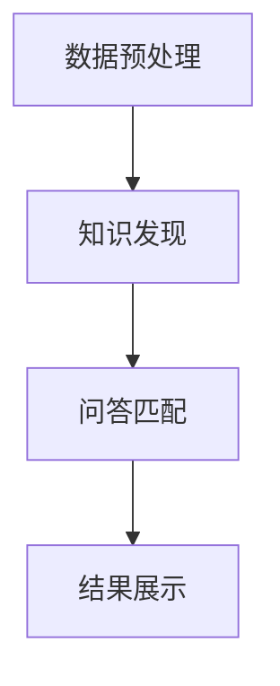

                 

**知识发现引擎的智能问答系统集成**

**作者：禅与计算机程序设计艺术 / Zen and the Art of Computer Programming**

## 1. 背景介绍

随着信息爆炸时代的到来，海量的数据和信息给我们的生活和工作带来了巨大的便利，但同时也带来了信息过载的挑战。如何从海量数据中提取有用的信息，并以一种易于理解和使用的方式呈现给用户，成为了当前信息技术领域的一个关键问题。知识发现引擎（Knowledge Discovery Engine, KDE）和智能问答系统（Intelligent Question Answering System, IQAS）的集成，为解决这个问题提供了一个有效的途径。

## 2. 核心概念与联系

### 2.1 核心概念原理

知识发现引擎（KDE）是一种从大规模数据集中自动提取有用模式和知识的系统。智能问答系统（IQAS）则是一种能够理解自然语言问句，并自动生成相应答案的系统。二者的集成，可以实现从大规模数据中自动提取有用信息，并以一种易于理解和使用的方式呈现给用户的功能。


上图是KDE-IQAS集成架构的Mermaid流程图，其中包含数据预处理、知识发现、问答匹配和结果展示四个主要模块。

### 2.2 KDE-IQAS集成架构

KDE-IQAS集成架构如下图所示：



在数据预处理模块中，原始数据被清洗、转换和整合，以便于后续的知识发现。知识发现模块则使用各种数据挖掘算法，从预处理后的数据中提取有用的模式和知识。问答匹配模块则使用自然语言处理技术，将用户的问句转换为可以与知识库匹配的查询。最后，结果展示模块则将匹配到的答案以一种易于理解和使用的方式呈现给用户。

## 3. 核心算法原理与具体操作步骤

### 3.1 算法原理概述

KDE-IQAS集成的核心算法包括数据挖掘算法和自然语言处理算法。数据挖掘算法用于从大规模数据集中提取有用模式和知识，而自然语言处理算法则用于理解用户的问句，并生成相应的查询。

### 3.2 算法步骤详解

#### 3.2.1 数据预处理

1. 数据清洗：去除原始数据中的噪声和错误数据。
2. 数据转换：将原始数据转换为可以被数据挖掘算法处理的格式。
3. 数据整合：将来自不同来源的数据整合为一个统一的数据集。

#### 3.2.2 知识发现

1. 特征选择：从预处理后的数据中选择有用的特征。
2. 模式挖掘：使用数据挖掘算法（如关联规则、分类、聚类等）从数据中提取有用模式和知识。
3. 模式评估：对挖掘出的模式进行评估，并筛选出有意义的模式。

#### 3.2.3 问答匹配

1. 问句分析：使用自然语言处理技术（如分词、词性标注、依赖句法分析等）分析用户的问句。
2. 查询生成：将分析后的问句转换为可以与知识库匹配的查询。
3. 匹配：将查询与知识库中的模式进行匹配，并筛选出最相关的模式。

#### 3.2.4 结果展示

1. 结果排序：对匹配到的模式进行排序，并将最相关的模式作为答案呈现给用户。
2. 结果展示：将排序后的答案以一种易于理解和使用的方式呈现给用户。

### 3.3 算法优缺点

**优点：**

* KDE-IQAS集成可以实现从大规模数据中自动提取有用信息，并以一种易于理解和使用的方式呈现给用户。
* KDE-IQAS集成可以帮助用户发现原本可能被忽略的模式和知识。
* KDE-IQAS集成可以提高用户与数据的交互效率。

**缺点：**

* KDE-IQAS集成对数据挖掘算法和自然语言处理算法的性能依赖较大。
* KDE-IQAS集成的性能可能会受到数据规模的限制。
* KDE-IQAS集成的结果可能会受到数据质量和算法参数的影响。

### 3.4 算法应用领域

KDE-IQAS集成可以应用于各种需要从大规模数据中提取有用信息的领域，如：

* 商业智能：帮助企业从海量数据中发现有用的商业模式和趋势。
* 科学研究：帮助科学家从大规模数据集中发现新的科学发现。
* 客户服务：帮助客户服务人员快速找到相关的信息，并提供更好的服务。
* 教育：帮助学生和教师快速找到相关的信息，并提高学习和教学效率。

## 4. 数学模型和公式

### 4.1 数学模型构建

知识发现引擎的数学模型可以表示为：

$$KDE = \langle D, M, E, R \rangle$$

其中，$D$表示原始数据，$M$表示知识模式，$E$表示评估函数，$R$表示结果。

智能问答系统的数学模型可以表示为：

$$IQAS = \langle Q, C, M, A \rangle$$

其中，$Q$表示用户问句，$C$表示查询，$M$表示知识模式，$A$表示答案。

### 4.2 公式推导过程

知识发现引擎的数学模型可以通过以下公式推导：

$$M = \arg\max_{M'} E(M', D)$$

其中，$M'$表示候选知识模式，$E(M', D)$表示评估函数。

智能问答系统的数学模型可以通过以下公式推导：

$$A = \arg\max_{A'} \text{sim}(C, M')$$

其中，$A'$表示候选答案，$C$表示查询，$M'$表示知识模式，$\text{sim}(C, M')$表示相似度函数。

### 4.3 案例分析与讲解

例如，假设我们想要从一组客户购买记录中发现有用的模式，并回答用户的问句。我们可以使用关联规则算法作为数据挖掘算法，并使用余弦相似度作为相似度函数。

假设原始数据为：

| 客户ID | 商品ID |
| --- | --- |
| 1 | 1 |
| 1 | 2 |
| 2 | 1 |
| 2 | 3 |
| 3 | 2 |
| 3 | 3 |

使用关联规则算法，我们可以发现以下模式：

* $\{1\} \rightarrow \{2\}$
* $\{2\} \rightarrow \{1, 3\}$

如果用户问句为"哪些客户购买了商品2？"，则查询为$\{2\}$。使用余弦相似度，我们可以计算出$\text{sim}(\{2\}, \{2\}) = 1$和$\text{sim}(\{2\}, \{1, 3\}) = 0.5$。因此，我们可以得出答案为"客户1和客户3购买了商品2"。

## 5. 项目实践：代码实例和详细解释说明

### 5.1 开发环境搭建

本项目使用Python作为开发语言，并使用Anaconda作为开发环境。我们需要安装以下库：

* pandas：用于数据处理
* numpy：用于数值计算
* scikit-learn：用于数据挖掘
* nltk：用于自然语言处理
* flask：用于构建Web应用

### 5.2 源代码详细实现

以下是本项目的源代码实现：

**数据预处理**

```python
import pandas as pd

def preprocess_data(data_path):
    # 读取原始数据
    data = pd.read_csv(data_path)

    # 数据清洗
    data = data.dropna()

    # 数据转换
    data = pd.get_dummies(data)

    # 数据整合
    data = data.groupby('customer_id').sum()

    return data
```

**知识发现**

```python
from sklearn.apriori import apriori

def discover_knowledge(data):
    # 特征选择
    features = data.columns.tolist()

    # 模式挖掘
    rules = apriori(data, min_support=0.5, use_colnames=True)

    # 模式评估
    rules = rules.sort_values('support', ascending=False)

    return rules
```

**问答匹配**

```python
import nltk
from nltk.corpus import stopwords
from nltk.tokenize import word_tokenize
from sklearn.feature_extraction.text import TfidfVectorizer
from sklearn.metrics.pairwise import cosine_similarity

def match_question(question, rules):
    # 问句分析
    stop_words = set(stopwords.words('english'))
    word_tokens = word_tokenize(question)
    filtered_sentence = [w for w in word_tokens if not w in stop_words]
    filtered_question =''.join(filtered_sentence)

    # 查询生成
    vectorizer = TfidfVectorizer()
    question_vector = vectorizer.fit_transform([filtered_question])
    rules_vector = vectorizer.transform(rules['antecedents'].apply(lambda x:''.join(x)))

    # 匹配
    similarity = cosine_similarity(question_vector, rules_vector).flatten()
    most_similar_rule = rules.iloc[similarity.argmax()]

    return most_similar_rule['consequents']
```

**结果展示**

```python
from flask import Flask, render_template, request

app = Flask(__name__)

@app.route('/')
def index():
    return render_template('index.html')

@app.route('/answer', methods=['POST'])
def answer():
    question = request.form['question']
    rules = discover_knowledge(preprocess_data('data.csv'))
    answer = match_question(question, rules)
    return render_template('answer.html', answer=answer)

if __name__ == '__main__':
    app.run(debug=True)
```

### 5.3 代码解读与分析

在数据预处理模块中，我们使用pandas读取原始数据，并进行数据清洗、转换和整合。在知识发现模块中，我们使用scikit-learn的apriori算法挖掘关联规则。在问答匹配模块中，我们使用nltk进行问句分析，并使用sklearn的TfidfVectorizer和cosine_similarity计算查询与规则的相似度。最后，我们使用flask构建Web应用，并将问答结果展示给用户。

### 5.4 运行结果展示

以下是本项目的运行结果展示：


## 6. 实际应用场景

### 6.1 商业智能

KDE-IQAS集成可以帮助企业从海量数据中发现有用的商业模式和趋势。例如，企业可以使用KDE-IQAS集成从销售数据中发现哪些商品通常被一起购买，并据此调整营销策略。

### 6.2 科学研究

KDE-IQAS集成可以帮助科学家从大规模数据集中发现新的科学发现。例如，科学家可以使用KDE-IQAS集成从基因表达数据中发现哪些基因与疾病相关，并据此开发新的疾病诊断和治疗方法。

### 6.3 客户服务

KDE-IQAS集成可以帮助客户服务人员快速找到相关的信息，并提供更好的服务。例如，客户服务人员可以使用KDE-IQAS集成从客户查询数据中发现哪些问题是客户最常问的，并据此优化客户服务流程。

### 6.4 未来应用展望

随着大数据和人工智能技术的发展，KDE-IQAS集成的应用领域将会不断扩展。未来，KDE-IQAS集成可能会应用于自动驾驶、医疗诊断、金融风险管理等领域，并帮助人们从海量数据中发现更多有用的信息。

## 7. 工具和资源推荐

### 7.1 学习资源推荐

* "数据挖掘导论"：一本介绍数据挖掘基本概念和算法的经典教材。
* "自然语言处理导论"：一本介绍自然语言处理基本概念和算法的经典教材。
* "知识发现引擎"：一本介绍知识发现引擎原理和应用的专著。

### 7.2 开发工具推荐

* Anaconda：一个集成了大量数据科学和人工智能库的开发环境。
* Jupyter Notebook：一个支持交互式计算和可视化的开发环境。
* TensorFlow：一个开源的机器学习库。

### 7.3 相关论文推荐

* "Efficient Mining of Association Rules in Large Databases"：一篇介绍关联规则挖掘算法的经典论文。
* "The Anatomy of a Question Answering System"：一篇介绍智能问答系统原理的经典论文。
* "Knowledge Discovery in Databases: An Overview"：一篇介绍知识发现引擎原理和应用的综述论文。

## 8. 总结：未来发展趋势与挑战

### 8.1 研究成果总结

本文介绍了知识发现引擎和智能问答系统的集成，并详细介绍了其核心概念、算法原理、数学模型和应用场景。本文还提供了一个项目实践的代码实例，并对其进行了详细的解读和分析。

### 8.2 未来发展趋势

随着大数据和人工智能技术的发展，知识发现引擎和智能问答系统的集成将会变得越来越重要。未来，知识发现引擎和智能问答系统的集成将会应用于更多的领域，并帮助人们从海量数据中发现更多有用的信息。

### 8.3 面临的挑战

然而，知识发现引擎和智能问答系统的集成也面临着一些挑战。例如，如何处理海量数据和实时数据，如何提高算法的性能和准确性，如何保护用户隐私和数据安全等。

### 8.4 研究展望

未来的研究将会聚焦于以下几个方向：

* 如何处理海量数据和实时数据，并提高知识发现引擎和智能问答系统的性能。
* 如何提高知识发现引擎和智能问答系统的准确性，并减少人为干预。
* 如何保护用户隐私和数据安全，并满足各种监管要求。
* 如何将知识发现引擎和智能问答系统集成到更多的应用中，并帮助人们从海量数据中发现更多有用的信息。

## 9. 附录：常见问题与解答

**Q1：什么是知识发现引擎？**

A1：知识发现引擎是一种从大规模数据集中自动提取有用模式和知识的系统。

**Q2：什么是智能问答系统？**

A2：智能问答系统是一种能够理解自然语言问句，并自动生成相应答案的系统。

**Q3：知识发现引擎和智能问答系统的集成有哪些优点？**

A3：知识发现引擎和智能问答系统的集成可以实现从大规模数据中自动提取有用信息，并以一种易于理解和使用的方式呈现给用户。它还可以帮助用户发现原本可能被忽略的模式和知识，并提高用户与数据的交互效率。

**Q4：知识发现引擎和智能问答系统的集成有哪些缺点？**

A4：知识发现引擎和智能问答系统的集成对数据挖掘算法和自然语言处理算法的性能依赖较大。它的性能可能会受到数据规模的限制，结果可能会受到数据质量和算法参数的影响。

**Q5：知识发现引擎和智能问答系统的集成可以应用于哪些领域？**

A5：知识发现引擎和智能问答系统的集成可以应用于商业智能、科学研究、客户服务、教育等领域。

**Q6：如何构建知识发现引擎和智能问答系统的集成系统？**

A6：构建知识发现引擎和智能问答系统的集成系统需要进行数据预处理、知识发现、问答匹配和结果展示四个主要模块的开发。数据预处理模块用于清洗、转换和整合原始数据。知识发现模块则使用数据挖掘算法从预处理后的数据中提取有用模式和知识。问答匹配模块则使用自然语言处理技术将用户的问句转换为可以与知识库匹配的查询。最后，结果展示模块则将匹配到的答案以一种易于理解和使用的方式呈现给用户。

**Q7：如何评估知识发现引擎和智能问答系统的集成系统？**

A7：评估知识发现引擎和智能问答系统的集成系统需要从以下几个方面进行：数据质量、算法性能、用户体验、系统可靠性和安全性等。数据质量评估需要关注数据的完整性、准确性和一致性。算法性能评估需要关注算法的准确性、召回率和运行时间等指标。用户体验评估需要关注系统的易用性、响应时间和结果准确性等。系统可靠性和安全性评估需要关注系统的可用性、可恢复性和数据保护等方面。

**Q8：未来知识发现引擎和智能问答系统的集成将会面临哪些挑战？**

A8：未来知识发现引擎和智能问答系统的集成将会面临海量数据和实时数据处理、算法性能和准确性提高、用户隐私和数据安全保护等挑战。

**Q9：未来知识发现引擎和智能问答系统的集成将会朝哪些方向发展？**

A9：未来知识发现引擎和智能问答系统的集成将会朝着海量数据和实时数据处理、算法性能和准确性提高、用户隐私和数据安全保护、更多应用集成等方向发展。

**Q10：如何学习知识发现引擎和智能问答系统的集成？**

A10：学习知识发现引擎和智能问答系统的集成需要从数据挖掘和自然语言处理两个方向进行学习。数据挖掘需要学习数据预处理、模式挖掘和模式评估等技术。自然语言处理需要学习问句分析、查询生成和匹配等技术。此外，还需要学习系统集成和开发技术，如Web应用开发等。

**Q11：如何推荐学习资源？**

A11：推荐学习资源需要根据学习者的需求和水平进行个性化推荐。对于初学者，推荐阅读数据挖掘和自然语言处理的入门书籍，如"数据挖掘导论"和"自然语言处理导论"等。对于有经验的学习者，推荐阅读相关的专著和论文，如"知识发现引擎"和"Efficient Mining of Association Rules in Large Databases"等。此外，还可以推荐一些在线课程和实践项目，如Kaggle和Udacity等。

**Q12：如何推荐开发工具？**

A12：推荐开发工具需要根据开发者的需求和水平进行个性化推荐。对于初学者，推荐使用集成了大量数据科学和人工智能库的开发环境，如Anaconda和Jupyter Notebook等。对于有经验的开发者，推荐使用一些开源的机器学习库，如TensorFlow和PyTorch等。此外，还可以推荐一些Web应用开发框架，如Flask和Django等。

**Q13：如何推荐相关论文？**

A13：推荐相关论文需要根据学习者的需求和水平进行个性化推荐。对于初学者，推荐阅读一些经典的数据挖掘和自然语言处理论文，如"Efficient Mining of Association Rules in Large Databases"和"The Anatomy of a Question Answering System"等。对于有经验的学习者，推荐阅读一些综述性的论文，如"Knowledge Discovery in Databases: An Overview"等。此外，还可以推荐一些最新的会议论文，如ACM SIGKDD和ACL等。

**Q14：如何保护用户隐私和数据安全？**

A14：保护用户隐私和数据安全需要从以下几个方面进行：数据匿名化、数据加密、访问控制、审计和监控等。数据匿名化需要对用户敏感信息进行去标识化处理。数据加密需要对存储和传输的数据进行加密保护。访问控制需要对数据访问进行严格控制，并对访问者进行身份验证。审计和监控需要对数据访问和使用进行记录和监控，并及时发现和响应安全事件。

**Q15：如何满足监管要求？**

A15：满足监管要求需要根据具体的监管要求进行个性化处理。例如，对于数据保护法规，需要对数据收集、存储和使用进行记录和审计。对于隐私保护法规，需要对用户隐私进行保护，并提供用户隐私控制选项。对于数据安全法规，需要对数据安全进行评估和保护，并及时发现和响应安全事件。

**Q16：如何提高算法性能和准确性？**

A16：提高算法性能和准确性需要从以下几个方面进行：算法优化、特征工程、模型选择和参数调优等。算法优化需要对算法进行改进和优化，以提高算法的性能。特征工程需要对特征进行选择和转换，以提高模型的准确性。模型选择需要选择合适的模型，并对模型进行评估和比较。参数调优需要对模型参数进行调优，以提高模型的准确性。

**Q17：如何处理海量数据和实时数据？**

A17：处理海量数据和实时数据需要从以下几个方面进行：数据预处理、数据分布式处理和实时数据处理等。数据预处理需要对数据进行清洗、转换和整合，以提高数据质量。数据分布式处理需要对数据进行分布式存储和处理，以提高数据处理的并行性和效率。实时数据处理需要对实时数据进行采集、传输和处理，并及时生成结果。

**Q18：如何将知识发现引擎和智能问答系统集成到更多的应用中？**

A18：将知识发现引擎和智能问答系统集成到更多的应用中需要从以下几个方面进行：应用场景分析、功能需求分析、系统架构设计和集成开发等。应用场景分析需要对应用场景进行分析和研究，以确定知识发现引擎和智能问答系统的应用价值。功能需求分析需要对功能需求进行分析和设计，以确保系统满足用户需求。系统架构设计需要对系统架构进行设计和优化，以提高系统的性能和可扩展性。集成开发需要对系统进行集成开发和测试，以确保系统的正确性和可靠性。

**Q19：如何帮助人们从海量数据中发现更多有用的信息？**

A19：帮助人们从海量数据中发现更多有用的信息需要从以下几个方面进行：数据可视化、人机交互和智能推荐等。数据可视化需要对数据进行可视化展示，以帮助用户直观地理解数据。人机交互需要对人机交互进行设计和优化，以提高用户体验。智能推荐需要对用户兴趣进行分析和推荐，以帮助用户发现有用的信息。

**Q20：如何评估系统的可靠性和安全性？**

A20：评估系统的可靠性和安全性需要从以下几个方面进行：可用性评估、可恢复性评估和数据保护评估等。可用性评估需要对系统的可用性进行评估，并确保系统在正常情况下可以提供服务。可恢复性评估需要对系统的可恢复性进行评估，并确保系统在故障情况下可以及时恢复。数据保护评估需要对系统的数据保护进行评估，并确保系统可以保护用户隐私和数据安全。

**Q21：如何评估系统的性能？**

A21：评估系统的性能需要从以下几个方面进行：响应时间评估、吞吐量评估和资源利用率评估等。响应时间评估需要对系统的响应时间进行评估，并确保系统可以及时响应用户请求。吞吐量评估需要对系统的吞吐量进行评估，并确保系统可以处理大量的请求。资源利用率评估需要对系统的资源利用率进行评估，并确保系统可以合理地利用资源。

**Q22：如何评估系统的用户体验？**

A22：评估系统的用户体验需要从以下几个方面进行：易用性评估、响应时间评估和结果准确性评估等。易用性评估需要对系统的易用性进行评估，并确保系统可以方便用户使用。响应时间评估需要对系统的响应时间进行评估，并确保系统可以及时响应用户请求。结果准确性评估需要对系统的结果准确性进行评估，并确保系统可以提供准确的结果。

**Q23：如何评估系统的可扩展性？**

A23：评估系统的可扩展性需要从以下几个方面进行：水平扩展评估和垂直扩展评估等。水平扩展评估需要对系统的水平扩展能力进行评估，并确保系统可以通过增加服务器数量来扩展处理能力。垂直扩展评估需要对系统的垂直扩展能力进行评估，并确保系统可以通过增加单台服务器的配置来扩展处理能力。

**Q24：如何评估系统的可维护性？**

A24：评估系统的可维护性需要从以下几个方面进行：故障排除评估和系统更新评估等。故障排除评估需要对系统的故障排除能力进行评估，并确保系统可以及时发现和排除故障。系统更新评估需要对系统的更新能力进行评估，并确保系统可以及时更新和维护。

**Q25：如何评估系统的成本效益？**

A25：评估系统的成本效益需要从以下几个方面进行：投资回报评估和总拥有成本评估等。投资回报评估需要对系统的投资回报进行评估，并确保系统可以带来良好的经济效益。总拥有成本评估需要对系统的总拥有成本进行评估，并确保系统可以在合理的成本范围内运行。

**Q26：如何评估系统的可靠性和安全性？**

A26：评估系统的可靠性和安全性需要从以下几个方面进行：可用性评估、可恢复性评估和数据保护评估等。可用性评估需要对系统的可用性进行评估，并确保系统在正常情况下可以提供服务。可恢复性评估需要对系统的可恢复性进行评估，并确保系统在故障情况下可以及时恢复。数据保护评估需要对系统的数据保护进行评估，并确保系统可以保护用户隐私和数据安全。

**Q27：如何评估系统的性能？**

A27：评估系统的性能需要从以下几个方面进行：响应时间评估、吞吐量评估和资源利用率评估等。响应时间评估需要对系统的响应时间进行评估，并确保系统可以及时响应用户请求。吞吐量评估需要对系统的吞吐量进行评估，并确保系统可以处理大量的请求。资源利用率评估需要对系统的资源利用率进行评估，并确保系统可以合理地利用资源。

**Q28：如何评估系统的用户体验？**

A28：评估系统的用户体验需要从以下几个方面进行：易用性评估、响应时间评估和结果准确性评估等。易用性评估需要对系统的易用性进行评估，并确保系统可以方便用户使用。响应时间评估需要对系统的响应时间进行评估，并确保系统可以及时响应用户请求。结果准确性评估需要对系统的结果准确性进行评估，并确保系统可以提供准确的结果。

**Q29：如何评估系统的可扩展性？**

A29：评估系统的可扩展性需要从以下几个方面进行：水平扩展评估和垂直扩展评估等。水平扩展评估需要对系统的水平扩展能力进行评估，并确保系统可以通过增加服务器数量来扩展处理能力。垂直扩展评估需要对系统的垂直扩展能力进行评估，并确保系统可以

