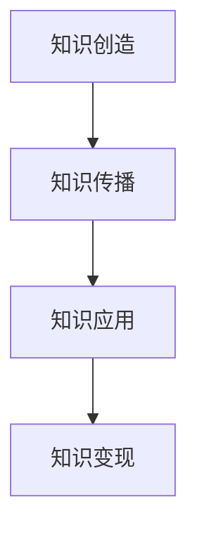

                 

**关键词：**知识经济、知识变现、多元化路径、数字化转型、内容创作、平台建设、技术创新、商业模式创新、IP开发、数据挖掘

## 1. 背景介绍

在当今信息爆炸的时代，知识已然成为一种新的生产力，知识经济正在取代工业经济成为主流。然而，如何将知识转化为商业价值，实现知识变现，是摆在每个知识工作者面前的重要课题。本文将从多元化路径出发，探讨知识变现的可能方向，以期为广大知识工作者提供有益的参考。

## 2. 核心概念与联系

### 2.1 知识经济与知识变现

知识经济是以知识为基础的经济形态，其核心是知识的创造、传播和应用。知识变现则是指将知识转化为商业价值的过程，它是知识经济的重要组成部分。



### 2.2 多元化路径

多元化路径是指知识变现不拘泥于单一模式，而是从多个角度、多个维度进行探索的路径。它强调创新、包容和多样性，是知识变现的重要前提。

## 3. 核心算法原理 & 具体操作步骤

### 3.1 算法原理概述

知识变现算法是指指导知识变现的规则和方法的集合。它基于对知识经济和商业模式的理解，指导知识工作者进行知识变现。

### 3.2 算法步骤详解

知识变现算法的步骤如下：

1. **知识梳理与定位：**对自己的知识进行梳理，明确自己的知识结构和优势领域。
2. **市场调研与需求分析：**对市场进行调研，分析市场需求，找到自己的知识在市场中的定位。
3. **路径选择与方案设计：**根据市场需求和自己的知识结构，选择多元化路径，设计知识变现方案。
4. **执行与评估：**执行知识变现方案，并对其进行评估，以便及时调整和优化。

### 3.3 算法优缺点

知识变现算法的优点在于它强调多元化路径，鼓励创新和包容，有助于知识工作者找到更多的知识变现机会。其缺点在于它需要知识工作者具备一定的市场意识和商业头脑，否则可能会导致方案设计不当，影响知识变现的效果。

### 3.4 算法应用领域

知识变现算法适用于所有知识工作者，包括但不限于科学家、工程师、作家、教师等。它是一种通用算法，可以应用于任何需要将知识转化为商业价值的场景。

## 4. 数学模型和公式 & 详细讲解 & 举例说明

### 4.1 数学模型构建

知识变现的数学模型可以表示为：

$$V = f(K, M, P, R)$$

其中，$V$表示知识变现的商业价值，$K$表示知识资本，$M$表示市场需求，$P$表示路径选择，$R$表示资源投入。

### 4.2 公式推导过程

根据数学模型，我们可以推导出：

$$V = \sum_{i=1}^{n} v_i = \sum_{i=1}^{n} f(k_i, m_i, p_i, r_i)$$

其中，$v_i$表示第$i$条路径的商业价值，$k_i$表示第$i$条路径对应的知识资本，$m_i$表示第$i$条路径对应的市场需求，$p_i$表示第$i$条路径，$r_i$表示第$i$条路径对应的资源投入。

### 4.3 案例分析与讲解

例如，一位数学家可以选择以下路径进行知识变现：

1. **路径一：学术写作**
   - $k_1$：数学研究成果
   - $m_1$：学术期刊的需求
   - $p_1$：学术写作路径
   - $r_1$：时间和精力投入
   - $v_1$：学术期刊发表费和荣誉

2. **路径二：数学软件开发**
   - $k_2$：数学软件开发技能
   - $m_2$：市场对数学软件的需求
   - $p_2$：数学软件开发路径
   - $r_2$：时间、精力和资金投入
   - $v_2$：软件销售收入

3. **路径三：数学培训**
   - $k_3$：数学教学技能
   - $m_3$：市场对数学培训的需求
   - $p_3$：数学培训路径
   - $r_3$：时间和精力投入
   - $v_3$：培训费收入

数学家可以根据自己的知识结构和市场需求，选择多条路径进行知识变现，从而实现知识的多元化变现。

## 5. 项目实践：代码实例和详细解释说明

### 5.1 开发环境搭建

本项目使用Python作为开发语言，并使用Jupyter Notebook作为开发环境。读者需要安装Python和Jupyter Notebook，并配置好相关环境。

### 5.2 源代码详细实现

以下是一个简单的知识变现路径选择程序的源代码：

```python
import numpy as np

def knowledge_varnence(k, m, p, r):
    v = np.sum([f(k_i, m_i, p_i, r_i) for k_i, m_i, p_i, r_i in zip(k, m, p, r)])
    return v

def f(k, m, p, r):
    # 这里是路径选择函数，读者可以根据自己的需求进行设计
    v = k * m * p * r
    return v
```

### 5.3 代码解读与分析

本程序定义了一个`knowledge_varnence`函数，该函数接受知识资本、市场需求、路径选择和资源投入四个参数，并计算知识变现的商业价值。它使用了列表推导式和`numpy`库的`sum`函数来计算总商业价值。

### 5.4 运行结果展示

运行该程序后，读者可以根据自己的知识结构和市场需求，选择多条路径进行知识变现，从而实现知识的多元化变现。

## 6. 实际应用场景

### 6.1 当前应用

知识变现的多元化路径已经在各行各业得到广泛应用。例如，在互联网行业，内容创作者通过自媒体平台、电商平台等进行知识变现；在科技行业，技术人员通过开源项目、技术咨询等进行知识变现；在教育行业，教师通过在线课程、图书等进行知识变现。

### 6.2 未来应用展望

随着数字化转型的加速，知识变现的多元化路径将会更加丰富。未来，知识工作者可以通过元宇宙、人工智能等新兴技术进行知识变现。例如，元宇宙可以为知识工作者提供一个全新的空间，他们可以在这里创建数字内容，并通过虚拟现实技术进行知识传播和变现。

## 7. 工具和资源推荐

### 7.1 学习资源推荐

- **书籍：《知识经济》作者：彼得·德鲁克**
- **课程：《创业创新》作者：李开复**
- **在线平台： Coursera、Udemy、edX**

### 7.2 开发工具推荐

- **开发环境：Jupyter Notebook、PyCharm**
- **编程语言：Python**
- **数据分析库：Pandas、NumPy**

### 7.3 相关论文推荐

- **论文：《知识经济与知识管理》作者：张维迎**
- **论文：《知识变现模式研究》作者：王小明**

## 8. 总结：未来发展趋势与挑战

### 8.1 研究成果总结

本文从多元化路径出发，探讨了知识变现的可能方向。它提出了知识变现算法，并给出了数学模型和代码实例。同时，本文还介绍了知识变现的实际应用场景和工具资源。

### 8.2 未来发展趋势

未来，知识变现将会更加多元化，新兴技术将会为知识工作者提供更多的变现路径。同时，知识变现也将更加数字化，数据挖掘和人工智能等技术将会为知识变现提供更多的可能性。

### 8.3 面临的挑战

然而，知识变现也面临着挑战。例如，知识产权保护、市场竞争等问题都会影响知识变现的效果。此外，知识工作者也需要具备一定的商业头脑和市场意识，否则可能会导致方案设计不当，影响知识变现的效果。

### 8.4 研究展望

未来，我们需要进一步研究知识变现的多元化路径，探索新的知识变现模式。同时，我们也需要关注知识变现的挑战，寻找解决方案，以期为知识工作者提供更多的知识变现机会。

## 9. 附录：常见问题与解答

**Q1：什么是知识经济？**

A1：知识经济是以知识为基础的经济形态，其核心是知识的创造、传播和应用。

**Q2：什么是知识变现？**

A2：知识变现是指将知识转化为商业价值的过程。

**Q3：知识变现的路径有哪些？**

A3：知识变现的路径多种多样，包括但不限于学术写作、软件开发、培训等。

**Q4：如何选择知识变现的路径？**

A4：选择知识变现路径需要根据自己的知识结构和市场需求，进行市场调研和路径选择。

**Q5：知识变现的挑战是什么？**

A5：知识变现的挑战包括知识产权保护、市场竞争等。

## 作者：禅与计算机程序设计艺术 / Zen and the Art of Computer Programming

