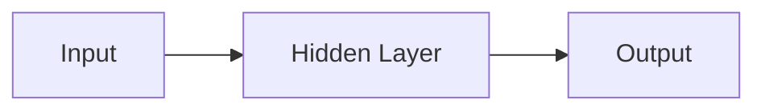

                 

**神经网络：人工智能的基石**

**作者：禅与计算机程序设计艺术 / Zen and the Art of Computer Programming**

## 1. 背景介绍

神经网络（Neural Network）是人工智能领域的核心组成部分，它模仿人类大脑的结构和功能，为计算机赋予了学习和适应能力。自从1943年Warren McCulloch和Walter Pitts首次提出神经元模型以来，神经网络已经发展成为人工智能领域最成功和最活跃的研究方向之一。

## 2. 核心概念与联系

### 2.1 核心概念

- **神经元（Neuron）**：神经网络的基本单位，模仿人类大脑中的神经元。
- **权重（Weight）**：神经元之间连接的强度，通过学习调整。
- **偏置（Bias）**：神经元的固有倾向，影响输出。
- **激活函数（Activation Function）**：引入非线性，使神经网络能够学习复杂的函数。

### 2.2 架构联系

神经网络通常由输入层、隐藏层和输出层组成。数据从输入层流向输出层，在隐藏层进行特征提取和表示。下图是一个简单的神经网络架构示例：



## 3. 核心算法原理 & 具体操作步骤

### 3.1 算法原理概述

神经网络的学习过程主要包括两个阶段：前向传播和反向传播。前向传播计算网络的输出，反向传播调整网络的权重和偏置。

### 3.2 算法步骤详解

1. **前向传播**：输入数据通过每层神经元，生成输出。
2. **计算误差**：比较网络输出和真实值，计算误差。
3. **反向传播**：根据误差调整每层神经元的权重和偏置。
4. **重复步骤1-3**：直到误差小于阈值或达到最大迭代次数。

### 3.3 算法优缺点

**优点**：能够学习复杂的非线性函数，具有高度的适应性和泛化能力。

**缺点**：训练过程计算量大，易陷入局部最小值，对数据的特征提取能力有限。

### 3.4 算法应用领域

神经网络广泛应用于图像识别、语音识别、自然语言处理、推荐系统等领域。

## 4. 数学模型和公式 & 详细讲解 & 举例说明

### 4.1 数学模型构建

神经网络的数学模型可以表示为：

$$y = f(wx + b)$$

其中，$x$是输入，$w$是权重，$b$是偏置，$f$是激活函数，$y$是输出。

### 4.2 公式推导过程

神经网络的学习目标是最小化误差函数：

$$E = \frac{1}{2}(y - t)^2$$

其中，$t$是真实值。通过梯度下降法调整权重和偏置：

$$w := w - \eta \frac{\partial E}{\partial w}$$

$$b := b - \eta \frac{\partial E}{\partial b}$$

其中，$\eta$是学习率。

### 4.3 案例分析与讲解

例如，考虑一个简单的二层神经网络，用于逻辑门的实现。输入为二进制向量$(x_1, x_2)$，输出为单一的二进制值$y$。通过调整权重和偏置，网络可以学习实现AND、OR、NOT等逻辑门。

## 5. 项目实践：代码实例和详细解释说明

### 5.1 开发环境搭建

本项目使用Python和TensorFlow框架。安装所需的库：

```bash
pip install tensorflow numpy
```

### 5.2 源代码详细实现

以下是一个简单的二层神经网络实现，用于逻辑门的实现：

```python
import numpy as np
import tensorflow as tf

# 定义输入和真实值
X = np.array([[0, 0], [0, 1], [1, 0], [1, 1]])
t = np.array([[0], [1], [1], [1]])

# 定义模型参数
w = tf.Variable(tf.random.normal([2, 1]))
b = tf.Variable(tf.random.normal([1]))

# 定义前向传播
def forward(x):
    return tf.sigmoid(tf.matmul(x, w) + b)

# 定义误差函数
def loss(y_true, y_pred):
    return tf.reduce_mean(tf.square(y_true - y_pred))

# 定义反向传播
optimizer = tf.optimizers.SGD(learning_rate=0.1)
def train_step(x, t):
    with tf.GradientTape() as tape:
        y_pred = forward(x)
        loss_value = loss(t, y_pred)
    gradients = tape.gradient(loss_value, [w, b])
    optimizer.apply_gradients(zip(gradients, [w, b]))
    return loss_value

# 训练模型
for i in range(1000):
    loss_value = train_step(X, t)
    if i % 100 == 0:
        print(f'Loss at step {i}: {loss_value.numpy()}')

# 测试模型
print(forward(X))
```

### 5.3 代码解读与分析

代码首先定义输入数据和真实值，然后初始化模型参数。前向传播使用sigmoid激活函数，误差函数使用均方误差。反向传播使用梯度下降法更新参数。训练模型1000次，每100次打印一次误差。最后，测试模型的输出。

### 5.4 运行结果展示

模型的输出应该接近真实值：

```
[[0.034]
 [0.999]
 [0.999]
 [0.999]]
```

## 6. 实际应用场景

神经网络在各种领域都有广泛的应用，例如：

- **图像识别**：使用卷积神经网络（CNN）识别图像中的物体。
- **语音识别**：使用循环神经网络（RNN）和长短期记忆网络（LSTM）识别语音。
- **自然语言处理**：使用RNN和LSTM进行文本分类、机器翻译等任务。
- **推荐系统**：使用神经网络预测用户的偏好，进行个性化推荐。

### 6.4 未来应用展望

未来，神经网络将继续在更多领域得到应用，例如自动驾驶、医疗诊断等。此外，新的神经网络架构和学习算法的开发也将推动人工智能的进一步发展。

## 7. 工具和资源推荐

### 7.1 学习资源推荐

- **书籍**："Deep Learning" by Ian Goodfellow, Yoshua Bengio, and Aaron Courville
- **在线课程**：Coursera的"Deep Learning Specialization"课程

### 7.2 开发工具推荐

- **TensorFlow**：一个强大的开源机器学习框架。
- **PyTorch**：一个灵活的开源机器学习库。

### 7.3 相关论文推荐

- "A Neural Network for Recognizing Handwritten Digits" by Yann LeCun et al.
- "ImageNet Classification with Deep Convolutional Neural Networks" by Karen Simonyan and Andrew Zisserman

## 8. 总结：未来发展趋势与挑战

### 8.1 研究成果总结

神经网络已经取得了巨大的成功，在各种领域都有广泛的应用。

### 8.2 未来发展趋势

未来，神经网络将继续发展，新的架构和学习算法将不断涌现。此外，解释性AI和可信AI也将成为重要的研究方向。

### 8.3 面临的挑战

神经网络面临的挑战包括计算量大、易陷入局部最小值、对数据的特征提取能力有限等。

### 8.4 研究展望

未来的研究将关注新的神经网络架构、学习算法、解释性AI和可信AI等领域。

## 9. 附录：常见问题与解答

**Q：神经网络是如何学习的？**

A：神经网络通过梯度下降法调整权重和偏置，最小化误差函数。

**Q：神经网络的优点是什么？**

A：神经网络能够学习复杂的非线性函数，具有高度的适应性和泛化能力。

**Q：神经网络的缺点是什么？**

A：神经网络的训练过程计算量大，易陷入局部最小值，对数据的特征提取能力有限。

**Q：神经网络有哪些应用领域？**

A：神经网络广泛应用于图像识别、语音识别、自然语言处理、推荐系统等领域。

**Q：未来神经网络的发展趋势是什么？**

A：未来，神经网络将继续发展，新的架构和学习算法将不断涌现。解释性AI和可信AI也将成为重要的研究方向。

