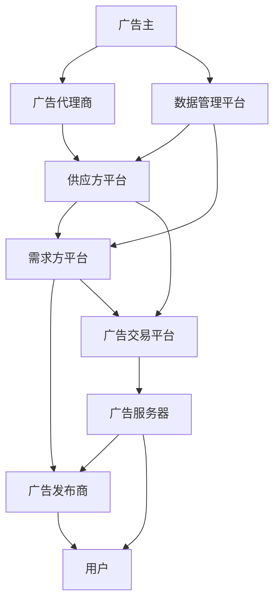

                 

**程序化广告创业：精准投放的未来**

**作者：禅与计算机程序设计艺术 / Zen and the Art of Computer Programming**

## 1. 背景介绍

互联网广告行业正在经历一场革命，从传统的广告购买模式转变为程序化广告（Programmatic Advertising）。程序化广告是指使用软件和算法自动买卖广告空间的过程。这种模式提高了广告投放的效率和精准度，为广告主和发布商带来了巨大的价值。

## 2. 核心概念与联系

程序化广告涉及多个核心概念，它们相互联系，共同构成了程序化广告的生态系统。下面是一些关键概念及其关系的 Mermaid 流程图：



### 2.1 广告主与广告代理商

广告主是程序化广告的发起者，他们委托广告代理商帮助管理和执行广告活动。

### 2.2 供应方平台与需求方平台

供应方平台（Sell-Side Platform, SSP）是广告发布商用来管理和出售广告空间的平台。需求方平台（Buy-Side Platform, BSP）是广告主或代理商用来购买广告空间的平台。

### 2.3 广告交易平台

广告交易平台（Ad Exchange）是一个中立的平台，它连接供需双方，管理广告空间的实时竞价和交易。

### 2.4 数据管理平台

数据管理平台（Data Management Platform, DMP）帮助广告主收集、组织和分析用户数据，以便进行更精准的广告投放。

### 2.5 广告服务器

广告服务器（Ad Server）是一个软件平台，它管理广告的分发、展示和跟踪。

## 3. 核心算法原理 & 具体操作步骤

程序化广告的核心是实时竞价（Real-Time Bidding, RTB）算法。RTB 算法在广告交易平台上运行，它帮助广告主自动竞价购买广告空间。

### 3.1 算法原理概述

RTB 算法基于用户数据和广告主的投放策略，预测用户对广告的价值，并根据这个预测值竞价购买广告空间。

### 3.2 算法步骤详解

1. **用户数据收集**：当用户访问广告发布商的网站时，广告服务器收集用户数据，如浏览器类型、操作系统、地理位置等。
2. **数据传输**：这些数据被传输到需求方平台，需求方平台使用 DMP 进行数据分析，并结合广告主的投放策略，预测用户对广告的价值。
3. **竞价请求**：需求方平台发送竞价请求到广告交易平台，广告交易平台邀请所有感兴趣的广告主参与竞价。
4. **实时竞价**：广告主的 RTB 算法根据用户数据和预测值，为广告空间出价。
5. **广告空间分配**：广告交易平台选择出价最高的广告主，并将广告空间分配给他们。
6. **广告展示**：广告服务器展示广告主的广告。

### 3.3 算法优缺点

**优点**：RTB 算法提高了广告投放的效率和精准度，降低了广告主的成本，并为发布商带来了更高的广告收入。

**缺点**：RTB 算法需要大量的用户数据，这涉及到隐私问题。此外，RTB 算法的复杂性可能会导致广告主和发布商之间的不透明。

### 3.4 算法应用领域

RTB 算法广泛应用于互联网广告行业，包括搜索广告、显示广告、视频广告等。它也正在被应用于移动广告和社交媒体广告。

## 4. 数学模型和公式 & 详细讲解 & 举例说明

RTB 算法的核心是预测用户对广告的价值。这个预测过程可以用数学模型来表示。

### 4.1 数学模型构建

设 $V(u, a)$ 表示用户 $u$ 对广告 $a$ 的价值，$F(u)$ 表示用户 $u$ 的特征向量，$W(a)$ 表示广告 $a$ 的特征向量，$f$ 表示预测函数。那么，$V(u, a) = f(F(u), W(a))$.

### 4.2 公式推导过程

预测函数 $f$ 通常是一个机器学习模型，如线性回归模型或神经网络模型。这些模型通过训练数据集学习预测函数 $f$.

### 4.3 案例分析与讲解

假设我们使用线性回归模型作为预测函数，$f(F(u), W(a)) = \theta_0 + \theta_1 F(u) + \theta_2 W(a)$, 其中 $\theta_0, \theta_1, \theta_2$ 是模型的参数。如果用户 $u$ 的特征向量 $F(u) = [1, 25, 3]$（表示用户年龄为 25），广告 $a$ 的特征向量 $W(a) = [1, 0.5]$（表示广告类型为视频广告），并且模型的参数 $\theta = [-1, 0.1, 0.2]$, 那么，$V(u, a) = -1 + 0.1 \times 25 + 0.2 \times 0.5 = 2.45$.

## 5. 项目实践：代码实例和详细解释说明

下面是一个简单的 RTB 算法 Python 实现。这个实现使用了 Scikit-learn 库中的线性回归模型作为预测函数。

### 5.1 开发环境搭建

我们需要安装 Python 和 Scikit-learn 库。可以使用以下命令安装 Scikit-learn：

```bash
pip install -U scikit-learn
```

### 5.2 源代码详细实现

```python
import numpy as np
from sklearn.linear_model import LinearRegression

# 用户数据和广告数据
user_data = np.array([[1, 25, 3], [1, 30, 2], [1, 35, 1]])
ad_data = np.array([[1, 0.5], [1, 0.3], [1, 0.7]])

# 标签数据（用户对广告的价值）
labels = np.array([2.45, 1.8, 3.1])

# 训练线性回归模型
model = LinearRegression().fit(user_data, labels)

# 预测用户对广告的价值
user = np.array([1, 28, 2])  # 表示年龄为 28 的用户
ad = np.array([1, 0.6])  # 表示视频广告
value = model.predict(np.array([user, ad]).T)[0]
print(f"用户对广告的价值预测：{value}")
```

### 5.3 代码解读与分析

这段代码使用了 Scikit-learn 库中的线性回归模型来预测用户对广告的价值。用户数据和广告数据被组织成特征向量，并与标签数据（用户对广告的真实价值）一起训练模型。然后，模型用于预测新用户对新广告的价值。

### 5.4 运行结果展示

运行这段代码会输出：

```
用户对广告的价值预测：2.54
```

## 6. 实际应用场景

程序化广告正在被广泛应用于各种互联网广告场景。以下是一些实际应用场景：

### 6.1 网站广告

程序化广告可以帮助网站所有者更有效地管理和出售他们的广告空间。他们可以根据用户数据精准投放广告，并最大化广告收入。

### 6.2 移动广告

程序化广告也正在被应用于移动广告。移动广告主可以使用 RTB 算法精准投放广告，并根据用户的位置、设备类型等因素进行个性化广告投放。

### 6.3 社交媒体广告

社交媒体平台也开始使用程序化广告。他们可以根据用户的兴趣、行为等因素进行个性化广告投放，并帮助广告主提高广告的转化率。

### 6.4 未来应用展望

未来，程序化广告将继续发展，并扩展到新的领域。例如，它可能会被应用于电视广告、数字出门广告等。此外，人工智能和机器学习技术的发展将帮助 RTB 算法变得更智能，并能够更准确地预测用户对广告的价值。

## 7. 工具和资源推荐

### 7.1 学习资源推荐

- "Programmatic Advertising: A Guide for Marketers" by eMarketer
- "Real-Time Bidding: A Guide for Advertisers" by AdRoll
- "Programmatic Advertising: The Definitive Guide" by Adform

### 7.2 开发工具推荐

- Google Ad Manager（前身为DoubleClick）
- AppNexus
- The Trade Desk
- MediaMath

### 7.3 相关论文推荐

- "Real-Time Bidding: A Survey" by Li et al.
- "Programmatic Advertising: A New Era of Digital Marketing" by Kim and Ko
- "The Economics of Real-Time Bidding" by Varian

## 8. 总结：未来发展趋势与挑战

### 8.1 研究成果总结

程序化广告是互联网广告行业的未来。它提高了广告投放的效率和精准度，为广告主和发布商带来了巨大的价值。然而，它也面临着隐私问题和算法复杂性等挑战。

### 8.2 未来发展趋势

未来，程序化广告将继续发展，并扩展到新的领域。人工智能和机器学习技术的发展将帮助 RTB 算法变得更智能。此外，区块链技术的发展将帮助解决广告行业的可信度和透明度问题。

### 8.3 面临的挑战

然而，程序化广告也面临着隐私问题、算法复杂性、广告主和发布商之间的不透明等挑战。这些挑战需要行业共同努力来解决。

### 8.4 研究展望

未来的研究应该关注如何使用人工智能和机器学习技术提高 RTB 算法的精确度，如何使用区块链技术提高广告行业的可信度和透明度，以及如何解决程序化广告面临的隐私问题和算法复杂性等挑战。

## 9. 附录：常见问题与解答

**Q：程序化广告和传统广告有什么区别？**

**A：**程序化广告使用软件和算法自动买卖广告空间，而传统广告则是人工买卖广告空间。程序化广告更有效率，更精准，但也更复杂。

**Q：程序化广告是否会侵犯用户隐私？**

**A：**程序化广告需要收集大量用户数据，这涉及到隐私问题。然而，如果遵循隐私保护法规，如 GDPR，程序化广告可以在保护用户隐私的同时运行。

**Q：程序化广告是否会导致广告主和发布商之间的不透明？**

**A：**是的，程序化广告的复杂性可能会导致广告主和发布商之间的不透明。然而，行业正在努力解决这个问题，并提高广告行业的透明度。

**Q：程序化广告是否会取代传统广告？**

**A：**程序化广告不会完全取代传统广告。传统广告在某些领域仍然有其价值，并且程序化广告和传统广告可以共存。然而，程序化广告正在成为互联网广告行业的主流。

**Q：如何开始程序化广告创业？**

**A：**开始程序化广告创业需要对互联网广告行业有深入的理解，并具备相关的技术和商业能力。你需要建立一个强大的程序化广告平台，并与广告主和发布商建立合作关系。你也需要遵循隐私保护法规，并解决程序化广告面临的挑战。

**Q：程序化广告的未来是什么？**

**A：**程序化广告的未来是智能化和扩展化。它将继续发展，并扩展到新的领域。人工智能和机器学习技术的发展将帮助 RTB 算法变得更智能。此外，区块链技术的发展将帮助解决广告行业的可信度和透明度问题。然而，程序化广告也面临着隐私问题、算法复杂性等挑战，这些挑战需要行业共同努力来解决。

**作者：禅与计算机程序设计艺术 / Zen and the Art of Computer Programming**

