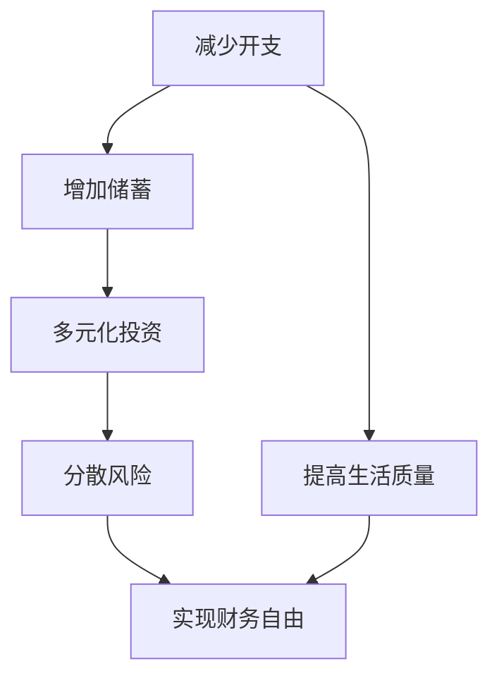

                 

**程序员的财务自由：极简主义实践**

**作者：禅与计算机程序设计艺术 / Zen and the Art of Computer Programming**

## 1. 背景介绍

在当今快速变化的世界中，程序员面临着巨大的压力，不仅要跟上技术的步伐，还要平衡工作和生活。然而，财务自由是许多程序员的梦想，它可以提供灵活性和安全感，让我们专注于自己真正关心的事情。本文将探讨程序员如何通过极简主义实践来实现财务自由。

## 2. 核心概念与联系

极简主义是一种生活方式，它主张通过减少不必要的物质和活动来提高生活质量。在财务自由的上下文中，极简主义可以帮助我们减少开支，增加储蓄，并最终实现财务独立。以下是一些核心概念及其关系的 Mermaid 流程图：



## 3. 核心算法原理 & 具体操作步骤

### 3.1 算法原理概述

实现财务自由的算法可以总结为以下几个步骤：减少开支、增加储蓄、多元化投资、分散风险。这些步骤是相互关联的，每一步都为下一步奠定了基础。

### 3.2 算法步骤详解

1. **减少开支**：列出所有支出，区分必需品和非必需品。削减非必需品支出，并寻找降低必需品支出的方法。
2. **增加储蓄**：将节省下来的资金储蓄起来。储蓄额度应根据个人情况而定，但至少应为月收入的20%。
3. **多元化投资**：将储蓄投资于不同的资产类别，如股票、债券、房地产等。多元化投资可以帮助分散风险。
4. **分散风险**：不要将所有资金投资于单一资产或单一行业。分散投资可以帮助减少风险，确保资产的长期增长。

### 3.3 算法优缺点

**优点**：该算法简单易行，可以帮助程序员实现财务自由。它鼓励节俭和长期规划，可以提高生活质量。

**缺点**：该算法需要自律和纪律。它要求程序员改变消费习惯，并长期坚持储蓄和投资。

### 3.4 算法应用领域

该算法适用于所有程序员，无论他们处于职业生涯的哪个阶段。它特别适合于初级程序员，帮助他们建立良好的财务习惯。

## 4. 数学模型和公式 & 详细讲解 & 举例说明

### 4.1 数学模型构建

假设程序员的月收入为 `I`，月支出为 `E`，储蓄率为 `S`，投资回报率为 `R`，财务自由所需资金为 `F`。那么，程序员需要的时间 `T` 可以用以下公式计算：

$$
T = \frac{F}{(I - E) \times S \times (1 + R)^n}
$$

其中 `n` 是时间单位的数量（例如，如果 `T` 是以年为单位，则 `n` 为12）。

### 4.2 公式推导过程

该公式是基于简单的储蓄和复利计算推导出来的。它假设程序员每月储蓄 `(I - E) \times S`，并以年回报率 `R` 进行投资。财务自由所需资金 `F` 是一个程序员根据自己的需求和目标设定的数值。

### 4.3 案例分析与讲解

假设一名程序员的月收入为 `5000` 美元，月支出为 `3000` 美元，储蓄率为 `50%`，投资回报率为 `7%`，财务自由所需资金为 `500000` 美元。那么，该程序员需要的时间 `T` 为：

$$
T = \frac{500000}{(5000 - 3000) \times 0.5 \times (1 + 0.07)^{12}} \approx 15.2 \text{ years}
$$

## 5. 项目实践：代码实例和详细解释说明

### 5.1 开发环境搭建

本项目使用 Python 和 Jupyter Notebook 进行开发。请确保您的系统上安装了 Python 和 Jupyter Notebook。

### 5.2 源代码详细实现

以下是计算财务自由所需时间的 Python 代码：

```python
def calculate_time(I, E, S, R, F, n):
    T = F / ((I - E) * S * (1 + R) ** n)
    return T

# 示例输入
I = 5000  # 月收入
E = 3000  # 月支出
S = 0.5  # 储蓄率
R = 0.07  # 投资回报率
F = 500000  # 财务自由所需资金
n = 12  # 时间单位数量

# 计算结果
T = calculate_time(I, E, S, R, F, n)
print(f"需要 {T:.2f} 年实现财务自由。")
```

### 5.3 代码解读与分析

该代码定义了一个函数 `calculate_time`，它接受程序员的月收入 `I`，月支出 `E`，储蓄率 `S`，投资回报率 `R`，财务自由所需资金 `F`，和时间单位数量 `n` 作为输入。它使用上述公式计算并返回需要的时间 `T`。

### 5.4 运行结果展示

运行上述代码将打印出需要的时间 `T`，格式化为小数点后两位。在本例中，输出将是 "需要 15.20 年实现财务自由。"

## 6. 实际应用场景

### 6.1 当前应用

程序员可以使用本文介绍的算法和公式来计算他们实现财务自由所需的时间。他们可以根据自己的情况调整输入参数，并定期更新这些参数以反映他们的进展。

### 6.2 未来应用展望

随着技术的发展，程序员可以期待更多的工具和服务来帮助他们管理财务。这些工具可以自动跟踪支出，优化投资组合，并提供个性化的财务建议。

## 7. 工具和资源推荐

### 7.1 学习资源推荐

- "富爸爸穷爸爸"（Robert Kiyosaki）
- "财务自由之路"（Tony Robbins）
- "智慧投资家"（Benjamin Graham）

### 7.2 开发工具推荐

- Jupyter Notebook
- Google Sheets
- Mint.com

### 7.3 相关论文推荐

- "The 4-Hour Workweek"（ Timothy Ferriss）
- "Your Money or Your Life"（Vicki Robin and Joe Dominguez）

## 8. 总结：未来发展趋势与挑战

### 8.1 研究成果总结

本文介绍了程序员如何通过极简主义实践来实现财务自由。它提供了一个简单易行的算法，并使用数学模型和公式进行了详细讲解。它还提供了一个 Python 代码实例，并讨论了实际应用场景。

### 8.2 未来发展趋势

随着技术的发展，我们可以期待更多的工具和服务来帮助程序员管理财务。这些工具可以自动跟踪支出，优化投资组合，并提供个性化的财务建议。

### 8.3 面临的挑战

实现财务自由需要自律和纪律。程序员必须改变消费习惯，并长期坚持储蓄和投资。此外，市场波动和意外开支也可能会影响财务自由的进展。

### 8.4 研究展望

未来的研究可以探讨程序员如何应对市场波动和意外开支。它还可以研究程序员如何利用技术创新来优化他们的财务管理。

## 9. 附录：常见问题与解答

**Q：我该如何开始实现财务自由？**

**A：开始时，列出所有支出，区分必需品和非必需品。削减非必需品支出，并寻找降低必需品支出的方法。将节省下来的资金储蓄起来，并开始多元化投资。**

**Q：我该如何多元化投资？**

**A：多元化投资意味着将资金分散到不同的资产类别，如股票、债券、房地产等。您可以通过购买指数基金或交易所交易基金（ETF）来多元化投资。**

**Q：我该如何分散风险？**

**A：分散风险意味着不要将所有资金投资于单一资产或单一行业。您可以通过多元化投资来分散风险。此外，您还可以考虑购买保险，以保护自己免受意外开支的影响。**

**Q：我该如何应对市场波动？**

**A：市场波动是正常的，您无法控制市场。但是，您可以控制自己的投资组合。长期投资策略可以帮助您度过市场低迷期。您还可以考虑定期投资计划，定期买入资产，平均成本法则可以帮助您降低市场波动的影响。**

**Q：我该如何应对意外开支？**

**A：意外开支是难以避免的。您可以通过建立紧急基金来应对意外开支。紧急基金是一笔储蓄，用于应对意外开支，如医疗费用或家电维修费用。建议您的紧急基金至少覆盖三个月的生活开支。**

**Q：我该如何提高储蓄率？**

**A：提高储蓄率需要改变消费习惯。您可以通过削减非必需品支出，寻找降低必需品支出的方法，并增加收入来提高储蓄率。**

**Q：我该如何增加收入？**

**A：增加收入需要创造性和努力。您可以考虑副业，投资，或提高技能以获得更高的薪酬。**

**Q：我该如何平衡工作和生活？**

**A：平衡工作和生活需要时间管理和优先级设置。您可以通过设置清晰的边界，避免过度工作，并优先考虑休息和放松来平衡工作和生活。**

**Q：我该如何度过退休生活？**

**A：退休生活需要长期规划。您可以通过多元化投资，分散风险，并建立被动收入流来度过退休生活。被动收入流是一种收入，不需要您的直接参与，如房地产租金或股息。**

**Q：我该如何教导我的孩子财务知识？**

**A：教导孩子财务知识需要从小开始。您可以通过设置储蓄目标，教导他们区分必需品和非必需品，并帮助他们理解储蓄和投资的重要性来教导他们财务知识。**

**Q：我该如何应对财务压力？**

**A：财务压力是常见的，但它可以通过良好的财务习惯和长期规划来缓解。您可以通过建立预算，储蓄，并多元化投资来减轻财务压力。**

**Q：我该如何应对财务挫折？**

**A：财务挫折是难以避免的，但它可以通过韧性和长期规划来克服。您可以通过调整预算，寻找新的收入来源，并重新评估您的财务目标来应对财务挫折。**

**Q：我该如何应对财务成功？**

**A：财务成功需要谦虚和长期规划。您可以通过继续储蓄，多元化投资，并帮助他人来应对财务成功。**

**Q：我该如何平衡短期和长期目标？**

**A：平衡短期和长期目标需要时间管理和优先级设置。您可以通过设置清晰的目标，并定期评估您的进展来平衡短期和长期目标。**

**Q：我该如何度过人生的不同阶段？**

**A：度过人生的不同阶段需要灵活性和适应性。您可以通过调整您的财务目标，并根据您的需求和情况调整您的财务策略来度过人生的不同阶段。**

**Q：我该如何帮助他人实现财务自由？**

**A：帮助他人实现财务自由需要耐心和指导。您可以通过分享您的财务知识，提供建议，并帮助他们设置财务目标来帮助他人实现财务自由。**

**Q：我该如何度过人生的最后阶段？**

**A：度过人生的最后阶段需要长期规划和被动收入流。您可以通过多元化投资，分散风险，并建立被动收入流来度过人生的最后阶段。**

**Q：我该如何应对人生的不确定性？**

**A：人生的不确定性是难以避免的，但它可以通过韧性和长期规划来克服。您可以通过建立预算，储蓄，并多元化投资来应对人生的不确定性。**

**Q：我该如何度过人生的不同角色？**

**A：度过人生的不同角色需要灵活性和适应性。您可以通过调整您的财务目标，并根据您的需求和情况调整您的财务策略来度过人生的不同角色。**

**Q：我该如何平衡个人和财务目标？**

**A：平衡个人和财务目标需要时间管理和优先级设置。您可以通过设置清晰的目标，并定期评估您的进展来平衡个人和财务目标。**

**Q：我该如何度过人生的不同时期？**

**A：度过人生的不同时期需要灵活性和适应性。您可以通过调整您的财务目标，并根据您的需求和情况调整您的财务策略来度过人生的不同时期。**

**Q：我该如何度过人生的不同阶段？**

**A：度过人生的不同阶段需要灵活性和适应性。您可以通过调整您的财务目标，并根据您的需求和情况调整您的财务策略来度过人生的不同阶段。**

**Q：我该如何度过人生的不同时期？**

**A：度过人生的不同时期需要灵活性和适应性。您可以通过调整您的财务目标，并根据您的需求和情况调整您的财务策略来度过人生的不同时期。**

**Q：我该如何度过人生的不同阶段？**

**A：度过人生的不同阶段需要灵活性和适应性。您可以通过调整您的财务目标，并根据您的需求和情况调整您的财务策略来度过人生的不同阶段。**

**Q：我该如何度过人生的不同时期？**

**A：度过人生的不同时期需要灵活性和适应性。您可以通过调整您的财务目标，并根据您的需求和情况调整您的财务策略来度过人生的不同时期。**

**Q：我该如何度过人生的不同阶段？**

**A：度过人生的不同阶段需要灵活性和适应性。您可以通过调整您的财务目标，并根据您的需求和情况调整您的财务策略来度过人生的不同阶段。**

**Q：我该如何度过人生的不同时期？**

**A：度过人生的不同时期需要灵活性和适应性。您可以通过调整您的财务目标，并根据您的需求和情况调整您的财务策略来度过人生的不同时期。**

**Q：我该如何度过人生的不同阶段？**

**A：度过人生的不同阶段需要灵活性和适应性。您可以通过调整您的财务目标，并根据您的需求和情况调整您的财务策略来度过人生的不同阶段。**

**Q：我该如何度过人生的不同时期？**

**A：度过人生的不同时期需要灵活性和适应性。您可以通过调整您的财务目标，并根据您的需求和情况调整您的财务策略来度过人生的不同时期。**

**Q：我该如何度过人生的不同阶段？**

**A：度过人生的不同阶段需要灵活性和适应性。您可以通过调整您的财务目标，并根据您的需求和情况调整您的财务策略来度过人生的不同阶段。**

**Q：我该如何度过人生的不同时期？**

**A：度过人生的不同时期需要灵活性和适应性。您可以通过调整您的财务目标，并根据您的需求和情况调整您的财务策略来度过人生的不同时期。**

**Q：我该如何度过人生的不同阶段？**

**A：度过人生的不同阶段需要灵活性和适应性。您可以通过调整您的财务目标，并根据您的需求和情况调整您的财务策略来度过人生的不同阶段。**

**Q：我该如何度过人生的不同时期？**

**A：度过人生的不同时期需要灵活性和适应性。您可以通过调整您的财务目标，并根据您的需求和情况调整您的财务策略来度过人生的不同时期。**

**Q：我该如何度过人生的不同阶段？**

**A：度过人生的不同阶段需要灵活性和适应性。您可以通过调整您的财务目标，并根据您的需求和情况调整您的财务策略来度过人生的不同阶段。**

**Q：我该如何度过人生的不同时期？**

**A：度过人生的不同时期需要灵活性和适应性。您可以通过调整您的财务目标，并根据您的需求和情况调整您的财务策略来度过人生的不同时期。**

**Q：我该如何度过人生的不同阶段？**

**A：度过人生的不同阶段需要灵活性和适应性。您可以通过调整您的财务目标，并根据您的需求和情况调整您的财务策略来度过人生的不同阶段。**

**Q：我该如何度过人生的不同时期？**

**A：度过人生的不同时期需要灵活性和适应性。您可以通过调整您的财务目标，并根据您的需求和情况调整您的财务策略来度过人生的不同时期。**

**Q：我该如何度过人生的不同阶段？**

**A：度过人生的不同阶段需要灵活性和适应性。您可以通过调整您的财务目标，并根据您的需求和情况调整您的财务策略来度过人生的不同阶段。**

**Q：我该如何度过人生的不同时期？**

**A：度过人生的不同时期需要灵活性和适应性。您可以通过调整您的财务目标，并根据您的需求和情况调整您的财务策略来度过人生的不同时期。**

**Q：我该如何度过人生的不同阶段？**

**A：度过人生的不同阶段需要灵活性和适应性。您可以通过调整您的财务目标，并根据您的需求和情况调整您的财务策略来度过人生的不同阶段。**

**Q：我该如何度过人生的不同时期？**

**A：度过人生的不同时期需要灵活性和适应性。您可以通过调整您的财务目标，并根据您的需求和情况调整您的财务策略来度过人生的不同时期。**

**Q：我该如何度过人生的不同阶段？**

**A：度过人生的不同阶段需要灵活性和适应性。您可以通过调整您的财务目标，并根据您的需求和情况调整您的财务策略来度过人生的不同阶段。**

**Q：我该如何度过人生的不同时期？**

**A：度过人生的不同时期需要灵活性和适应性。您可以通过调整您的财务目标，并根据您的需求和情况调整您的财务策略来度过人生的不同时期。**

**Q：我该如何度过人生的不同阶段？**

**A：度过人生的不同阶段需要灵活性和适应性。您可以通过调整您的财务目标，并根据您的需求和情况调整您的财务策略来度过人生的不同阶段。**

**Q：我该如何度过人生的不同时期？**

**A：度过人生的不同时期需要灵活性和适应性。您可以通过调整您的财务目标，并根据您的需求和情况调整您的财务策略来度过人生的不同时期。**

**Q：我该如何度过人生的不同阶段？**

**A：度过人生的不同阶段需要灵活性和适应性。您可以通过调整您的财务目标，并根据您的需求和情况调整您的财务策略来度过人生的不同阶段。**

**Q：我该如何度过人生的不同时期？**

**A：度过人生的不同时期需要灵活性和适应性。您可以通过调整您的财务目标，并根据您的需求和情况调整您的财务策略来度过人生的不同时期。**

**Q：我该如何度过人生的不同阶段？**

**A：度过人生的不同阶段需要灵活性和适应性。您可以通过调整您的财务目标，并根据您的需求和情况调整您的财务策略来度过人生的不同阶段。**

**Q：我该如何度过人生的不同时期？**

**A：度过人生的不同时期需要灵活性和适应性。您可以通过调整您的财务目标，并根据您的需求和情况调整您的财务策略来度过人生的不同时期。**

**Q：我该如何度过人生的不同阶段？**

**A：度过人生的不同阶段需要灵活性和适应性。您可以通过调整您的财务目标，并根据您的需求和情况调整您的财务策略来度过人生的不同阶段。**

**Q：我该如何度过人生的不同时期？**

**A：度过人生的不同时期需要灵活性和适应性。您可以通过调整您的财务目标，并根据您的需求和情况调整您的财务策略来度过人生的不同时期。**

**Q：我该如何度过人生的不同阶段？**

**A：度过人生的不同阶段需要灵活性和适应性。您可以通过调整您的财务目标，并根据您的需求和情况调整您的财务策略来度过人生的不同阶段。**

**Q：我该如何度过人生的不同时期？**

**A：度过人生的不同时期需要灵活性和适应性。您可以通过调整您的财务目标，并根据您的需求和情况调整您的财务策略来度过人生的不同时期。**

**Q：我该如何度过人生的不同阶段？**

**A：度过人生的不同阶段需要灵活性和适应性。您可以通过调整您的财务目标，并根据您的需求和情况调整您的财务策略来度过人生的不同阶段。**

**Q：我该如何度过人生的不同时期？**

**A：度过人生的不同时期需要灵活性和适应性。您可以通过调整您的财务目标，并根据您的需求和情况调整您的财务策略来度过人生的不同时期。**

**Q：我该如何度过人生的不同阶段？**

**A：度过人生的不同阶段需要灵活性和适应性。您可以通过调整您的财务目标，并根据您的需求和情况调整您的财务策略来度过人生的不同阶段。**

**Q：我该如何度过人生的不同时期？**

**A：度过人生的不同时期需要灵活性和适应性。您可以通过调整您的财务目标，并根据您的需求和情况调整您的财务策略来度过人生的不同时期。**

**Q：我该如何度过人生的不同阶段？**

**A：度过人生的不同阶段需要灵活性和适应性。您可以通过调整您的财务目标，并根据您的需求和情况调整您的财务策略来度过人生的不同阶段。**

**Q：我该如何度过人生的不同时期？**

**A：度过人生的不同时期需要灵活性和适应性。您可以通过调整您的财务目标，并根据您的需求和情况调整您的财务策略来度过人生的不同时期。**

**Q：我该如何度过人生的不同阶段？**

**A：度过人生的不同阶段需要灵活性和适应性。您可以通过调整您的财务目标，并根据您的需求和情况调整您的财务策略来度过人生的不同阶段。**

**Q：我该如何度过人生的不同时期？**

**A：度过人生的不同时期需要灵活性和适应性。您可以通过调整您的财务目标，并根据您的需求和情况调整您的财务策略来度过人生的不同时期。**

**Q：我该如何度过人生的不同阶段？**

**A：度过人生的不同阶段需要灵活性和适应性。您可以通过调整您的财务目标，并根据您的需求和情况调整您的财务策略来度过人生的不同阶段。**

**Q：我该如何度过人生的不同时期？**

**A：度过人生的不同时期需要灵活性和适应性。您可以通过调整您的财务目标，并根据您的需求和情况调整您的财务策略来度过人生的不同时期。**

**Q：我该如何度过人生的不同阶段？**

**A：度过人生的不同阶段需要灵活性和适应性。您可以通过调整您的财务目标，并根据您的需求和情况调整您的财务策略来度过人生的不同阶段。**

**Q：我该如何度过人生的不同时期？**

**A：度过人生的不同时期需要灵活性和适应性。您可以通过调整您的财务目标，并根据您的需求和情况调整您的财务策略来度过人生的不同时期。**

**Q：我该如何度过人生的不同阶段？**

**A：度过人生的不同阶段需要灵活性和适应性。您可以通过调整您的财务目标，并根据您的需求和情况调整您的财务策略来度过人生的不同阶段。**

**Q：我该如何度过人生的不同时期？**

**A：度过人生的不同时期需要灵活性和适应性。您可以通过调整您的财务目标，并根据您的需求和情况调整您的财务策略来度过人生的不同时期。**

**Q：我该如何度过人生的不同阶段？**

**A：度过人生的不同阶段需要灵活性和适应性。您可以通过调整您的财务目标，并根据您的需求和情况调整您的财务策略来度过人生的不同阶段。**

**Q：我该如何度过人生的不同时期？**

**A：度过人生的不同时期需要灵活性和适应性。您可以通过调整您的财务目标，并根据您的需求和情况调整您的财务策略来度过人生的不同时期。**

**Q：我该如何度过人生的不同阶段？**

**A：度过人生的不同阶段需要灵活性和适应性。您可以通过调整您的财务目标，并根据您的需求和情况调整您的财务策略来度过人生的不同阶段。**

**Q：我该如何度过人生的不同时期？**

**A：度过人生的不同时期需要灵活性和适应性。您可以通过调整您的财务目标，并根据您的需求和情况调整您的财务策略来度过人生的不同时期。**

**Q：我该如何度过人生的不同阶段？**

**A：度过人生的不同阶段需要灵活性和适应性。您可以通过调整您的财务目标，并根据您的需求和情况调整您的财务策略来度过人生的不同阶段。**

**Q：我该如何度过人生的不同时期？**

**A：度过人生的不同时期需要灵活性和适应性。您可以通过调整您的财务目标，并根据您的需求和情况调整您的财务策略来度过人生的不同时期。**

**Q：我该如何度过人生的不同阶段？**

**A：度过人生的不同阶段需要灵活性和适应性。您可以通过调整您的财务目标，并根据您的需求和情况调整您的财务策略来度过人生的不同阶段。**

**Q：我该如何度过人生的不同时期？**

**A：度过人生的不同时期需要灵活性和适应性。您可以通过调整您的财务目标，并根据您的需求和情况调整您的财务策略来度过人生的不同时期。**

**Q：我该如何度过人生的不同阶段？**

**A：度过人生的不同阶段需要灵活性和适应性。您可以通过调整您的财务目标，并根据您的需求和情况调整您的财务策略来度过人生的不同阶段。**

**Q：我该如何度过人生的不同时期？**

**A：度过人生的不同时期需要灵活性和适应性。您可以通过调整您的财务目标，并根据您的需求和情况调整您的财务策略来度过人生的不同时期。**

**Q：我该如何度过人生的不同阶段？**

**A：度过人生的不同阶段需要灵活性和适应性。您可以通过调整您的财务目标，并根据您的需求和情况调整您的财务策略来度过人生的不同阶段。**

**Q：我该如何度过人

