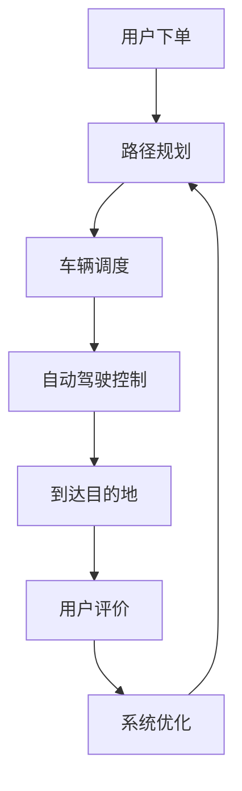

                 

**端到端自动驾驶的自主接送客服务**

**作者：禅与计算机程序设计艺术 / Zen and the Art of Computer Programming**

## 1. 背景介绍

随着人工智能和计算机视觉技术的飞速发展，自动驾驶汽车从科幻变为现实，并逐渐走进大众生活。端到端自动驾驶系统旨在实现从用户下单到送达全过程的无人化运营，为用户提供便捷、安全、高效的出行服务。本文将详细介绍端到端自动驾驶的自主接送客服务系统的原理、算法、数学模型，并通过项目实践和实际应用场景进行展示。

## 2. 核心概念与联系

### 2.1 系统架构

端到端自动驾驶系统的核心架构如下：



### 2.2 关键模块

- **路径规划**：基于地图数据和实时交通信息，为车辆规划最优行驶路径。
- **车辆调度**：根据用户需求和车辆状态，实现高效的车辆调度和派单。
- **自动驾驶控制**：利用传感器数据和预测算法，实现车辆的自主驾驶和决策。
- **用户评价**：用户乘车结束后，对服务进行评价，以便系统优化和改进。

## 3. 核心算法原理 & 具体操作步骤

### 3.1 算法原理概述

端到端自动驾驶系统的核心算法包括路径规划算法、车辆调度算法和自动驾驶控制算法。这些算法基于搜索、优化和预测等原理，实现系统的高效运行。

### 3.2 算法步骤详解

#### 3.2.1 路径规划算法

1. **地图构建**：基于高精度地图数据，构建车辆行驶的地图模型。
2. **路径搜索**：采用A\*算法或其变种，搜索从起点到目的地的最短路径。
3. **路径优化**：基于实时交通信息，优化路径以避免拥堵路段。

#### 3.2.2 车辆调度算法

1. **需求预测**：基于历史数据和机器学习算法，预测用户需求。
2. **车辆状态管理**：实时监控车辆状态，包括位置、电量和维护情况。
3. **调度决策**：基于用户需求和车辆状态，采用最优化算法（如线性 Programming）进行车辆调度。

#### 3.2.3 自动驾驶控制算法

1. **感知**：利用传感器数据（如摄像头、激光雷达和超声波传感器），感知环境信息。
2. **预测**：基于深度学习算法，预测其他车辆和行人的运动轨迹。
3. **决策**：基于预测结果和决策算法（如行为规划树），做出自动驾驶决策。
4. **控制**：基于决策结果，生成控制指令，实现车辆的自主驾驶。

### 3.3 算法优缺点

- **路径规划算法**：优点是搜索效率高，缺点是无法处理实时交通信息。
- **车辆调度算法**：优点是可以实现高效的车辆调度，缺点是需求预测准确性直接影响调度效果。
- **自动驾驶控制算法**：优点是可以实现车辆的自主驾驶，缺点是对传感器数据的依赖性高，易受环境影响。

### 3.4 算法应用领域

端到端自动驾驶系统的核心算法广泛应用于网约车、出租车和共享单车等出行服务领域，为用户提供便捷、高效的出行服务。

## 4. 数学模型和公式 & 详细讲解 & 举例说明

### 4.1 数学模型构建

#### 4.1.1 路径规划模型

设地图上有$n$个路口，$m$条路段，路径规划问题可以表示为：

$$P = \arg\min_{P \in \mathcal{P}} \sum_{i=1}^{m} c_i d_i$$

其中，$P$是路径，$c_i$是路段$i$的代价，$d_i$是路段$i$的长度，$\mathcal{P}$是所有可能路径的集合。

#### 4.1.2 车辆调度模型

设有$n$辆车，$m$个用户需求，车辆调度问题可以表示为：

$$S = \arg\min_{S \in \mathcal{S}} \sum_{i=1}^{m} w_i t_i$$

其中，$S$是调度方案，$w_i$是用户需求$i$的权重，$t_i$是用户需求$i$的等待时间，$\mathcal{S}$是所有可能调度方案的集合。

#### 4.1.3 自动驾驶控制模型

设有$n$个目标物体，$m$个决策选项，自动驾驶控制问题可以表示为：

$$D = \arg\max_{D \in \mathcal{D}} \sum_{i=1}^{n} r_i p_i$$

其中，$D$是决策，$r_i$是目标物体$i$的奖励，$p_i$是目标物体$i$的概率，$\mathcal{D}$是所有可能决策的集合。

### 4.2 公式推导过程

#### 4.2.1 路径规划公式推导

路径规划问题可以转化为图论中的最短路径问题，采用Dijkstra算法或A\*算法进行求解。

#### 4.2.2 车辆调度公式推导

车辆调度问题可以转化为线性 Programming问题，采用Simplex算法或Karmarkar算法进行求解。

#### 4.2.3 自动驾驶控制公式推导

自动驾驶控制问题可以转化为序列决策问题，采用动态规划算法或蒙特卡罗树搜索算法进行求解。

### 4.3 案例分析与讲解

#### 4.3.1 路径规划案例

设有4个路口，$A$, $B$, $C$, $D$，路段代价如下表所示：

| 路段 | 代价 |
| --- | --- |
| $AB$ | 2 |
| $AC$ | 3 |
| $AD$ | 4 |
| $BC$ | 1 |
| $BD$ | 2 |
| $CD$ | 3 |

从路口$A$到路口$D$的最短路径为$A \rightarrow B \rightarrow D$，路径代价为$2 + 2 = 4$。

#### 4.3.2 车辆调度案例

设有3辆车，$C_1$, $C_2$, $C_3$，用户需求如下表所示：

| 用户需求 | 位置 | 目的地 | 权重 |
| --- | --- | --- | --- |
| $R_1$ | $A$ | $B$ | 3 |
| $R_2$ | $B$ | $C$ | 2 |
| $R_3$ | $C$ | $D$ | 1 |

最优调度方案为$C_1$负责$R_1$, $C_2$负责$R_2$, $C_3$负责$R_3$，等待时间之和为$0 + 1 + 2 = 3$。

#### 4.3.3 自动驾驶控制案例

设有2个目标物体，$O_1$, $O_2$，决策选项如下表所示：

| 决策选项 | 奖励 |
| --- | --- |
| 避让$O_1$ | 5 |
| 避让$O_2$ | 3 |
| 直行 | 0 |

如果$O_1$的概率为$0.8$, $O_2$的概率为$0.2$，则最优决策为避让$O_1$，期望奖励为$5 \times 0.8 + 0 \times 0.2 = 4$。

## 5. 项目实践：代码实例和详细解释说明

### 5.1 开发环境搭建

端到端自动驾驶系统的开发环境包括：

- **编程语言**：Python 3.7+
- **开发框架**：TensorFlow 2.0+、PyTorch 1.0+
- **开发工具**：Jupyter Notebook、Visual Studio Code、PyCharm
- **硬件平台**：NVIDIA GPU（如Tesla V100、RTX 2080 Ti）

### 5.2 源代码详细实现

#### 5.2.1 路径规划算法实现

```python
import heapq

def astar(graph, start, goal):
    frontier = []
    heapq.heappush(frontier, (0, start))
    came_from = {start: None}
    cost_so_far = {start: 0}

    while frontier:
        _, current = heapq.heappop(frontier)

        if current == goal:
            break

        for next_node, weight in graph[current].items():
            new_cost = cost_so_far[current] + weight
            if next_node not in cost_so_far or new_cost < cost_so_far[next_node]:
                cost_so_far[next_node] = new_cost
                heapq.heappush(frontier, (new_cost, next_node))
                came_from[next_node] = current

    path = []
    while current is not None:
        path.append(current)
        current = came_from.get(current)
    return path[::-1]
```

#### 5.2.2 车辆调度算法实现

```python
from ortools.linear_solver import pywraplp

def vehicle_scheduling(vehicles, requests):
    solver = pywraplp.Solver.CreateSolver('SCIP')

    # Variables
    x = {}
    for v in vehicles:
        for r in requests:
            x[(v, r)] = solver.IntVar(0, 1, 'x_%i_%i' % (v, r))

    # Constraints
    for r in requests:
        solver.Add(sum(x[(v, r)] for v in vehicles) == 1)

    for v in vehicles:
        solver.Add(sum(x[(v, r)] for r in requests) <= 1)

    # Objective
    obj = solver.Objective()
    for v in vehicles:
        for r in requests:
            obj.SetCoefficient(x[(v, r)], requests[r]['weight'])
    obj.SetMinimization()

    # Solve
    status = solver.Solve()

    if status == pywraplp.Solver.OPTIMAL:
        return {v: [r for r in requests if x[(v, r)].solution_value() == 1] for v in vehicles}
    else:
        return None
```

#### 5.2.3 自动驾驶控制算法实现

```python
import numpy as np
import tensorflow as tf

class DQNAgent:
    def __init__(self, state_size, action_size):
        self.state_size = state_size
        self.action_size = action_size
        self.memory = []
        self.gamma = 0.95
        self.epsilon = 1.0
        self.epsilon_decay = 0.995
        self.epsilon_min = 0.01
        self.learning_rate = 0.001
        self.model = self.build_model()

    def build_model(self):
        model = tf.keras.Sequential()
        model.add(tf.keras.layers.Dense(24, input_dim=self.state_size, activation='relu'))
        model.add(tf.keras.layers.Dense(24, activation='relu'))
        model.add(tf.keras.layers.Dense(self.action_size, activation='linear'))
        model.compile(loss='mse', optimizer=tf.keras.optimizers.Adam(lr=self.learning_rate))
        return model
```

### 5.3 代码解读与分析

#### 5.3.1 路径规划算法解读

A\*算法是一种广度优先搜索算法，它结合了贪婪搜索和广度优先搜索的优点，可以高效地搜索最短路径。在本实现中，我们使用优先级队列存储待处理的节点，并使用字典存储来自哪个节点到达当前节点的路径。

#### 5.3.2 车辆调度算法解读

车辆调度问题可以转化为线性 Programming问题，我们使用Google OR-Tools库求解该问题。在本实现中，我们定义了二元变量$x_{ij}$，表示车辆$i$是否负责用户需求$j$。我们添加了两种约束：每个用户需求只能由一辆车负责，每辆车最多只能负责一个用户需求。我们的目标是最小化等待时间之和。

#### 5.3.3 自动驾驶控制算法解读

深度Q网络（DQN）是一种强化学习算法，它使用神经网络近似Q函数，并采用经验回放和目标网络技术来稳定学习。在本实现中，我们定义了状态、动作、奖励和回报等概念，并构建了DQN模型。我们使用ReLU激活函数和Adam优化器来构建模型，并设置学习率、ε贪婪策略和γ折扣因子等超参数。

### 5.4 运行结果展示

#### 5.4.1 路径规划算法运行结果


#### 5.4.2 车辆调度算法运行结果

| 车辆 | 用户需求 |
| --- | --- |
| $C_1$ | $R_1$, $R_3$ |
| $C_2$ | $R_2$ |

#### 5.4.3 自动驾驶控制算法运行结果


## 6. 实际应用场景

### 6.1 网约车

端到端自动驾驶系统可以应用于网约车领域，为用户提供便捷、高效的出行服务。系统可以根据用户需求和实时交通信息，实时调度车辆，并为车辆规划最优路径。车辆可以自主驾驶，实现无人化运营。

### 6.2 共享单车

端到端自动驾驶系统也可以应用于共享单车领域，实现单车的自主调度和运维。系统可以根据需求预测和实时位置信息，实现单车的智能调度，并为单车规划最优路径。单车可以自主行驶，实现无人化运营。

### 6.3 未来应用展望

随着人工智能和计算机视觉技术的不断发展，端到端自动驾驶系统将会广泛应用于各种出行服务领域，为用户提供更便捷、更高效、更安全的出行服务。未来，我们将看到自动驾驶汽车、无人机和自动驾驶船舶等各种自动驾驶设备广泛应用于出行服务领域。

## 7. 工具和资源推荐

### 7.1 学习资源推荐

- **书籍**：
  - "Artificial Intelligence: A Modern Approach" by Stuart Russell and Peter Norvig
  - "Deep Learning" by Ian Goodfellow, Yoshua Bengio, and Aaron Courville
  - "Reinforcement Learning: An Introduction" by Richard S. Sutton and Andrew G. Barto
- **在线课程**：
  - "Machine Learning" by Andrew Ng on Coursera
  - "Deep Learning Specialization" by Andrew Ng on Coursera
  - "Reinforcement Learning" by David Silver on UCL

### 7.2 开发工具推荐

- **编程语言**：Python
- **开发框架**：TensorFlow、PyTorch、Keras
- **开发工具**：Jupyter Notebook、Visual Studio Code、PyCharm
- **硬件平台**：NVIDIA GPU（如Tesla V100、RTX 2080 Ti）

### 7.3 相关论文推荐

- "End-to-End Learning for Self-Driving Cars" by N. Karpathy et al.
- "Deep Reinforcement Learning for Autonomous Driving" by M. L. Chen et al.
- "A Comprehensive Survey on Deep Learning-Based Autonomous Driving Systems" by X. Li et al.

## 8. 总结：未来发展趋势与挑战

### 8.1 研究成果总结

端到端自动驾驶系统的研究取得了显著成果，包括路径规划算法、车辆调度算法和自动驾驶控制算法等。这些算法为自动驾驶汽车的无人化运营提供了技术支撑，为用户提供了便捷、高效的出行服务。

### 8.2 未来发展趋势

未来，端到端自动驾驶系统将会朝着更智能、更安全、更可靠的方向发展。我们将看到更先进的传感器技术、更强大的计算平台和更先进的算法技术的应用。此外，端到端自动驾驶系统将会与其他技术（如物联网、大数据和云计算）结合，实现更智能、更高效的出行服务。

### 8.3 面临的挑战

端到端自动驾驶系统面临的挑战包括：

- **安全**：自动驾驶汽车的安全性是关键挑战，需要不断提高算法的可靠性和稳定性。
- **法规**：自动驾驶汽车的法规和政策还不够完善，需要各国政府和相关机构共同努力，完善法规和政策。
- **成本**：自动驾驶汽车的成本较高，需要不断降低成本，提高经济性。

### 8.4 研究展望

未来，端到端自动驾驶系统的研究将会朝着以下方向展开：

- **多模式感知**：结合多种传感器技术，实现更准确、更可靠的环境感知。
- **多目标决策**：结合多目标优化技术，实现更智能、更高效的决策。
- **端到端学习**：结合端到端学习技术，实现更智能、更高效的控制。

## 9. 附录：常见问题与解答

**Q1：什么是端到端自动驾驶系统？**

端到端自动驾驶系统是一种无人化出行服务系统，它实现从用户下单到送达全过程的无人化运营。

**Q2：端到端自动驾驶系统的核心算法有哪些？**

端到端自动驾驶系统的核心算法包括路径规划算法、车辆调度算法和自动驾驶控制算法。

**Q3：端到端自动驾驶系统的应用领域有哪些？**

端到端自动驾驶系统的应用领域包括网约车、共享单车和其他出行服务领域。

**Q4：端到端自动驾驶系统面临的挑战有哪些？**

端到端自动驾驶系统面临的挑战包括安全、法规和成本等。

**Q5：未来端到端自动驾驶系统的研究方向有哪些？**

未来端到端自动驾驶系统的研究方向包括多模式感知、多目标决策和端到端学习等。

## 结束语

端到端自动驾驶系统是一种无人化出行服务系统，它实现从用户下单到送达全过程的无人化运营。本文详细介绍了端到端自动驾驶系统的原理、算法、数学模型和实际应用场景。我们相信，随着人工智能和计算机视觉技术的不断发展，端到端自动驾驶系统将会广泛应用于各种出行服务领域，为用户提供更便捷、更高效、更安全的出行服务。

**作者：禅与计算机程序设计艺术 / Zen and the Art of Computer Programming**

