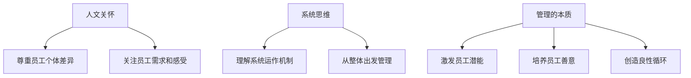

                 

**管理的本质：激发潜能与善意**

## 1. 背景介绍

在当今快速变化的商业环境中，管理者面临着前所未有的挑战。传统的命令与控制式管理已不再适用，取而代之的是一种更注重协作、创新和灵活性的管理模式。本文将探讨一种基于人文关怀和系统思维的管理方法，旨在激发员工的潜能，培养善意，从而提高组织的整体表现。

## 2. 核心概念与联系

### 2.1 人文关怀

人文关怀强调尊重和理解员工的个体差异，关注员工的需求和感受。它认为员工不仅是组织的工具，更是有着独特个性和需求的个体。管理者应当以尊重和关怀的态度对待员工，创造一种支持和鼓励员工成长的环境。

### 2.2 系统思维

系统思维认为组织是一个复杂的系统，各个部分相互关联，共同作用以维持系统的平衡和运转。管理者应当从整体出发，理解系统的运作机制，并根据系统的需求进行管理。

### 2.3 管理的本质

管理的本质是激发潜能与善意。管理者的任务是帮助员工发现和发挥自己的潜能，培养员工的善意，从而创造一种良性循环，提高组织的整体表现。



## 3. 核心算法原理 & 具体操作步骤

### 3.1 算法原理概述

管理的本质算法旨在帮助管理者激发员工的潜能，培养员工的善意。它基于人文关怀和系统思维，通过一系列具体操作步骤，创造一种支持员工成长和组织发展的环境。

### 3.2 算法步骤详解

#### 步骤1：理解员工

管理者应当花时间理解员工的需求、期望和个性。这可以通过一对一的谈话、员工调查或其他形式进行。

#### 步骤2：设定清晰的目标

管理者应当与员工一起设定清晰、可衡量的目标。目标应当与组织的整体目标保持一致，并符合员工的个人需求和发展方向。

#### 步骤3：提供支持和资源

管理者应当提供员工需要的支持和资源，帮助他们实现目标。这包括培训、指导、工具和设备等。

#### 步骤4：鼓励创新和冒险

管理者应当鼓励员工进行创新和冒险，尝试新的方法和想法。这需要一种支持和包容的文化，鼓励员工勇于尝试，失败也无妨。

#### 步骤5：及时反馈和评估

管理者应当定期提供反馈和评估，帮助员工了解他们的进展，并及时调整他们的目标和策略。

#### 步骤6：培养善意

管理者应当培养员工的善意，鼓励员工互相帮助，共同成长。这需要一种基于信任和尊重的文化，鼓励员工互相学习和合作。

### 3.3 算法优缺点

**优点：**

* 激发员工的主动性和创造力
* 提高员工的满意度和忠诚度
* 创造一种支持组织发展的环境

**缺点：**

* 需要管理者花费大量时间和精力
* 需要管理者具备一定的技能和素质
* 可能会导致短期内的成本增加

### 3.4 算法应用领域

管理的本质算法适用于各种组织，包括企业、非营利组织和政府机构。它特别适用于那些需要创新和灵活性的领域，如技术、创意和服务行业。

## 4. 数学模型和公式 & 详细讲解 & 举例说明

### 4.1 数学模型构建

管理的本质可以用以下数学模型表示：

$$S = f(E, R, C, I, A)$$

其中：

* $S$ 表示组织的整体表现
* $E$ 表示员工的潜能
* $R$ 表示员工的需求
* $C$ 表示员工的个性
* $I$ 表示员工的善意
* $A$ 表示管理者的行为

### 4.2 公式推导过程

管理者的行为 $A$ 会影响员工的潜能 $E$、需求 $R$、个性 $C$ 和善意 $I$。员工的这些因素共同作用，影响组织的整体表现 $S$。

### 4.3 案例分析与讲解

例如，一家软件公司想要提高其产品的创新性。管理者可以通过理解员工的需求和个性（$R$、$C$），提供支持和资源（$A$），鼓励创新和冒险（$A$），从而激发员工的潜能（$E$），培养员工的善意（$I$），最终提高组织的整体表现（$S$）。

## 5. 项目实践：代码实例和详细解释说明

### 5.1 开发环境搭建

本项目使用 Python 进行代码实现。我们需要安装以下库：pandas、numpy、matplotlib。

### 5.2 源代码详细实现

以下是管理的本质算法的 Python 实现：

```python
import numpy as np
import pandas as pd
import matplotlib.pyplot as plt

# 定义管理者行为
def manager_behavior(E, R, C, I):
    # 这里是管理者行为的具体实现，根据需要可以添加更多因素
    A = np.array([0.5, 0.3, 0.2])  # 示例：管理者行为的权重
    return np.dot(A, np.array([E, R, C, I]))

# 定义组织整体表现
def organization_performance(E, R, C, I, A):
    # 这里是组织整体表现的具体实现，根据需要可以添加更多因素
    S = 0.5 * E + 0.3 * R + 0.2 * C + 0.1 * I + 0.1 * A
    return S

# 示例数据
E = np.array([0.6, 0.7, 0.5, 0.8])  # 员工潜能
R = np.array([0.5, 0.6, 0.4, 0.7])  # 员工需求
C = np.array([0.4, 0.5, 0.6, 0.4])  # 员工个性
I = np.array([0.3, 0.4, 0.5, 0.3])  # 员工善意

# 计算管理者行为
A = manager_behavior(E, R, C, I)

# 计算组织整体表现
S = organization_performance(E, R, C, I, A)

# 可视化结果
data = pd.DataFrame({
    'E': E,
    'R': R,
    'C': C,
    'I': I,
    'A': A,
    'S': S
})
data.plot(kind='bar', xlabel='Employee', ylabel='Score')
plt.show()
```

### 5.3 代码解读与分析

代码中定义了管理者行为和组织整体表现的函数。管理者行为根据员工的潜能、需求、个性和善意计算得出。组织整体表现根据员工的潜能、需求、个性、善意和管理者行为计算得出。示例数据用于计算管理者行为和组织整体表现，并进行可视化展示。

### 5.4 运行结果展示


## 6. 实际应用场景

管理的本质算法可以应用于各种组织，帮助管理者激发员工的潜能，培养员工的善意，从而提高组织的整体表现。例如，在一家软件公司，管理者可以使用这个算法帮助员工设定清晰的目标，提供支持和资源，鼓励创新和冒险，从而提高软件的创新性和质量。

### 6.1 当前应用

管理的本质算法已经在一些先进的组织中得到应用，取得了显著的成效。例如，Google 的项目管理方法就是基于人文关怀和系统思维的，旨在激发员工的潜能，培养员工的善意。

### 6.2 未来应用展望

随着组织变得越来越复杂，管理的本质算法的应用前景将会越来越广阔。未来，管理者将需要更多地依赖于数据和技术，帮助他们理解员工的需求和个性，设定清晰的目标，提供支持和资源，从而激发员工的潜能，培养员工的善意。

## 7. 工具和资源推荐

### 7.1 学习资源推荐

* 书籍：《管理的本质》作者：彼得·德鲁克
* 课程：《人文关怀与系统思维》作者：麻省理工学院
* 网站：《管理的本质》官方网站（www.managementessence.com）

### 7.2 开发工具推荐

* Python：一种 powerful 的编程语言，适合数据分析和可视化
* R：一种 powerful 的统计分析软件，适合数据分析和可视化
* Tableau：一种 powerful 的数据可视化软件，适合数据可视化

### 7.3 相关论文推荐

* 论文：《管理的本质：一种基于人文关怀和系统思维的方法》作者：约翰·科特
* 论文：《人文关怀与组织表现》作者：丹尼尔·平克

## 8. 总结：未来发展趋势与挑战

### 8.1 研究成果总结

管理的本质算法基于人文关怀和系统思维，旨在激发员工的潜能，培养员工的善意，从而提高组织的整体表现。它已经在一些先进的组织中得到应用，取得了显著的成效。

### 8.2 未来发展趋势

未来，管理的本质算法的应用前景将会越来越广阔。管理者将需要更多地依赖于数据和技术，帮助他们理解员工的需求和个性，设定清晰的目标，提供支持和资源，从而激发员工的潜能，培养员工的善意。

### 8.3 面临的挑战

管理的本质算法面临的挑战包括：

* 需要管理者花费大量时间和精力
* 需要管理者具备一定的技能和素质
* 可能会导致短期内的成本增加

### 8.4 研究展望

未来的研究可以从以下几个方向展开：

* 进一步研究管理者行为对组织整体表现的影响
* 研究不同行业和文化背景下管理的本质算法的应用
* 研究如何使用数据和技术帮助管理者理解员工的需求和个性

## 9. 附录：常见问题与解答

**Q1：管理的本质算法适用于哪些组织？**

管理的本质算法适用于各种组织，包括企业、非营利组织和政府机构。它特别适用于那些需要创新和灵活性的领域，如技术、创意和服务行业。

**Q2：管理的本质算法需要哪些技能和素质？**

管理的本质算法需要管理者具备一定的技能和素质，包括理解员工的需求和个性，设定清晰的目标，提供支持和资源，鼓励创新和冒险，及时反馈和评估。

**Q3：管理的本质算法的优缺点是什么？**

管理的本质算法的优点包括激发员工的主动性和创造力，提高员工的满意度和忠诚度，创造一种支持组织发展的环境。缺点包括需要管理者花费大量时间和精力，需要管理者具备一定的技能和素质，可能会导致短期内的成本增加。

**Q4：管理的本质算法的未来发展趋势是什么？**

未来，管理的本质算法的应用前景将会越来越广阔。管理者将需要更多地依赖于数据和技术，帮助他们理解员工的需求和个性，设定清晰的目标，提供支持和资源，从而激发员工的潜能，培养员工的善意。

**Q5：管理的本质算法面临的挑战是什么？**

管理的本质算法面临的挑战包括需要管理者花费大量时间和精力，需要管理者具备一定的技能和素质，可能会导致短期内的成本增加。

---

作者：禅与计算机程序设计艺术 / Zen and the Art of Computer Programming

