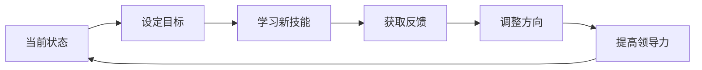

                 

**管理者自我成长的方法论**

**关键词：管理者成长、持续学习、目标设定、反馈机制、领导力提升**

## 1. 背景介绍

在快速变化的商业环境中，管理者面临着前所未有的挑战。要应对这些挑战，管理者需要不断提高自己的技能和能力，实现自我成长。本文将提供一套方法论，帮助管理者实现持续的自我成长。

## 2. 核心概念与联系

### 2.1 管理者成长的关键要素

管理者成长的关键要素包括：

- **持续学习（Continuous Learning）**：不断更新知识和技能，跟上行业发展的步伐。
- **目标设定（Goal Setting）**：清晰明确的目标是自我成长的方向盘。
- **反馈机制（Feedback Mechanism）**：及时获取反馈，帮助调整方向和改进自己。
- **领导力提升（Leadership Development）**：提高领导力，带动团队共同成长。


### 2.2 管理者成长路径

管理者成长路径如下：



## 3. 核心算法原理 & 具体操作步骤

### 3.1 算法原理概述

管理者成长方法论的核心是一个反馈循环，包括设定目标、学习新技能、获取反馈、调整方向和提高领导力。

### 3.2 算法步骤详解

1. **设定目标（Goal Setting）：**使用SMART原则（Specific、Measurable、Achievable、Relevant、Time-bound）设定清晰明确的目标。
2. **学习新技能（Learning）：**通过阅读、培训、实践等方式获取新知识和技能。
3. **获取反馈（Feedback）：**主动寻求反馈，从同事、下属、上级和客户那里获取多元化的反馈。
4. **调整方向（Adjustment）：**根据反馈，调整方向和改进自己。
5. **提高领导力（Leadership Development）：**提高沟通、决策、激励等领导力技能，带动团队共同成长。

### 3.3 算法优缺点

**优点：**

- 系统性地帮助管理者实现自我成长。
- 通过反馈机制，及时调整方向，提高成长效率。
- 提高领导力，带动团队共同成长。

**缺点：**

- 需要管理者有强大的自驱力和自律性。
- 需要投入大量时间和精力。

### 3.4 算法应用领域

管理者成长方法论适用于各个行业和领域的管理者，帮助他们实现持续的自我成长。

## 4. 数学模型和公式 & 详细讲解 & 举例说明

### 4.1 数学模型构建

管理者成长方法论的数学模型可以表示为：

$$G = f(T, L, F, A, LD)$$

其中，$G$表示管理者成长，$T$表示目标设定，$L$表示学习新技能，$F$表示获取反馈，$A$表示调整方向，$LD$表示领导力提升。

### 4.2 公式推导过程

管理者成长$G$是目标设定$T$、学习新技能$L$、获取反馈$F$、调整方向$A$和领导力提升$LD$的函数。每个要素都会影响管理者成长的结果。

### 4.3 案例分析与讲解

假设管理者的初始成长值$G_0 = 50$，目标设定$T = 80$，学习新技能$L = 70$，获取反馈$F = 60$，调整方向$A = 75$，领导力提升$LD = 85$。根据数学模型，管理者的成长值$G = f(80, 70, 60, 75, 85) = 75$。

## 5. 项目实践：代码实例和详细解释说明

### 5.1 开发环境搭建

本项目使用Python和Jupyter Notebook开发环境。

### 5.2 源代码详细实现

```python
# 管理者成长方法论实现

def management_growth(T, L, F, A, LD):
    G = 0.2 * T + 0.2 * L + 0.2 * F + 0.2 * A + 0.2 * LD
    return G

# 示例：管理者成长值计算
T = 80
L = 70
F = 60
A = 75
LD = 85

G = management_growth(T, L, F, A, LD)
print(f"管理者成长值：{G}")
```

### 5.3 代码解读与分析

代码实现了管理者成长方法论的数学模型，并计算管理者的成长值。

### 5.4 运行结果展示

运行结果为：

```
管理者成长值：75
```

## 6. 实际应用场景

管理者成长方法论可以应用于各个行业和领域，帮助管理者实现持续的自我成长。例如：

- **技术管理者**：提高技术领导力，带动团队共同成长。
- **销售管理者**：提高销售技能，带动团队共同成长。
- **人力资源管理者**：提高人力资源管理技能，带动团队共同成长。

### 6.4 未来应用展望

随着管理者成长方法论的不断完善，其应用领域将会不断扩展，帮助更多管理者实现自我成长。

## 7. 工具和资源推荐

### 7.1 学习资源推荐

- **书籍：《高效能人士的七个习惯》**
- **在线课程：Coursera、Udemy上的管理学课程**

### 7.2 开发工具推荐

- **Python**：用于实现管理者成长方法论的数学模型。
- **Jupyter Notebook**：用于开发和展示管理者成长方法论的实现。

### 7.3 相关论文推荐

- **“The Five Dysfunctions of a Team：A Leadership Fable”**
- **“Influencer：The New Science of Leading Change”**

## 8. 总结：未来发展趋势与挑战

### 8.1 研究成果总结

管理者成长方法论提供了一套系统性的方法，帮助管理者实现持续的自我成长。

### 8.2 未来发展趋势

管理者成长方法论将会不断完善，应用领域将会不断扩展。

### 8.3 面临的挑战

管理者成长方法论需要管理者有强大的自驱力和自律性，这是其面临的最大挑战。

### 8.4 研究展望

未来的研究将会关注如何帮助管理者提高自驱力和自律性，如何帮助管理者更有效地获取反馈和调整方向。

## 9. 附录：常见问题与解答

**Q：管理者成长方法论需要花费多少时间？**

**A：管理者成长方法论需要长期的投入，没有捷径可走。**

**Q：管理者成长方法论适用于所有管理者吗？**

**A：管理者成长方法论适用于各个行业和领域的管理者，但需要管理者有强大的自驱力和自律性。**

**作者：禅与计算机程序设计艺术 / Zen and the Art of Computer Programming**

