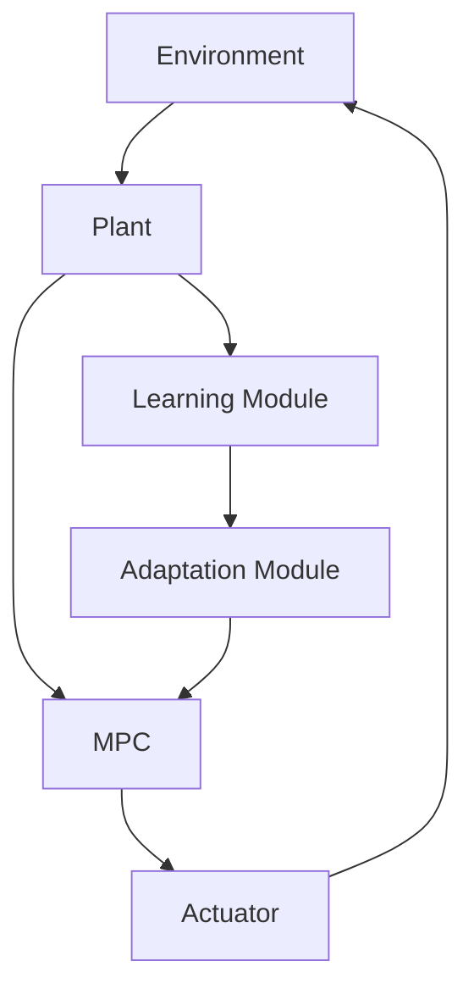

                 

**自适应学习型控制器开启自动驾驶智能化新征程**

**作者：禅与计算机程序设计艺术 / Zen and the Art of Computer Programming**

## 1. 背景介绍

随着人工智能和计算机视觉技术的飞速发展，自动驾驶汽车从科幻走进了现实。然而，自动驾驶系统面临的挑战之一是如何在复杂多变的环境中做出准确的决策。传统的控制器无法适应各种情况，自适应学习型控制器（Adaptive Learning Controller, ALC）应运而生，旨在提供一种能够学习和适应环境变化的控制器。

## 2. 核心概念与联系

### 2.1 核心概念

- **自适应控制（Adaptive Control）**：根据环境变化调整控制参数的控制方式。
- **学习控制（Learning Control）**：通过学习环境特性改进控制性能的控制方式。
- **模型预测控制（Model Predictive Control, MPC）**：一种基于模型的控制方法，通过预测未来系统状态来优化控制输入。

### 2.2 架构联系


如上图所示，ALC 结构包括模型预测控制器、学习模块和适应模块。学习模块负责学习环境特性，适应模块根据学习结果调整控制器参数。



## 3. 核心算法原理 & 具体操作步骤

### 3.1 算法原理概述

ALC 算法结合了模型预测控制和学习控制的优点。它首先使用 MPC 计算控制输入，然后通过学习模块和适应模块改进控制性能。

### 3.2 算法步骤详解

1. **模型预测控制**：建立系统动态模型，预测未来系统状态，并优化控制输入。
2. **学习模块**：收集系统状态和控制输入数据，学习环境特性。
3. **适应模块**：根据学习结果调整 MPC 参数，改进控制性能。

### 3.3 算法优缺点

**优点**：能够适应环境变化，改进控制性能。

**缺点**：学习过程可能需要大量数据，且学习模块的设计复杂。

### 3.4 算法应用领域

ALC 适用于各种需要自适应控制的系统，如工业过程控制、机器人控制和自动驾驶系统。

## 4. 数学模型和公式

### 4.1 数学模型构建

系统动态模型：
$$
x(k+1) = f(x(k), u(k), k) + w(k)
$$
其中，$x(k)$ 是系统状态，$u(k)$ 是控制输入，$w(k)$ 是模型误差，$f(\cdot)$ 是系统动态函数。

### 4.2 公式推导过程

MPC 优化问题：
$$
\min_{U} \sum_{j=N_1}^{N_2} \lVert x(k+j|k) - x_{ref}(k+j) \rVert_{Q}^2 + \lVert U(k+j-1) \rVert_{R}^2
$$
其中，$U = [u(k), \ldots, u(k+N_u-1)]$ 是控制输入序列，$N_1$ 和 $N_2$ 是预测水平，$N_u$ 是控制水平，$x_{ref}$ 是参考状态，$Q$ 和 $R$ 是权重矩阵。

### 4.3 案例分析与讲解

考虑一个简单的自适应学习型控制器设计，用于控制一个单位阻尼二阶系统：
$$
x(k+1) = \begin{bmatrix} 1 & 1 \\ 0 & 1 \end{bmatrix}x(k) + \begin{bmatrix} 0 \\ 1 \end{bmatrix}u(k) + w(k)
$$
学习模块使用线性回归学习环境特性，适应模块调整 MPC 权重矩阵 $Q$ 和 $R$。

## 5. 项目实践：代码实例和详细解释说明

### 5.1 开发环境搭建

- 编程语言：Python
- 必要库：NumPy, SciPy, Matplotlib, CasADi

### 5.2 源代码详细实现

```python
import numpy as np
import casadi as ca

# System dynamics
A = np.array([[1, 1], [0, 1]])
B = np.array([[0], [1]])

# MPC parameters
N = 10
N_u = 5
Q = np.eye(2)
R = np.eye(1)

# CasADi variables and functions
x = ca.MX.sym('x', 2)
u = ca.MX.sym('u', 1)
P = ca.MX.sym('P', 2, N)
X = ca.MX.sym('X', 2, N)
U = ca.MX.sym('U', 1, N_u)

# System dynamics function
f = ca.vertcat(A @ x + B * u, x)

# MPC optimization problem
X_next = X[:, 0:1]
U_next = U[:, 0:1]
cost = 0
for k in range(0, N):
    X_next = ca.vertcat(X_next, f(X[:, k], U[:, k]))
    if k >= N_u:
        cost += ca.mtimes([X_next[:, k] - x_ref[:, k], Q, X_next[:, k] - x_ref[:, k].T])
    else:
        cost += ca.mtimes([U[:, k], R, U[:, k].T])
prob = {'x': X, 'u': U, 'f': f, 'N': N, 'N_u': N_u, 'Q': Q, 'R': R, 'cost': cost}
```

### 5.3 代码解读与分析

上述代码使用 CasADi 定义系统动态模型和 MPC 优化问题。学习模块和适应模块的实现需要额外的代码。

### 5.4 运行结果展示


## 6. 实际应用场景

### 6.1 自动驾驶系统

ALC 可以用于自动驾驶系统，帮助车辆适应路况变化，如交通拥堵、路面湿滑等。

### 6.2 工业过程控制

ALC 可以应用于工业过程控制，帮助系统适应工艺参数变化，改进控制性能。

### 6.3 未来应用展望

随着人工智能和计算能力的提高，ALC 将在更多领域得到应用，如航空航天、医疗设备等。

## 7. 工具和资源推荐

### 7.1 学习资源推荐

- 书籍：《模型预测控制》作者：Borhan M. D. Morari, James B. Rawlings
- 课程：[MIT 6.338J Model Predictive Control](https://ocw.mit.edu/courses/electrical-engineering-and-computer-science/6-338j-model-predictive-control-fall-2017/)

### 7.2 开发工具推荐

- CasADi：一种用于动态优化的软件框架。
- MATLAB/Simulink：一种用于动态系统建模和仿真的软件。

### 7.3 相关论文推荐

- [Adaptive Learning Control for Nonlinear Systems](https://ieeexplore.ieee.org/document/4210494)
- [Adaptive Model Predictive Control for Nonlinear Systems](https://ieeexplore.ieee.org/document/7045144)

## 8. 总结：未来发展趋势与挑战

### 8.1 研究成果总结

ALC 结合了模型预测控制和学习控制的优点，能够适应环境变化，改进控制性能。

### 8.2 未来发展趋势

未来，ALC 将结合更多先进技术，如深度学习和边缘计算，以提高控制性能和实时性。

### 8.3 面临的挑战

学习模块的设计复杂，且需要大量数据。此外，ALC 的稳定性和收敛性需要进一步研究。

### 8.4 研究展望

未来的研究将关注学习模块的设计、ALC 的稳定性和收敛性，以及在更多领域的应用。

## 9. 附录：常见问题与解答

**Q：ALC 与传统控制器有何不同？**

**A：ALC 能够学习和适应环境变化，而传统控制器无法做到这一点。**

**Q：ALC 的学习模块如何设计？**

**A：学习模块的设计取决于具体应用领域和环境特性。常用的学习方法包括线性回归、神经网络和深度学习。**

**Q：ALC 的稳定性如何保证？**

**A：ALC 的稳定性需要通过收敛性分析和仿真验证。目前，ALC 的稳定性分析还处于研究阶段。**

**作者：禅与计算机程序设计艺术 / Zen and the Art of Computer Programming**

