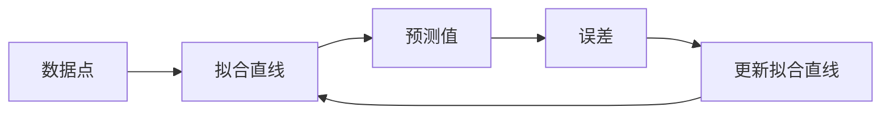

                 

## 1. 背景介绍

人工智能（AI）是当今世界最热门的话题之一，其应用领域从自动驾驶汽车到医疗诊断无所不包。然而，AI的复杂性和抽象性往往使其难以理解，更不用说教授它了。理查德·费曼，一位伟大的物理学家，提出了一个简单有效的学习和教授方法：费曼技巧。本文将探讨如何运用费曼技巧来教授AI，使其更容易理解和学习。

## 2. 核心概念与联系

费曼技巧的核心概念是将抽象的概念转化为具体的、可以理解的事物。在AI领域，这意味着将算法、模型和数学公式转化为日常生活中的场景或故事。下面是一个简单的示例，说明如何将线性回归转化为一个故事：



在故事中，数据点是一条路，我们想要找到一条最接近这条路的直线（拟合直线）。我们沿着这条直线前进，预测下一个数据点在哪里（预测值）。如果我们偏离了路径，我们就会有误差（误差）。我们根据误差调整直线，并重复这个过程，直到我们找到最接近路径的直线。

## 3. 核心算法原理 & 具体操作步骤

### 3.1 算法原理概述

线性回归是一种简单但强大的机器学习算法，用于预测连续值。它的目标是找到一条直线，使得数据点与这条直线的距离最小。

### 3.2 算法步骤详解

1. 初始化拟合直线的参数（斜率和截距）。
2. 计算当前拟合直线的预测值。
3. 计算预测值与实际值之间的误差。
4. 根据误差调整拟合直线的参数。
5. 重复步骤2-4，直到误差小于阈值或达到最大迭代次数。

### 3.3 算法优缺点

优点：

* 简单易懂，易于实现。
* 对数据的要求不高，只需要连续值即可。
* 可以提供数据的拟合情况。

缺点：

* 只能处理线性关系的数据。
* 对数据的假设条件较多，如数据要服从正态分布等。
* 易受异常值的影响。

### 3.4 算法应用领域

线性回归广泛应用于预测连续值，如房价预测、股票价格预测、天气预测等。它也常用于数据分析，帮助理解数据之间的关系。

## 4. 数学模型和公式 & 详细讲解 & 举例说明

### 4.1 数学模型构建

线性回归的数学模型是：

$$y = wx + b$$

其中，$y$是预测值，$x$是输入值，$w$是斜率，$b$是截距。

### 4.2 公式推导过程

线性回归的目标是最小化误差平方和（MSE），即：

$$MSE = \frac{1}{n}\sum_{i=1}^{n}(y_i - \hat{y}_i)^2$$

其中，$y_i$是实际值，$\hat{y}_i$是预测值，$n$是数据点数。

我们可以使用梯度下降算法来最小化MSE。梯度下降的公式是：

$$w := w - \eta \frac{\partial MSE}{\partial w}$$

$$b := b - \eta \frac{\partial MSE}{\partial b}$$

其中，$\eta$是学习率。

### 4.3 案例分析与讲解

假设我们有一组数据，表示房屋的面积（平方米）和房屋的价格（万美元）。我们想要预测房屋的价格。我们可以使用线性回归来拟合这组数据，找到一条最接近数据的直线。然后，我们可以使用这条直线来预测未知房屋的价格。

## 5. 项目实践：代码实例和详细解释说明

### 5.1 开发环境搭建

我们将使用Python和scikit-learn库来实现线性回归。

### 5.2 源代码详细实现

```python
from sklearn.linear_model import LinearRegression
import numpy as np

# 创建数据
X = np.array([1, 2, 3, 4, 5]).reshape(-1, 1)
y = np.array([2, 4, 5, 4, 5])

# 创建线性回归对象
lr = LinearRegression()

# 拟合数据
lr.fit(X, y)

# 获取参数
w = lr.coef_[0]
b = lr.intercept_

print(f"w: {w}, b: {b}")
```

### 5.3 代码解读与分析

我们首先导入所需的库，并创建一组数据。然后，我们创建一个线性回归对象，并使用`fit()`方法拟合数据。最后，我们获取斜率和截距的值。

### 5.4 运行结果展示

运行代码后，我们会得到斜率和截距的值。这些值可以用于预测新数据的值。

## 6. 实际应用场景

线性回归在各种领域都有广泛的应用，从预测天气到预测股票价格。它也常用于数据分析，帮助理解数据之间的关系。

### 6.4 未来应用展望

随着数据的不断增长和复杂化，线性回归的应用也将不断扩展。未来，我们可能会看到线性回归被应用于更复杂的数据集，并与其他机器学习算法结合使用。

## 7. 工具和资源推荐

### 7.1 学习资源推荐

* Andrew Ng的机器学习课程（https://www.coursera.org/learn/machine-learning）
* scikit-learn文档（https://scikit-learn.org/stable/documentation.html）
* "统计学习方法"（https://www.oreilly.com/library/view/statistical-learning-methods/9781461471370/）

### 7.2 开发工具推荐

* Python和scikit-learn库
* R语言和caret包
* MATLAB和Statistics and Machine Learning Toolbox

### 7.3 相关论文推荐

* "The Elements of Statistical Learning"（https://www.oreilly.com/library/view/the-elements-of/9780470037008/）
* "Linear Regression"（https://www.statisticshowto.com/probabilityandstatistics/linear-regression/）

## 8. 总结：未来发展趋势与挑战

### 8.1 研究成果总结

本文介绍了如何运用费曼技巧来教授AI，以线性回归为例说明了具体操作步骤。我们还讨论了线性回归的优缺点和应用领域。

### 8.2 未来发展趋势

随着AI技术的不断发展，我们将看到更多的AI算法被应用于各种领域。同时，AI的解释性也将变得越来越重要，费曼技巧将发挥关键作用。

### 8.3 面临的挑战

AI的复杂性和抽象性是教授它的主要挑战。费曼技巧虽然有效，但也需要一定的技巧和经验。

### 8.4 研究展望

未来的研究将关注如何更好地运用费曼技巧来教授AI，以及如何将费曼技巧与其他教授方法结合使用。

## 9. 附录：常见问题与解答

**Q：费曼技巧如何帮助理解AI？**

**A：费曼技巧帮助将抽象的AI概念转化为具体的、可以理解的事物。这有助于我们更好地理解AI算法的原理和工作机制。**

**Q：线性回归有哪些缺点？**

**A：线性回归的缺点包括只能处理线性关系的数据，对数据的假设条件较多，易受异常值的影响。**

**Q：线性回归的应用领域有哪些？**

**A：线性回归广泛应用于预测连续值，如房价预测、股票价格预测、天气预测等。它也常用于数据分析，帮助理解数据之间的关系。**

**作者：禅与计算机程序设计艺术 / Zen and the Art of Computer Programming**

