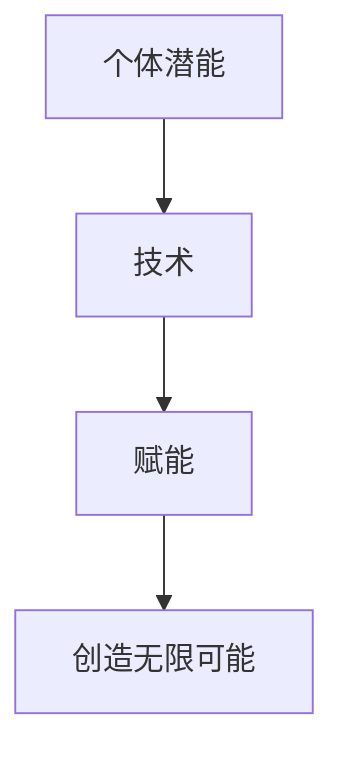

                 

**赋能人类：释放个体潜能，创造无限可能**

**作者：禅与计算机程序设计艺术 / Zen and the Art of Computer Programming**

## 1. 背景介绍

在当今信息化时代，人工智能（AI）、大数据和云计算等技术正在快速发展，为人类带来了前所未有的机遇和挑战。然而，我们如何才能真正地赋能人类，释放个体潜能，创造无限可能呢？本文将从技术和哲学的角度出发，探讨这个问题，并提供一些实用的建议和工具。

## 2. 核心概念与联系

### 2.1 个体潜能与赋能

个体潜能是指每个人内在的、尚未被开发的能力和资源。赋能则是指通过技术、教育或其他手段，帮助个体发掘和开发其潜能。赋能人类的目标是帮助每个人都能够发挥出最大的潜能，创造出更美好的未来。

### 2.2 技术与人类潜能

技术可以帮助我们赋能人类，释放个体潜能。然而，技术本身并不能解决所有问题。我们需要理解技术与人类潜能之间的关系，并将技术作为工具，而不是目的。



## 3. 核心算法原理 & 具体操作步骤

### 3.1 算法原理概述

赋能人类的过程可以看作是一个优化算法。我们需要找到最优的方法，帮助个体发掘和开发其潜能。这个过程涉及到数据收集、分析和反馈等步骤。

### 3.2 算法步骤详解

1. **数据收集**：收集个体的相关数据，包括学习能力、兴趣爱好、性格特点等。
2. **数据分析**：分析收集到的数据，找出个体的优势和劣势。
3. **目标设定**：根据分析结果，帮助个体设定合理的目标。
4. **反馈与调整**：提供反馈，帮助个体调整其学习和发展方向。

### 3.3 算法优缺点

优点：这个算法可以帮助个体找到最适合自己的发展方向，从而发挥出最大的潜能。

缺点：这个算法需要大量的数据收集和分析工作，并且需要个体的主动配合。

### 3.4 算法应用领域

这个算法可以应用于教育、职业发展、个人成长等领域。

## 4. 数学模型和公式 & 详细讲解 & 举例说明

### 4.1 数学模型构建

我们可以使用机器学习模型来预测个体的发展潜能。例如，我们可以使用回归模型来预测个体在某一领域的发展潜能。

### 4.2 公式推导过程

假设我们有以下特征变量：$X_1, X_2,..., X_n$, 以及目标变量$Y$. 我们可以使用线性回归模型来预测$Y$：

$$Y = \beta_0 + \beta_1X_1 + \beta_2X_2 +... + \beta_nX_n + \epsilon$$

其中$\beta_0, \beta_1,..., \beta_n$是回归系数，$\epsilon$是误差项。

### 4.3 案例分析与讲解

例如，我们想预测个体在数学领域的发展潜能。我们可以使用以下特征变量：$X_1$ - 个体的数学基础，$X_2$ - 个体的学习动机，$X_3$ - 个体的数学兴趣。我们可以使用线性回归模型来预测个体的数学发展潜能$Y$：

$$Y = \beta_0 + \beta_1X_1 + \beta_2X_2 + \beta_3X_3 + \epsilon$$

## 5. 项目实践：代码实例和详细解释说明

### 5.1 开发环境搭建

我们需要安装Python、NumPy、Pandas、Scikit-learn等库。

### 5.2 源代码详细实现

```python
import numpy as np
import pandas as pd
from sklearn.linear_model import LinearRegression

# 加载数据
data = pd.read_csv('data.csv')

# 分割特征变量和目标变量
X = data[['X1', 'X2', 'X3']]
Y = data['Y']

# 创建线性回归模型
model = LinearRegression()

# 拟合模型
model.fit(X, Y)

# 预测个体的数学发展潜能
predictions = model.predict(X)
```

### 5.3 代码解读与分析

我们首先加载数据，然后分割特征变量和目标变量。我们使用Scikit-learn库中的线性回归模型来拟合数据，并预测个体的数学发展潜能。

### 5.4 运行结果展示

我们可以将预测结果与实际结果进行比较，并计算模型的准确性。

## 6. 实际应用场景

### 6.1 个体发展

个体可以使用这个模型来预测自己的发展潜能，并设定合理的目标。

### 6.2 教育机构

教育机构可以使用这个模型来帮助学生找到最适合自己的发展方向。

### 6.3 未来应用展望

未来，我们可以将这个模型与其他技术结合起来，创造出更智能的赋能系统。

## 7. 工具和资源推荐

### 7.1 学习资源推荐

* "人工智能：一种现代 Approach" - Stuart Russell, Peter Norvig
* "机器学习" - Tom Mitchell

### 7.2 开发工具推荐

* Python
* Scikit-learn
* TensorFlow

### 7.3 相关论文推荐

* "Predicting Student Performance in Higher Education Using Machine Learning Techniques" - Rose Luckin, et al.
* "Using Machine Learning to Predict Student Performance in Mathematics" - David Baker, et al.

## 8. 总结：未来发展趋势与挑战

### 8.1 研究成果总结

我们提出了一个赋能人类的算法，并使用机器学习模型来预测个体的发展潜能。

### 8.2 未来发展趋势

未来，我们可以将这个模型与其他技术结合起来，创造出更智能的赋能系统。我们也可以使用更复杂的模型，如神经网络模型，来提高预测准确性。

### 8.3 面临的挑战

我们需要解决数据收集和隐私保护等问题。我们也需要考虑到个体的主观能动性，不能完全依赖模型的预测结果。

### 8.4 研究展望

我们计划进一步研究赋能人类的算法，并将其应用于更多领域。我们也计划研究如何将这个模型与其他技术结合起来，创造出更智能的赋能系统。

## 9. 附录：常见问题与解答

**Q：这个模型是否侵犯个体隐私？**

**A：我们需要采取措施保护个体隐私，例如使用匿名数据或加密技术。**

**Q：这个模型是否可以预测个体的未来成就？**

**A：这个模型可以预测个体的发展潜能，但不能预测个体的未来成就。个体的未来成就取决于多种因素，包括个体的主观能动性。**

**Q：这个模型是否可以应用于其他领域？**

**A：是的，这个模型可以应用于其他领域，例如职业发展、个人成长等。**

**作者：禅与计算机程序设计艺术 / Zen and the Art of Computer Programming**

