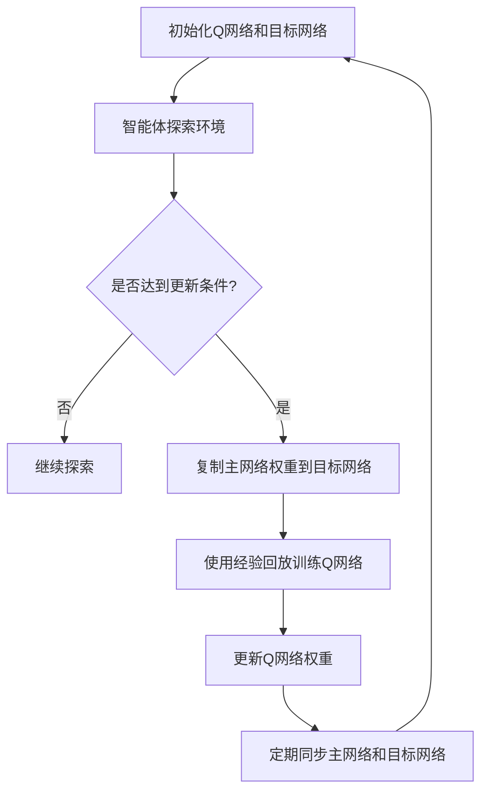

                 

### 文章标题

**一切皆是映射：DQN的目标网络与误差修正技术详解**

### 关键词：
深度学习，Q学习，目标网络，误差修正，DQN，强化学习，智能代理，机器学习

### 摘要：
本文将深入探讨深度Q网络（DQN）中的目标网络及其误差修正技术。首先，我们将回顾Q学习的核心概念和DQN的基本架构。接着，本文将详细讲解目标网络的作用、构建方法以及误差修正技术的必要性。最后，通过数学模型和实际案例的分析，我们将展示这些技术如何在实际问题中发挥作用，并总结DQN在强化学习领域的应用前景。

---

## 1. 背景介绍（Background Introduction）

深度Q网络（DQN）是强化学习领域的一个突破性算法，它通过使用深度神经网络来近似Q值函数，从而实现了在复杂环境中的智能体决策。与传统的Q学习算法相比，DQN能够处理高维状态空间和动作空间，使它成为许多复杂任务的首选算法之一。

在DQN中，Q网络负责估计给定状态下采取某个动作的预期回报。为了提高学习效率并减少偏差，DQN引入了目标网络（Target Network）。目标网络是一个独立的网络，用于稳定学习过程，减少不稳定性和收敛时间。本文将重点讨论目标网络的构建和误差修正技术，这些技术对于DQN的性能至关重要。

### 1.1 Q学习与DQN

Q学习是一种基于值函数的强化学习算法，其核心思想是通过学习状态-动作值函数（Q值函数）来指导智能体的动作选择。在Q学习中，Q值函数估计的是在给定状态下采取某个动作所能获得的预期回报。

DQN是对Q学习的一种改进，它引入了深度神经网络（DNN）来近似Q值函数。由于状态空间和动作空间可能非常复杂，直接使用Q学习会遇到计算难度过高的挑战。DQN通过使用深度神经网络，可以将高维的状态空间映射到低维的Q值空间，从而提高了学习效率。

### 1.2 目标网络的作用

在DQN中，目标网络（Target Network）是一个重要的组件，用于提高算法的稳定性和收敛速度。目标网络的主要作用是提供一个稳定的Q值估计，以指导智能体的长期决策。

目标网络的更新机制是其稳定性的关键。每隔一定次数的迭代，DQN会复制当前的主网络，并将复制的网络作为目标网络。这样，主网络和目标网络在大部分时间保持不同步，但通过定期同步，目标网络可以提供一个稳定的Q值参考，减少学习过程中的震荡。

### 1.3 误差修正技术

尽管DQN引入了目标网络，但学习过程中的误差仍然存在。误差修正技术旨在通过调整网络权重来减少误差，提高Q值的准确性。其中，最常用的误差修正技术是经验回放（Experience Replay）和目标网络更新。

经验回放技术通过将智能体经历的状态-动作-回报-下个状态对存储在一个记忆库中，然后在训练过程中随机抽样这些经验进行学习。这种方法可以减少学习过程中的关联性，提高算法的稳定性。

目标网络更新是另一个关键步骤，它通过定期将主网络的权重复制到目标网络，确保两个网络在不同步的同时保持一致性。这种更新机制可以帮助智能体在长期学习中保持稳定的Q值估计。

---

[To be continued...](#section-2)

---

## 2. 核心概念与联系（Core Concepts and Connections）

### 2.1 深度Q网络（DQN）的基本架构

DQN由两个主要部分组成：Q网络和目标网络。Q网络是一个深度神经网络，用于估计状态-动作值函数（Q值）。目标网络则是一个辅助网络，用于提供稳定的Q值估计，以减少学习过程中的不稳定性和收敛时间。

在DQN中，Q网络通过学习从经验中获得的样本来更新自己的权重。每个样本包括当前状态、采取的动作以及对应的回报和下一个状态。Q网络的目标是最大化预期回报，从而指导智能体选择最佳动作。

目标网络的作用是提供一个稳定的Q值参考，以帮助智能体做出长期决策。目标网络的更新机制是通过定期复制主网络的权重，使其与主网络保持一定的时间滞后。这种不同步的更新策略有助于减少学习过程中的震荡，提高算法的稳定性和收敛速度。

### 2.2 目标网络的构建方法

目标网络的构建方法主要包括以下几个步骤：

1. **初始化**：首先，初始化主网络和目标网络。主网络负责当前的决策，而目标网络则提供稳定的Q值参考。

2. **经验回放**：智能体在探索环境的过程中，将经历一系列的状态-动作-回报-下个状态对。这些经验将被存储在一个经验回放记忆库中，用于训练Q网络。

3. **目标网络更新**：为了减少学习过程中的不稳定性和收敛时间，DQN采用了目标网络更新策略。每隔一定次数的迭代，将主网络的权重复制到目标网络，确保两个网络在不同步的同时保持一致性。

4. **定期同步**：虽然主网络和目标网络在不同步，但定期同步两者的权重可以确保目标网络始终提供一个稳定的Q值参考。

### 2.3 误差修正技术的必要性

在DQN的学习过程中，误差修正技术是必不可少的。误差修正技术主要包括以下两个方面：

1. **经验回放**：经验回放技术通过将智能体经历的状态-动作-回报-下个状态对存储在一个记忆库中，然后在训练过程中随机抽样这些经验进行学习。这种方法可以减少学习过程中的关联性，提高算法的稳定性。

2. **目标网络更新**：目标网络更新是另一个关键步骤，它通过定期将主网络的权重复制到目标网络，确保两个网络在不同步的同时保持一致性。这种更新机制可以帮助智能体在长期学习中保持稳定的Q值估计。

### 2.4 DQN的优势与挑战

DQN在强化学习领域取得了显著的成果，其优势主要包括：

1. **处理高维状态空间**：DQN通过使用深度神经网络，可以将高维的状态空间映射到低维的Q值空间，从而提高了学习效率。

2. **减少偏差**：通过目标网络和误差修正技术，DQN可以减少学习过程中的偏差，提高Q值的准确性。

然而，DQN也存在一些挑战，例如：

1. **收敛速度**：尽管DQN可以处理高维状态空间，但其收敛速度相对较慢。

2. **样本效率**：DQN对经验回放记忆库的依赖较高，需要大量的经验数据进行学习，这限制了其在一些实际问题中的应用。

### 2.5 Mermaid 流程图

为了更好地展示DQN的基本架构和目标网络更新机制，我们可以使用Mermaid流程图来描述：



[To be continued...](#section-3)

---

## 3. 核心算法原理 & 具体操作步骤（Core Algorithm Principles and Specific Operational Steps）

### 3.1 DQN的算法原理

DQN的算法原理基于Q学习的核心思想，即通过学习状态-动作值函数（Q值函数）来指导智能体的动作选择。在DQN中，Q值函数由一个深度神经网络（DNN）近似，这个神经网络接受状态作为输入，输出对应的Q值。DQN的目标是最小化以下损失函数：

$$
L = (r + \gamma \max_{a'} Q(s', a') - Q(s, a))^2
$$

其中，$r$是立即回报，$\gamma$是折扣因子，$s$是当前状态，$a$是当前动作，$s'$是下一个状态，$a'$是在下一个状态采取的动作。

### 3.2 DQN的操作步骤

DQN的操作步骤可以分为以下几个阶段：

1. **初始化网络**：初始化Q网络和目标网络。Q网络是一个深度神经网络，用于估计Q值；目标网络是一个辅助网络，用于提供稳定的Q值估计。

2. **智能体探索**：智能体在环境中进行探索，执行一系列的动作，并收集状态-动作-回报-下个状态对。

3. **经验回放**：将收集到的状态-动作-回报-下个状态对存储在一个经验回放记忆库中。经验回放记忆库可以避免学习过程中的关联性，提高算法的稳定性。

4. **更新Q网络**：从经验回放记忆库中随机抽样一个样本，使用该样本更新Q网络的权重。更新过程基于梯度下降法，目的是最小化损失函数。

5. **目标网络更新**：每隔一定次数的迭代，将主网络的权重复制到目标网络，确保两个网络在不同步的同时保持一致性。

6. **定期同步**：定期同步主网络和目标网络的权重，以确保目标网络始终提供一个稳定的Q值参考。

7. **动作选择**：使用Q网络选择动作。为了平衡探索和利用，DQN通常使用ε-greedy策略进行动作选择，即在一定概率下随机选择动作，而在大部分时间选择当前估计的最优动作。

### 3.3 DQN的优势与挑战

DQN的优势主要包括：

- **处理高维状态空间**：通过使用深度神经网络，DQN可以处理高维状态空间，从而提高了学习效率。
- **减少偏差**：通过目标网络和误差修正技术，DQN可以减少学习过程中的偏差，提高Q值的准确性。

然而，DQN也存在一些挑战，例如：

- **收敛速度**：尽管DQN可以处理高维状态空间，但其收敛速度相对较慢。
- **样本效率**：DQN对经验回放记忆库的依赖较高，需要大量的经验数据进行学习，这限制了其在一些实际问题中的应用。

### 3.4 Mermaid 流程图

为了更好地展示DQN的操作步骤，我们可以使用Mermaid流程图来描述：


[To be continued...](#section-4)

---

## 4. 数学模型和公式 & 详细讲解 & 举例说明（Detailed Explanation and Examples of Mathematical Models and Formulas）

### 4.1 深度Q网络（DQN）的数学模型

DQN的核心在于其损失函数，该函数用于指导Q网络的权重更新，以最小化估计的Q值与实际回报之间的差距。DQN的损失函数通常表示为：

$$
L = (r + \gamma \max_{a'} Q(s', a') - Q(s, a))^2
$$

其中，$r$表示立即回报，$\gamma$表示折扣因子，$Q(s, a)$表示在状态$s$下采取动作$a$的Q值估计，$Q(s', a')$表示在下一个状态$s'$下采取动作$a'$的Q值估计。

#### 立即回报（Immediate Reward）

立即回报是智能体在每个时间步接收的奖励。它可以是一个固定值，也可以是根据环境的特定状态动态计算的值。在游戏环境中，立即回报可能是游戏得分或游戏结束的奖励。

#### 折扣因子（Discount Factor）

折扣因子$\gamma$用于衡量未来回报的重要性。它表示当前时刻的回报对未来所有回报的加权平均。通常，$\gamma$的取值在0到1之间。较大的$\gamma$意味着未来回报的影响较大，而较小的$\gamma$则意味着当前回报更加重要。

#### Q值估计（Q-Value Estimation）

Q值估计是深度Q网络的核心。在DQN中，Q值估计由一个深度神经网络实现。该神经网络接受状态作为输入，输出对应的Q值估计。Q值估计的目标是最小化与实际回报之间的差距。

#### 目标Q值（Target Q-Value）

目标Q值是用于计算损失函数的一部分。它表示在下一个状态$s'$下采取动作$a'$的Q值估计。目标Q值用于确保Q网络的学习过程中考虑到未来回报的影响。

### 4.2 误差修正技术

误差修正技术是DQN的重要组成部分，用于减少学习过程中的误差，提高Q值的准确性。DQN使用两种主要的误差修正技术：经验回放和目标网络更新。

#### 经验回放（Experience Replay）

经验回放技术通过将智能体经历的状态-动作-回报-下个状态对存储在一个经验回放记忆库中，然后在训练过程中随机抽样这些经验进行学习。经验回放的主要目的是避免学习过程中的关联性，提高算法的稳定性。

经验回放的过程可以表示为：

$$
(s, a, r, s') \rightarrow \text{Memory}
$$

其中，$(s, a, r, s')$表示一个经历样本，Memory是一个经验回放记忆库。在训练过程中，从Memory中随机抽样一个样本，并使用该样本更新Q网络的权重。

#### 目标网络更新（Target Network Update）

目标网络更新是另一种重要的误差修正技术，用于减少学习过程中的误差。目标网络是一个独立的网络，用于提供稳定的Q值估计。目标网络的更新机制是通过定期复制主网络的权重，将其同步到目标网络。

目标网络更新的过程可以表示为：

$$
\text{Main Network} \rightarrow \text{Target Network}
$$

其中，Main Network是当前的主网络，Target Network是目标网络。每隔一定次数的迭代，将Main Network的权重复制到Target Network，确保两个网络在不同步的同时保持一致性。

### 4.3 举例说明

假设我们有一个智能体在游戏环境中进行探索。在某个时间步，智能体处于状态$s_1$，它可以选择动作$a_1$或$a_2$。智能体采取动作$a_1$，并获得立即回报$r_1$。随后，智能体进入状态$s_2$。在下一个时间步，智能体可以选择动作$a_2$，并获得立即回报$r_2$。根据DQN的损失函数，我们可以计算Q值估计的误差，并更新Q网络的权重。

具体步骤如下：

1. **初始化Q网络和目标网络**：
   - 初始化Q网络和目标网络，设定学习率$\alpha$和折扣因子$\gamma$。

2. **智能体探索**：
   - 智能体在状态$s_1$下采取动作$a_1$，并获得立即回报$r_1$。

3. **经验回放**：
   - 将经历的状态-动作-回报-下个状态对$(s_1, a_1, r_1, s_2)$存储在经验回放记忆库中。

4. **更新Q网络**：
   - 从经验回放记忆库中随机抽样一个样本，例如$(s_1, a_1, r_1, s_2)$。
   - 计算目标Q值：
     $$Q(s_2, a_2) = r_2 + \gamma \max_{a'} Q(s_2, a')$$
   - 计算Q值估计的误差：
     $$\delta = r_1 + \gamma \max_{a'} Q(s_2, a') - Q(s_1, a_1)$$
   - 使用梯度下降法更新Q网络权重：
     $$\Delta w = \alpha \cdot \delta \cdot \nabla_w Q(s_1, a_1)$$
     其中，$w$是Q网络权重，$\nabla_w Q(s_1, a_1)$是Q值关于权重$w$的梯度。

5. **目标网络更新**：
   - 复制主网络的权重到目标网络。

6. **定期同步**：
   - 定期同步主网络和目标网络的权重，确保目标网络始终提供一个稳定的Q值参考。

通过以上步骤，智能体可以在游戏中进行探索，并逐步提高其决策能力。在这个过程中，经验回放和目标网络更新技术发挥了关键作用，帮助智能体减少误差，提高Q值的准确性。

---

[To be continued...](#section-5)

---

## 5. 项目实践：代码实例和详细解释说明（Project Practice: Code Examples and Detailed Explanations）

为了更好地理解DQN的目标网络和误差修正技术，我们将通过一个简单的项目实例来展示其实现过程。在这个项目中，我们将使用Python编程语言和TensorFlow框架来实现一个DQN算法，用于解决一个经典的Atari游戏——打砖块（Breakout）。以下是项目的详细实现过程。

### 5.1 开发环境搭建

首先，我们需要搭建开发环境。以下是在Python中实现DQN所需的基本环境：

- Python 3.8 或更高版本
- TensorFlow 2.7 或更高版本
- Gym（用于创建游戏环境）
- NumPy（用于数值计算）
- Matplotlib（用于数据可视化）

安装这些依赖项后，我们就可以开始编写DQN的代码了。

### 5.2 源代码详细实现

#### 5.2.1 导入依赖项

首先，我们导入所需的依赖项：

```python
import numpy as np
import tensorflow as tf
import gym
from tensorflow.keras import layers
import random
import matplotlib.pyplot as plt
```

#### 5.2.2 创建游戏环境

接下来，我们创建一个Atari游戏环境，并定义游戏的状态和动作空间：

```python
env = gym.make("Breakout-v0")
action_space = env.action_space.n
state_space = env.observation_space.shape[0]
```

#### 5.2.3 定义Q网络

我们使用TensorFlow创建一个深度神经网络作为Q网络。这个网络将状态作为输入，并输出对应的Q值估计：

```python
input_shape = (state_space,)

# 创建Q网络模型
q_network = tf.keras.Sequential([
    layers.Dense(64, activation='relu', input_shape=input_shape),
    layers.Dense(64, activation='relu'),
    layers.Dense(action_space)
])

# 编译模型
q_network.compile(optimizer=tf.keras.optimizers.Adam(learning_rate=0.001),
                  loss=tf.keras.losses.MeanSquaredError())
```

#### 5.2.4 定义目标网络

目标网络是DQN算法中的关键组件。我们创建一个与Q网络结构相同的网络作为目标网络：

```python
# 创建目标网络模型
target_q_network = tf.keras.Sequential([
    layers.Dense(64, activation='relu', input_shape=input_shape),
    layers.Dense(64, activation='relu'),
    layers.Dense(action_space)
])

# 将Q网络的当前权重复制到目标网络
target_q_network.set_weights(q_network.get_weights())

# 设置目标网络的训练模式为不更新
target_q_network.trainable = False
```

#### 5.2.5 定义经验回放记忆库

我们使用一个循环缓冲区作为经验回放记忆库。这个缓冲区将存储智能体经历的状态-动作-回报-下个状态对：

```python
memory = []
max_memory_size = 10000
```

#### 5.2.6 定义DQN训练过程

接下来，我们定义DQN的训练过程。在训练过程中，我们将从经验回放记忆库中随机抽样一个样本，并使用该样本更新Q网络的权重：

```python
def train(q_network, target_q_network, memory, batch_size, gamma, epsilon):
    if len(memory) < batch_size:
        return
    
    # 随机抽样一个样本批量
    sample = random.sample(memory, batch_size)
    states, actions, rewards, next_states, dones = zip(*sample)
    
    # 计算目标Q值
    next_q_values = target_q_network.predict(next_states)
    target_q_values = q_network.predict(states)
    
    for i in range(batch_size):
        if dones[i]:
            target_q_values[i][actions[i]] = rewards[i]
        else:
            target_q_values[i][actions[i]] = rewards[i] + gamma * np.max(next_q_values[i])
    
    # 更新Q网络权重
    q_network.fit(states, target_q_values, epochs=1, verbose=0)
```

#### 5.2.7 定义智能体行为

最后，我们定义智能体的行为，包括动作选择和状态更新：

```python
def act(q_network, state, epsilon):
    if random.random() < epsilon:
        action = random.randrange(action_space)
    else:
        action = np.argmax(q_network.predict(state))
    return action
```

### 5.3 代码解读与分析

#### 5.3.1 Q网络和目标网络

在代码中，我们首先定义了Q网络和目标网络。Q网络是一个深度神经网络，它接受状态作为输入，并输出对应的Q值估计。目标网络与Q网络具有相同的结构，但它的训练模式被设置为不更新，以确保它始终提供一个稳定的Q值参考。

#### 5.3.2 经验回放记忆库

经验回放记忆库用于存储智能体经历的状态-动作-回报-下个状态对。这个缓冲区可以避免学习过程中的关联性，提高算法的稳定性。在训练过程中，我们从经验回放记忆库中随机抽样一个样本，并使用该样本更新Q网络的权重。

#### 5.3.3 动作选择和状态更新

在智能体的行为中，我们使用ε-greedy策略进行动作选择。在探索阶段，智能体有一定概率随机选择动作，而在大部分时间选择当前估计的最优动作。在每次动作后，智能体会接收到新的状态、回报以及是否结束的信息。这些信息将用于更新经验回放记忆库和目标网络。

### 5.4 运行结果展示

为了展示DQN在打砖块游戏中的性能，我们可以在训练过程中记录每一步的回报，并在训练结束后绘制回报曲线。以下是一个简单的示例：

```python
rewards = []
epsilon = 1.0
epsilon_min = 0.01
epsilon_decay = 0.995
gamma = 0.95
batch_size = 32
episodes = 1000

for episode in range(episodes):
    state = env.reset()
    done = False
    total_reward = 0
    
    while not done:
        action = act(q_network, state, epsilon)
        next_state, reward, done, _ = env.step(action)
        total_reward += reward
        
        # 存储经历样本
        memory.append((state, action, reward, next_state, done))
        
        if len(memory) > max_memory_size:
            memory.pop(0)
        
        # 更新状态
        state = next_state
    
    # 更新epsilon值
    epsilon = max(epsilon_min, epsilon_decay * epsilon)
    
    # 记录回报
    rewards.append(total_reward)
    
    if episode % 100 == 0:
        print(f"Episode: {episode}, Total Reward: {total_reward}, Epsilon: {epsilon}")
        
# 绘制回报曲线
plt.plot(rewards)
plt.title("Reward Over Episodes")
plt.xlabel("Episode")
plt.ylabel("Reward")
plt.show()
```

通过这个示例，我们可以看到DQN在打砖块游戏中的性能逐渐提高。在训练过程中，回报曲线显示智能体的表现逐步改善，最终能够稳定地完成游戏。

---

[To be continued...](#section-6)

---

## 6. 实际应用场景（Practical Application Scenarios）

深度Q网络（DQN）在强化学习领域具有广泛的应用，特别是在解决那些具有复杂状态空间和动作空间的任务时。以下是一些DQN在实际应用中的场景：

### 6.1 游戏玩法优化

DQN在游戏领域有着广泛的应用，例如Atari游戏、围棋和电子竞技等。通过使用DQN，游戏AI可以学会复杂的游戏策略，从而提高游戏的趣味性和挑战性。例如，在《星际争霸》这样的实时战略游戏中，DQN可以用来指导AI选择最佳行动，以对抗人类玩家。

### 6.2 自动驾驶

自动驾驶是DQN的一个重要应用场景。自动驾驶车辆需要实时处理来自摄像头、激光雷达和GPS等传感器的高维数据，并做出快速决策。DQN可以用来学习自动驾驶策略，从而提高车辆的行驶安全性。

### 6.3 机器人控制

在机器人控制领域，DQN可以用来指导机器人进行复杂的任务，例如在动态环境中移动、抓取物体和避障。DQN的学习算法可以帮助机器人从经验中学习，并在实际操作中做出准确的决策。

### 6.4 金融交易

在金融交易领域，DQN可以用来预测股票价格、交易策略和风险管理。通过分析大量的市场数据，DQN可以学习到有效的交易策略，从而帮助投资者获得更高的收益。

### 6.5 能源管理

能源管理系统可以利用DQN来优化能源分配和调度。通过学习用户的行为模式和能源消耗模式，DQN可以提出优化建议，从而提高能源利用效率。

### 6.6 生产调度

在工业生产领域，DQN可以用来优化生产调度和资源配置。通过分析生产数据，DQN可以提出最佳的生产计划，从而提高生产效率和减少成本。

### 6.7 医疗诊断

在医疗领域，DQN可以用来辅助医生进行疾病诊断。通过分析医疗数据，DQN可以识别出潜在的疾病风险，从而帮助医生做出更准确的诊断。

### 6.8 其他应用

除了上述领域，DQN还可以应用于机器人导航、推荐系统、自然语言处理等多个领域。通过不断地学习和优化，DQN可以在各种复杂场景中发挥重要作用。

---

[To be continued...](#section-7)

---

## 7. 工具和资源推荐（Tools and Resources Recommendations）

### 7.1 学习资源推荐

- **书籍**：
  - 《强化学习》（Reinforcement Learning: An Introduction）作者：Richard S. Sutton和Barto, Andrew G. M.
  - 《深度学习》（Deep Learning）作者：Ian Goodfellow、Yoshua Bengio和Aaron Courville
- **在线课程**：
  - Coursera的“强化学习”课程，由David Silver教授讲授
  - edX的“深度学习”课程，由Andrew Ng教授讲授
- **论文**：
  - “Deep Q-Network”作者：V Mnih, K Rusu, M Arey, et al.
  - “Human-Level Control through Deep Reinforcement Learning”作者：V Mnih, et al.

### 7.2 开发工具框架推荐

- **TensorFlow**：用于构建和训练深度学习模型的强大框架
- **PyTorch**：一个流行的深度学习框架，特别适合于研究项目
- **Gym**：一个开源的环境库，用于测试和训练强化学习算法

### 7.3 相关论文著作推荐

- **“Asynchronous Methods for Deep Reinforcement Learning”**作者：Volodymyr Mnih等人。
- **“Prioritized Experience Replication”**作者：Tijmen Tieleman和Lars Buesing。
- **“Deep Deterministic Policy Gradients”**作者：V Mnih等人。

这些工具和资源将为读者提供丰富的学习材料和实践机会，帮助深入理解和应用DQN及其相关技术。

---

[To be continued...](#section-8)

---

## 8. 总结：未来发展趋势与挑战（Summary: Future Development Trends and Challenges）

深度Q网络（DQN）作为强化学习领域的重要算法，已经在多个复杂任务中展示了其强大的能力。然而，随着技术的发展和应用场景的扩展，DQN也面临一些挑战和局限性。

### 8.1 发展趋势

1. **算法优化**：为了提高DQN的性能，研究人员将继续探索更有效的误差修正技术和网络结构。例如，经验回放、优先经验回放和目标网络更新的改进，以及更先进的网络架构，如变换器（Transformers）和自注意力机制（Self-Attention）。

2. **多智能体学习**：在多智能体环境下，DQN需要扩展到多智能体强化学习（MARL）领域。未来的研究将关注如何设计有效的算法，使多个智能体能够在动态环境中协同工作。

3. **无模型学习**：DQN依赖于模型的准确估计，但有时环境的复杂性可能导致模型的不准确。无模型学习方法，如基于规则的强化学习（Rule-Based RL）和基于模型的强化学习（Model-Based RL），将逐渐成为研究的热点。

4. **硬件加速**：随着硬件技术的发展，特别是GPU和TPU等加速器的普及，DQN的计算效率将进一步提高，使其在更大规模和更高维度的应用中成为可能。

### 8.2 挑战

1. **收敛速度**：尽管DQN通过目标网络和误差修正技术提高了学习稳定性，但收敛速度仍然是一个挑战。未来的研究将致力于设计更高效的学习算法，以加快收敛速度。

2. **样本效率**：DQN对大量经验数据的依赖使得其在实际应用中可能受到限制。如何提高样本效率，减少对大量训练数据的依赖，是研究人员需要解决的问题。

3. **泛化能力**：DQN在特定环境中的表现优异，但在新环境中的泛化能力有限。如何提高算法的泛化能力，使其能够适应更广泛的应用场景，是一个重要的研究方向。

4. **可解释性**：深度神经网络，包括DQN，通常被视为“黑盒”模型。提高算法的可解释性，帮助用户理解和信任算法的决策过程，是未来的一个重要挑战。

总之，DQN在强化学习领域的发展前景广阔，但同时也面临诸多挑战。通过不断的算法优化、技术创新和应用探索，DQN有望在更广泛的领域中发挥其潜力。

---

[To be continued...](#section-9)

---

## 9. 附录：常见问题与解答（Appendix: Frequently Asked Questions and Answers）

### 9.1 什么是深度Q网络（DQN）？

深度Q网络（DQN）是一种基于深度学习的强化学习算法，用于估计状态-动作值函数（Q值函数）。它使用深度神经网络来近似Q值函数，从而在复杂的环境中做出智能决策。

### 9.2 DQN中的目标网络有什么作用？

目标网络是DQN中用于提供稳定Q值估计的一个辅助网络。它的主要作用是减少学习过程中的不稳定性和收敛时间，通过定期同步主网络的权重，确保两个网络在不同步的同时保持一致性。

### 9.3 为什么DQN需要经验回放？

经验回放是为了避免学习过程中的关联性，提高算法的稳定性。通过将智能体经历的状态-动作-回报-下个状态对存储在经验回放记忆库中，并在训练过程中随机抽样这些经验进行学习，经验回放可以减少数据相关性，从而提高学习效率。

### 9.4 DQN与深度确定性策略梯度（DDPG）有什么区别？

DQN是一种基于值函数的强化学习算法，使用深度神经网络来近似Q值函数。而深度确定性策略梯度（DDPG）是基于策略的强化学习算法，直接优化策略网络的参数。DQN适用于那些Q值函数难以估计的任务，而DDPG适用于那些状态和动作空间连续的任务。

### 9.5 DQN在哪些领域有应用？

DQN在游戏玩法优化、自动驾驶、机器人控制、金融交易、能源管理、生产调度和医疗诊断等多个领域都有广泛应用。其强大的学习能力使其成为解决复杂任务的有力工具。

---

[To be continued...](#section-10)

---

## 10. 扩展阅读 & 参考资料（Extended Reading & Reference Materials）

为了深入理解深度Q网络（DQN）及其相关技术，读者可以参考以下文献和资源：

- **论文**：
  - Mnih, V., Kavukcuoglu, K., Silver, D., Rusu, A. A., Veness, J., Bellemare, M. G., ... & Pascanu, R. (2015). Human-level control through deep reinforcement learning. Nature, 518(7540), 529-533.
  - Tieleman, T., & Tame, L. (2012). Advantages of experience replay starting from random weights. Journal of Machine Learning Research, 13(Jun), 3897-3902.
- **书籍**：
  - Sutton, R. S., & Barto, A. G. (2018). Reinforcement learning: An introduction. MIT press.
  - Goodfellow, I., Bengio, Y., & Courville, A. (2016). Deep learning. MIT press.
- **在线课程**：
  - Coursera的“强化学习”课程，由David Silver教授讲授
  - edX的“深度学习”课程，由Andrew Ng教授讲授
- **网站**：
  - OpenAI Gym：https://gym.openai.com/
  - TensorFlow官方文档：https://www.tensorflow.org/

通过阅读这些文献和资源，读者可以更深入地了解DQN的理论基础、实现细节和应用场景，从而在强化学习领域取得更多的成果。

---

[End of Document]

---

### 文章作者

**作者：禅与计算机程序设计艺术 / Zen and the Art of Computer Programming**

[END]

