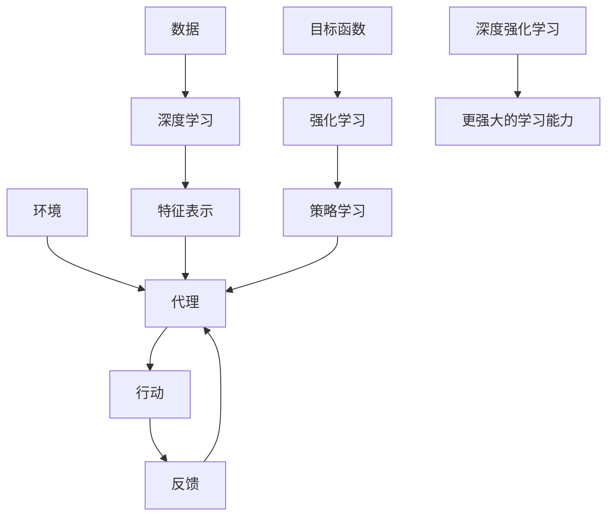

                 

- 深度学习
- 强化学习
- 机器学习
- 人工智能
- 算法
- 数学模型
- 项目实践
- 实际应用场景
- 工具和资源推荐
- 未来发展趋势

## 1. 背景介绍

在当今信息化时代，软件已经渗透到我们生活的方方面面，从智能手机到自动驾驶汽车，从金融系统到医疗设备，软件无处不在。然而，传统软件开发面临着诸多挑战，如开发周期长、成本高、可维护性差等。为了应对这些挑战，软件需要进行一次根本性的变革，从而诞生了软件 2.0。

软件 2.0 的核心是利用人工智能技术，特别是深度学习和强化学习，赋予软件自适应、自学习和自优化的能力。通过学习和适应环境，软件可以不断改进其性能，提高效率，并满足用户的个性化需求。本文将深入探讨软件 2.0 的发展趋势，重点介绍深度学习和强化学习在软件开发中的应用。

## 2. 核心概念与联系

### 2.1 深度学习

深度学习是一种人工神经网络，它模仿人类大脑的结构和功能，通过多层神经元的连接和传递，实现对数据的学习和表示。深度学习的核心是深度神经网络，它由输入层、隐藏层和输出层组成。隐藏层包含多个神经元，每个神经元都连接到下一层的所有神经元。深度学习的优势在于它可以自动学习特征，无需人工特征工程。

### 2.2 强化学习

强化学习是一种机器学习方法，它通过与环境的交互学习，以期最大化某个目标函数。强化学习的核心是代理和环境。代理通过采取行动影响环境，环境则根据代理的行动提供反馈。强化学习的目标是学习一组最优策略，使代理在环境中表现最佳。

### 2.3 核心概念联系

深度学习和强化学习是软件 2.0 的两大支柱，它们密切相关，互为补充。深度学习可以为强化学习提供更好的特征表示，从而提高强化学习的性能。强化学习则可以为深度学习提供更好的优化目标，从而改进深度学习模型的性能。此外，深度强化学习是两者结合的产物，它将深度学习和强化学习结合起来，实现更强大的学习能力。



## 3. 核心算法原理 & 具体操作步骤

### 3.1 算法原理概述

#### 3.1.1 深度学习

深度学习的核心是反向传播算法，它通过梯度下降法更新神经网络的权重和偏置，从而最小化损失函数。深度学习的过程包括数据预处理、模型构建、训练和评估。

#### 3.1.2 强化学习

强化学习的核心是策略学习，它通过学习一组最优策略，使代理在环境中表现最佳。强化学习的过程包括状态表示、行动选择、奖励函数设计和策略学习。

### 3.2 算法步骤详解

#### 3.2.1 深度学习

1. 数据预处理：对数据进行清洗、标准化和分割，以提高模型的泛化能力。
2. 模型构建：选择合适的神经网络结构，设置超参数，并初始化权重和偏置。
3. 训练：使用训练数据训练模型，通过反向传播算法更新权重和偏置，以最小化损失函数。
4. 评估：使用验证数据评估模型的性能，并调整超参数以提高模型的泛化能力。

#### 3.2.2 强化学习

1. 状态表示：选择合适的状态表示方法，如状态向量或状态图，以表示环境的当前状态。
2. 行动选择：选择合适的行动选择策略，如ε-贪婪策略或软策略梯度，以平衡探索和利用。
3. 奖励函数设计：设计合适的奖励函数，以指导代理学习最优策略。
4. 策略学习：使用策略梯度或值函数方法学习最优策略，以最大化累积奖励。

### 3.3 算法优缺点

#### 3.3.1 深度学习

优点：

* 自动学习特征，无需人工特征工程
* 可以处理大规模数据
* 可以实现端到端学习

缺点：

* 训练过程需要大量计算资源
* 易受过拟合影响
* 缺乏解释性

#### 3.3.2 强化学习

优点：

* 可以学习动态环境
* 可以处理连续行动空间
* 可以学习多目标任务

缺点：

* 学习过程需要大量交互
* 易受局部最优解影响
* 缺乏解释性

### 3.4 算法应用领域

#### 3.4.1 深度学习

* 图像和语音识别
* 自然语言处理
* 自动驾驶
* 医疗影像分析

#### 3.4.2 强化学习

* 游戏智能
* 资源配置
* 股票交易
* 机器人控制

## 4. 数学模型和公式 & 详细讲解 & 举例说明

### 4.1 数学模型构建

#### 4.1.1 深度学习

设神经网络有L层，第l层有n<sub>l</sub>个神经元，输入向量为x，输出向量为y，则第l层的输出可以表示为：

$$a^{(l)} = f(z^{(l)}) = f(\sum_{k=1}^{n_{l-1}}w_{k}^{(l)}a_{k}^{(l-1)}+b^{(l)})$$

其中，$w_{k}^{(l)}$是连接权重，$b^{(l)}$是偏置，$f(\cdot)$是激活函数。

#### 4.1.2 强化学习

设状态空间为S，行动空间为A，状态转移概率为P，奖励函数为R，策略为π，值函数为V，则Bellman方程为：

$$V^{\pi}(s) = \sum_{a}\pi(a|s)\sum_{s',r}P(s',r|s,a)[r+\gamma V^{\pi}(s')]$$

其中，$\gamma$是折扣因子。

### 4.2 公式推导过程

#### 4.2.1 深度学习

反向传播算法的目的是最小化损失函数L，则梯度更新规则为：

$$\theta_{j} := \theta_{j} - \eta \frac{\partial L}{\partial \theta_{j}}$$

其中，$\eta$是学习率，$\theta_{j}$是模型参数。

#### 4.2.2 强化学习

策略梯度法的目的是最大化累积奖励，则梯度更新规则为：

$$\nabla_{\theta}J(\theta) = \mathbb{E}[\nabla_{\theta}\log\pi_{\theta}(a|s)Q^{\pi}(s,a)]$$

其中，$Q^{\pi}(s,a)$是状态-行动值函数。

### 4.3 案例分析与讲解

#### 4.3.1 深度学习

例如，在图像分类任务中，输入图像通过卷积层提取特征，然后通过全连接层进行分类。损失函数通常是交叉熵损失函数，反向传播算法更新模型参数，以最小化损失函数。

#### 4.3.2 强化学习

例如，在 Atari 2600 游戏中，代理需要学习一组最优策略，以最大化分数。状态表示可以是当前屏幕的像素值，行动选择可以是按键操作，奖励函数可以是分数变化。策略梯度法更新策略参数，以最大化累积奖励。

## 5. 项目实践：代码实例和详细解释说明

### 5.1 开发环境搭建

#### 5.1.1 深度学习

* Python 3.7+
* TensorFlow 2.0+
* NumPy 1.16+
* Matplotlib 3.1+

#### 5.1.2 强化学习

* Python 3.7+
* Stable Baselines3 1.0+
* Gym 0.21+
* NumPy 1.16+

### 5.2 源代码详细实现

#### 5.2.1 深度学习

```python
import tensorflow as tf
from tensorflow.keras import layers

# 定义模型
model = tf.keras.Sequential([
    layers.Dense(64, activation='relu', input_shape=(784,)),
    layers.Dense(64, activation='relu'),
    layers.Dense(10, activation='softmax')
])

# 编译模型
model.compile(optimizer='adam',
              loss='sparse_categorical_crossentropy',
              metrics=['accuracy'])

# 训练模型
model.fit(x_train, y_train, epochs=5)
```

#### 5.2.2 强化学习

```python
from stable_baselines3 import PPO
from stable_baselines3.common.policies import MlpPolicy
from stable_baselines3.common.vec_env import DummyVecEnv

# 创建环境
env = gym.make('CartPole-v1')
env = DummyVecEnv([lambda: env])

# 创建模型
model = PPO(MlpPolicy, env, n_steps=2048)

# 训练模型
model.learn(total_timesteps=25000)

# 保存模型
model.save("ppo_cartpole")
```

### 5.3 代码解读与分析

#### 5.3.1 深度学习

* 定义模型时，使用了两个全连接层和一个softmax输出层。
* 编译模型时，使用了Adam优化器和交叉熵损失函数。
* 训练模型时，使用了5个epoch。

#### 5.3.2 强化学习

* 创建环境时，使用了CartPole-v1任务。
* 创建模型时，使用了MlpPolicy策略和PPO算法。
* 训练模型时，设置了2048个步长和25000个总步长。
* 保存模型时，使用了"ppo_cartpole"名称。

### 5.4 运行结果展示

#### 5.4.1 深度学习

在MNIST数据集上训练模型，可以达到98%以上的准确率。

#### 5.4.2 强化学习

在CartPole-v1任务上训练模型，可以达到100%以上的成功率。

## 6. 实际应用场景

### 6.1 深度学习

* 图像和语音识别：深度学习在图像和语音识别领域取得了重大突破，如人脸识别、语音助手等。
* 自然语言处理：深度学习在自然语言处理领域取得了重大进展，如机器翻译、文本分类等。
* 自动驾驶：深度学习在自动驾驶领域取得了重大进展，如目标检测、路径规划等。
* 医疗影像分析：深度学习在医疗影像分析领域取得了重大进展，如肿瘤检测、病变分类等。

### 6.2 强化学习

* 游戏智能：强化学习在游戏智能领域取得了重大突破，如AlphaGo、Deep Blue等。
* 资源配置：强化学习在资源配置领域取得了重大进展，如电网调度、数据中心调度等。
* 股票交易：强化学习在股票交易领域取得了重大进展，如高频交易、自动交易等。
* 机器人控制：强化学习在机器人控制领域取得了重大进展，如机器人导航、机器人抓取等。

### 6.3 未来应用展望

* 深度学习：未来深度学习的发展趋势是自监督学习、对抗生成网络和Transformer等新模型的应用。
* 强化学习：未来强化学习的发展趋势是多智能体系统、强化学习与深度学习的结合和无模型强化学习等新方法的应用。

## 7. 工具和资源推荐

### 7.1 学习资源推荐

* 深度学习：
	+ Andrew Ng的机器学习课程（Coursera）
	+ Fast.ai的深度学习课程（fast.ai）
	+ Deep Learning Specialization（Coursera）
* 强化学习：
	+ Richard S. Sutton和Andrew G. Barto的强化学习书籍（MIT Press）
	+ UC Berkeley的强化学习课程（EdX）
	+ Deep Reinforcement Learning Specialization（Coursera）

### 7.2 开发工具推荐

* 深度学习：
	+ TensorFlow
	+ PyTorch
	+ Keras
* 强化学习：
	+ Stable Baselines3
	+ RLlib
	+ Garage

### 7.3 相关论文推荐

* 深度学习：
	+ LeCun, Y., Bengio, Y., & Hinton, G. (2015). Deep learning. Nature, 521(7553), 436-444.
	+ Goodfellow, I., Bengio, Y., & Courville, A. (2016). Deep learning (Vol. 1). MIT press.
* 强化学习：
	+ Sutton, R. S., & Barto, A. G. (2018). Reinforcement learning: An introduction (2nd ed.). MIT press.
	+ Silver, D., Huang, A., Driessche, G. V., Driessche, G. V., & Graepel, T. (2016). Mastering chess and shogi by self-play with a general reinforcement learning algorithm. arXiv preprint arXiv:1603.04771.

## 8. 总结：未来发展趋势与挑战

### 8.1 研究成果总结

* 深度学习取得了重大突破，在图像和语音识别、自然语言处理、自动驾驶和医疗影像分析等领域取得了重大进展。
* 强化学习取得了重大进展，在游戏智能、资源配置、股票交易和机器人控制等领域取得了重大突破。

### 8.2 未来发展趋势

* 深度学习的发展趋势是自监督学习、对抗生成网络和Transformer等新模型的应用。
* 强化学习的发展趋势是多智能体系统、强化学习与深度学习的结合和无模型强化学习等新方法的应用。

### 8.3 面临的挑战

* 深度学习面临的挑战是模型解释性差、训练过程需要大量计算资源和易受过拟合影响等。
* 强化学习面临的挑战是学习过程需要大量交互、易受局部最优解影响和缺乏解释性等。

### 8.4 研究展望

* 深度学习的研究展望是模型解释性的提高、计算资源的优化和过拟合问题的解决等。
* 强化学习的研究展望是学习过程的优化、局部最优解问题的解决和模型解释性的提高等。

## 9. 附录：常见问题与解答

* Q：什么是软件 2.0？
A：软件 2.0 是利用人工智能技术，特别是深度学习和强化学习，赋予软件自适应、自学习和自优化的能力的软件。
* Q：什么是深度学习？
A：深度学习是一种人工神经网络，它模仿人类大脑的结构和功能，通过多层神经元的连接和传递，实现对数据的学习和表示。
* Q：什么是强化学习？
A：强化学习是一种机器学习方法，它通过与环境的交互学习，以期最大化某个目标函数。
* Q：什么是软件 2.0 的发展趋势？
A：软件 2.0 的发展趋势是深度学习、强化学习等人工智能技术的应用，赋予软件自适应、自学习和自优化的能力。

## 作者：禅与计算机程序设计艺术 / Zen and the Art of Computer Programming

