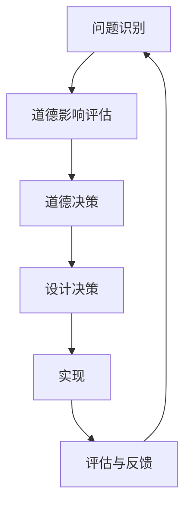

                 

软件工程、可持续发展、道德设计、数字正义、人工智能伦理、软件可靠性

## 1. 背景介绍

随着软件在现代社会中的广泛应用，其对我们的日常生活和决策的影响也与日俱增。然而，软件开发者和使用者往往忽略了软件背后的道德和社会责任。我们需要转变思维，从单纯追求功能和性能转向考虑软件的社会影响和道德后果。本文将探讨软件 2.0 的社会责任，即如何设计和开发更负责任、更道德的软件。

## 2. 核心概念与联系

### 2.1 道德设计

道德设计是一种设计理念，旨在将道德考虑纳入设计过程，以创建更负责任、更道德的产品和服务。在软件开发中，道德设计意味着考虑软件的道德影响，并将其作为设计决策的关键因素。



### 2.2 数字正义

数字正义是指在数字化环境中实现公平、公正和正义的原则。软件开发者应当考虑软件的使用者和受益者，确保软件不会导致不公平或歧视。数字正义与道德设计密切相关，因为它要求开发者考虑软件的道德影响和社会后果。

### 2.3 人工智能伦理

人工智能伦理是指研究和开发人工智能系统时应当遵循的道德准则。随着人工智能在软件中的广泛应用，人工智能伦理对软件开发者和使用者产生了重大影响。开发者应当考虑人工智能系统的道德影响，并确保其符合道德准则。

## 3. 核心算法原理 & 具体操作步骤

### 3.1 道德决策树算法原理

道德决策树是一种帮助开发者做出道德决策的工具。它类似于传统的决策树，但将道德因素纳入考虑范围。算法原理如下：

1. 识别道德相关的因素，如公平、隐私、透明度等。
2. 为每个因素定义可能的值或等级。
3. 为每个因素分配权重，表示其重要性。
4. 使用决策树算法，基于道德因素的值和权重做出决策。

### 3.2 道德决策树步骤详解

1. **问题识别**：识别软件设计中需要做出道德决策的问题。
2. **道德影响评估**：评估每个决策选项对道德因素的影响。
3. **道德决策**：使用道德决策树算法做出道德决策。
4. **设计决策**：基于道德决策做出设计决策。
5. **实现**：实现设计决策。
6. **评估与反馈**：评估软件的道德影响，并根据反馈调整设计决策。

### 3.3 道德决策树优缺点

**优点**：

* 将道德因素纳入设计决策过程。
* 提供了一个结构化的框架，帮助开发者做出道德决策。
* 可以量化道德因素，使其更容易被考虑。

**缺点**：

* 道德决策树的有效性取决于其输入，即道德因素的定义和权重。
* 道德决策树无法解决所有道德问题，某些问题可能需要更深入的分析和讨论。

### 3.4 道德决策树应用领域

道德决策树可以应用于任何需要做出道德决策的软件开发领域，例如：

* 人工智能系统，如自动驾驶汽车、预测分析系统等。
* 数据隐私保护系统。
* 社交媒体平台，如内容审核、用户行为监控等。
* 公共服务软件，如医疗保健、教育等。

## 4. 数学模型和公式 & 详细讲解 & 举例说明

### 4.1 数学模型构建

数学模型可以用于量化软件的道德影响。例如，可以使用公平度指标（fairness metric）来量化软件的公平性。公平度指标可以定义为：

$$F = 1 - \frac{\sum_{i=1}^{n} |P(A|B_i) - P(B_i)|}{\sum_{i=1}^{n} P(B_i)}$$

其中，$P(A|B_i)$ 是条件概率，$P(B_i)$ 是事件$B_i$ 的概率，$n$ 是事件的总数。

### 4.2 公式推导过程

公平度指标的推导过程如下：

1. 计算每个事件$B_i$ 的条件概率$P(A|B_i)$。
2. 计算每个事件$B_i$ 的概率$P(B_i)$。
3. 计算每个事件$B_i$ 的公平度，$1 - |P(A|B_i) - P(B_i)|$。
4. 计算所有事件的公平度的加权平均值，权重为事件的概率$P(B_i)$。
5. 将公平度指标的值缩放到[0, 1]之间，使其更容易解释。

### 4.3 案例分析与讲解

假设我们要评估一个就业平台的公平性，该平台使用人工智能算法匹配求职者和工作岗位。我们可以使用公平度指标来量化平台的公平性。例如，如果求职者的种族是一个道德相关因素，我们可以计算每个种族的求职者被匹配到工作岗位的条件概率，并使用公平度指标来评估平台的公平性。

## 5. 项目实践：代码实例和详细解释说明

### 5.1 开发环境搭建

本项目使用Python作为编程语言，并使用Scikit-learn库来实现公平度指标。开发环境包括：

* Python 3.8
* Scikit-learn 0.24.2
* Jupyter Notebook 6.1.4

### 5.2 源代码详细实现

以下是计算公平度指标的Python代码示例：

```python
from sklearn.metrics import confusion_matrix
import numpy as np

def calculate_fairness(y_true, y_pred, labels):
    cm = confusion_matrix(y_true, y_pred, labels=labels)
    fairness = 1 - np.abs(cm.diagonal() / np.sum(cm, axis=1) - np.mean(cm.diagonal()))
    return np.mean(fairness)

# 示例数据
y_true = np.array([1, 1, 0, 1, 0, 1, 0, 1, 1, 0])
y_pred = np.array([1, 0, 0, 1, 0, 1, 1, 1, 1, 0])
labels = np.unique(y_true)

# 计算公平度指标
fairness = calculate_fairness(y_true, y_pred, labels)
print("Fairness:", fairness)
```

### 5.3 代码解读与分析

* `calculate_fairness`函数计算给定预测和真实标签的公平度指标。
* `confusion_matrix`函数计算混淆矩阵，用于评估预测的准确性。
* `np.abs`函数计算条件概率的绝对值。
* `np.mean`函数计算公平度指标的加权平均值。
* 示例数据`y_true`和`y_pred`表示真实标签和预测标签。

### 5.4 运行结果展示

运行上述代码，输出的公平度指标值表示软件的公平性。值越接近1，表示软件越公平。

## 6. 实际应用场景

### 6.1 就业平台

就业平台可以使用公平度指标来评估其匹配算法的公平性。如果公平度指标的值较低，平台可以调整其算法，以提高公平性。

### 6.2 信贷评分系统

信贷评分系统可以使用公平度指标来评估其评分算法的公平性。如果公平度指标的值较低，系统可以调整其算法，以减少歧视。

### 6.3 未来应用展望

随着软件在现代社会中的广泛应用，道德设计和数字正义将变得越来越重要。开发者和使用者需要考虑软件的道德影响和社会后果，并采取措施减少不公平和歧视。公平度指标和道德决策树等工具可以帮助开发者做出更负责任、更道德的设计决策。

## 7. 工具和资源推荐

### 7.1 学习资源推荐

* "Design for the Real World" by Victor Papanek
* "The Design of Everyday Things" by Don Norman
* "Ethics in AI" by Stuart Armstrong and Roman V. Yampolskiy
* "Weapons of Math Destruction" by Cathy O'Neil

### 7.2 开发工具推荐

* Scikit-learn：用于机器学习算法的Python库。
* TensorFlow：用于深度学习的开源平台。
* IBM Watson：提供人工智能解决方案的平台。

### 7.3 相关论文推荐

* "Fairness Definitions and Their Politics" by Solon Barocas, Moritz Hardt, and Arvind Narayanan
* "Bias in Artificial Intelligence: A Survey" by Sorelle Friedler, Carlos Scheidegger, and Suresh Venkatasubramanian
* "Ethical Challenges in AI: A Survey" by Mark R. Brown, David G. Mark, and Subbarao Kambhampati

## 8. 总结：未来发展趋势与挑战

### 8.1 研究成果总结

本文介绍了软件 2.0 的社会责任，即如何设计和开发更负责任、更道德的软件。我们讨论了道德设计、数字正义和人工智能伦理等概念，并介绍了道德决策树算法和公平度指标等工具。

### 8.2 未来发展趋势

随着软件在现代社会中的广泛应用，道德设计和数字正义将变得越来越重要。开发者和使用者需要考虑软件的道德影响和社会后果，并采取措施减少不公平和歧视。公平度指标和道德决策树等工具可以帮助开发者做出更负责任、更道德的设计决策。

### 8.3 面临的挑战

软件 2.0 的社会责任面临着多项挑战，包括：

* 缺乏统一的道德标准和准则。
* 道德决策的主观性。
* 道德设计和数字正义的复杂性。
* 缺乏有关软件道德影响的数据和信息。

### 8.4 研究展望

未来的研究应当关注以下领域：

* 开发更准确和更可靠的道德决策工具。
* 研究软件道德影响的数据收集和分析方法。
* 发展更完善的道德设计和数字正义框架。
* 研究软件道德影响的法律和政策框架。

## 9. 附录：常见问题与解答

**Q1：软件 2.0 的社会责任与传统软件开发有何不同？**

A1：软件 2.0 的社会责任强调考虑软件的道德影响和社会后果，而传统软件开发往往只关注功能和性能。软件 2.0 的社会责任要求开发者和使用者采取措施减少不公平和歧视，并确保软件符合道德准则。

**Q2：道德决策树算法的有效性取决于什么因素？**

A2：道德决策树算法的有效性取决于其输入，即道德因素的定义和权重。如果道德因素定义不准确或权重分配不当，道德决策树算法可能无法做出准确的道德决策。

**Q3：公平度指标可以用于评估任何软件吗？**

A3：公平度指标可以用于评估任何需要考虑公平性的软件。例如，就业平台、信贷评分系统和人脸识别系统等。然而，公平度指标无法评估所有道德因素，开发者应当考虑其他道德因素，如隐私、透明度等。

**Q4：软件 2.0 的社会责任对软件开发者和使用者有何影响？**

A4：软件 2.0 的社会责任要求开发者和使用者考虑软件的道德影响和社会后果。开发者应当使用道德决策树算法和公平度指标等工具，做出更负责任、更道德的设计决策。使用者应当意识到软件的道德影响，并要求开发者采取措施减少不公平和歧视。

**Q5：软件 2.0 的社会责任是否会增加软件开发的成本？**

A5：软件 2.0 的社会责任可能会增加软件开发的成本，因为开发者需要考虑道德因素，并使用道德决策工具。然而，长期来看，软件 2.0 的社会责任可以带来更负责任、更道德的软件，从而提高软件的可靠性和信任度，并减少不公平和歧视。

## 作者：禅与计算机程序设计艺术 / Zen and the Art of Computer Programming

