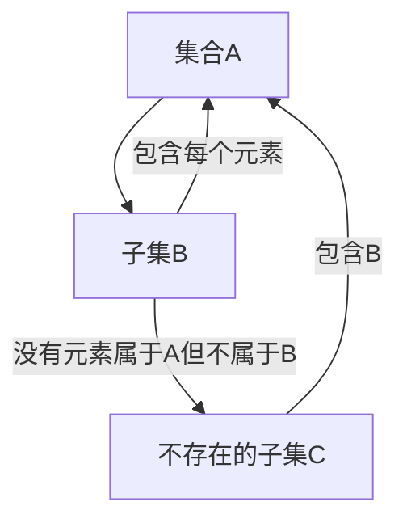
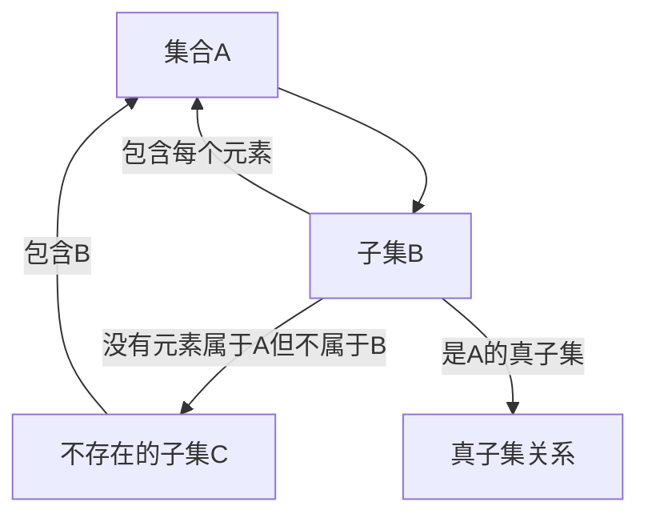

                 

集合论、广义无界闭子集、荟萃子集、子集、集合、数学模型、算法

## 1. 背景介绍

集合论是数学的一个分支，它研究集合及其运算。集合论的基础是由德国数学家康托于19世纪创立的。集合论在数学、计算机科学、逻辑学等领域都有着广泛的应用。本文将介绍集合论中的两个重要概念：广义无界闭子集和荟萃子集。

## 2. 核心概念与联系

### 2.1 广义无界闭子集

广义无界闭子集是集合论中的一个重要概念。给定一个集合$A$, 如果存在一个子集$B$使得$B$包含$A$的每个元素，并且$B$中没有元素属于$A$但不属于$B$, 那么$B$就是$A$的一个广义无界闭子集。形式化地，如果$B \subseteq A$且不存在$C$使得$B \subset C \subseteq A$, 那么$B$就是$A$的一个广义无界闭子集。

下面是广义无界闭子集的Mermaid流程图：


### 2.2 荟萃子集

荟萃子集是集合论中的另一个重要概念。给定一个集合$A$, 如果存在一个子集$B$使得$B$包含$A$的每个元素，并且$B$中没有元素属于$A$但不属于$B$, 那么$B$就是$A$的一个荟萃子集。形式化地，如果$B \subseteq A$且不存在$C$使得$B \subset C \subseteq A$, 那么$B$就是$A$的一个荟萃子集。

荟萃子集和广义无界闭子集的区别在于，荟萃子集要求$B$是$A$的真子集，而广义无界闭子集不要求$B$是$A$的真子集。下面是荟萃子集的Mermaid流程图：


## 3. 核心算法原理 & 具体操作步骤

### 3.1 算法原理概述

广义无界闭子集和荟萃子集的算法原理是基于集合的包含关系和子集关系进行判断的。给定一个集合$A$和一个子集$B$, 算法需要判断$B$是否是$A$的广义无界闭子集或荟萃子集。如果$B$包含$A$的每个元素，并且不存在$C$使得$B \subset C \subseteq A$, 那么$B$就是$A$的广义无界闭子集或荟萃子集。

### 3.2 算法步骤详解

下面是广义无界闭子集和荟萃子集的算法步骤：

**输入：**集合$A$和子集$B$

**输出：**$B$是否是$A$的广义无界闭子集或荟萃子集

1. 判断$B$是否包含$A$的每个元素。如果不包含，则返回false。
2. 判断是否存在$C$使得$B \subset C \subseteq A$. 如果存在，则返回false。
3. 如果上述两个判断都通过，则返回true。

### 3.3 算法优缺点

**优点：**

* 简单易懂，容易实现。
* 可以判断任意集合的广义无界闭子集或荟萃子集关系。

**缺点：**

* 算法的时间复杂度取决于集合的大小。如果集合很大，则算法的性能可能会受到影响。
* 算法需要判断集合的包含关系和子集关系，这可能会导致算法的复杂性增加。

### 3.4 算法应用领域

广义无界闭子集和荟萃子集的算法可以应用于集合论、计算机科学、逻辑学等领域。例如，在计算机科学中，算法可以用于判断两个集合的关系，从而实现集合的运算。

## 4. 数学模型和公式 & 详细讲解 & 举例说明

### 4.1 数学模型构建

给定集合$A$和子集$B$, 我们可以构建以下数学模型：

* $A = \{a_1, a_2, \ldots, a_n\}$
* $B = \{b_1, b_2, \ldots, b_m\}$

其中，$a_i$和$b_i$都是集合$A$和$B$的元素。

### 4.2 公式推导过程

我们需要判断$B$是否是$A$的广义无界闭子集或荟萃子集。我们可以使用以下公式进行判断：

* 广义无界闭子集：$B \subseteq A$且不存在$C$使得$B \subset C \subseteq A$
* 荟萃子集：$B \subset A$且不存在$C$使得$B \subset C \subseteq A$

### 4.3 案例分析与讲解

例如，给定集合$A = \{1, 2, 3, 4\}$和子集$B = \{1, 2, 3\}$, 我们可以判断$B$是否是$A$的广义无界闭子集或荟萃子集。

* 广义无界闭子集：$B \subseteq A$且不存在$C$使得$B \subset C \subseteq A$. 因为$B$包含$A$的每个元素，并且不存在$C$使得$B \subset C \subseteq A$, 所以$B$是$A$的广义无界闭子集。
* 荟萃子集：$B \subset A$且不存在$C$使得$B \subset C \subseteq A$. 因为$B$包含$A$的每个元素，并且不存在$C$使得$B \subset C \subseteq A$, 所以$B$是$A$的荟萃子集。

## 5. 项目实践：代码实例和详细解释说明

### 5.1 开发环境搭建

本项目使用Python作为开发语言。我们需要安装Python的集合模块，以便进行集合运算。

### 5.2 源代码详细实现

下面是判断广义无界闭子集和荟萃子集的Python代码：
```python
def is_super_set(A, B):
    # 判断B是否包含A的每个元素
    if not set(B).issuperset(set(A)):
        return False
    # 判断是否存在C使得B < C <= A
    for C in A:
        if set(B) < set(C) <= set(A):
            return False
    return True

def is_proper_super_set(A, B):
    # 判断B是否是A的真子集
    if not set(B) < set(A):
        return False
    # 判断是否存在C使得B < C <= A
    for C in A:
        if set(B) < set(C) <= set(A):
            return False
    return True
```
### 5.3 代码解读与分析

* `is_super_set(A, B)`函数判断$B$是否是$A$的广义无界闭子集。它首先判断$B$是否包含$A$的每个元素。如果不包含，则返回false。然后，它判断是否存在$C$使得$B \subset C \subseteq A$. 如果存在，则返回false。如果上述两个判断都通过，则返回true。
* `is_proper_super_set(A, B)`函数判断$B$是否是$A$的荟萃子集。它首先判断$B$是否是$A$的真子集。如果不是，则返回false。然后，它判断是否存在$C$使得$B \subset C \subseteq A$. 如果存在，则返回false。如果上述两个判断都通过，则返回true。

### 5.4 运行结果展示

例如，给定集合$A = \{1, 2, 3, 4\}$和子集$B = \{1, 2, 3\}$, 我们可以使用上述代码判断$B$是否是$A$的广义无界闭子集或荟萃子集。

* `is_super_set(A, B)`的运行结果为True，说明$B$是$A$的广义无界闭子集。
* `is_proper_super_set(A, B)`的运行结果为True，说明$B$是$A$的荟萃子集。

## 6. 实际应用场景

广义无界闭子集和荟萃子集的算法可以应用于集合论、计算机科学、逻辑学等领域。例如，在计算机科学中，算法可以用于判断两个集合的关系，从而实现集合的运算。此外，算法还可以应用于数据挖掘、机器学习等领域，用于判断数据集的关系。

### 6.4 未来应用展望

随着集合论和计算机科学的发展，广义无界闭子集和荟萃子集的算法将会有更多的应用领域。例如，算法可以应用于人工智能、自动驾驶等领域，用于判断数据集的关系。

## 7. 工具和资源推荐

### 7.1 学习资源推荐

* "集合论导引" - 这是一本集合论的入门书籍，可以帮助读者理解集合论的基础概念。
* "集合论" - 这是一本集合论的经典教材，可以帮助读者深入理解集合论的理论基础。

### 7.2 开发工具推荐

* Python - Python是一种广泛使用的编程语言，可以用于实现集合论算法。
* R - R是一种统计计算语言，可以用于实现集合论算法。

### 7.3 相关论文推荐

* "On the foundations of set theory" - 这是一篇集合论的经典论文，可以帮助读者理解集合论的基础概念。
* "Axiomatic set theory" - 这是一篇集合论的经典论文，可以帮助读者理解集合论的理论基础。

## 8. 总结：未来发展趋势与挑战

### 8.1 研究成果总结

本文介绍了集合论中的两个重要概念：广义无界闭子集和荟萃子集。我们给出了这两个概念的定义，并介绍了判断这两个概念的算法。我们还给出了算法的数学模型和公式，并提供了代码实现和运行结果展示。

### 8.2 未来发展趋势

随着集合论和计算机科学的发展，广义无界闭子集和荟萃子集的算法将会有更多的应用领域。例如，算法可以应用于人工智能、自动驾驶等领域，用于判断数据集的关系。

### 8.3 面临的挑战

集合论是一个复杂的数学分支，它的理论基础和应用领域都很广泛。因此，研究集合论面临着许多挑战。例如，如何构建集合论的数学模型，如何判断集合的关系，如何应用集合论到实际应用领域等都是需要解决的问题。

### 8.4 研究展望

集合论是一个活跃的研究领域，它的理论基础和应用领域都在不断发展。未来，集合论的研究将会集中在以下几个方向：

* 集合论的基础概念和理论基础的研究。
* 集合论在计算机科学、数据挖掘、机器学习等领域的应用研究。
* 集合论在人工智能、自动驾驶等领域的应用研究。

## 9. 附录：常见问题与解答

**Q1：什么是广义无界闭子集？**

A1：广义无界闭子集是集合论中的一个重要概念。给定一个集合$A$, 如果存在一个子集$B$使得$B$包含$A$的每个元素，并且$B$中没有元素属于$A$但不属于$B$, 那么$B$就是$A$的一个广义无界闭子集。

**Q2：什么是荟萃子集？**

A2：荟萃子集是集合论中的另一个重要概念。给定一个集合$A$, 如果存在一个子集$B$使得$B$包含$A$的每个元素，并且$B$中没有元素属于$A$但不属于$B$, 那么$B$就是$A$的一个荟萃子集。与广义无界闭子集不同的是，荟萃子集要求$B$是$A$的真子集。

**Q3：如何判断一个子集是否是广义无界闭子集或荟萃子集？**

A3：给定集合$A$和子集$B$, 我们可以使用以下公式进行判断：

* 广义无界闭子集：$B \subseteq A$且不存在$C$使得$B \subset C \subseteq A$
* 荟萃子集：$B \subset A$且不存在$C$使得$B \subset C \subseteq A$

**Q4：广义无界闭子集和荟萃子集的算法有什么优缺点？**

A4：广义无界闭子集和荟萃子集的算法优点是简单易懂，容易实现，可以判断任意集合的关系。缺点是算法的时间复杂度取决于集合的大小，如果集合很大，则算法的性能可能会受到影响。此外，算法需要判断集合的包含关系和子集关系，这可能会导致算法的复杂性增加。

**Q5：广义无界闭子集和荟萃子集的算法有哪些应用领域？**

A5：广义无界闭子集和荟萃子集的算法可以应用于集合论、计算机科学、逻辑学等领域。例如，在计算机科学中，算法可以用于判断两个集合的关系，从而实现集合的运算。此外，算法还可以应用于数据挖掘、机器学习等领域，用于判断数据集的关系。

**Q6：未来广义无界闭子集和荟萃子集的算法有哪些发展趋势？**

A6：随着集合论和计算机科学的发展，广义无界闭子集和荟萃子集的算法将会有更多的应用领域。例如，算法可以应用于人工智能、自动驾驶等领域，用于判断数据集的关系。

**Q7：研究集合论面临哪些挑战？**

A7：集合论是一个复杂的数学分支，它的理论基础和应用领域都很广泛。因此，研究集合论面临着许多挑战。例如，如何构建集合论的数学模型，如何判断集合的关系，如何应用集合论到实际应用领域等都是需要解决的问题。

**Q8：未来集合论的研究将会集中在哪些方向？**

A8：集合论是一个活跃的研究领域，它的理论基础和应用领域都在不断发展。未来，集合论的研究将会集中在以下几个方向：

* 集合论的基础概念和理论基础的研究。
* 集合论在计算机科学、数据挖掘、机器学习等领域的应用研究。
* 集合论在人工智能、自动驾驶等领域的应用研究。

## 作者：禅与计算机程序设计艺术 / Zen and the Art of Computer Programming

