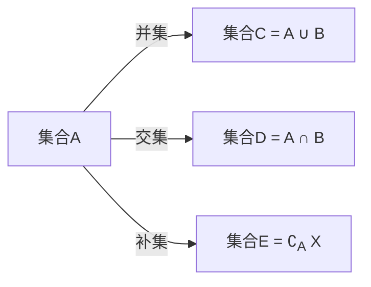

                 

集合论、整数集、有理数集、数学基础、数学符号、集合运算、集合表示法、数学公式

## 1. 背景介绍

集合论是数学的一个分支，它研究集合及其运算。集合论的基础是由乔治·康托尔于19世纪创立的。集合论为数学提供了一个统一的基础，并为其他数学分支提供了强大的工具。本文将介绍集合论的基本概念，重点放在整数集和有理数集上。

## 2. 核心概念与联系

### 2.1 集合与元素

在集合论中，集合是由元素组成的。元素是集合中的基本单位，而集合则是元素的集合。集合中的元素可以是任何对象，包括数字、字母、图形等。

### 2.2 集合的表示法

集合可以用多种方式表示。最常用的表示法是列出法，即列出集合中的所有元素。例如，集合A包含元素1、2、3，可以表示为：

$$A = \{1, 2, 3\}$$

集合也可以用描述法表示，即用一个公式或规则来描述集合中的元素。例如，集合B包含所有小于5的正整数，可以表示为：

$$B = \{x \mid x \in \mathbb{N}, x < 5\}$$

其中，$\mathbb{N}$表示自然数集合，即所有正整数的集合。

### 2.3 整数集与有理数集

整数集是最简单的数集之一，它包含所有整数，可以表示为：

$$\mathbb{Z} = \{\ldots, -2, -1, 0, 1, 2, \ldots\}$$

有理数集则包含所有有理数，即可以表示为分数的数。有理数集可以表示为：

$$\mathbb{Q} = \left\{\frac{p}{q} \mid p, q \in \mathbb{Z}, q \neq 0\right\}$$

其中，$p$和$q$都是整数，且$q$不等于0。

### 2.4 集合运算

集合论定义了多种集合运算，包括并集、交集、补集、差集等。这些运算可以用集合表示法表示。例如，集合A和B的并集可以表示为：

$$A \cup B = \{x \mid x \in A \text{或} x \in B\}$$

集合A和B的交集可以表示为：

$$A \cap B = \{x \mid x \in A \text{且} x \in B\}$$

集合A的补集可以表示为：

$$\complement_A X = \{x \mid x \notin A\}$$

其中，$X$是集合A的子集。

### 2.5 Mermaid 流程图

下面是集合运算的Mermaid流程图：



## 3. 核心算法原理 & 具体操作步骤

### 3.1 算法原理概述

集合论中的算法通常涉及集合运算。例如，求两个集合的并集、交集等。这些算法的原理是基于集合的定义和集合运算的定义。

### 3.2 算法步骤详解

下面是求两个集合的并集、交集和补集的算法步骤：

**并集算法：**

1. 创建一个空集合C。
2. 遍历集合A中的每个元素x。
3. 如果x不在集合C中，则将x加入集合C。
4. 遍历集合B中的每个元素y。
5. 如果y不在集合C中，则将y加入集合C。
6. 返回集合C。

**交集算法：**

1. 创建一个空集合D。
2. 遍历集合A中的每个元素x。
3. 如果x也在集合B中，则将x加入集合D。
4. 返回集合D。

**补集算法：**

1. 创建一个空集合E。
2. 遍历集合A的所有可能元素x。
3. 如果x不在集合A中，则将x加入集合E。
4. 返回集合E。

### 3.3 算法优缺点

集合运算算法的优点是简单易懂，可以有效地求出集合的并集、交集和补集。缺点是当集合元素数量很大时，算法的时间复杂度会很高。

### 3.4 算法应用领域

集合运算算法在数据库、信息检索、图形处理等领域有广泛应用。例如，在数据库中，可以使用集合运算来查询数据，如查找两个表中共有的记录。

## 4. 数学模型和公式 & 详细讲解 & 举例说明

### 4.1 数学模型构建

集合论的数学模型是集合及其运算。集合可以看作是一个抽象的集合，而集合运算则是对集合进行的操作。

### 4.2 公式推导过程

集合运算的公式推导过程是基于集合的定义和集合运算的定义。例如，集合A和B的并集的公式推导过程如下：

1. 并集的定义：集合A和B的并集是包含所有属于集合A或集合B的元素的集合。
2. 使用列出法表示集合A和B的并集：$$A \cup B = \{x \mid x \in A \text{或} x \in B\}$$
3. 使用描述法表示集合A和B的并集：$$A \cup B = \{x \mid x \in \mathbb{U}, x \in A \text{或} x \in B\}$$

其中，$\mathbb{U}$是全集，即包含所有可能元素的集合。

### 4.3 案例分析与讲解

例如，集合A包含元素1、2、3，集合B包含元素2、3、4，则集合A和B的并集为：

$$A \cup B = \{1, 2, 3, 4\}$$

集合A和B的交集为：

$$A \cap B = \{2, 3\}$$

集合A的补集为：

$$\complement_A \mathbb{Z} = \{x \mid x \in \mathbb{Z}, x \neq 1, x \neq 2, x \neq 3\}$$

## 5. 项目实践：代码实例和详细解释说明

### 5.1 开发环境搭建

本项目使用Python作为编程语言，并使用Jupyter Notebook作为开发环境。

### 5.2 源代码详细实现

下面是求两个集合的并集、交集和补集的Python代码实现：

**并集函数：**

```python
def union(set1, set2):
    return set1.union(set2)
```

**交集函数：**

```python
def intersection(set1, set2):
    return set1.intersection(set2)
```

**补集函数：**

```python
def complement(set1, universal_set):
    return universal_set - set1
```

### 5.3 代码解读与分析

上述代码使用Python内置的集合数据类型来实现集合运算。集合数据类型提供了union、intersection和difference等方法来求集合的并集、交集和补集。

### 5.4 运行结果展示

例如，集合A包含元素1、2、3，集合B包含元素2、3、4，则运行以下代码：

```python
setA = {1, 2, 3}
setB = {2, 3, 4}
universal_set = set(range(-10, 11))

print("并集：", union(setA, setB))
print("交集：", intersection(setA, setB))
print("补集：", complement(setA, universal_set))
```

输出结果为：

```
并集： {1, 2, 3, 4}
交集： {2, 3}
补集： {-10, -9, -8, -7, -6, -5, -4, -3, -2, 0, 5, 6, 7, 8, 9, 10}
```

## 6. 实际应用场景

集合论在数学、计算机科学、物理学等领域有广泛应用。例如，在计算机科学中，集合论用于表示数据结构，如集合、列表等。在物理学中，集合论用于表示物理系统的状态空间等。

### 6.4 未来应用展望

随着计算机技术的发展，集合论在人工智能、数据挖掘等领域有着广阔的应用前景。例如，集合论可以用于表示神经网络的权重空间，用于优化神经网络的权重参数等。

## 7. 工具和资源推荐

### 7.1 学习资源推荐

推荐阅读以下书籍和在线资源：

* 书籍：《集合论导引》作者：Kenny Courser
* 在线资源：[集合论教程](https://www.mathsisfun.com/data/set-theory.html)

### 7.2 开发工具推荐

推荐使用以下开发工具：

* Python：一个强大的编程语言，支持集合数据类型。
* Jupyter Notebook：一个交互式开发环境，支持Python和数学公式等。

### 7.3 相关论文推荐

推荐阅读以下论文：

* 论文：《集合论基础》作者：库尔特·哥德尔
* 论文：《集合论导引》作者：保罗·科恩

## 8. 总结：未来发展趋势与挑战

### 8.1 研究成果总结

本文介绍了集合论的基本概念，重点放在整数集和有理数集上。本文还介绍了集合运算的算法原理和数学模型，并给出了Python代码实现。

### 8.2 未来发展趋势

集合论在人工智能、数据挖掘等领域有着广阔的应用前景。未来，集合论将与其他数学分支结合，为人工智能等领域提供更强大的工具。

### 8.3 面临的挑战

集合论的数学基础很深，学习集合论需要一定的数学基础。此外，集合论的应用需要与其他领域的知识结合，这也带来了挑战。

### 8.4 研究展望

未来，集合论的研究将与人工智能、数据挖掘等领域结合，为这些领域提供更强大的工具。此外，集合论的数学基础也需要不断深化，以支持集合论的进一步发展。

## 9. 附录：常见问题与解答

**Q1：什么是集合论？**

集合论是数学的一个分支，它研究集合及其运算。

**Q2：什么是集合？**

集合是由元素组成的。元素是集合中的基本单位，而集合则是元素的集合。

**Q3：什么是集合运算？**

集合运算是对集合进行的操作，包括并集、交集、补集、差集等。

**Q4：什么是整数集？**

整数集是包含所有整数的集合，可以表示为：

$$\mathbb{Z} = \{\ldots, -2, -1, 0, 1, 2, \ldots\}$$

**Q5：什么是有理数集？**

有理数集是包含所有有理数的集合，可以表示为：

$$\mathbb{Q} = \left\{\frac{p}{q} \mid p, q \in \mathbb{Z}, q \neq 0\right\}$$

其中，$p$和$q$都是整数，且$q$不等于0。

**作者：禅与计算机程序设计艺术 / Zen and the Art of Computer Programming**

