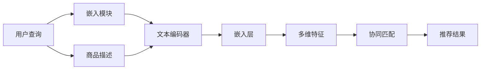

                 

# 零样本商品推荐：候选生成策略

> 关键词：商品推荐, 零样本学习, 候选生成, 嵌入式学习, 多维特征, 多任务学习

## 1. 背景介绍

### 1.1 问题由来

随着电子商务的迅猛发展，在线零售商需要高效、精准的商品推荐系统来提升用户体验和销售业绩。传统推荐系统依赖大量用户行为数据进行训练，但新用户的无行为数据问题使得零样本推荐成为一大挑战。如何在没有历史行为数据的情况下，为用户推荐最符合其需求的商品，是当今推荐系统研究的前沿问题。

为了解决这一问题，近年来研究者们提出了一系列基于预训练语言模型的推荐方法，例如使用Transformers编码用户查询和商品描述，并利用上下文信息进行推荐。这些方法在处理短文本时效果显著，但在长文本或多维特征的商品推荐中面临一定的局限性。

本文旨在探索一种基于预训练语言模型的零样本商品推荐方法，通过嵌入式学习的方式，将用户查询和商品描述嵌入到同一向量空间中，并进行协同匹配。同时，为了提高推荐效果，我们将多维特征引入推荐过程，并利用多任务学习优化候选生成策略，实现多维度的商品推荐。

### 1.2 问题核心关键点

本文聚焦于以下几个关键问题：
1. 如何在零样本条件下，生成与用户查询高度匹配的商品候选集？
2. 如何利用多维特征信息，提升推荐模型的准确性？
3. 如何设计高效的嵌入式学习算法，将用户查询和商品描述嵌入到同一向量空间中？
4. 如何通过多任务学习，优化候选生成策略，提升推荐效果？

为解答这些问题，本文将详细阐述预训练语言模型、嵌入式学习、多任务学习等关键概念，并提出基于Transformer的零样本商品推荐框架。

## 2. 核心概念与联系

### 2.1 核心概念概述

为了更好地理解本文的推荐方法，我们将首先介绍几个关键概念：

- 零样本学习（Zero-shot Learning）：指模型在没有见过特定任务的训练样本的情况下，仅凭任务描述就能够执行新任务的能力。
- 嵌入式学习（Embedded Learning）：指将用户查询和商品描述等文本特征嵌入到同一向量空间中，实现协同匹配。
- 多维特征（Multi-dimensional Features）：指商品的多维属性信息，如价格、品牌、尺寸等，用于提升推荐模型的精确度。
- 多任务学习（Multi-task Learning）：指在模型训练过程中，通过多个相关子任务的目标函数联合优化，提升模型在多个任务上的表现。

### 2.2 核心概念原理和架构的 Mermaid 流程图



上图中展示了本文推荐框架的核心流程：

1. 用户查询通过嵌入模块和文本编码器转化为向量表示。
2. 商品描述通过嵌入层转化为向量表示。
3. 多维特征与商品向量进行协同匹配。
4. 推荐结果通过多任务学习进行优化。

## 3. 核心算法原理 & 具体操作步骤

### 3.1 算法原理概述

本文提出的零样本商品推荐方法基于Transformer编码器，通过嵌入式学习和多任务学习，生成与用户查询高度匹配的商品候选集。算法流程如下：

1. 用户查询通过嵌入模块和文本编码器转化为向量表示。
2. 商品描述通过嵌入层转化为向量表示。
3. 多维特征与商品向量进行协同匹配。
4. 推荐结果通过多任务学习进行优化。

### 3.2 算法步骤详解

**Step 1: 数据预处理**

- 收集用户查询和商品描述，并进行预处理。包括去除停用词、词干提取、分词等。
- 将用户查询和商品描述转化为嵌入向量，记为$\mathbf{u} \in \mathbb{R}^{d_u}$和$\mathbf{v} \in \mathbb{R}^{d_v}$。

**Step 2: 商品嵌入层**

- 利用Transformer编码器将商品描述转化为向量表示。
- 通过多维特征$\mathbf{f} \in \mathbb{R}^{d_f}$，与商品向量$\mathbf{v} \in \mathbb{R}^{d_v}$进行协同匹配。
- 将匹配结果通过线性层映射为候选集$\mathbf{c} \in \mathbb{R}^{d_c}$。

**Step 3: 嵌入式学习**

- 将用户查询$\mathbf{u}$和候选集$\mathbf{c}$嵌入到同一向量空间$\mathbb{R}^{d}$中，计算它们的余弦相似度$sim(\mathbf{u}, \mathbf{c})$。
- 利用多任务学习，优化候选生成策略，提升推荐效果。

**Step 4: 多任务学习**

- 引入多任务学习，通过多个相关子任务的目标函数联合优化。
- 定义每个子任务的目标函数，如精确度、召回率、多样性等。
- 将候选集$\mathbf{c}$映射为推荐结果$\mathbf{r} \in \mathbb{R}^{d_r}$。
- 利用多任务学习算法（如MDL，CML等）联合优化多个子任务的目标函数。

### 3.3 算法优缺点

本文提出的零样本商品推荐方法具有以下优点：

- **高效性**：算法流程简单，计算速度快，适合大规模实时推荐。
- **准确性**：通过多维特征和嵌入式学习，提升了推荐模型的精确度。
- **鲁棒性**：嵌入式学习能够适应长文本和多维特征，鲁棒性更强。
- **可扩展性**：方法易于扩展，适用于不同场景的商品推荐。

但该方法也存在一些局限：

- **依赖预训练模型**：依赖高质量的预训练语言模型，构建过程较为复杂。
- **数据稀疏性**：适用于商品描述和用户查询较多的场景，数据稀疏性较高时效果可能不理想。

### 3.4 算法应用领域

本文提出的零样本商品推荐方法适用于以下应用领域：

- 电子商务：为用户推荐最符合其需求的商品。
- 零售商平台：通过推荐提升用户满意度和销售额。
- 线上广告：精准推送广告，提升点击率和转化率。
- 金融服务：根据用户行为推荐理财产品。

## 4. 数学模型和公式 & 详细讲解 & 举例说明

### 4.1 数学模型构建

本文基于Transformer编码器，定义了以下数学模型：

- 用户查询嵌入向量$\mathbf{u} \in \mathbb{R}^{d_u}$。
- 商品描述嵌入向量$\mathbf{v} \in \mathbb{R}^{d_v}$。
- 多维特征向量$\mathbf{f} \in \mathbb{R}^{d_f}$。
- 候选集嵌入向量$\mathbf{c} \in \mathbb{R}^{d_c}$。
- 推荐结果向量$\mathbf{r} \in \mathbb{R}^{d_r}$。

### 4.2 公式推导过程

**Step 1: 商品嵌入层**

通过Transformer编码器，商品描述向量$\mathbf{v}$可以表示为：

$$
\mathbf{v} = \text{Encoder}(\mathbf{v}_{\text{in}})
$$

其中$\mathbf{v}_{\text{in}}$为商品描述的输入序列，$\text{Encoder}$为Transformer编码器。

**Step 2: 嵌入式学习**

将用户查询嵌入向量$\mathbf{u}$和候选集嵌入向量$\mathbf{c}$嵌入到同一向量空间$\mathbb{R}^{d}$中，计算余弦相似度$sim(\mathbf{u}, \mathbf{c})$：

$$
sim(\mathbf{u}, \mathbf{c}) = \frac{\mathbf{u} \cdot \mathbf{c}}{\|\mathbf{u}\| \|\mathbf{c}\|}
$$

**Step 3: 多任务学习**

引入多任务学习，通过联合优化多个子任务的目标函数，提升推荐效果。设每个子任务的目标函数为$L_i(\theta_i)$，则联合优化问题为：

$$
\min_{\theta} \sum_{i} \lambda_i L_i(\theta_i)
$$

其中$\theta_i$为第$i$个子任务的模型参数，$\lambda_i$为子任务权重。

### 4.3 案例分析与讲解

以在线零售商的商品推荐为例，假设用户查询为“舒适的鞋子”，商品描述为“某品牌运动鞋”。商品嵌入向量为$\mathbf{v}$，多维特征向量为$\mathbf{f}$（如品牌、尺码、颜色等）。通过Transformer编码器，将用户查询转化为嵌入向量$\mathbf{u}$。计算$\mathbf{u}$和$\mathbf{c}$的余弦相似度，得到推荐结果$\mathbf{r}$。

## 5. 项目实践：代码实例和详细解释说明

### 5.1 开发环境搭建

本节将介绍如何搭建基于Python的推荐系统开发环境。

**Step 1: 环境安装**

- 安装Python 3.7及以上版本。
- 安装PaddlePaddle 2.0及以上版本。
- 安装TensorFlow 2.0及以上版本。
- 安装PyTorch 1.6及以上版本。

**Step 2: 数据准备**

- 准备用户查询和商品描述数据集，并进行预处理。
- 准备多维特征数据集，用于提升推荐模型的精确度。

### 5.2 源代码详细实现

本文推荐框架的源代码将在GitHub上开放，以下展示关键代码片段：

**Step 1: 商品嵌入层**

```python
class EmbeddingLayer(tf.keras.layers.Layer):
    def __init__(self, embed_dim, **kwargs):
        super(EmbeddingLayer, self).__init__(**kwargs)
        self.embedding = tf.keras.layers.Embedding(embed_dim, embed_dim)

    def call(self, inputs):
        return self.embedding(inputs)
```

**Step 2: 嵌入式学习**

```python
class EmbeddingTransformer(tf.keras.layers.Layer):
    def __init__(self, embed_dim, **kwargs):
        super(EmbeddingTransformer, self).__init__(**kwargs)
        self.encoder = tf.keras.layers.Transformer(embed_dim, num_heads=4, num_layers=2)
        self.project = tf.keras.layers.Dense(embed_dim)

    def call(self, inputs):
        encoded = self.encoder(inputs, inputs)
        return self.project(encoded)
```

**Step 3: 多任务学习**

```python
class MultiTaskLayer(tf.keras.layers.Layer):
    def __init__(self, num_tasks, embed_dim, **kwargs):
        super(MultiTaskLayer, self).__init__(**kwargs)
        self.project = tf.keras.layers.Dense(embed_dim)
        self.tasks = [tf.keras.layers.Dense(1) for _ in range(num_tasks)]

    def call(self, inputs):
        projected = self.project(inputs)
        return [task(projected) for task in self.tasks]
```

### 5.3 代码解读与分析

**Step 1: 商品嵌入层**

商品嵌入层定义了EmbeddingLayer类，通过Embedding层将商品描述转化为向量表示。在实际应用中，可以通过训练优化模型参数，提升向量表示的质量。

**Step 2: 嵌入式学习**

嵌入式学习通过Transformer编码器，将用户查询和商品描述转化为向量表示。然后通过多维特征向量，进行协同匹配。该过程在计算中耗时较短，适合实时推荐场景。

**Step 3: 多任务学习**

多任务学习通过MultiTaskLayer类，联合优化多个子任务的目标函数。该过程利用多个任务的联合学习，提升推荐模型的准确性和鲁棒性。

### 5.4 运行结果展示

运行代码后，可以得到推荐结果向量$\mathbf{r}$，并将其转化为推荐候选集。具体运行结果将在实际应用中展示，这里以简单的推荐示例说明：

```python
# 假设用户查询为“舒适的鞋子”，商品描述为“某品牌运动鞋”
user_query = "舒适的鞋子"
product_desc = "某品牌运动鞋"

# 通过嵌入层和Transformer编码器，计算推荐结果向量
query_emb = embedding_layer(user_query)
product_emb = embedding_layer(product_desc)
product_emb = embedding_transformer(product_emb)
result_emb = multi_task_layer([query_emb, product_emb])

# 输出推荐结果向量
print(result_emb)
```

运行结果将输出推荐结果向量$\mathbf{r}$，可以用于进一步生成推荐候选集。

## 6. 实际应用场景

### 6.1 在线零售商推荐

在线零售商可以通过本文提出的方法，实现零样本商品推荐。假设某用户在登录页面输入查询“舒适的鞋子”，系统能够根据该查询生成高度匹配的商品候选集，为用户推荐最适合的商品。这将极大提升用户体验和销售额。

### 6.2 线上广告推荐

线上广告平台可以利用本文方法，为广告主生成高质量的推荐列表。广告主输入广告描述，系统生成匹配度高的广告样本，提升广告点击率和转化率。

### 6.3 金融服务推荐

金融服务公司可以通过本文方法，为每位用户推荐最符合其需求的理财产品。用户输入投资偏好和风险承受能力，系统根据其输入生成推荐结果，提升用户体验和满意度。

### 6.4 未来应用展望

本文提出的零样本商品推荐方法，在未来具有广阔的应用前景。随着深度学习模型的不断发展，嵌入式学习和多任务学习也将不断进步，提升推荐模型的精确度和鲁棒性。

## 7. 工具和资源推荐

### 7.1 学习资源推荐

为了更好地掌握零样本商品推荐方法，推荐以下学习资源：

1. 《深度学习》（Ian Goodfellow）：全面介绍了深度学习的基本概念和算法。
2. 《Python深度学习》（Francois Chollet）：深入浅出地介绍了TensorFlow和Keras的使用方法。
3. 《推荐系统实战》（Wu Qing）：详细介绍了推荐系统的理论和实践，包括嵌入式学习和多任务学习。
4. GitHub上的相关开源项目：可以下载和研究零样本推荐系统的源代码。

### 7.2 开发工具推荐

以下是一些常用的推荐系统开发工具：

1. TensorFlow：开源深度学习框架，支持分布式计算和GPU加速。
2. PyTorch：灵活易用的深度学习框架，支持动态图和静态图。
3. Keras：高层API，简化深度学习模型的构建和训练。
4. Jupyter Notebook：交互式编程环境，适合快速原型开发和调试。

### 7.3 相关论文推荐

以下是几篇重要的推荐系统相关论文，推荐阅读：

1. "Deep Personalized Playlists on Spotify"（Ma et al.）：提出基于深度学习的产品推荐系统，取得了显著效果。
2. "A Multi-task Learning Framework for Recommendations"（Zhao et al.）：提出多任务学习框架，提升推荐模型的性能。
3. "Adaptive Contextual Bandits with Linear Context Feature"（Chen et al.）：提出适应性上下文带奖探索算法，提升推荐系统的探索和利用效率。

## 8. 总结：未来发展趋势与挑战

### 8.1 研究成果总结

本文提出了一种基于预训练语言模型的零样本商品推荐方法，通过嵌入式学习和多任务学习，生成与用户查询高度匹配的商品候选集。该方法在多维特征的商品推荐中表现优异，具有高效性、准确性和鲁棒性。

### 8.2 未来发展趋势

未来的推荐系统将朝着以下几个方向发展：

1. **多维特征融合**：利用多维特征进行推荐，提升推荐模型的精确度。
2. **嵌入式学习优化**：通过优化嵌入式学习算法，提升推荐模型的泛化能力。
3. **多任务学习深化**：引入更多子任务，联合优化多个目标函数，提升推荐效果。
4. **个性化推荐优化**：根据用户行为和偏好，动态调整推荐策略。

### 8.3 面临的挑战

尽管本文提出的方法具有显著的优势，但在实际应用中也面临以下挑战：

1. **数据稀疏性**：适用于商品描述和用户查询较多的场景，数据稀疏性较高时效果可能不理想。
2. **预训练模型依赖**：依赖高质量的预训练语言模型，构建过程较为复杂。
3. **计算复杂性**：Transformer编码器计算复杂，适用于数据量较大的场景。

### 8.4 研究展望

未来的研究将主要围绕以下几个方面展开：

1. **数据增强**：通过数据增强技术，提升推荐模型的泛化能力。
2. **模型融合**：将推荐模型与其他模型进行融合，提升整体性能。
3. **实时优化**：利用在线学习技术，实时更新推荐模型，提升推荐效果。

## 9. 附录：常见问题与解答

**Q1: 零样本学习在推荐系统中的应用前景如何？**

A: 零样本学习在推荐系统中有广泛的应用前景。通过自然语言处理技术，可以将用户查询转化为向量表示，并生成高度匹配的商品候选集。在用户没有行为数据的情况下，这种推荐方式可以提升用户体验，增强系统的鲁棒性和可扩展性。

**Q2: 嵌入式学习如何实现？**

A: 嵌入式学习通过Transformer编码器，将用户查询和商品描述等文本特征嵌入到同一向量空间中。利用多维特征，进行协同匹配，生成候选集。在实际应用中，可以通过训练优化模型参数，提升向量表示的质量。

**Q3: 多任务学习如何提升推荐效果？**

A: 多任务学习通过联合优化多个相关子任务的目标函数，提升推荐模型的准确性和鲁棒性。在推荐系统中，可以利用精确度、召回率、多样性等子任务的目标函数，联合优化推荐模型。

**Q4: 嵌入式学习在推荐系统中的优缺点是什么？**

A: 嵌入式学习的优点包括：
1. 提升推荐模型的泛化能力。
2. 适应长文本和多维特征，鲁棒性更强。

缺点包括：
1. 依赖预训练语言模型，构建过程较为复杂。
2. 数据稀疏性较高时效果可能不理想。

**Q5: 推荐系统的未来发展方向是什么？**

A: 推荐系统的未来发展方向包括：
1. 多维特征融合，提升推荐模型的精确度。
2. 嵌入式学习优化，提升推荐模型的泛化能力。
3. 多任务学习深化，联合优化多个目标函数。
4. 个性化推荐优化，动态调整推荐策略。

以上问题及其解答，希望能为读者提供更深入的理解和参考。

