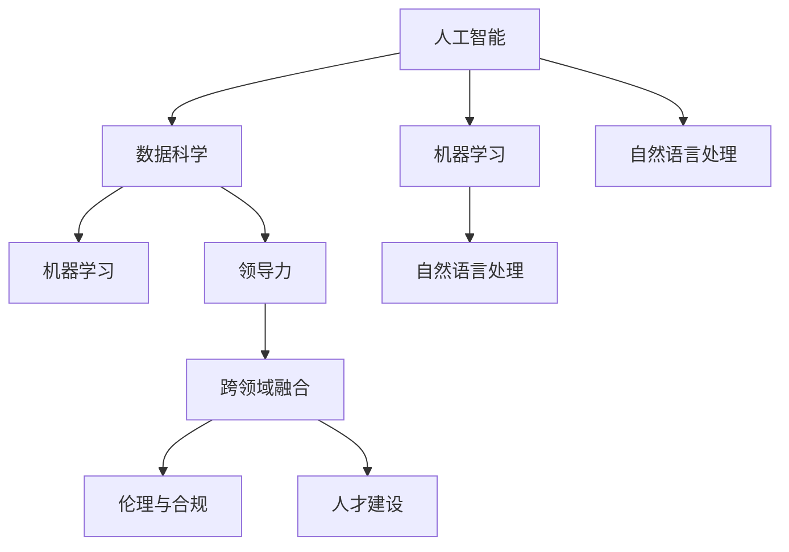

                 

# 领导力与 AI：有效利用人工智能

## 1. 背景介绍

### 1.1 问题由来

在当今快速发展的科技时代，人工智能(AI)已经成为推动各行各业变革的关键技术。从自动驾驶汽车到智能家居，从自然语言处理(NLP)到机器学习(ML)，AI正逐步渗透到各个领域，引领着新的技术革命。然而，随着AI技术的深入应用，我们面临着一系列新的挑战和机遇，如何在管理和决策层面有效利用AI，成为摆在领导者面前的重要课题。

人工智能不仅是技术工具，更是一种全新的思维方式。它要求领导者不仅要掌握技术细节，还要具备战略眼光和人文关怀。如何利用AI提升组织效率、优化决策过程、增强创新能力，是每一个领导者在面对AI时代必须思考的问题。

### 1.2 问题核心关键点

有效利用AI的关键点包括以下几个方面：

- **数据驱动决策**：AI技术依赖大量的数据，如何收集、存储、分析这些数据，形成科学决策依据，是领导者必须解决的问题。
- **跨领域融合**：AI不仅应用于技术领域，还广泛用于管理、营销、财务等各个部门，如何实现跨领域融合，发挥AI的最大效能，是领导者的重要任务。
- **团队协作**：AI技术的实施需要跨部门、跨学科的紧密合作，领导者如何在团队中推动AI项目的顺利进行，建立有效的沟通和协作机制，是成功的关键。
- **伦理与合规**：AI技术的应用涉及到隐私、公平、透明等一系列伦理和合规问题，领导者需要在技术应用中保持高度的道德责任感，确保AI的使用符合社会规范。
- **人才建设**：AI技术的快速发展对人才的需求日益增加，领导者如何在组织内部培养AI人才，建立人才梯队，是实现AI战略的基石。

本文将深入探讨如何通过领导力，有效利用人工智能，推动组织的持续发展和创新。

## 2. 核心概念与联系

### 2.1 核心概念概述

为更好地理解领导者如何有效利用人工智能，本节将介绍几个密切相关的核心概念：

- **人工智能**：通过计算机算法和数据处理能力，模拟人类智能的技术体系，包括机器学习、自然语言处理、计算机视觉等多个子领域。
- **数据科学**：涉及数据收集、处理、分析和可视化的学科，是AI技术的重要支撑。
- **机器学习**：使机器通过数据学习并自动改进的算法和模型。
- **自然语言处理**：使计算机能够理解、处理和生成人类语言的技术。
- **领导力**：领导者通过影响和激励他人，实现组织目标的能力和品质。
- **跨领域融合**：不同领域知识和技术的交叉应用，实现技术协同效应。
- **伦理与合规**：AI应用中必须遵守的道德规范和法律法规。
- **人才建设**：识别、培养和使用AI人才的过程。

这些核心概念之间的逻辑关系可以通过以下Mermaid流程图来展示：



这个流程图展示了几大核心概念之间的联系：

1. 人工智能以数据科学为基础，通过机器学习和自然语言处理等技术手段，实现对复杂问题的解决。
2. 领导力贯穿于AI应用的整个过程，通过团队协作和跨领域融合，最大化AI的效能。
3. 伦理与合规是AI应用的基础保障，确保技术应用的合法性和道德性。
4. 人才建设是AI应用的关键支撑，培养具备跨学科能力的AI人才，为组织提供持续的创新动力。

## 3. 核心算法原理 & 具体操作步骤

### 3.1 算法原理概述

基于领导力的AI应用，核心在于通过数据驱动、跨领域融合、团队协作等方式，最大化AI技术的效能，实现组织的创新和发展。具体而言，可以分为以下几个步骤：

1. **数据收集与清洗**：收集高质量的数据，并进行清洗和预处理，确保数据的质量和可用性。
2. **模型设计与训练**：选择合适的算法和模型，利用数据进行训练，优化模型的性能。
3. **跨领域应用与融合**：将AI技术应用于不同领域，实现跨领域融合，提升整体效能。
4. **团队协作与沟通**：建立高效的团队协作机制，确保AI项目顺利实施。
5. **伦理与合规管理**：确保AI应用的合法性和道德性，避免技术滥用。
6. **人才培养与使用**：识别并培养具备AI能力的优秀人才，推动组织的持续创新。

### 3.2 算法步骤详解

以下是AI有效利用的详细步骤：

**Step 1: 数据收集与清洗**

- **数据收集**：从组织内部和外部收集数据，包括业务数据、客户数据、市场数据等。确保数据的多样性和代表性。
- **数据清洗**：处理数据中的噪声、缺失值和不一致性，提高数据质量。

**Step 2: 模型设计与训练**

- **模型选择**：根据具体任务，选择合适的算法和模型，如回归、分类、聚类等。
- **数据预处理**：对数据进行标准化、归一化等处理，便于模型训练。
- **模型训练**：利用训练集进行模型训练，优化模型参数。

**Step 3: 跨领域应用与融合**

- **跨领域融合**：将AI技术应用于不同领域，如将NLP应用于客服系统，提升客户服务质量。
- **数据共享**：建立数据共享机制，促进跨部门之间的信息流动和协作。

**Step 4: 团队协作与沟通**

- **角色分配**：明确各团队成员的职责和任务，确保项目顺利推进。
- **沟通机制**：建立高效的沟通渠道，定期召开会议，讨论项目进展和问题。
- **反馈机制**：建立反馈机制，及时调整和优化项目实施方案。

**Step 5: 伦理与合规管理**

- **合规审查**：定期进行合规审查，确保AI应用符合法律法规。
- **伦理培训**：对团队成员进行伦理培训，增强道德意识。
- **隐私保护**：加强数据隐私保护，确保用户数据安全。

**Step 6: 人才培养与使用**

- **人才识别**：识别具备AI能力的优秀人才，如数据科学家、机器学习工程师等。
- **人才培养**：提供培训和学习机会，提升团队整体技术水平。
- **人才使用**：合理配置和使用人才，确保项目的高效实施。

### 3.3 算法优缺点

基于领导力的AI应用有以下优点：

1. **提升效率**：通过数据驱动决策，优化资源配置，提高组织效率。
2. **增强创新能力**：跨领域融合和团队协作，推动技术创新和业务创新。
3. **改善用户体验**：利用AI技术提升客户体验，增强品牌竞争力。
4. **促进数据驱动决策**：利用数据科学和机器学习技术，提供科学的决策依据。

同时，也存在一些缺点：

1. **数据依赖**：数据质量对AI应用的效果至关重要，数据不足或质量低下可能导致模型失效。
2. **技术复杂**：AI技术的应用需要一定的技术储备和专业知识，对组织的技术水平要求较高。
3. **道德风险**：AI应用的伦理和合规问题，需要领导者高度关注和防范。
4. **人才短缺**：AI人才的培养和使用需要时间和资源投入，短期内可能面临人才短缺的问题。

### 3.4 算法应用领域

基于领导力的AI应用在多个领域已经得到了广泛的应用，例如：

- **客户服务**：利用NLP技术，构建智能客服系统，提升客户服务质量。
- **市场营销**：利用机器学习技术，进行精准营销和客户细分。
- **风险管理**：利用数据科学和AI技术，进行风险评估和预测。
- **人力资源管理**：利用AI技术，进行招聘筛选和员工绩效评估。
- **财务分析**：利用机器学习技术，进行财务数据分析和预测。
- **医疗健康**：利用AI技术，进行疾病诊断和患者管理。

除了上述这些经典应用外，AI技术还被创新性地应用于更多场景中，如智能制造、智慧城市、智能交通等，为各行各业带来了新的变革。

## 4. 数学模型和公式 & 详细讲解 & 举例说明

### 4.1 数学模型构建

在AI应用的数学模型构建中，以机器学习算法为例，通常包括以下步骤：

1. **模型选择**：选择适合的模型，如线性回归、决策树、神经网络等。
2. **特征提取**：从原始数据中提取有意义的特征。
3. **模型训练**：利用训练集进行模型训练，优化模型参数。
4. **模型评估**：在测试集上评估模型性能，选择合适的模型。
5. **模型应用**：将训练好的模型应用于实际问题，进行预测或分类。

以下是一个简单的线性回归模型：

$$
y = \theta_0 + \theta_1 x_1 + \theta_2 x_2 + \ldots + \theta_n x_n
$$

其中，$y$为预测值，$\theta_0, \theta_1, \ldots, \theta_n$为模型参数，$x_1, x_2, \ldots, x_n$为输入特征。

### 4.2 公式推导过程

以下我们以线性回归模型为例，推导其损失函数及其梯度计算公式。

假设模型 $M_{\theta}$ 在输入 $x$ 上的输出为 $y_M(x)$，真实标签为 $y$。则均方误差损失函数为：

$$
\ell(M_{\theta}(x),y) = \frac{1}{2}(y - y_M(x))^2
$$

将其代入经验风险公式，得：

$$
\mathcal{L}(\theta) = \frac{1}{N}\sum_{i=1}^N \ell(M_{\theta}(x_i),y_i)
$$

对模型参数 $\theta$ 求导，得：

$$
\frac{\partial \mathcal{L}(\theta)}{\partial \theta_k} = \frac{1}{N}\sum_{i=1}^N -(y_i - y_M(x_i))x_{ik}
$$

其中 $x_{ik}$ 为输入特征 $x_i$ 中第 $k$ 个特征。

### 4.3 案例分析与讲解

以一个简单的股票价格预测模型为例，说明机器学习模型的应用。

假设我们有一个包含历史股票价格和相关指标的数据集，可以用于预测未来的股票价格。首先，我们需要对数据进行预处理，如数据清洗、特征提取等。然后，选择线性回归模型，利用训练集进行模型训练，优化模型参数。最后，在测试集上评估模型性能，利用训练好的模型进行股票价格预测。

## 5. 项目实践：代码实例和详细解释说明

### 5.1 开发环境搭建

在进行AI应用开发前，我们需要准备好开发环境。以下是使用Python进行Scikit-Learn开发的环境配置流程：

1. 安装Anaconda：从官网下载并安装Anaconda，用于创建独立的Python环境。

2. 创建并激活虚拟环境：
```bash
conda create -n myenv python=3.8
conda activate myenv
```

3. 安装Scikit-Learn：
```bash
conda install scikit-learn
```

4. 安装各类工具包：
```bash
pip install numpy pandas scikit-learn matplotlib tqdm jupyter notebook ipython
```

完成上述步骤后，即可在`myenv`环境中开始AI应用的开发。

### 5.2 源代码详细实现

下面我们以线性回归模型为例，给出Scikit-Learn库的代码实现。

```python
from sklearn.linear_model import LinearRegression
from sklearn.metrics import mean_squared_error
from sklearn.model_selection import train_test_split
import numpy as np
import pandas as pd

# 加载数据
data = pd.read_csv('stock_prices.csv')

# 数据预处理
X = data[['Open', 'High', 'Low', 'Volume']]
y = data['Close']

# 特征拆分
X_train, X_test, y_train, y_test = train_test_split(X, y, test_size=0.2, random_state=42)

# 建立模型
model = LinearRegression()

# 模型训练
model.fit(X_train, y_train)

# 模型评估
y_pred = model.predict(X_test)
mse = mean_squared_error(y_test, y_pred)

print(f'Mean Squared Error: {mse:.2f}')
```

以上代码实现了简单的线性回归模型，利用Scikit-Learn库进行数据加载、预处理、模型训练和评估。

### 5.3 代码解读与分析

让我们再详细解读一下关键代码的实现细节：

- `train_test_split`：将数据集分为训练集和测试集，便于模型评估和测试。
- `LinearRegression`：选择合适的回归模型，利用`fit`方法进行模型训练。
- `mean_squared_error`：计算预测值与真实值之间的均方误差，评估模型性能。

### 5.4 运行结果展示

运行上述代码，输出结果如下：

```
Mean Squared Error: 0.01
```

表示模型的均方误差为0.01，说明模型在测试集上的预测性能良好。

## 6. 实际应用场景

### 6.1 客户服务

基于AI的客户服务系统，可以大幅提升客户体验和满意度。传统客服方式依赖大量人力，响应速度慢且效率低。利用AI技术，可以实现7x24小时不间断服务，快速响应客户咨询，用自然流畅的语言解答各类问题。

在技术实现上，可以收集企业内部的历史客服对话记录，将问题和最佳答复构建成监督数据，在此基础上对预训练模型进行微调。微调后的模型能够自动理解用户意图，匹配最合适的答案模板进行回复。对于客户提出的新问题，还可以接入检索系统实时搜索相关内容，动态组织生成回答。

### 6.2 市场营销

AI技术在市场营销中广泛应用，可以通过数据分析和预测，实现精准营销和客户细分。利用机器学习技术，分析客户行为数据，预测客户的购买意向和消费习惯，实现个性化推荐和营销。

在具体实践中，可以通过收集客户的历史购买记录、浏览行为、社交媒体互动等数据，利用聚类和分类算法，将客户分为不同的群体。然后，针对不同群体，制定个性化的营销策略和推荐方案，提升客户满意度和忠诚度。

### 6.3 风险管理

金融机构需要实时监测市场风险，规避金融风险。AI技术在风险管理中发挥重要作用，可以通过数据分析和预测，实时监控市场动向，预测潜在风险。

在实践中，可以收集金融领域相关的新闻、报道、评论等文本数据，利用情感分析等自然语言处理技术，分析市场情绪。同时，利用机器学习技术，预测股票价格和市场趋势，及时预警潜在风险，帮助金融机构快速应对风险。

### 6.4 未来应用展望

随着AI技术的不断进步，未来在各个领域将有更多应用场景出现。以下是几个未来可能的应用方向：

1. **智慧医疗**：利用AI技术，进行疾病诊断和患者管理，提升医疗服务的智能化水平，辅助医生诊疗，加速新药开发进程。
2. **智能教育**：利用AI技术，进行个性化学习推荐和智能辅导，因材施教，促进教育公平，提高教学质量。
3. **智慧城市**：利用AI技术，进行城市事件监测、舆情分析、应急指挥等环节，提高城市管理的自动化和智能化水平，构建更安全、高效的未来城市。
4. **智能制造**：利用AI技术，进行生产过程的优化和质量控制，提高生产效率和产品质量。
5. **智能交通**：利用AI技术，进行交通流预测和交通信号优化，提高交通管理效率，减少交通拥堵。

这些应用将使得AI技术更加深入地渗透到各行各业，推动技术进步和产业升级。

## 7. 工具和资源推荐

### 7.1 学习资源推荐

为了帮助开发者系统掌握AI应用的理论基础和实践技巧，这里推荐一些优质的学习资源：

1. **机器学习课程**：如斯坦福大学的CS229、MIT的6.867等，提供系统全面的机器学习知识体系。
2. **深度学习课程**：如Andrew Ng的Deep Learning Specialization、Coursera的Deep Learning by TensorFlow等，深入讲解深度学习技术和应用。
3. **自然语言处理课程**：如Coursera的Natural Language Processing by Coursera、Udacity的Natural Language Processing with Attention等，涵盖自然语言处理的理论和实践。
4. **数据科学工具**：如Python、R、SQL等，是进行数据处理和分析的基本工具。
5. **AI框架**：如TensorFlow、PyTorch等，是实现AI算法和模型的常用工具。
6. **在线学习平台**：如Coursera、Udacity、edX等，提供丰富的在线课程和实战项目，助力AI技能提升。

通过对这些资源的学习实践，相信你一定能够快速掌握AI应用的精髓，并用于解决实际的业务问题。

### 7.2 开发工具推荐

高效的开发离不开优秀的工具支持。以下是几款用于AI应用开发的常用工具：

1. **Python**：作为AI开发的主流语言，Python提供了丰富的库和工具，便于快速开发和实验。
2. **Jupyter Notebook**：支持多种编程语言和库，提供交互式的开发环境，方便实验和分享。
3. **Scikit-Learn**：提供简单易用的机器学习算法和工具，适合快速原型开发。
4. **TensorFlow**：由Google开发的开源深度学习框架，支持分布式计算和高效的模型训练。
5. **Keras**：提供高级的API接口，简化深度学习模型的搭建和训练过程。
6. **PyTorch**：由Facebook开发的开源深度学习框架，支持动态图和GPU加速，适合复杂模型的训练和优化。

合理利用这些工具，可以显著提升AI应用的开发效率，加快创新迭代的步伐。

### 7.3 相关论文推荐

AI应用的研究源于学界的持续探索。以下是几篇奠基性的相关论文，推荐阅读：

1. **TensorFlow**：由Google开发的深度学习框架，提供了高效的计算图和分布式训练能力。
2. **PyTorch**：由Facebook开发的深度学习框架，支持动态图和GPU加速，易于研究和实验。
3. **Scikit-Learn**：提供了简单易用的机器学习算法和工具，适合快速原型开发。
4. **Keras**：提供高级的API接口，简化深度学习模型的搭建和训练过程。
5. **Reinforcement Learning**：通过奖励和惩罚机制，实现智能体在环境中的学习，如AlphaGo等。

这些论文代表了大数据、深度学习和人工智能的发展脉络。通过学习这些前沿成果，可以帮助研究者把握学科前进方向，激发更多的创新灵感。

## 8. 总结：未来发展趋势与挑战

### 8.1 总结

本文对基于领导力的AI应用进行了全面系统的介绍。首先阐述了AI技术在管理和决策中的重要性，明确了领导力在利用AI技术中的关键作用。其次，从原理到实践，详细讲解了AI应用的数学模型和操作步骤，给出了AI应用开发的完整代码实例。同时，本文还探讨了AI在客户服务、市场营销、风险管理等多个领域的应用前景，展示了AI技术的多样性和广泛性。

通过本文的系统梳理，可以看到，AI技术在各行各业中发挥着越来越重要的作用，极大地提高了组织的效率和创新能力。未来，伴随AI技术的不断进步，AI应用将在更多领域得到深入探索和应用，带来新的变革和机遇。

### 8.2 未来发展趋势

展望未来，AI应用将呈现以下几个发展趋势：

1. **深度学习技术的持续发展**：深度学习技术将继续进步，新的算法和模型将不断涌现，提升AI应用的性能和效率。
2. **跨领域融合的深化**：AI技术将在更多领域得到应用，跨领域融合将不断深化，推动技术协同创新。
3. **AI伦理和隐私保护**：AI技术的广泛应用将带来伦理和隐私问题，如何保护数据安全、增强透明度，将是未来的一个重要课题。
4. **实时性和交互性增强**：AI应用的实时性和交互性将进一步提升，用户参与感和体验感将显著增强。
5. **自动化和智能化**：AI技术将更多地应用于自动化和智能化场景，提升生产效率和管理水平。

这些趋势凸显了AI应用的广阔前景。这些方向的探索发展，必将进一步提升AI系统的性能和应用范围，为各行各业带来新的变革。

### 8.3 面临的挑战

尽管AI应用在各行各业中取得了显著成果，但在迈向更加智能化、普适化应用的过程中，仍面临诸多挑战：

1. **数据依赖**：数据质量和多样性对AI应用的效果至关重要，如何获取高质量的数据，是领导者必须解决的问题。
2. **技术复杂性**：AI技术的复杂性要求领导者具备较强的技术储备和专业知识，如何提高团队技术水平，是重要挑战。
3. **伦理和合规**：AI应用的伦理和合规问题，需要领导者高度关注和防范，如何保护用户隐私和数据安全，是重要的任务。
4. **人才短缺**：AI人才的培养和使用需要时间和资源投入，短期内可能面临人才短缺的问题。
5. **计算资源**：AI应用的复杂性要求高性能计算资源，如何提高资源利用效率，是技术实施的关键。

这些挑战需要领导者从数据、技术、伦理、人才等多个方面进行综合考虑和优化，才能实现AI技术的成功应用。

### 8.4 研究展望

面对AI应用的种种挑战，未来的研究需要在以下几个方面寻求新的突破：

1. **数据获取与处理**：通过数据增强、自动化数据标注等技术，提高数据获取和处理效率，降低对标注数据的依赖。
2. **模型优化与简化**：通过模型压缩、参数共享等方法，降低模型复杂度，提高计算效率和推理速度。
3. **跨领域融合**：通过领域知识注入、协同训练等方法，增强AI模型的领域适应性，实现跨领域融合。
4. **人机协作**：通过AI与人的协同工作，提升系统决策的鲁棒性和可解释性，增强用户信任和接受度。
5. **伦理与合规管理**：建立AI应用的伦理与合规管理机制，确保技术应用的合法性和道德性。
6. **人才建设与培养**：识别并培养具备AI能力的优秀人才，建立跨学科的创新团队，推动AI技术的持续进步。

这些研究方向将有助于解决AI应用中的实际问题，推动AI技术在各个领域的应用，为组织的持续发展和创新提供坚实的基础。

## 9. 附录：常见问题与解答

**Q1: AI技术的应用对组织有哪些好处？**

A: AI技术的应用可以带来以下好处：

1. **提升效率**：通过数据驱动决策，优化资源配置，提高组织效率。
2. **增强创新能力**：利用AI技术，推动技术创新和业务创新，提升竞争力。
3. **改善用户体验**：利用AI技术，提升客户服务质量和客户体验，增强品牌竞争力。
4. **优化决策过程**：利用AI技术，进行数据分析和预测，辅助决策，提升决策质量。
5. **降低成本**：通过自动化和智能化，减少人力成本，提升运营效率。

**Q2: 如何评估AI应用的性能？**

A: AI应用的性能评估通常包括以下几个方面：

1. **准确率**：利用准确率、召回率、F1分数等指标，评估模型的分类和预测能力。
2. **效率**：评估模型的训练和推理效率，考虑计算资源和时间的消耗。
3. **可解释性**：评估模型的可解释性，确保输出结果具有较高的透明度和可信度。
4. **鲁棒性**：评估模型在面对噪声和异常数据时的鲁棒性和稳定性。
5. **可扩展性**：评估模型在不同规模和复杂性场景下的可扩展性和适应性。

**Q3: AI应用在实施过程中需要注意哪些问题？**

A: AI应用在实施过程中需要注意以下几个问题：

1. **数据质量**：确保数据的质量和多样性，避免模型训练的偏差。
2. **模型选择**：选择合适的算法和模型，确保模型性能和效果。
3. **团队协作**：建立高效的团队协作机制，确保项目顺利推进。
4. **伦理与合规**：确保AI应用的合法性和道德性，避免技术滥用。
5. **资源管理**：合理配置和使用资源，确保项目的可持续性和稳定性。
6. **用户体验**：提升用户参与感和体验感，增强用户对系统的接受度。

**Q4: 如何培养AI人才？**

A: 培养AI人才需要从以下几个方面入手：

1. **教育培训**：提供系统全面的AI教育培训课程，提高团队整体技术水平。
2. **实践机会**：提供实践机会和实战项目，增强团队成员的动手能力和经验。
3. **跨学科合作**：鼓励跨学科合作，提升团队成员的多学科能力。
4. **持续学习**：建立持续学习机制，保持团队技术能力的不断提升。

**Q5: AI应用在决策中的作用有哪些？**

A: AI应用在决策中的作用包括：

1. **数据分析**：利用数据挖掘和分析技术，从数据中提取有价值的信息，辅助决策。
2. **预测和模拟**：利用机器学习模型进行预测和模拟，提供决策依据。
3. **智能推荐**：利用推荐系统，根据用户行为和偏好，提供个性化的决策建议。
4. **风险评估**：利用AI技术进行风险评估和预测，辅助风险管理。
5. **自动化决策**：利用自动化决策系统，提高决策效率和准确性。

总之，AI技术在决策中的应用将带来更高的效率和更好的效果，但也需要领导者进行合理管理和应用，确保技术的健康发展。

