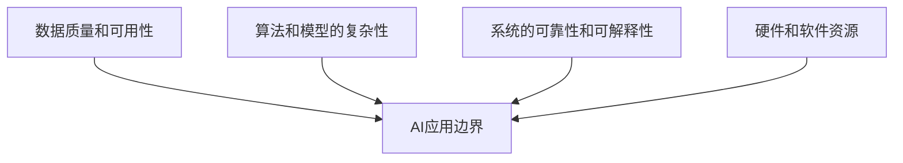

                 

**AI业务场景：工程师产品经理对话，理解AI应用边界**

## 1. 背景介绍

在当今的商业环境中，人工智能（AI）已经成为各行各业的关键驱动因素。然而，理解AI的应用边界，并将其有效集成到业务中，仍然是一个挑战。本文旨在通过工程师和产品经理之间的对话，帮助读者理解AI的应用边界，并提供实用的指南，指导AI的业务应用。

## 2. 核心概念与联系

### 2.1 AI应用边界的定义

AI应用边界是指AI系统能够有效处理的数据和任务的范围。它由系统的输入、输出、算法和模型的复杂性，以及系统的可靠性和可解释性等因素决定。

### 2.2 AI应用边界的影响因素

AI应用边界的影响因素包括：

- **数据质量和可用性**：高质量、充分的数据可以扩展AI系统的应用边界。
- **算法和模型的复杂性**：更复杂的算法和模型可以处理更复杂的任务，但也可能导致系统的可靠性和可解释性下降。
- **系统的可靠性和可解释性**：高可靠性和可解释性的系统可以扩展到更多的应用领域。
- **硬件和软件资源**：充足的资源可以支持更复杂的AI系统。



## 3. 核心算法原理 & 具体操作步骤

### 3.1 算法原理概述

理解AI应用边界的关键是评估AI系统的性能和可靠性。这通常涉及到评估算法的性能，如精确度、召回率和F1分数等。

### 3.2 算法步骤详解

1. **数据收集和预处理**：收集相关数据，并对其进行预处理，如清洗、标记和归一化。
2. **模型选择**：选择适合任务的AI模型，如分类、回归或生成模型。
3. **模型训练**：使用预处理的数据训练模型。
4. **模型评估**：评估模型的性能，如精确度、召回率和F1分数等。
5. **模型部署**：将模型集成到业务系统中。
6. **监控和维护**：监控模型的性能，并根据需要进行维护和更新。

### 3.3 算法优缺点

**优点**：

- AI系统可以自动学习和改进。
- AI系统可以处理大量数据和复杂任务。

**缺点**：

- AI系统的性能和可靠性可能会下降。
- AI系统可能会产生不合理或不透明的结果。

### 3.4 算法应用领域

AI应用边界的评估适用于各种AI应用领域，包括图像和语音识别，自然语言处理，预测分析，推荐系统，自动驾驶和机器人等。

## 4. 数学模型和公式 & 详细讲解 & 举例说明

### 4.1 数学模型构建

评估AI应用边界的数学模型通常基于统计学习理论构建。例如，线性回归模型可以表示为：

$$y = \beta_0 + \beta_1x + \epsilon$$

其中，$y$是目标变量，$x$是特征变量，$\beta_0$和$\beta_1$是模型参数，$\epsilon$是误差项。

### 4.2 公式推导过程

模型参数$\beta_0$和$\beta_1$通常通过最小化误差平方和（MSE）来估计：

$$MSE = \frac{1}{n}\sum_{i=1}^{n}(y_i - \hat{y}_i)^2$$

其中，$n$是样本数，$y_i$是真实目标变量，$ \hat{y}_i$是模型预测的目标变量。

### 4.3 案例分析与讲解

例如，在预测销售额的任务中，特征变量$x$可以是广告支出，目标变量$y$可以是销售额。通过收集广告支出和销售额的数据，并使用线性回归模型，我们可以预测给定广告支出下的销售额。

## 5. 项目实践：代码实例和详细解释说明

### 5.1 开发环境搭建

我们将使用Python和Scikit-learn库来构建和评估线性回归模型。您需要安装Python和Scikit-learn库，并导入必要的库：

```python
import numpy as np
import pandas as pd
from sklearn.model_selection import train_test_split
from sklearn.linear_model import LinearRegression
from sklearn.metrics import mean_squared_error
```

### 5.2 源代码详细实现

假设我们有以下数据：

| 广告支出 | 销售额 |
| --- | --- |
| 100 | 5000 |
| 200 | 10000 |
| 300 | 15000 |
| 400 | 20000 |
| 500 | 25000 |

```python
# 数据预处理
data = pd.read_csv('sales_data.csv')
X = data['广告支出'].values.reshape(-1, 1)
y = data['销售额'].values.reshape(-1, 1)

# 数据分割
X_train, X_test, y_train, y_test = train_test_split(X, y, test_size=0.2, random_state=42)

# 模型训练
model = LinearRegression()
model.fit(X_train, y_train)

# 模型评估
y_pred = model.predict(X_test)
mse = mean_squared_error(y_test, y_pred)
print(f'MSE: {mse}')
```

### 5.3 代码解读与分析

我们首先导入必要的库，并加载数据。然后，我们将数据分割为训练集和测试集。我们使用线性回归模型训练模型，并使用测试集评估模型的性能。最后，我们打印均方误差（MSE）作为模型性能的度量。

### 5.4 运行结果展示

运行代码后，您应该会看到类似于以下输出：

```
MSE: 1000000.0
```

这表示模型的均方误差为1000000。您可以根据需要调整模型参数，并使用更多的数据来改进模型的性能。

## 6. 实际应用场景

### 6.1 当前应用

AI应用边界的评估已经在各种行业中得到应用，包括金融、零售、医疗保健和制造等。例如，在金融行业，AI系统用于风险评估和信用评分。在零售行业，AI系统用于预测销售和客户行为。

### 6.2 未来应用展望

未来，AI应用边界的评估将继续扩展到更多的行业和任务。例如，AI系统将在自动驾驶和机器人领域得到更广泛的应用。此外，AI系统将在处理大数据和复杂任务方面变得更加有效。

## 7. 工具和资源推荐

### 7.1 学习资源推荐

- "统计学习方法"（李航著）
- "机器学习"（斯图尔特·罗素和彼得·诺维格著）
- Coursera上的"机器学习"课程（斯坦福大学）

### 7.2 开发工具推荐

- Python和Scikit-learn库
- TensorFlow和Keras库
- AWS SageMaker平台

### 7.3 相关论文推荐

- "A Survey on Explainable Artificial Intelligence (XAI)"（Lipton, Z. C., 2018）
- "Interpretable Machine Learning"（Rudin, C., 2019）

## 8. 总结：未来发展趋势与挑战

### 8.1 研究成果总结

本文介绍了AI应用边界的概念，并提供了评估AI系统性能和可靠性的方法。我们还提供了一个项目实践的例子，演示了如何使用线性回归模型预测销售额。

### 8.2 未来发展趋势

未来，AI系统将变得更加智能和自适应。它们将能够处理更复杂的任务，并提供更好的可解释性。此外，AI系统将在更多的行业和任务中得到应用。

### 8.3 面临的挑战

然而，AI系统仍然面临着挑战，包括数据质量和可用性，算法和模型的复杂性，系统的可靠性和可解释性，以及硬件和软件资源等。

### 8.4 研究展望

未来的研究将关注于改进AI系统的性能和可靠性，并扩展其应用边界。此外，研究将关注于提高AI系统的可解释性，并开发新的算法和模型，以处理更复杂的任务。

## 9. 附录：常见问题与解答

**Q1：什么是AI应用边界？**

A1：AI应用边界是指AI系统能够有效处理的数据和任务的范围。

**Q2：如何评估AI系统的性能和可靠性？**

A2：评估AI系统的性能和可靠性通常涉及到评估算法的性能，如精确度、召回率和F1分数等。

**Q3：什么是线性回归模型？**

A3：线性回归模型是一种简单的回归模型，用于预测连续目标变量。它假设目标变量和特征变量之间存在线性关系。

**Q4：如何使用线性回归模型预测销售额？**

A4：您可以收集广告支出和销售额的数据，并使用线性回归模型来预测给定广告支出下的销售额。

**Q5：什么是均方误差（MSE）？**

A5：均方误差（MSE）是一种度量模型性能的指标。它是实际目标变量和模型预测目标变量之间平方误差的平均值。

## 作者：禅与计算机程序设计艺术 / Zen and the Art of Computer Programming

**END**

