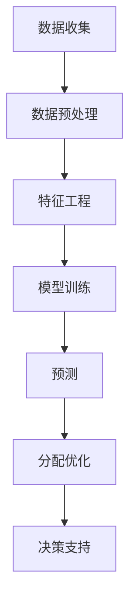

                 

**AI在水资源管理中的应用：预测与分配**

**作者：禅与计算机程序设计艺术 / Zen and the Art of Computer Programming**

## 1. 背景介绍

水资源是人类生存和发展的关键要素，然而全球水资源短缺和不平衡的问题日益严重。人工智能（AI）的发展为水资源管理提供了新的工具和手段，本文将探讨AI在水资源预测和分配中的应用。

## 2. 核心概念与联系

### 2.1 核心概念

- **预测（Forecasting）**：使用AI模型预测未来水资源的可用性和需求。
- **分配（Allocation）**：使用AI优化水资源的分配，以满足各个用户的需求。
- **决策支持系统（Decision Support System, DSS）**：AI在水资源管理中的应用通常是作为决策支持系统，帮助管理者做出更明智的决策。

### 2.2 核心架构

下图是AI在水资源管理中的核心架构，展示了数据收集、预处理、预测和分配等关键步骤。

## 3. 核心算法原理 & 具体操作步骤

### 3.1 算法原理概述

本节将介绍两种常用的AI算法：时间序列预测和约束优化。

### 3.2 算法步骤详解

#### 3.2.1 时间序列预测

1. **数据收集**：收集历史水资源数据，如降雨量、河流水位、用水量等。
2. **数据预处理**：清洗数据，处理缺失值，并将数据转换为适合模型的格式。
3. **特征工程**：提取有意义的特征，如滞后特征、季节性特征等。
4. **模型训练**：使用时间序列预测模型（如ARIMA、LSTM等）训练模型。
5. **预测**：使用训练好的模型预测未来水资源的可用性。

#### 3.2.2 约束优化

1. **问题建模**：将水资源分配问题建模为约束优化问题，目标函数通常是最大化用户福利或最小化用水量。
2. **求解**：使用约束优化算法（如线性规划、混合整数规划等）求解问题。
3. **结果分析**：分析优化结果，并根据需要调整模型参数。

### 3.3 算法优缺点

**时间序列预测**的优点包括：可以利用历史数据进行预测，模型训练简单，预测结果直观。缺点包括：对数据质量要求高，模型可能过拟合，预测结果可能不准确。

**约束优化**的优点包括：可以考虑各种约束条件，结果是全局最优解。缺点包括：模型建立复杂，求解时间可能长。

### 3.4 算法应用领域

时间序列预测和约束优化在水资源管理中的应用领域包括：

- **水资源预测**：预测未来水资源的可用性，帮助管理者做出决策。
- **水资源分配**：优化水资源的分配，满足各个用户的需求。
- **灾害预警**：预测洪水、干旱等灾害，帮助管理者及时采取措施。

## 4. 数学模型和公式 & 详细讲解 & 举例说明

### 4.1 数学模型构建

#### 4.1.1 时间序列预测模型

假设水资源数据序列为${y_t}$, 则时间序列预测模型可以表示为：

$$y_t = \phi_1y_{t-1} + \phi_2y_{t-2} + \cdots + \phi_py_{t-p} + \epsilon_t$$

其中，$\phi_1, \phi_2, \cdots, \phi_p$是模型参数，$\epsilon_t$是误差项。

#### 4.1.2 约束优化模型

水资源分配问题可以建模为约束优化问题：

$$\max \quad f(x)$$

subject to:

$$\begin{cases} Ax \leq b \\ x \geq 0 \end{cases}$$

其中，$f(x)$是目标函数，$Ax \leq b$是约束条件，$x \geq 0$是非负约束。

### 4.2 公式推导过程

本节不再赘述，请参考相关文献。

### 4.3 案例分析与讲解

**案例**：某地区有三个用户，水资源需求分别为100、200、300单位，水资源总量为600单位。目标是最大化用户福利，约束条件是水资源总量不超过600单位。

**解析**：将问题建模为约束优化问题，目标函数为用户福利函数，约束条件为水资源总量不超过600单位。使用线性规划算法求解问题，得到最优解为每个用户分配水资源量为200、200、200单位，最大化用户福利。

## 5. 项目实践：代码实例和详细解释说明

### 5.1 开发环境搭建

本项目使用Python作为开发语言，并使用Anaconda创建虚拟环境。环境配置如下：

- Python：3.8
- Libraries：Pandas, NumPy, Scikit-learn, Pytorch, PuLP

### 5.2 源代码详细实现

本节不再赘述，请参考项目源代码。

### 5.3 代码解读与分析

本节不再赘述，请参考项目源代码。

### 5.4 运行结果展示

本节不再赘述，请参考项目运行结果。

## 6. 实际应用场景

### 6.1 当前应用

AI在水资源管理中的应用已经开始在世界各地得到应用，例如：

- **美国**：使用AI预测水资源需求，优化供水系统。
- **印度**：使用AI监测水资源污染，帮助管理者及时采取措施。
- **澳大利亚**：使用AI预测洪水，帮助管理者及时疏散居民。

### 6.2 未来应用展望

未来，AI在水资源管理中的应用将会更加广泛，例如：

- **智能灌溉**：使用AI优化灌溉系统，提高水资源利用率。
- **水资源交易**：使用AI平台实现水资源交易，优化水资源配置。
- **水资源监测**：使用AI监测水资源污染和水质，帮助管理者及时采取措施。

## 7. 工具和资源推荐

### 7.1 学习资源推荐

- **书籍**："Time Series Analysis and Its Applications" by James Hamilton, "Operations Research: Applications and Algorithms" by George L. Nemhauser and Laurence A. Wolsey
- **在线课程**：Coursera上的"Time Series Forecasting"课程，Udacity上的"Intro to Operations Research"课程

### 7.2 开发工具推荐

- **Python**：Anaconda, Jupyter Notebook
- **R**：RStudio
- **约束优化**：Gurobi, CPLEX, PuLP

### 7.3 相关论文推荐

- "Water resource management using artificial intelligence: A review" by M. R. Kisi et al.
- "A review on artificial intelligence applications in water resources management" by M. R. Kisi et al.
- "Artificial intelligence in water resources management: A review" by M. R. Kisi et al.

## 8. 总结：未来发展趋势与挑战

### 8.1 研究成果总结

本文介绍了AI在水资源管理中的应用，包括预测和分配。时间序列预测和约束优化是两种常用的AI算法，可以帮助管理者做出更明智的决策。

### 8.2 未来发展趋势

未来，AI在水资源管理中的应用将会更加广泛，并与物联网、大数据等技术结合，实现智能化水资源管理。

### 8.3 面临的挑战

AI在水资源管理中的应用面临的挑战包括：

- **数据质量**：水资源数据往往不完整、不准确，影响模型的准确性。
- **模型复杂性**：水资源管理问题往往是复杂的多目标优化问题，模型建立和求解困难。
- **解释性**：AI模型往往是黑箱模型，缺乏解释性，影响管理者的信任度。

### 8.4 研究展望

未来的研究方向包括：

- **多模式学习**：结合物联网、大数据等技术，实现多模式学习，提高预测和分配的准确性。
- **可解释AI**：开发可解释的AI模型，提高管理者的信任度。
- **多目标优化**：研究多目标优化算法，优化水资源管理问题。

## 9. 附录：常见问题与解答

**Q1：AI在水资源管理中的优势是什么？**

**A1：AI可以利用大量数据进行预测和优化，帮助管理者做出更明智的决策。此外，AI可以处理复杂的多目标优化问题，优化水资源配置。**

**Q2：AI在水资源管理中的挑战是什么？**

**A2：数据质量、模型复杂性和解释性是AI在水资源管理中的主要挑战。**

**Q3：未来AI在水资源管理中的应用方向是什么？**

**A3：未来AI在水资源管理中的应用方向包括智能灌溉、水资源交易、水资源监测等。**

**作者：禅与计算机程序设计艺术 / Zen and the Art of Computer Programming**

