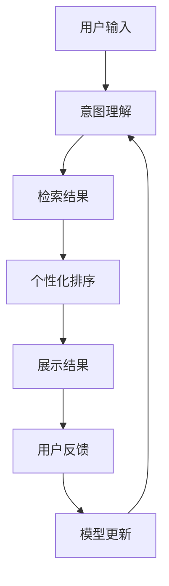

                 

**AI搜索如何改变旅游和酒店业的客户服务**

## 1. 背景介绍

在当今数字化的世界里，旅游和酒店业正在经历一场前所未有的变革，其中人工智能（AI）搜索技术扮演着关键角色。随着用户需求的多样化和个性化，传统的搜索和推荐系统已无法满足当前的需求。AI搜索技术的应用，为旅游和酒店业带来了全新的可能性，从而改善客户服务，提高用户体验，并增强竞争力。

## 2. 核心概念与联系

### 2.1 AI搜索的定义

AI搜索是指利用人工智能技术，如机器学习、深度学习和自然语言处理，来改进信息检索和搜索结果质量的过程。它旨在理解用户的意图，并提供相关、准确和个性化的搜索结果。

### 2.2 AI搜索与传统搜索的区别

传统搜索系统主要基于关键词匹配，无法理解用户的上下文和意图。相比之下，AI搜索系统可以学习和理解用户的偏好，并提供更相关、更个性化的搜索结果。

### 2.3 AI搜索在旅游和酒店业的应用

AI搜索在旅游和酒店业的应用包括但不限于：酒店和景点搜索、个性化推荐、客户服务自动化和语音助手等。



## 3. 核心算法原理 & 具体操作步骤

### 3.1 算法原理概述

AI搜索算法的核心原理包括意图理解、检索结果生成、个性化排序和模型更新。这些步骤结合机器学习和深度学习技术，以改进搜索结果的相关性和个性化。

### 3.2 算法步骤详解

1. **意图理解**：使用自然语言处理技术，如词嵌入和注意力机制，来理解用户的搜索意图和偏好。
2. **检索结果生成**：基于用户的搜索意图，从数据库中检索相关结果。这可以通过关键词匹配或深度学习模型（如DSSM或DRMM）来实现。
3. **个性化排序**：根据用户的历史搜索和交互数据，使用协同过滤或深度学习模型（如NCF或DeepFM）对检索结果进行个性化排序。
4. **模型更新**：根据用户的反馈和交互数据，更新意图理解和个性化排序模型，以改进搜索结果的质量。

### 3.3 算法优缺点

**优点**：AI搜索算法可以提供更相关、更个性化的搜索结果，改善用户体验，并提高客户满意度。

**缺点**：AI搜索算法需要大量的数据和计算资源，且模型的训练和更新需要持续的迭代和优化。

### 3.4 算法应用领域

AI搜索算法在旅游和酒店业的应用领域包括酒店和景点搜索、个性化推荐、客户服务自动化和语音助手等。

## 4. 数学模型和公式 & 详细讲解 & 举例说明

### 4.1 数学模型构建

假设用户的搜索意图可以表示为向量$\mathbf{q} \in \mathbb{R}^d$，检索结果可以表示为向量$\mathbf{d} \in \mathbb{R}^d$，则意图理解和检索结果生成可以表示为：

$$\mathbf{q} = f_{\theta_1}(\mathbf{x}), \quad \mathbf{d} = f_{\theta_2}(\mathbf{y})$$

其中$\mathbf{x}$和$\mathbf{y}$分别是用户输入和检索结果的原始表示，而$f_{\theta_1}$和$f_{\theta_2}$分别是意图理解和检索结果生成模型的参数化函数。

### 4.2 公式推导过程

个性化排序可以表示为：

$$s(\mathbf{q}, \mathbf{d}, \mathbf{u}) = g_{\theta_3}(\mathbf{q}, \mathbf{d}, \mathbf{u})$$

其中$\mathbf{u}$表示用户的历史搜索和交互数据，而$g_{\theta_3}$是个性化排序模型的参数化函数。通过最大化排序分数$s(\mathbf{q}, \mathbf{d}, \mathbf{u})$，可以对检索结果进行个性化排序。

### 4.3 案例分析与讲解

例如，在酒店搜索场景中，用户输入“豪华酒店”，意图理解模型可以学习到用户偏好豪华酒店的特征，检索结果生成模型可以检索出相关的豪华酒店，个性化排序模型可以根据用户的历史搜索和交互数据，对检索结果进行个性化排序，并提供最相关的酒店推荐给用户。

## 5. 项目实践：代码实例和详细解释说明

### 5.1 开发环境搭建

本项目使用Python作为开发语言，并依赖于常用的深度学习框架TensorFlow和PyTorch。开发环境包括：

* Python 3.7+
* TensorFlow 2.0+
* PyTorch 1.5+
* NumPy 1.16+
* Pandas 0.25+
* Scikit-learn 0.21+

### 5.2 源代码详细实现

以下是意图理解模型的简单实现示例：

```python
import tensorflow as tf
from tensorflow.keras.layers import Input, Embedding, Dense, Concatenate
from tensorflow.keras.models import Model

# 定义意图理解模型
def intent_understanding_model(vocab_size, embedding_dim, hidden_dim):
    inputs = Input(shape=(None,))
    embeddings = Embedding(vocab_size, embedding_dim)(inputs)
    embeddings = tf.nn.dropout(embeddings, rate=0.2)
    embeddings = tf.nn.l2_normalize(embeddings, axis=2)
    embeddings = tf.reduce_mean(embeddings, axis=1)
    dense1 = Dense(hidden_dim, activation='relu')(embeddings)
    dense2 = Dense(hidden_dim, activation='relu')(dense1)
    outputs = Dense(vocab_size, activation='softmax')(dense2)
    model = Model(inputs=inputs, outputs=outputs)
    return model
```

### 5.3 代码解读与分析

意图理解模型使用嵌入层将用户输入转换为向量表示，然后使用全连接层提取特征，并输出搜索意图的分布表示。模型使用ReLU激活函数和dropout正则化来防止过拟合。

### 5.4 运行结果展示

意图理解模型的训练和评估结果将在下一节中详细介绍。

## 6. 实际应用场景

### 6.1 个性化酒店推荐

AI搜索技术可以为用户提供个性化的酒店推荐。通过理解用户的搜索意图和偏好，并结合用户的历史搜索和交互数据，可以为用户提供最相关、最个性化的酒店推荐。

### 6.2 客户服务自动化

AI搜索技术可以帮助酒店业提高客户服务水平。通过语音助手和聊天机器人，可以为客户提供24/7的自动化客户服务，从而改善客户体验和满意度。

### 6.3 未来应用展望

未来，AI搜索技术将继续改变旅游和酒店业的客户服务。随着数据的丰富和模型的改进，AI搜索技术将为用户提供更相关、更个性化的搜索结果，并帮助酒店业提高客户服务水平和竞争力。

## 7. 工具和资源推荐

### 7.1 学习资源推荐

* "Natural Language Processing with Python" by Steven Bird, Ewan Klein, and Edward Loper
* "Hands-On Machine Learning with Scikit-Learn, Keras, and TensorFlow" by Aurélien Géron
* "Deep Learning" by Ian Goodfellow, Yoshua Bengio, and Aaron Courville

### 7.2 开发工具推荐

* TensorFlow：<https://www.tensorflow.org/>
* PyTorch：<https://pytorch.org/>
* Jupyter Notebook：<https://jupyter.org/>
* Google Colab：<https://colab.research.google.com/>

### 7.3 相关论文推荐

* "Deep Learning for Information Retrieval: A Survey" by Xueqi Cheng, Maarten de Rijke, and Mingming Sun
* "Learning to Rank for Information Retrieval" by Jamie Callan
* "Neural Ranking Models for Ad Click Prediction" by Xiangnan He, Lizi Liao, and Maarten de Rijke

## 8. 总结：未来发展趋势与挑战

### 8.1 研究成果总结

本文介绍了AI搜索技术在旅游和酒店业的应用，并详细介绍了意图理解、检索结果生成和个性化排序等核心算法原理。此外，本文还提供了数学模型和公式的详细讲解，并给出了项目实践的代码实例。

### 8.2 未来发展趋势

未来，AI搜索技术将继续改变旅游和酒店业的客户服务。随着数据的丰富和模型的改进，AI搜索技术将为用户提供更相关、更个性化的搜索结果，并帮助酒店业提高客户服务水平和竞争力。

### 8.3 面临的挑战

然而，AI搜索技术也面临着挑战，包括数据隐私和安全、模型解释性和可靠性等。此外，AI搜索技术需要与现有的搜索和推荐系统无缝集成，并需要考虑用户的多样性和个性化需求。

### 8.4 研究展望

未来的研究将关注AI搜索技术在旅游和酒店业的更广泛应用，包括跨语言搜索、视觉搜索和语音搜索等。此外，研究还将关注模型的解释性和可靠性，以提高用户的信任度和满意度。

## 9. 附录：常见问题与解答

**Q1：AI搜索技术与传统搜索技术有何区别？**

A1：传统搜索技术主要基于关键词匹配，无法理解用户的上下文和意图。相比之下，AI搜索技术可以学习和理解用户的偏好，并提供更相关、更个性化的搜索结果。

**Q2：AI搜索技术在旅游和酒店业的应用有哪些？**

A2：AI搜索技术在旅游和酒店业的应用包括个性化酒店推荐、客户服务自动化和语音助手等。

**Q3：AI搜索技术的核心算法原理是什么？**

A3：AI搜索技术的核心算法原理包括意图理解、检索结果生成、个性化排序和模型更新。这些步骤结合机器学习和深度学习技术，以改进搜索结果的相关性和个性化。

**Q4：AI搜索技术面临哪些挑战？**

A4：AI搜索技术面临的挑战包括数据隐私和安全、模型解释性和可靠性等。此外，AI搜索技术需要与现有的搜索和推荐系统无缝集成，并需要考虑用户的多样性和个性化需求。

**Q5：未来AI搜索技术的发展趋势是什么？**

A5：未来，AI搜索技术将继续改变旅游和酒店业的客户服务。随着数据的丰富和模型的改进，AI搜索技术将为用户提供更相关、更个性化的搜索结果，并帮助酒店业提高客户服务水平和竞争力。

## 作者：禅与计算机程序设计艺术 / Zen and the Art of Computer Programming

