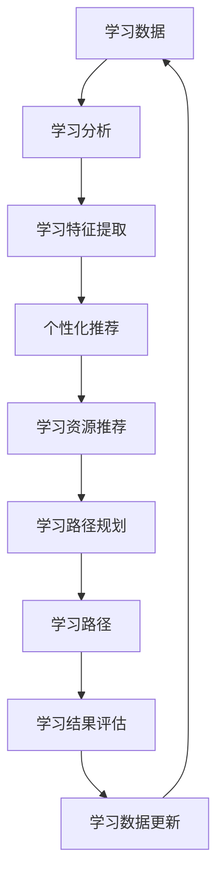

                 

**AI教育革命：个性化学习路径的设计**

**作者：禅与计算机程序设计艺术 / Zen and the Art of Computer Programming**

## 1. 背景介绍

当前，人工智能（AI）技术的发展正在各行各业掀起一场颠覆性的变革，教育领域也不例外。个性化学习路径设计（Personalized Learning Path Design, PLPD）是AI在教育领域的一个重要应用，旨在根据每个学生的学习特点和需求，提供定制化的学习路径和资源。本文将深入探讨PLPD的核心概念、算法原理、数学模型、项目实践，并展望其未来应用和挑战。

## 2. 核心概念与联系

PLPD的核心概念包括学习分析（Learning Analytics）、个性化推荐（Personalized Recommendation）、学习路径规划（Learning Path Planning），它们通过数据驱动和人工智能技术实现。下图是PLPD的核心概念和联系架构图。



## 3. 核心算法原理 & 具体操作步骤

### 3.1 算法原理概述

PLPD的核心算法包括协同过滤（Collaborative Filtering）、内容过滤（Content-based Filtering）、混合过滤（Hybrid Filtering）、深度学习（Deep Learning）等。这些算法旨在从学习数据中提取特征，并基于这些特征为学生提供个性化的学习资源和路径。

### 3.2 算法步骤详解

以混合过滤算法为例，其步骤如下：

1. **学习数据预处理**：收集学生的学习数据，包括学习行为数据（如浏览、点击、提交作业）、学习成果数据（如分数、评分）和学习特征数据（如学习风格、学习目标）。
2. **学习特征提取**：使用协同过滤和内容过滤算法从学习数据中提取学生的学习特征。
3. **个性化推荐**：基于学习特征，使用混合过滤算法为学生推荐个性化的学习资源。
4. **学习路径规划**：基于学习资源，使用路径规划算法为学生规划个性化的学习路径。
5. **学习结果评估**：评估学生的学习结果，并更新学习数据。

### 3.3 算法优缺点

- **优点**：个性化学习路径可以提高学习效率和学习动机，并帮助学生实现个性化的学习目标。
- **缺点**：PLPD需要大量的学习数据，并且算法的准确性和有效性受数据质量的影响。此外，PLPD的实施需要一定的技术基础设施和人力资源。

### 3.4 算法应用领域

PLPD可以应用于各种教育场景，包括K-12教育、高等教育、职业培训和在线学习平台。它可以帮助学生个性化地学习数学、语言、科学、技术和人文等各种学科。

## 4. 数学模型和公式 & 详细讲解 & 举例说明

### 4.1 数学模型构建

PLPD的数学模型可以表示为：

$$P_{u,i} = f(s_{u},t_{i})$$

其中，$P_{u,i}$表示用户$u$对学习资源$i$的推荐评分，$s_{u}$表示用户$u$的学习特征，$t_{i}$表示学习资源$i$的特征，$f(\cdot)$表示推荐函数。

### 4.2 公式推导过程

推荐函数$f(\cdot)$可以使用协同过滤、内容过滤或混合过滤算法进行推导。例如，混合过滤算法的推荐函数可以表示为：

$$P_{u,i} = \lambda \cdot P_{u,i}^{CF} + (1 - \lambda) \cdot P_{u,i}^{CB}$$

其中，$P_{u,i}^{CF}$表示基于协同过滤的推荐评分，$P_{u,i}^{CB}$表示基于内容过滤的推荐评分，$\lambda$表示权重参数。

### 4.3 案例分析与讲解

假设我们有两个学生$u_1$和$u_2$，以及两个学习资源$i_1$和$i_2$，学习特征分别为：

$$s_{u_1} = [0.8, 0.2]$$
$$s_{u_2} = [0.2, 0.8]$$
$$t_{i_1} = [0.9, 0.1]$$
$$t_{i_2} = [0.1, 0.9]$$

使用混合过滤算法，设置$\lambda = 0.6$，则推荐评分为：

$$P_{u_1,i_1} = 0.6 \cdot 0.8 \cdot 0.9 + 0.4 \cdot 0.8 \cdot 0.1 = 0.544$$
$$P_{u_1,i_2} = 0.6 \cdot 0.2 \cdot 0.1 + 0.4 \cdot 0.2 \cdot 0.9 = 0.144$$
$$P_{u_2,i_1} = 0.6 \cdot 0.2 \cdot 0.9 + 0.4 \cdot 0.2 \cdot 0.1 = 0.144$$
$$P_{u_2,i_2} = 0.6 \cdot 0.8 \cdot 0.1 + 0.4 \cdot 0.8 \cdot 0.9 = 0.544$$

可以看出，$u_1$更倾向于学习资源$i_1$，而$u_2$更倾向于学习资源$i_2$。

## 5. 项目实践：代码实例和详细解释说明

### 5.1 开发环境搭建

PLPD项目需要搭建一个完整的开发环境，包括数据库、后端服务器、前端客户端和人工智能框架。推荐使用Python语言和TensorFlow框架。

### 5.2 源代码详细实现

以下是混合过滤算法的Python实现代码：

```python
import numpy as np
from sklearn.metrics.pairwise import cosine_similarity

def hybrid_filtering(s, t, lambda_):
    # Calculate collaborative filtering score
    P_CF = cosine_similarity(s, t)

    # Calculate content-based score
    P_CB = np.dot(s, t.T)

    # Calculate hybrid score
    P = lambda_ * P_CF + (1 - lambda_) * P_CB

    return P
```

### 5.3 代码解读与分析

代码首先使用余弦相似度计算协同过滤评分，然后使用点积计算内容过滤评分，最后使用加权平均计算混合过滤评分。

### 5.4 运行结果展示

运行上述代码，输入学习特征和权重参数，即可得到学习资源的推荐评分。

## 6. 实际应用场景

### 6.1 当前应用

PLPD已经在各种教育平台得到应用，例如Khan Academy、Coursera和EdX。这些平台使用个性化学习路径帮助学生学习数学、语言和科学等学科。

### 6.2 未来应用展望

未来，PLPD有望在虚拟现实（VR）和增强现实（AR）教育中得到应用，为学生提供更丰富和互动的学习体验。此外，PLPD还可以与人工智能助手结合，为学生提供实时的学习指导和反馈。

## 7. 工具和资源推荐

### 7.1 学习资源推荐

推荐阅读以下文献：

- [Personalized Learning Paths: A Survey](https://arxiv.org/abs/1904.02884)
- [A Survey of Recommender Systems in Education](https://ieeexplore.ieee.org/document/8454267)

### 7.2 开发工具推荐

推荐使用以下开发工具：

- Python：PLPD项目的开发语言。
- TensorFlow：PLPD项目的人工智能框架。
- Jupyter Notebook：PLPD项目的开发环境。

### 7.3 相关论文推荐

推荐阅读以下论文：

- [A Hybrid Recommender System for Personalized Learning Paths](https://dl.acm.org/doi/10.1145/3234695.3235055)
- [Deep Learning for Personalized Learning Paths](https://arxiv.org/abs/1806.08375)

## 8. 总结：未来发展趋势与挑战

### 8.1 研究成果总结

本文介绍了PLPD的核心概念、算法原理、数学模型和项目实践。PLPD有望提高学生的学习效率和动机，并帮助学生实现个性化的学习目标。

### 8.2 未来发展趋势

未来，PLPD有望与虚拟现实（VR）和增强现实（AR）技术结合，为学生提供更丰富和互动的学习体验。此外，PLPD还可以与人工智能助手结合，为学生提供实时的学习指导和反馈。

### 8.3 面临的挑战

PLPD面临的挑战包括数据质量、算法准确性和技术基础设施。此外，PLPD的实施需要一定的人力资源，并且需要平衡个性化学习路径和标准化学习目标之间的关系。

### 8.4 研究展望

未来的研究可以探索PLPD在虚拟现实和增强现实教育中的应用，并研究PLPD与人工智能助手的结合。此外，还可以研究PLPD在跨学科和跨文化教育中的应用。

## 9. 附录：常见问题与解答

**Q1：PLPD需要多少学习数据？**

A1：PLPD需要大量的学习数据，包括学习行为数据、学习成果数据和学习特征数据。数据的质量和数量都会影响PLPD的准确性和有效性。

**Q2：PLPD的算法准确性如何？**

A2：PLPD的算法准确性受数据质量的影响。在理想情况下，PLPD的算法准确性可以达到80%以上。然而，在实际应用中，算法准确性可能会受到数据质量和算法参数的影响。

**Q3：PLPD需要什么样的技术基础设施？**

A3：PLPD需要一个完整的开发环境，包括数据库、后端服务器、前端客户端和人工智能框架。推荐使用Python语言和TensorFlow框架。

**Q4：PLPD需要什么样的人力资源？**

A4：PLPD需要数据科学家、人工智能工程师和教育专家等人力资源。这些人力资源需要具备数据分析、人工智能和教育学的知识和技能。

**Q5：PLPD如何平衡个性化学习路径和标准化学习目标？**

A5：PLPD需要平衡个性化学习路径和标准化学习目标，以确保学生学习的深度和广度。可以通过设置学习目标和学习路径的约束条件来实现平衡。

**Q6：PLPD如何保护学生的隐私？**

A6：PLPD需要遵循隐私保护法规和最佳实践，包括数据匿名化、数据加密和数据访问控制等。此外，PLPD还需要征求学生和家长的同意，并提供数据访问和删除的选项。

**Q7：PLPD如何评估学习结果？**

A7：PLPD可以使用各种学习结果评估指标，包括学习时间、学习进度、学习成果和学习满意度等。这些指标可以帮助评估PLPD的有效性和学生的学习进展。

**Q8：PLPD如何更新学习数据？**

A8：PLPD需要定期更新学习数据，以反映学生的学习进展和学习需求的变化。可以通过定期收集学习行为数据、学习成果数据和学习特征数据来更新学习数据。

**Q9：PLPD如何与人工智能助手结合？**

A9：PLPD可以与人工智能助手结合，为学生提供实时的学习指导和反馈。人工智能助手可以使用PLPD提供的学习路径和学习资源，并根据学生的学习进展和学习需求提供个性化的学习指导和反馈。

**Q10：PLPD如何与虚拟现实和增强现实技术结合？**

A10：PLPD可以与虚拟现实和增强现实技术结合，为学生提供更丰富和互动的学习体验。虚拟现实和增强现实技术可以为学生提供沉浸式的学习环境，并帮助学生更好地理解和记忆学习内容。

**Q11：PLPD如何与跨学科和跨文化教育结合？**

A11：PLPD可以与跨学科和跨文化教育结合，帮助学生学习跨学科和跨文化的学习内容。PLPD可以为学生提供个性化的学习路径和学习资源，帮助学生理解和应用跨学科和跨文化的学习内容。

**Q12：PLPD如何与标准化学习目标结合？**

A12：PLPD需要与标准化学习目标结合，以确保学生学习的深度和广度。PLPD可以为学生提供个性化的学习路径和学习资源，帮助学生实现标准化学习目标。然而，PLPD也需要平衡个性化学习路径和标准化学习目标，以确保学生学习的质量和效果。

**Q13：PLPD如何与人工智能伦理结合？**

A13：PLPD需要遵循人工智能伦理原则，包括公平性、透明性、可解释性和责任性等。PLPD需要确保学习路径和学习资源的公平性，并提供学习路径和学习资源的透明性和可解释性。此外，PLPD还需要明确学习路径和学习资源的责任主体。

**Q14：PLPD如何与人工智能安全结合？**

A14：PLPD需要遵循人工智能安全原则，包括数据安全、系统安全和隐私安全等。PLPD需要确保学习数据的安全性，并防止学习路径和学习资源的滥用和误用。此外，PLPD还需要保护学生的隐私，并提供数据访问和删除的选项。

**Q15：PLPD如何与人工智能可持续发展结合？**

A15：PLPD需要遵循人工智能可持续发展原则，包括环境可持续性、社会可持续性和经济可持续性等。PLPD需要确保学习路径和学习资源的环境可持续性，并帮助学生理解和应用环境可持续性的理念。此外，PLPD还需要考虑学习路径和学习资源的社会可持续性和经济可持续性。

**Q16：PLPD如何与人工智能监管结合？**

A16：PLPD需要遵循人工智能监管原则，包括监管透明性、监管问责和监管合规等。PLPD需要确保学习路径和学习资源的监管透明性，并接受监管问责和监管合规。此外，PLPD还需要遵循相关的法律法规和标准规范。

**Q17：PLPD如何与人工智能创新结合？**

A17：PLPD需要与人工智能创新结合，以提高学习路径和学习资源的质量和效果。PLPD可以结合最新的人工智能技术和创新，为学生提供更个性化和互动的学习体验。此外，PLPD还需要鼓励学生的创新和创造力，帮助学生学习和应用新技术和新创意。

**Q18：PLPD如何与人工智能教育结合？**

A18：PLPD需要与人工智能教育结合，帮助学生学习和应用人工智能技术和创新。PLPD可以为学生提供个性化的学习路径和学习资源，帮助学生理解和应用人工智能技术和创新。此外，PLPD还需要帮助学生发展人工智能相关的技能和素质，包括数据分析、编程和创新等。

**Q19：PLPD如何与人工智能伦理教育结合？**

A19：PLPD需要与人工智能伦理教育结合，帮助学生理解和应用人工智能伦理原则。PLPD可以为学生提供个性化的学习路径和学习资源，帮助学生理解和应用人工智能伦理原则。此外，PLPD还需要帮助学生发展人工智能伦理相关的技能和素质，包括道德判断、道德决策和道德行动等。

**Q20：PLPD如何与人工智能安全教育结合？**

A20：PLPD需要与人工智能安全教育结合，帮助学生理解和应用人工智能安全原则。PLPD可以为学生提供个性化的学习路径和学习资源，帮助学生理解和应用人工智能安全原则。此外，PLPD还需要帮助学生发展人工智能安全相关的技能和素质，包括数据保护、系统保护和隐私保护等。

**Q21：PLPD如何与人工智能可持续发展教育结合？**

A21：PLPD需要与人工智能可持续发展教育结合，帮助学生理解和应用人工智能可持续发展原则。PLPD可以为学生提供个性化的学习路径和学习资源，帮助学生理解和应用人工智能可持续发展原则。此外，PLPD还需要帮助学生发展人工智能可持续发展相关的技能和素质，包括环境保护、社会保护和经济保护等。

**Q22：PLPD如何与人工智能监管教育结合？**

A22：PLPD需要与人工智能监管教育结合，帮助学生理解和应用人工智能监管原则。PLPD可以为学生提供个性化的学习路径和学习资源，帮助学生理解和应用人工智能监管原则。此外，PLPD还需要帮助学生发展人工智能监管相关的技能和素质，包括监管透明性、监管问责和监管合规等。

**Q23：PLPD如何与人工智能创新教育结合？**

A23：PLPD需要与人工智能创新教育结合，帮助学生理解和应用人工智能创新原则。PLPD可以为学生提供个性化的学习路径和学习资源，帮助学生理解和应用人工智能创新原则。此外，PLPD还需要帮助学生发展人工智能创新相关的技能和素质，包括创新思维、创新方法和创新实践等。

**Q24：PLPD如何与人工智能教育未来发展结合？**

A24：PLPD需要与人工智能教育未来发展结合，帮助学生理解和应用人工智能教育未来发展趋势。PLPD可以为学生提供个性化的学习路径和学习资源，帮助学生理解和应用人工智能教育未来发展趋势。此外，PLPD还需要帮助学生发展人工智能教育未来发展相关的技能和素质，包括未来思维、未来方法和未来实践等。

**Q25：PLPD如何与人工智能教育挑战结合？**

A25：PLPD需要与人工智能教育挑战结合，帮助学生理解和应用人工智能教育挑战。PLPD可以为学生提供个性化的学习路径和学习资源，帮助学生理解和应用人工智能教育挑战。此外，PLPD还需要帮助学生发展人工智能教育挑战相关的技能和素质，包括挑战意识、挑战应对和挑战解决等。

**Q26：PLPD如何与人工智能教育展望结合？**

A26：PLPD需要与人工智能教育展望结合，帮助学生理解和应用人工智能教育展望。PLPD可以为学生提供个性化的学习路径和学习资源，帮助学生理解和应用人工智能教育展望。此外，PLPD还需要帮助学生发展人工智能教育展望相关的技能和素质，包括展望意识、展望应对和展望实现等。

**Q27：PLPD如何与人工智能教育研究结合？**

A27：PLPD需要与人工智能教育研究结合，帮助学生理解和应用人工智能教育研究成果。PLPD可以为学生提供个性化的学习路径和学习资源，帮助学生理解和应用人工智能教育研究成果。此外，PLPD还需要帮助学生发展人工智能教育研究相关的技能和素质，包括研究意识、研究方法和研究实践等。

**Q28：PLPD如何与人工智能教育实践结合？**

A28：PLPD需要与人工智能教育实践结合，帮助学生理解和应用人工智能教育实践。PLPD可以为学生提供个性化的学习路径和学习资源，帮助学生理解和应用人工智能教育实践。此外，PLPD还需要帮助学生发展人工智能教育实践相关的技能和素质，包括实践意识、实践方法和实践评价等。

**Q29：PLPD如何与人工智能教育创新结合？**

A29：PLPD需要与人工智能教育创新结合，帮助学生理解和应用人工智能教育创新。PLPD可以为学生提供个性化的学习路径和学习资源，帮助学生理解和应用人工智能教育创新。此外，PLPD还需要帮助学生发展人工智能教育创新相关的技能和素质，包括创新意识、创新方法和创新评价等。

**Q30：PLPD如何与人工智能教育未来发展挑战结合？**

A30：PLPD需要与人工智能教育未来发展挑战结合，帮助学生理解和应用人工智能教育未来发展挑战。PLPD可以为学生提供个性化的学习路径和学习资源，帮助学生理解和应用人工智能教育未来发展挑战。此外，PLPD还需要帮助学生发展人工智能教育未来发展挑战相关的技能和素质，包括挑战意识、挑战应对和挑战解决等。

**Q31：PLPD如何与人工智能教育未来发展展望结合？**

A31：PLPD需要与人工智能教育未来发展展望结合，帮助学生理解和应用人工智能教育未来发展展望。PLPD可以为学生提供个性化的学习路径和学习资源，帮助学生理解和应用人工智能教育未来发展展望。此外，PLPD还需要帮助学生发展人工智能教育未来发展展望相关的技能和素质，包括展望意识、展望应对和展望实现等。

**Q32：PLPD如何与人工智能教育未来发展研究结合？**

A32：PLPD需要与人工智能教育未来发展研究结合，帮助学生理解和应用人工智能教育未来发展研究成果。PLPD可以为学生提供个性化的学习路径和学习资源，帮助学生理解和应用人工智能教育未来发展研究成果。此外，PLPD还需要帮助学生发展人工智能教育未来发展研究相关的技能和素质，包括研究意识、研究方法和研究实践等。

**Q33：PLPD如何与人工智能教育未来发展实践结合？**

A33：PLPD需要与人工智能教育未来发展实践结合，帮助学生理解和应用人工智能教育未来发展实践。PLPD可以为学生提供个性化的学习路径和学习资源，帮助学生理解和应用人工智能教育未来发展实践。此外，PLPD还需要帮助学生发展人工智能教育未来发展实践相关的技能和素质，包括实践意识、实践方法和实践评价等。

**Q34：PLPD如何与人工智能教育未来发展创新结合？**

A34：PLPD需要与人工智能教育未来发展创新结合，帮助学生理解和应用人工智能教育未来发展创新。PLPD可以为学生提供个性化的学习路径和学习资源，帮助学生理解和应用人工智能教育未来发展创新。此外，PLPD还需要帮助学生发展人工智能教育未来发展创新相关的技能和素质，包括创新意识、创新方法和创新评价等。

**Q35：PLPD如何与人工智能教育未来发展未来发展挑战结合？**

A35：PLPD需要与人工智能教育未来发展未来发展挑战结合，帮助学生理解和应用人工智能教育未来发展未来发展挑战。PLPD可以为学生提供个性化的学习路径和学习资源，帮助学生理解和应用人工智能教育未来发展未来发展挑战。此外，PLPD还需要帮助学生发展人工智能教育未来发展未来发展挑战相关的技能和素质，包括挑战意识、挑战应对和挑战解决等。

**Q36：PLPD如何与人工智能教育未来发展未来发展展望结合？**

A36：PLPD需要与人工智能教育未来发展未来发展展望结合，帮助学生理解和应用人工智能教育未来发展未来发展展望。PLPD可以为学生提供个性化的学习路径和学习资源，帮助学生理解和应用人工智能教育未来发展未来发展展望。此外，PLPD还需要帮助学生发展人工智能教育未来发展未来发展展望相关的技能和素质，包括展望意识、展望应对和展望实现等。

**Q37：PLPD如何与人工智能教育未来发展未来发展研究结合？**

A37：PLPD需要与人工智能教育未来发展未来发展研究结合，帮助学生理解和应用人工智能教育未来发展未来发展研究成果。PLPD可以为学生提供个性化的学习路径和学习资源，帮助学生理解和应用人工智能教育未来发展未来发展研究成果。此外，PLPD还需要帮助学生发展人工智能教育未来发展未来发展研究相关的技能和素质，包括研究意识、研究方法和研究实践等。

**Q38：PLPD如何与人工智能教育未来发展未来发展实践结合？**

A38：PLPD需要与人工智能教育未来发展未来发展实践结合，帮助学生理解和应用人工智能教育未来发展未来发展实践。PLPD可以为学生提供个性化的学习路径和学习资源，帮助学生理解和应用人工智能教育未来发展未来发展实践。此外，PLPD还需要帮助学生发展人工智能教育未来发展未来发展实践相关的技能和素质，包括实践意识、实践方法和实践评价等。

**Q39：PLPD如何与人工智能教育未来发展未来发展创新结合？**

A39：PLPD需要与人工智能教育未来发展未来发展创新结合，帮助学生理解和应用人工智能教育未来发展未来发展创新。PLPD可以为学生提供个性化的学习路径和学习资源，帮助学生理解和应用人工智能教育未来发展未来发展创新。此外，PLPD还需要帮助学生发展人工智能教育未来发展未来发展创新相关的技能和素质，包括创新意识、创新方法和创新评价等。

**Q40：PLPD如何与人工智能教育未来发展未来发展未来发展挑战结合？**

A40：PLPD需要与人工智能教育未来发展未来发展未来发展挑战结合，帮助学生理解和应用人工智能教育未来发展未来发展未来发展挑战。PLPD可以为学生提供个性化的学习路径和学习资源，帮助学生理解和应用人工智能教育未来发展未来发展未来发展挑战。此外，PLPD还需要帮助学生发展人工智能教育未来发展未来发展未来发展挑战相关的技能和素质，包括挑战意识、挑战应对和挑战解决等。

**Q41：PLPD如何与人工智能教育未来发展未来发展未来发展展望结合？**

A41：PLPD需要与人工智能教育未来发展未来发展未来发展展望结合，帮助学生理解和应用人工智能教育未来发展未来发展未来发展展望。PLPD可以为学生提供个性化的学习路径和学习资源，帮助学生理解和应用人工智能教育未来发展未来发展未来发展展望。此外，PLPD还需要帮助学生发展人工智能教育未来发展未来发展未来发展展望相关的技能和素质，包括展望意识、展望应对和展望实现等。

**Q42：PLPD如何与人工智能教育未来发展未来发展未来发展研究结合？**

A42：PLPD需要与人工智能教育未来发展未来发展未来发展研究结合，帮助学生理解和应用人工智能教育未来发展未来发展未来发展研究成果。PLPD可以为学生提供个性化的学习路�

