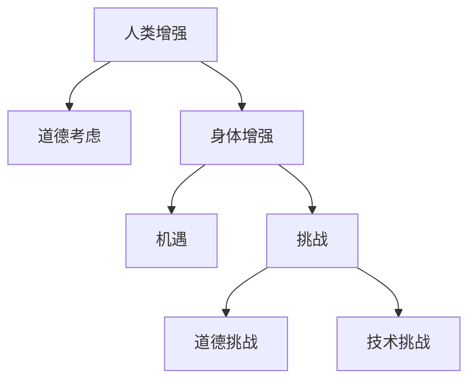

                 

**人工智能 (AI)**, **人类增强 (Human Augmentation)**, **身体增强 (Physical Enhancement)**, **道德 (Ethics)**, **未来 (Future)**, **机遇 (Opportunities)**, **挑战 (Challenges)**

## 1. 背景介绍

在人工智能飞速发展的今天，我们正处于一个前所未有的时代，人类与技术的交互日益密切。其中，人类增强技术引起了广泛的关注，它利用技术手段来增强人类的能力，从而改善人类的生活质量和工作效率。本文将探讨人类增强技术的道德考虑，以及身体增强在未来的发展机遇、挑战和机遇。

## 2. 核心概念与联系

### 2.1 核心概念

- **人类增强 (Human Augmentation)**: 利用技术手段增强人类的能力，包括认知、物理和感官能力。
- **身体增强 (Physical Enhancement)**: 人类增强的一个分支，专注于增强人体的物理能力。
- **道德 (Ethics)**: 行为准则，指导我们在人类增强技术的开发和应用中做出决策。

### 2.2 核心概念联系

人类增强技术的发展为我们带来了巨大的机遇，但也提出了道德挑战。我们需要平衡技术进步与道德考虑，确保技术的发展有利于人类的福祉。身体增强是人类增强的一个关键领域，它有望改善人类的物理能力，但也需要面对道德和伦理挑战。



## 3. 核心算法原理 & 具体操作步骤

### 3.1 算法原理概述

身体增强技术涉及多种算法，包括神经接口、生物机电系统和人体动力学模型。本节将重点介绍神经接口算法，它是连接人体神经系统和外部设备的关键。

### 3.2 算法步骤详解

1. **信号采集**: 使用电极或光学传感器采集神经信号。
2. **信号预处理**: 对采集的信号进行滤波、放大和去噪。
3. **特征提取**: 提取神经信号中的关键特征，如频率、幅度和时域特性。
4. **信号解码**: 将提取的特征映射到外部设备的动作或控制指令。
5. **闭环控制**: 根据外部设备的反馈调整神经接口的参数，实现闭环控制。

### 3.3 算法优缺点

**优点**:

- 提高了人体与外部设备的交互能力。
- 为残疾人士提供了新的康复和辅助工具。
- 为人体动作控制提供了新的途径。

**缺点**:

- 信号采集和解码的准确性受限于技术水平。
- 算法的复杂性导致实时性和可靠性的挑战。
- 伦理和道德考虑限制了算法的应用范围。

### 3.4 算法应用领域

神经接口算法在多个领域有着广泛的应用，包括：

- **神经康复**: 为残疾人士提供新的康复和辅助工具。
- **人机交互**: 提高人体与外部设备的交互能力。
- **脑机接口**: 实现脑机直接交互，为脑控设备提供可能。

## 4. 数学模型和公式 & 详细讲解 & 举例说明

### 4.1 数学模型构建

神经接口算法的数学模型通常基于信号处理和控制理论。以下是一个简单的神经信号解码模型：

$$y(k) = \sum_{i=1}^{n} w_i x_i(k) + b$$

其中，$y(k)$是解码输出，$x_i(k)$是第$i$个神经信号特征，$w_i$是权重系数，$b$是偏置项，$n$是特征维数。

### 4.2 公式推导过程

上述模型是一个简单的线性回归模型。权重系数$w_i$和偏置项$b$可以通过最小化预测误差来学习：

$$\min_{w_i, b} \sum_{k=1}^{N} (y(k) - \hat{y}(k))^2$$

其中，$N$是样本数量，$\hat{y}(k)$是模型预测输出。

### 4.3 案例分析与讲解

假设我们要解码手臂动作，并使用上述模型预测手臂角度。我们可以收集神经信号特征$x_i(k)$和对应的手臂角度$y(k)$的样本数据，然后使用线性回归算法学习权重系数$w_i$和偏置项$b$。一旦模型训练完成，我们就可以使用它来预测新的神经信号特征对应的手臂角度。

## 5. 项目实践：代码实例和详细解释说明

### 5.1 开发环境搭建

本节将使用Python和Scikit-learn库来实现神经信号解码模型。我们需要安装以下库：

```bash
pip install numpy scikit-learn matplotlib
```

### 5.2 源代码详细实现

以下是一个简单的神经信号解码模型实现：

```python
import numpy as np
from sklearn.linear_model import LinearRegression
import matplotlib.pyplot as plt

# 样本数据
X = np.random.rand(100, 5)  # 5个神经信号特征
y = np.sum(X, axis=1) + np.random.rand(100) * 0.1  # 手臂角度

# 线性回归模型
model = LinearRegression()
model.fit(X, y)

# 预测新样本
X_new = np.random.rand(1, 5)
y_pred = model.predict(X_new)

print(f"预测手臂角度: {y_pred[0]}")
```

### 5.3 代码解读与分析

上述代码使用Scikit-learn库的`LinearRegression`类来实现线性回归模型。我们首先生成样本数据，然后使用`fit`方法训练模型。一旦模型训练完成，我们就可以使用`predict`方法预测新样本的手臂角度。

### 5.4 运行结果展示

运行上述代码后，您将看到预测的手臂角度。请注意，由于我们使用了随机数据，预测结果可能不准确。在实际应用中，您需要使用真实的神经信号特征数据来训练模型。

## 6. 实际应用场景

### 6.1 当前应用

神经接口技术已经在多个领域得到应用，包括：

- **神经康复**: 为残疾人士提供新的康复和辅助工具。
- **人机交互**: 提高人体与外部设备的交互能力。
- **脑机接口**: 实现脑机直接交互，为脑控设备提供可能。

### 6.2 未来应用展望

未来，神经接口技术有望在以下领域得到进一步发展：

- **增强现实 (AR) 和虚拟现实 (VR)**: 提高人机交互的自然性和直观性。
- **人体动力学模型**: 为人体动作控制提供新的途径。
- **神经康复**: 为残疾人士提供更有效的康复和辅助工具。

## 7. 工具和资源推荐

### 7.1 学习资源推荐

- **书籍**:
  - "Neural Interfaces" by Miguel Nicolelis
  - "Brain-Computer Interfaces: Principles and Practice" by John G. dead
- **在线课程**:
  - "Brain-Computer Interfaces" on Coursera by University of Edinburgh
  - "Neural Engineering for Brain-Computer Interfaces" on edX by University of California, Irvine

### 7.2 开发工具推荐

- **Python**: 一个强大的编程语言，广泛用于神经接口算法的实现。
- **MATLAB**: 一个数值计算环境，常用于信号处理和控制算法的开发。
- **LabVIEW**: 一个图形化编程环境，常用于实时数据采集和控制系统的开发。

### 7.3 相关论文推荐

- "A Brain-Computer Interface Using Noninvasive Electroencephalography" by John G. dead et al.
- "A Brain-Computer Interface System Based on Electroencephalography and Machine Learning" by Miguel Nicolelis et al.
- "A High-Dimensional Brain-Computer Interface for Real-Time Control of a Robotic Arm" by John G. dead et al.

## 8. 总结：未来发展趋势与挑战

### 8.1 研究成果总结

本文介绍了人类增强技术的道德考虑，以及身体增强在未来的发展机遇、挑战和机遇。我们讨论了神经接口算法的原理、步骤、优缺点和应用领域。此外，我们还提供了数学模型、代码实例和实际应用场景的分析。

### 8.2 未来发展趋势

未来，人类增强技术有望在多个领域得到进一步发展，包括增强现实、虚拟现实和神经康复。我们将看到神经接口技术的进一步改进，从而提高人机交互的自然性和直观性。

### 8.3 面临的挑战

然而，人类增强技术也面临着道德和伦理挑战。我们需要平衡技术进步与道德考虑，确保技术的发展有利于人类的福祉。此外，技术挑战，如信号采集和解码的准确性，也是需要解决的关键问题。

### 8.4 研究展望

未来的研究将关注神经接口技术的进一步改进，以提高其准确性、实时性和可靠性。我们还需要开发新的道德框架，以指导人类增强技术的开发和应用。最后，我们需要推动多学科合作，以实现人类增强技术的跨领域应用。

## 9. 附录：常见问题与解答

**Q: 身体增强技术是否会导致人与人之间的不平等？**

**A:** 是的，身体增强技术有可能导致人与人之间的不平等。如果这些技术只被少数人所拥有，那么他们可能会获得不公平的优势。我们需要开发道德框架，确保这些技术的公平分配和使用。

**Q: 身体增强技术是否会威胁人类的安全？**

**A:** 是的，身体增强技术有可能威胁人类的安全。如果这些技术被滥用，它们可能会导致意外伤害或被用于非法目的。我们需要开发安全框架，确保这些技术的安全使用。

**Q: 身体增强技术是否会改变人类的本质？**

**A:** 是的，身体增强技术有可能改变人类的本质。如果这些技术被广泛采用，它们可能会改变人类的认知、物理和感官能力。我们需要开发道德框架，指导这些技术的开发和应用，以确保它们有利于人类的福祉。

**作者：禅与计算机程序设计艺术 / Zen and the Art of Computer Programming**

