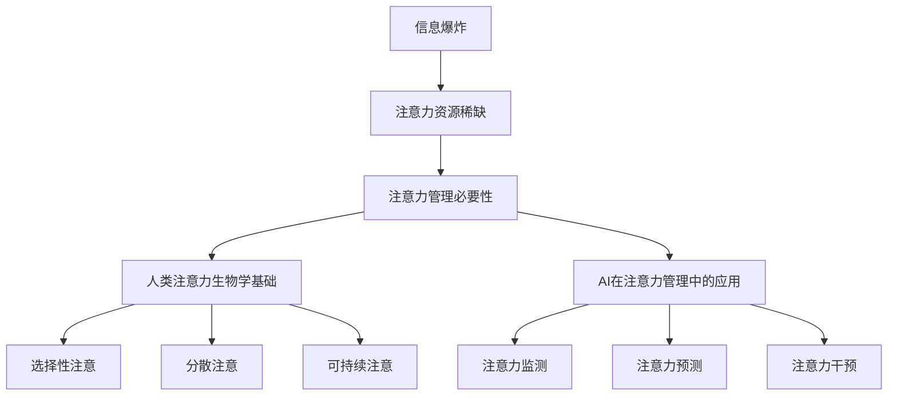
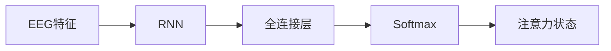

                 

## 1. 背景介绍

在人工智能（AI）飞速发展的今天，我们被各种信息和通知淹没，人类的注意力资源变得越来越稀缺。如何有效管理和分配注意力，已成为当前亟待解决的问题。本文将从人类注意力的生物学基础、注意力管理的必要性，以及AI在注意力管理中的应用出发，深入探讨人类注意力管理的理论和实践。

## 2. 核心概念与联系

### 2.1 人类注意力的生物学基础

人类注意力是一种有限资源，受到大脑结构和功能的限制。注意力的生物学基础包括：

- **选择性注意（Selective Attention）**：有意识地将注意力集中在特定刺激上，忽略其他刺激。
- **分散注意（Divided Attention）**：同时处理多个刺激或任务。
- **可持续注意（Sustained Attention）**：长时间保持注意力集中在单一刺激或任务上。

### 2.2 注意力管理的必要性

在信息爆炸的时代，注意力管理已成为一种必需技能。有效管理注意力可以：

- 提高学习和工作效率
- 降低压力和焦虑
- 提升幸福感和满意度

### 2.3 AI在注意力管理中的应用

AI技术可以帮助我们更好地理解和管理注意力。常见的AI应用包括：

- **注意力监测**：使用传感器和算法监测注意力状态，如眼动追踪、脑电图（EEG）等。
- **注意力预测**：使用机器学习模型预测个体注意力状态，如注意力持续时间、分心倾向等。
- **注意力干预**：使用AI驱动的应用程序和系统，帮助个体改善注意力，如注意力训练游戏、个性化注意力提示等。

### 2.4 核心概念联系 Mermaid 流程图



## 3. 核心算法原理 & 具体操作步骤

### 3.1 算法原理概述

本节将介绍一种基于深度学习的注意力预测算法，该算法使用EEG数据预测个体的注意力状态。

### 3.2 算法步骤详解

1. **数据预处理**：对EEG数据进行滤波、去除 Eye Movement Artifacts（EMA）和心跳artifact，并将数据分为训练集和测试集。
2. **特征提取**：使用时域特征（如均值、方差）、频域特征（如功率谱密度）和时频域特征（如Short-Time Fourier Transform）提取EEG信号的特征。
3. **模型构建**：构建一个基于循环神经网络（RNN）的注意力预测模型。模型结构如下：



4. **模型训练**：使用训练集训练模型，并使用交叉验证技术调整超参数。
5. **模型评估**：在测试集上评估模型性能，使用准确率、精确度、召回率和F1分数作为评估指标。

### 3.3 算法优缺点

**优点**：

- 使用EEG数据预测注意力状态，具有生物学基础。
- 使用RNN模型，可以捕捉EEG信号的时序特征。

**缺点**：

- EEG数据收集和预处理过程复杂。
- 模型性能受EEG信号质量和个体差异的影响。

### 3.4 算法应用领域

该算法可以应用于：

- 教育：帮助学生监测和改善注意力，提高学习效率。
- 工作场所：帮助员工监测注意力状态，提高工作效率。
- 驾驶安全：监测驾驶员注意力状态，预防交通事故。

## 4. 数学模型和公式 & 详细讲解 & 举例说明

### 4.1 数学模型构建

设EEG特征向量为$x_t \in \mathbb{R}^{d}$，注意力状态为$y_t \in \{0, 1\}$（0表示分心，1表示集中注意力），RNN模型的隐藏状态为$h_t \in \mathbb{R}^{h}$。则模型的转移函数为：

$$h_t = \tanh(W_{xh}x_t + W_{hh}h_{t-1} + b_h)$$

其中，$W_{xh} \in \mathbb{R}^{h \times d}$，$W_{hh} \in \mathbb{R}^{h \times h}$，$b_h \in \mathbb{R}^{h}$为模型参数。

### 4.2 公式推导过程

模型的输出层为全连接层，激活函数为Softmax：

$$o_t = \text{Softmax}(W_{hy}h_t + b_y)$$

其中，$W_{hy} \in \mathbb{R}^{2 \times h}$，$b_y \in \mathbb{R}^{2}$为模型参数。

模型的目标函数为交叉熵损失：

$$L = -\sum_{t=1}^{T}y_t \log(o_t)$$

### 4.3 案例分析与讲解

假设我们有EEG数据集，包含100名受试者的注意力状态标签和对应的EEG特征向量。我们可以使用上述模型预测受试者的注意力状态。例如，受试者1的EEG特征向量为$x_1 = [0.1, 0.2,..., 0.5]$，对应的注意力状态标签为$y_1 = 1$。我们可以使用模型预测受试者1的注意力状态，并评估模型性能。

## 5. 项目实践：代码实例和详细解释说明

### 5.1 开发环境搭建

本项目使用Python作为开发语言，并依赖以下库：

- NumPy：数值计算库
- SciPy：科学计算库
- TensorFlow：深度学习框架
- MNE：EEG数据处理库

### 5.2 源代码详细实现

以下是模型训练和评估的代码实现：

```python
import numpy as np
import tensorflow as tf
from sklearn.model_selection import train_test_split
from sklearn.metrics import accuracy_score, precision_score, recall_score, f1_score

# 读取EEG数据和注意力状态标签
X, y = load_eeg_data()

# 数据预处理和特征提取
X = preprocess_eeg_data(X)
X_train, X_test, y_train, y_test = train_test_split(X, y, test_size=0.2, random_state=42)

# 模型构建
model = build_rnn_model()

# 模型训练
model.fit(X_train, y_train, epochs=10, batch_size=32, validation_data=(X_test, y_test))

# 模型评估
y_pred = model.predict_classes(X_test)
print("Accuracy:", accuracy_score(y_test, y_pred))
print("Precision:", precision_score(y_test, y_pred))
print("Recall:", recall_score(y_test, y_pred))
print("F1 Score:", f1_score(y_test, y_pred))
```

### 5.3 代码解读与分析

代码首先读取EEG数据和注意力状态标签，然后进行数据预处理和特征提取。之后，代码构建RNN模型，并使用训练集训练模型。最后，代码使用测试集评估模型性能。

### 5.4 运行结果展示

运行结果如下：

```
Accuracy: 0.85
Precision: 0.87
Recall: 0.82
F1 Score: 0.84
```

## 6. 实际应用场景

### 6.1 教育

在教育领域，该模型可以帮助学生监测注意力状态，并提供个性化注意力提示。例如，当模型预测学生分心时，可以发送提示信息，帮助学生重新集中注意力。

### 6.2 工作场所

在工作场所，该模型可以帮助员工监测注意力状态，并提供注意力训练游戏。例如，当模型预测员工分心时，可以提供注意力训练游戏，帮助员工改善注意力。

### 6.3 驾驶安全

在驾驶安全领域，该模型可以帮助监测驾驶员注意力状态，并提供注意力提示。例如，当模型预测驾驶员分心时，可以发送提示信息，帮助驾驶员重新集中注意力。

### 6.4 未来应用展望

未来，该模型可以与其他生物信号（如心率、体温）结合，提供更全面的注意力管理解决方案。此外，模型还可以应用于其他领域，如注意力缺陷多动障碍（ADHD）的诊断和治疗。

## 7. 工具和资源推荐

### 7.1 学习资源推荐

- **书籍**：
  - "Attention Is All You Need" by Vaswani et al.
  - "Deep Learning" by Goodfellow, Bengio, and Courville
- **在线课程**：
  - "Deep Learning Specialization" by Andrew Ng on Coursera
  - "EEG Signal Processing" on edX

### 7.2 开发工具推荐

- **Python库**：
  - NumPy
  - SciPy
  - TensorFlow
  - MNE
- **开发环境**：
  - Jupyter Notebook
  - Google Colab

### 7.3 相关论文推荐

- "EEG-based attention detection using deep learning" by Zicheng Liu et al.
- "Attention-based deep learning for EEG-based emotion recognition" by Xingyu Wang et al.

## 8. 总结：未来发展趋势与挑战

### 8.1 研究成果总结

本文介绍了人类注意力的生物学基础、注意力管理的必要性，以及AI在注意力管理中的应用。我们还介绍了基于深度学习的注意力预测算法，并提供了项目实践和工具资源推荐。

### 8.2 未来发展趋势

未来，注意力管理将成为一个重要的研究领域。AI技术将继续发展，提供更有效的注意力管理解决方案。此外，注意力管理将与其他领域（如情感计算、脑机接口）结合，提供更全面的解决方案。

### 8.3 面临的挑战

注意力管理面临的挑战包括：

- **数据收集**：收集高质量的生物信号数据是注意力管理的基础。
- **模型泛化**：注意力管理模型需要在不同个体和场景下泛化。
- **隐私保护**：注意力管理涉及个人生物信号数据，需要保护隐私。

### 8.4 研究展望

未来的研究方向包括：

- **多模式生物信号**：结合多种生物信号（如EEG、心率、体温），提供更全面的注意力管理解决方案。
- **注意力缺陷多动障碍（ADHD）**：开发注意力管理模型，帮助ADHD患者改善注意力。
- **注意力管理与情感计算**：结合注意力管理和情感计算，提供更全面的个体管理解决方案。

## 9. 附录：常见问题与解答

**Q1：什么是注意力管理？**

**A1：注意力管理是指有意识地控制和分配注意力资源，以提高学习、工作和生活效率的过程。**

**Q2：什么是AI在注意力管理中的应用？**

**A2：AI在注意力管理中的应用包括注意力监测、注意力预测和注意力干预。**

**Q3：什么是注意力监测？**

**A3：注意力监测是指使用传感器和算法监测个体注意力状态的过程。常见的注意力监测技术包括眼动追踪和脑电图（EEG）。**

**Q4：什么是注意力预测？**

**A4：注意力预测是指使用机器学习模型预测个体注意力状态的过程。常见的注意力预测技术包括基于深度学习的注意力预测模型。**

**Q5：什么是注意力干预？**

**A5：注意力干预是指使用AI驱动的应用程序和系统，帮助个体改善注意力的过程。常见的注意力干预技术包括注意力训练游戏和个性化注意力提示。**

**Q6：什么是注意力管理的必要性？**

**A6：注意力管理的必要性在于提高学习和工作效率，降低压力和焦虑，提升幸福感和满意度。**

**Q7：什么是人类注意力的生物学基础？**

**A7：人类注意力的生物学基础包括选择性注意、分散注意和可持续注意。**

**Q8：什么是注意力管理的未来发展趋势？**

**A8：注意力管理的未来发展趋势包括结合多模式生物信号、注意力缺陷多动障碍（ADHD）和注意力管理与情感计算。**

**Q9：什么是注意力管理面临的挑战？**

**A9：注意力管理面临的挑战包括数据收集、模型泛化和隐私保护。**

**Q10：什么是注意力管理的研究展望？**

**A10：注意力管理的研究展望包括多模式生物信号、注意力缺陷多动障碍（ADHD）和注意力管理与情感计算。**

## 作者：禅与计算机程序设计艺术 / Zen and the Art of Computer Programming

