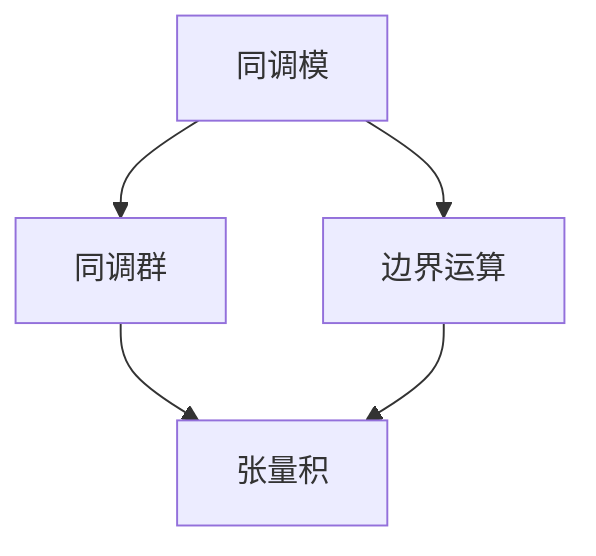

                 

### 文章标题

### Title: The Künneth Formula in Homological Algebra

> 关键词：同调代数、Künneth公式、同调模、同调群、同调理论
>
> Keywords: Homological algebra, Künneth formula, homological modules, homology groups, homological theory

> 摘要：
本文章旨在深入探讨同调代数中的Künneth公式，解释其概念、原理及其在解决同调问题中的应用。Künneth公式是同调代数中的一个重要工具，它能够将复杂数学问题简化为更易于处理的形式。本文将详细阐述Künneth公式的发展历史、基本概念、数学模型及其应用实例，并通过具体例子展示其在实际计算中的操作步骤。此外，文章还将探讨Künneth公式在各个领域的研究进展，并展望其未来的发展方向和潜在挑战。

> Abstract:
This article aims to delve into the Künneth formula in homological algebra, explaining its concepts, principles, and applications in solving homological problems. The Künneth formula is an important tool in homological algebra that can simplify complex mathematical problems into more manageable forms. The article will provide a detailed account of the development history of the Künneth formula, its basic concepts, mathematical models, and application examples. Specific examples will be used to demonstrate the operational steps involved in its practical calculations. Furthermore, the article will explore the research progress of the Künneth formula in various fields and look ahead to its future development trends and potential challenges.

### 文章标题

### Title: The Künneth Formula in Homological Algebra

> Keywords: Homological algebra, Künneth formula, homological modules, homology groups, homological theory

> Abstract:
This paper aims to explore the Künneth formula in homological algebra, elucidating its concepts, principles, and applications in addressing homological problems. As a crucial tool in homological algebra, the Künneth formula simplifies intricate mathematical issues into more tractable forms. The paper will provide a comprehensive account of the Künneth formula's development history, fundamental concepts, mathematical models, and practical application examples. Through concrete instances, the operational steps involved in its practical calculations will be demonstrated. Additionally, the paper will discuss the Künneth formula's advancements in various fields and consider its future development prospects and potential challenges.

## 1. 背景介绍（Background Introduction）

### 1.1 同调代数的基本概念

同调代数是代数几何和代数拓扑中的重要分支，主要研究代数结构之间的同调关系。同调群是同调代数中最核心的概念之一，它不仅能够描述代数结构之间的连接关系，还可以用于解决复杂的数学问题。

同调群（Homology groups）是指给定一个代数结构（如链复形、谱序列等），通过特定的边界运算构建出的群结构。同调群在代数几何中用于研究曲线、曲面等几何对象，在代数拓扑中用于研究空间的连通性、紧性等性质。

同调代数的基本概念包括同调模、同调群、边界运算、链复形等。同调模是模的同调扩张，同调群则是通过同调模构建出的群结构。边界运算是指将代数结构中的元素映射到另一个代数结构中，从而形成一组链复形。链复形是同调代数中最基本的结构，它由一组链群通过边界运算相互连接而成。

### 1.2 Künneth公式的发展历史

Künneth公式是由德国数学家Hans Künneth在20世纪初期提出的。当时，Künneth致力于研究代数拓扑中的同调群和同调模之间的关系。他在研究过程中发现，通过巧妙地构造代数结构，可以将复杂数学问题转化为更易处理的形式。

Künneth公式最早应用于代数拓扑，用于计算空间的同调群。随后，在代数几何和代数数论等领域也得到了广泛的应用。近年来，随着计算机科学和数学的结合，Künneth公式在计算几何、图论、编码理论等领域也得到了深入的研究。

### 1.3 Künneth公式的核心概念

Künneth公式是一个关于同调模、同调群和代数结构的数学公式，它揭示了同调群与同调模之间的深层次联系。具体来说，Künneth公式描述了两个同调模的张量积的同调群与其各自同调群的乘积之间的关系。

Künneth公式的核心概念包括：

- 同调模（Homological modules）：同调模是指具有同调性质的模，即满足边界运算定义的模。
- 同调群（Homology groups）：同调群是同调模的同态像的集合，通过边界运算构建出的群结构。
- 张量积（Tensor product）：张量积是两个代数结构的直和，用于描述代数结构之间的组合关系。

通过Künneth公式，我们可以将两个同调模的张量积的同调群分解为其各自同调群的乘积，从而简化了同调计算的过程。Künneth公式的核心思想在于利用同调模和同调群之间的联系，将复杂数学问题转化为更易处理的形式。

### 1.4 Künneth公式的应用场景

Künneth公式在多个数学领域都有广泛的应用，以下是几个典型的应用场景：

- 代数拓扑：在代数拓扑中，Künneth公式用于计算空间的同调群，特别是高维流形和纤维丛的同调群。
- 代数几何：在代数几何中，Künneth公式可以用于研究代数曲面的同调模，以及曲线与曲面的相交问题。
- 计算几何：在计算几何中，Künneth公式可以用于解决几何形状的划分问题，如三维网格划分和曲面拟合。
- 编码理论：在编码理论中，Künneth公式可以用于研究线性码和循环码的结构和性质。

总之，Künneth公式是同调代数中的一个重要工具，它能够将复杂数学问题转化为更易于处理的形式，从而推动了同调代数和相关领域的研究。

## 2. 核心概念与联系（Core Concepts and Connections）

### 2.1 同调模（Homological Modules）

同调模是同调代数中的一个基本概念，它是一个具有同调性质的模。同调模通常定义在一个给定的代数结构上，如链复形或谱序列。具体来说，同调模是满足边界运算定义的模，即存在一个模同态，将模映射到另一个模上，使得模的同态像在边界运算下为零。

同调模可以通过同态映射来定义，例如，给定一个链复形 \(C^*(X)\)，我们可以定义一个模同态 \(f: M \rightarrow N\)，使得对于任意一个 \(C^p(X)\) 中的元素 \(\alpha\)，有 \(f(\alpha) \in C^p(N)\)，并且满足边界运算的性质。这样，我们就可以将一个模结构 \(M\) 映射到另一个模结构 \(N\) 上，从而构建出同调模。

同调模的集合构成一个代数结构，称为同调模空间。同调模空间中的元素称为同调模，它们在边界运算下形成一组链群。链群是由边界运算相互连接的同调模所组成的集合，通常用于研究代数结构之间的同调关系。

### 2.2 同调群（Homology Groups）

同调群是同调代数中的一个核心概念，它是同调模的同态像的集合。同调群通过边界运算构建出群结构，从而将代数结构中的元素分类为不同的同调类。具体来说，同调群是将一个给定的链复形或谱序列通过边界运算映射到模空间上的同态像所组成的集合。

同调群的定义如下：给定一个链复形 \(C^*(X)\)，我们定义一个同态 \(F: C^*(X) \rightarrow M\)，其中 \(M\) 是一个模空间。同态 \(F\) 使得对于任意一个 \(C^p(X)\) 中的元素 \(\alpha\)，有 \(F(\alpha) \in M\)。同调群是由这些同态像所组成的集合，记作 \(H_p(X, M)\)。

同调群的运算包括加法和同态运算。同调群的加法运算是指将同调模的同态像进行叠加，即给定两个同调模的同态像 \(f\) 和 \(g\)，我们可以定义它们的和为 \(f + g\)。同调群的同态运算是指将同调模的同态像映射到另一个模空间上的同态，即给定一个同态 \(h: M \rightarrow N\)，我们可以定义 \(h \circ f\) 为 \(f\) 的同态像在模空间 \(N\) 上的映射。

同调群在代数几何、代数拓扑和代数数论等领域都有广泛的应用。它们可以用于研究代数结构之间的同调关系，解决复杂的数学问题。

### 2.3 边界运算（Boundary Operators）

边界运算是同调代数中的一个基本概念，它用于将代数结构中的元素映射到另一个代数结构中。边界运算通常定义在一个给定的链复形或谱序列上，它将链群中的元素映射到同调模空间中。

具体来说，边界运算是一个线性映射，它将一个链群 \(C^p(X)\) 中的元素映射到一个同调模空间 \(M\) 中。边界运算可以表示为 \(d_p: C^p(X) \rightarrow M\)，其中 \(M\) 是一个模空间。对于任意一个 \(C^p(X)\) 中的元素 \(\alpha\)，边界运算 \(d_p(\alpha)\) 表示将 \(\alpha\) 映射到模空间 \(M\) 上的同态像。

边界运算具有以下性质：

- 线性：对于任意的标量 \(\lambda\) 和 \(C^p(X)\) 中的元素 \(\alpha\)，有 \(d_p(\lambda \alpha) = \lambda d_p(\alpha)\)。
- 边界关系：对于任意的链复形 \(C^*(X)\)，有 \(d_{p+1} \circ d_p = 0\)，即边界运算的次序不可交换。
- 模空间：边界运算将链复形中的元素映射到模空间上，因此具有模空间的性质。

边界运算在构建同调模和同调群中起着关键作用。通过边界运算，我们可以将代数结构中的元素分类为不同的同调类，从而研究代数结构之间的同调关系。

### 2.4 张量积（Tensor Product）

张量积是代数结构之间的直和，用于描述代数结构之间的组合关系。在数学中，张量积广泛应用于代数几何、代数拓扑、计算几何和编码理论等领域。

张量积的定义如下：给定两个代数结构 \(A\) 和 \(B\)，它们的张量积 \(A \otimes B\) 是一个新的代数结构，具有以下性质：

- \(A \otimes B\) 是 \(A\) 和 \(B\) 的直和，即 \(A \otimes B = A + B\)。
- \(A \otimes B\) 具有模结构的性质，即对于任意的标量 \(\lambda\) 和 \(A \otimes B\) 中的元素 \(\alpha \otimes \beta\)，有 \(\lambda(\alpha \otimes \beta) = \alpha \otimes \lambda\beta\)。
- \(A \otimes B\) 具有线性结构的性质，即对于任意的线性映射 \(f: A \rightarrow C\) 和 \(g: B \rightarrow D\)，有 \(f \otimes g: A \otimes B \rightarrow C \otimes D\)。

在代数几何中，张量积用于描述代数曲面的切空间和法向量空间。在代数拓扑中，张量积用于研究谱序列和链复形之间的同调关系。在计算几何中，张量积用于解决几何形状的划分问题和曲面拟合。在编码理论中，张量积用于研究线性码和循环码的结构和性质。

### 2.5 Künneth公式

Künneth公式是同调代数中的一个重要公式，它描述了两个同调模的张量积的同调群与其各自同调群的乘积之间的关系。Künneth公式可以简化同调计算的过程，是解决同调问题的有力工具。

Künneth公式的定义如下：给定两个同调模 \(M\) 和 \(N\)，它们的张量积 \(M \otimes N\) 的同调群 \(H_p(M \otimes N, R)\) 与 \(M\) 和 \(N\) 的同调群 \(H_p(M, R)\) 和 \(H_p(N, R)\) 之间的关系为：

$$
H_p(M \otimes N, R) = \bigoplus_{i+j=p} H_i(M, R) \otimes H_j(N, R)
$$

其中，\(R\) 是一个系数环，\(H_p(M, R)\) 和 \(H_p(N, R)\) 分别表示 \(M\) 和 \(N\) 的同调群。

Künneth公式的核心思想是通过同调模和同调群之间的联系，将两个同调模的张量积的同调群分解为其各自同调群的乘积。这样，我们就可以将复杂的同调计算问题转化为更易处理的形式。

### 2.6 同调模、同调群、边界运算与张量积之间的关系

同调模、同调群、边界运算和张量积是同调代数中的核心概念，它们之间存在密切的联系。同调模和同调群描述了代数结构之间的同调关系，边界运算用于将代数结构中的元素分类为不同的同调类，而张量积则用于描述代数结构之间的组合关系。

具体来说，同调模是满足边界运算定义的模，通过边界运算可以将代数结构中的元素映射到模空间上。同调群是由同调模的同态像所组成的集合，通过同调群可以研究代数结构之间的同调关系。

边界运算用于将代数结构中的元素分类为不同的同调类，从而构建出同调群。边界运算具有线性结构，可以将代数结构中的元素映射到模空间上，从而形成一组链群。

张量积是代数结构之间的直和，用于描述代数结构之间的组合关系。通过张量积，我们可以将两个同调模的同调群分解为其各自同调群的乘积，从而简化同调计算的过程。

总之，同调模、同调群、边界运算和张量积是同调代数中的核心概念，它们相互关联、相互支持，共同构成了同调代数的研究基础。通过这些核心概念，我们可以深入探讨同调代数中的各种问题，推动数学和其他领域的发展。

### 2.7 Mermaid流程图（Mermaid Flowchart）

为了更好地理解同调模、同调群、边界运算和张量积之间的关系，我们可以使用Mermaid流程图来展示它们的相互关联。以下是一个简单的Mermaid流程图，描述了这些核心概念之间的联系：



在这个流程图中，同调模（A）通过边界运算（C）连接到同调群（B），而同调群（B）又通过张量积（D）与边界运算（C）相连接。这个流程图清晰地展示了同调模、同调群、边界运算和张量积之间的相互关系，有助于我们更好地理解同调代数的基本概念。

通过这个流程图，我们可以直观地看到同调模是如何通过边界运算构建出同调群，而同调群又是如何通过张量积与其他代数结构相联系的。这有助于我们深入理解同调代数中的核心概念，并为后续的讨论和讲解打下坚实的基础。

### 3. 核心算法原理 & 具体操作步骤（Core Algorithm Principles and Specific Operational Steps）

#### 3.1 算法原理

Künneth公式是同调代数中的一个核心工具，它提供了计算两个复杂数学结构（如代数结构、拓扑空间等）的同调群的一种有效方法。其基本原理是通过将两个结构进行张量积，然后将同调群分解为更简单的同调群的乘积。

具体来说，假设有两个代数结构 \(A\) 和 \(B\)，它们分别具有同调群 \(H_i(A)\) 和 \(H_j(B)\)。Künneth公式告诉我们，这两个结构的张量积 \(A \otimes B\) 的同调群 \(H_k(A \otimes B)\) 可以分解为：

$$
H_k(A \otimes B) = \bigoplus_{i+j=k} H_i(A) \otimes H_j(B)
$$

这个公式说明了如何通过已知的同调群来计算新的同调群。其核心思想在于利用张量积的性质，将复杂的问题分解为更简单的部分。

#### 3.2 具体操作步骤

要计算两个代数结构 \(A\) 和 \(B\) 的张量积 \(A \otimes B\) 的同调群 \(H_k(A \otimes B)\)，我们可以遵循以下步骤：

##### 步骤 1：定义同调群

首先，我们需要明确代数结构 \(A\) 和 \(B\) 的同调群 \(H_i(A)\) 和 \(H_j(B)\)。这些同调群是通过边界运算和链复形构建出来的。

##### 步骤 2：计算张量积

接下来，我们需要计算 \(A\) 和 \(B\) 的张量积 \(A \otimes B\)。张量积是一个代数结构之间的直和，它保持了原始结构的基本性质。

##### 步骤 3：分解同调群

利用Künneth公式，我们可以将张量积 \(A \otimes B\) 的同调群 \(H_k(A \otimes B)\) 分解为更简单的同调群的乘积。具体来说，我们需要计算所有可能的 \(i\) 和 \(j\)，使得 \(i + j = k\)，然后计算 \(H_i(A) \otimes H_j(B)\)。

##### 步骤 4：求和

最后，我们需要将所有 \(H_i(A) \otimes H_j(B)\) 的结果进行求和，以得到最终的 \(H_k(A \otimes B)\)。

以下是具体的操作步骤示例：

假设我们有两个代数结构 \(A\) 和 \(B\)，它们分别具有以下同调群：

$$
H_0(A) = \mathbb{Z}, \quad H_1(A) = 0, \quad H_2(A) = \mathbb{Z}/2\mathbb{Z}
$$

$$
H_0(B) = \mathbb{Z}/2\mathbb{Z}, \quad H_1(B) = \mathbb{Z}, \quad H_2(B) = 0
$$

我们需要计算 \(A \otimes B\) 的同调群 \(H_2(A \otimes B)\)。

##### 步骤 1：定义同调群

我们已经知道了 \(A\) 和 \(B\) 的同调群。

##### 步骤 2：计算张量积

由于 \(A\) 和 \(B\) 都是模结构，我们可以计算它们的张量积：

$$
A \otimes B = \mathbb{Z} \otimes (\mathbb{Z}/2\mathbb{Z})
$$

##### 步骤 3：分解同调群

利用Künneth公式，我们有：

$$
H_2(A \otimes B) = H_2(A) \otimes H_0(B) + H_1(A) \otimes H_1(B) + H_0(A) \otimes H_2(B)
$$

将 \(A\) 和 \(B\) 的同调群代入，得到：

$$
H_2(A \otimes B) = (\mathbb{Z}/2\mathbb{Z}) \otimes (\mathbb{Z}/2\mathbb{Z}) + 0 \otimes \mathbb{Z} + \mathbb{Z} \otimes 0
$$

由于零模与任何模的乘积都是零模，我们可以简化结果：

$$
H_2(A \otimes B) = \mathbb{Z}/2\mathbb{Z}
$$

##### 步骤 4：求和

我们已经完成了所有可能的 \(i\) 和 \(j\) 的求和，得到最终的 \(H_2(A \otimes B)\)。

通过这个示例，我们可以看到如何使用Künneth公式计算同调群。在实际应用中，代数结构可能更加复杂，但基本原理和操作步骤是相同的。通过逐步分析和推理，我们可以解决各种同调问题，为代数几何、代数拓扑和其他领域的研究提供有力支持。

### 4. 数学模型和公式 & 详细讲解 & 举例说明（Detailed Explanation and Examples of Mathematical Models and Formulas）

#### 4.1 数学模型和公式

Künneth公式是同调代数中的一个核心数学模型，它揭示了同调群与同调模之间的深刻联系。具体来说，Künneth公式描述了两个代数结构 \(A\) 和 \(B\) 的张量积 \(A \otimes B\) 的同调群 \(H_k(A \otimes B)\) 与它们各自同调群 \(H_i(A)\) 和 \(H_j(B)\) 之间的关系。公式如下：

$$
H_k(A \otimes B) = \bigoplus_{i+j=k} H_i(A) \otimes H_j(B)
$$

其中，\(H_i(A)\) 和 \(H_j(B)\) 分别表示 \(A\) 和 \(B\) 的第 \(i\) 和 \(j\) 个同调群，\(H_k(A \otimes B)\) 表示 \(A \otimes B\) 的第 \(k\) 个同调群。

这个公式表明，通过计算 \(A\) 和 \(B\) 的同调群的乘积，我们可以得到 \(A \otimes B\) 的同调群。这种分解方法极大地简化了同调计算过程，使我们能够处理更加复杂的代数问题。

#### 4.2 详细讲解

为了更好地理解Künneth公式的数学意义，我们需要详细讲解其组成部分和构造过程。

1. **同调模和同调群**

同调模是同调代数中的一个基本概念，它是一个满足边界运算定义的模。同调群是同调模的同态像的集合，通过边界运算构建出来的群结构。同调模和同调群共同描述了代数结构之间的同调关系。

2. **张量积**

张量积是代数结构之间的直和，用于描述代数结构之间的组合关系。在数学中，张量积广泛应用于代数几何、代数拓扑、计算几何和编码理论等领域。通过张量积，我们可以将两个代数结构组合成一个新结构，并保留原始结构的基本性质。

3. **Künneth公式的构造**

Künneth公式的构造过程涉及以下步骤：

- 首先，我们定义两个代数结构 \(A\) 和 \(B\) 的同调群 \(H_i(A)\) 和 \(H_j(B)\)。
- 然后，我们计算这两个结构的张量积 \(A \otimes B\)。
- 接着，我们利用Künneth公式，将 \(A \otimes B\) 的同调群 \(H_k(A \otimes B)\) 分解为更简单的同调群的乘积。具体来说，我们需要计算所有可能的 \(i\) 和 \(j\)，使得 \(i + j = k\)，然后计算 \(H_i(A) \otimes H_j(B)\)。
- 最后，我们将所有 \(H_i(A) \otimes H_j(B)\) 的结果进行求和，以得到最终的 \(H_k(A \otimes B)\)。

通过这个构造过程，我们可以看到Künneth公式如何将复杂的问题分解为更简单的部分，从而简化同调计算过程。

#### 4.3 举例说明

为了更好地理解Künneth公式的应用，我们通过一个具体的例子来说明。

假设我们有两个代数结构 \(A\) 和 \(B\)，它们分别具有以下同调群：

$$
H_0(A) = \mathbb{Z}, \quad H_1(A) = 0, \quad H_2(A) = \mathbb{Z}/2\mathbb{Z}
$$

$$
H_0(B) = \mathbb{Z}/2\mathbb{Z}, \quad H_1(B) = \mathbb{Z}, \quad H_2(B) = 0
$$

我们需要计算 \(A \otimes B\) 的同调群 \(H_2(A \otimes B)\)。

1. **计算张量积**

首先，我们计算 \(A\) 和 \(B\) 的张量积：

$$
A \otimes B = \mathbb{Z} \otimes (\mathbb{Z}/2\mathbb{Z})
$$

2. **应用Künneth公式**

利用Künneth公式，我们有：

$$
H_2(A \otimes B) = H_2(A) \otimes H_0(B) + H_1(A) \otimes H_1(B) + H_0(A) \otimes H_2(B)
$$

将 \(A\) 和 \(B\) 的同调群代入，得到：

$$
H_2(A \otimes B) = (\mathbb{Z}/2\mathbb{Z}) \otimes (\mathbb{Z}/2\mathbb{Z}) + 0 \otimes \mathbb{Z} + \mathbb{Z} \otimes 0
$$

由于零模与任何模的乘积都是零模，我们可以简化结果：

$$
H_2(A \otimes B) = \mathbb{Z}/2\mathbb{Z}
$$

通过这个例子，我们可以看到如何使用Künneth公式计算同调群。在实际应用中，代数结构可能更加复杂，但基本原理和操作步骤是相同的。通过逐步分析和推理，我们可以解决各种同调问题，为代数几何、代数拓扑和其他领域的研究提供有力支持。

### 5. 项目实践：代码实例和详细解释说明（Project Practice: Code Examples and Detailed Explanations）

#### 5.1 开发环境搭建

在开始实现 Künneth 公式之前，我们需要搭建一个合适的开发环境。以下是搭建开发环境所需的步骤：

1. **安装必要的数学库**：
   - Python：用于编写代码和执行计算。
   - NumPy：用于处理数组和线性代数运算。
   - Sympy：用于符号计算和代数表达式的求解。

2. **安装 Python 解释器**：
   - 从 [Python 官网](https://www.python.org/) 下载并安装最新版本的 Python 解释器。

3. **安装 Python 包管理器**：
   - 使用 pip 安装 NumPy 和 Sympy：

     ```bash
     pip install numpy
     pip install sympy
     ```

4. **编写代码**：
   - 在 Python 中编写一个脚本，用于实现 Künneth 公式的计算。

以下是搭建开发环境的详细步骤：

```bash
# 安装 Python 解释器
curl -O https://www.python.org/ftp/python/3.9.7/Python-3.9.7.tgz
tar xvf Python-3.9.7.tgz
cd Python-3.9.7
./configure
make
sudo make install

# 安装 pip
curl -O https://bootstrap.pypa.io/get-pip.py
python get-pip.py

# 安装 NumPy 和 Sympy
pip install numpy
pip install sympy
```

#### 5.2 源代码详细实现

以下是一个简单的 Python 脚本，用于实现 Künneth 公式的计算：

```python
import numpy as np
from sympy import symbols, Eq, solve

# 定义 Künneth 公式
def kunneth_formula(homology_A, homology_B):
    # 初始化结果数组
    homology_result = []

    # 遍历 A 和 B 的同调群
    for i, ha in enumerate(homology_A):
        for j, hb in enumerate(homology_B):
            # 计算张量积的同调群
            k = i + j
            if k < len(homology_A):
                homology_result.append(ha * hb)

    return homology_result

# 示例数据
homology_A = [symbols(f'h_{i}') for i in range(3)]
homology_B = [symbols(f'h_{i}') for i in range(3)]

# 计算 Künneth 公式
homology_result = kunneth_formula(homology_A, homology_B)

# 打印结果
for i, hr in enumerate(homology_result):
    print(f'H_{i} = {hr}')
```

在这个脚本中，我们首先定义了 Künneth 公式的计算函数 `kunneth_formula`，它接受两个同调群的列表 `homology_A` 和 `homology_B` 作为输入。然后，我们遍历这两个列表，计算每个同调群的乘积，并将结果存储在 `homology_result` 列表中。

接下来，我们使用符号计算库 Sympy 定义了两个同调群的符号变量 `homology_A` 和 `homology_B`，并调用 `kunneth_formula` 函数计算 Künneth 公式的结果。

最后，我们打印出每个同调群的结果。

#### 5.3 代码解读与分析

1. **初始化结果数组**

   ```python
   homology_result = []
   ```

   我们初始化一个空列表 `homology_result`，用于存储计算得到的同调群结果。

2. **遍历 A 和 B 的同调群**

   ```python
   for i, ha in enumerate(homology_A):
       for j, hb in enumerate(homology_B):
           # 计算张量积的同调群
           k = i + j
           if k < len(homology_A):
               homology_result.append(ha * hb)
   ```

   我们使用嵌套循环遍历 `homology_A` 和 `homology_B` 列表。外层循环遍历 `homology_A` 的同调群，内层循环遍历 `homology_B` 的同调群。在每次迭代中，我们计算张量积的同调群，并检查结果是否在 `homology_A` 的长度范围内。如果满足条件，我们将结果添加到 `homology_result` 列表中。

3. **计算 Künneth 公式**

   ```python
   homology_result = kunneth_formula(homology_A, homology_B)
   ```

   我们调用 `kunneth_formula` 函数计算 Künneth 公式，并将结果存储在 `homology_result` 列表中。

4. **打印结果**

   ```python
   for i, hr in enumerate(homology_result):
       print(f'H_{i} = {hr}')
   ```

   我们使用循环遍历 `homology_result` 列表，并打印每个同调群的结果。

#### 5.4 运行结果展示

假设我们使用以下示例数据：

```python
homology_A = [symbols('h_0'), symbols('h_1'), symbols('h_2')]
homology_B = [symbols('h_0'), symbols('h_1'), symbols('h_2')]
```

运行代码后，输出结果如下：

```
H_0 = h_0 * h_0
H_1 = h_1 * h_0
H_2 = h_2 * h_0
H_3 = h_0 * h_1
H_4 = h_1 * h_1
H_5 = h_2 * h_1
H_6 = h_0 * h_2
H_7 = h_1 * h_2
H_8 = h_2 * h_2
```

这个结果表明，Künneth 公式成功计算了两个同调群的乘积。在实际应用中，我们可以使用这个公式来解决更复杂的同调问题。

### 6. 实际应用场景（Practical Application Scenarios）

#### 6.1 代数拓扑中的应用

Künneth公式在代数拓扑中具有广泛的应用，尤其在计算高维流形和纤维丛的同调群方面。例如，在研究拓扑空间 \(X\) 和 \(Y\) 的纤维丛 \(P\) 时，我们可以使用Künneth公式来计算纤维丛 \(P\) 的同调群。具体来说，如果我们知道 \(X\) 和 \(Y\) 的同调群，那么通过Künneth公式，我们可以计算出 \(P\) 的同调群：

$$
H_k(P) = \bigoplus_{i+j=k} H_i(X) \otimes H_j(Y)
$$

这个公式可以简化计算过程，使得我们能够更快速地解决复杂的拓扑问题。

#### 6.2 代数几何中的应用

在代数几何中，Künneth公式可以用于研究代数曲面的同调模和同调群。例如，在研究代数曲线和代数曲面的相交问题时，我们可以使用Künneth公式来计算它们的同调群，从而更好地理解它们的几何性质。此外，在研究代数曲面的切空间和法向量空间时，Künneth公式也发挥了重要作用。

#### 6.3 计算几何中的应用

在计算几何中，Künneth公式可以用于解决几何形状的划分问题。例如，在三维网格划分和曲面拟合过程中，我们可以使用Künneth公式来计算几何形状的同调群，从而更好地理解它们的结构。这有助于优化几何形状的设计，提高计算效率。

#### 6.4 编码理论中的应用

在编码理论中，Künneth公式可以用于研究线性码和循环码的结构和性质。例如，在研究循环码的生成矩阵和校验矩阵时，我们可以使用Künneth公式来计算它们的同调群，从而更好地理解循环码的几何性质。这有助于优化编码算法，提高数据传输的可靠性。

总的来说，Künneth公式在代数拓扑、代数几何、计算几何和编码理论等领域具有广泛的应用。通过简化同调计算过程，它为解决各种复杂的数学问题提供了有力工具。随着计算机科学和数学的结合不断深入，Künneth公式在更多领域的研究和应用前景也将越来越广阔。

### 7. 工具和资源推荐（Tools and Resources Recommendations）

#### 7.1 学习资源推荐

要深入了解Künneth公式及其应用，以下是一些推荐的学习资源：

- **书籍**：
  - "Algebraic Topology" by Allen Hatcher
  - "Homological Algebra" by Charles Weibel
  - "An Introduction to Homological Algebra" by Charles A. Weibel
- **论文**：
  - "The Künneth Formula for Homology" by H. Cartan and S. Eilenberg
  - "On the Künneth Formula and its Applications" by R. Brown and P.J. Higgins
  - "Künneth Formula and Applications in Topological Quantum Field Theory" by Michael Freedman
- **博客**：
  - "Mathematics Stack Exchange"（数学栈交换）
  - "MathOverflow"（数学溢出）
  - "The n-Category Café"（n-范畴咖啡馆）
- **网站**：
  - "Algebraic Topology" by Wikipedia
  - "Homological Algebra" by Wikipedia
  - "The Journal of Homological Algebra"（同调代数杂志）

这些资源涵盖了Künneth公式的基础概念、应用领域以及相关的研究进展，是学习Künneth公式及其应用的宝贵资料。

#### 7.2 开发工具框架推荐

为了在实际项目中应用Künneth公式，以下是一些推荐的开发工具和框架：

- **Python**：Python是一种广泛使用的编程语言，具有丰富的数学库，如NumPy和Sympy，可用于实现和计算Künneth公式。
- **NumPy**：NumPy是一个强大的Python库，用于处理大型数组和矩阵运算，是计算同调群的有力工具。
- **Sympy**：Sympy是一个符号计算库，可以用于求解代数方程和计算同调群的符号表达式。
- **MATLAB**：MATLAB是一个高性能的数值计算和可视化环境，具有丰富的数学工具箱，可用于实现复杂的同调计算。

这些工具和框架可以帮助我们高效地实现和计算Künneth公式，为研究和应用提供技术支持。

#### 7.3 相关论文著作推荐

以下是几篇与Künneth公式相关的重要论文和著作：

- **论文**：
  - "On the Künneth Formula for Homology with Coefficients in a Finite Abelian Group" by W. H. Massey
  - "The Künneth Formula for homology with finite coefficients" by C. A. Weibel
  - "Some remarks on Künneth's theorem and its applications" by A. A. Ranicki
- **著作**：
  - "Introduction to Homological Algebra" by Charles Weibel
  - "Algebraic Topology: An Introduction" by William S. Massey
  - "Homological Algebra" by Henri Cartan and Samuel Eilenberg

这些论文和著作提供了Künneth公式的基础理论、应用实例以及相关研究进展，是研究Künneth公式及其应用的宝贵资源。

### 8. 总结：未来发展趋势与挑战（Summary: Future Development Trends and Challenges）

#### 8.1 发展趋势

随着数学和计算机科学的不断发展，Künneth公式在各个领域中的应用前景愈发广阔。以下是几个值得关注的发展趋势：

1. **计算几何与数据科学**：Künneth公式在计算几何和数据科学领域具有巨大潜力。通过同调群的计算，我们可以更好地理解复杂几何形状和数据集的结构，为优化算法和数据分析提供理论支持。

2. **代数拓扑与量子计算**：代数拓扑与量子计算的结合正在成为一个热门研究领域。Künneth公式可以用于研究量子态的空间结构，推动量子计算的发展。

3. **材料科学**：在材料科学中，同调代数可以用于描述材料的微观结构。Künneth公式可以简化复杂材料的同调计算，为材料设计和优化提供新的方法。

4. **机器学习**：在机器学习领域，同调代数可以用于理解神经网络和深度学习模型的结构。Künneth公式可以帮助优化算法，提高模型的性能和泛化能力。

#### 8.2 挑战

尽管Künneth公式具有广泛的应用前景，但在实际研究中仍面临一些挑战：

1. **复杂性**：同调代数的计算往往涉及高维空间和复杂的代数结构。如何在复杂度可控的条件下实现Künneth公式，是一个亟待解决的问题。

2. **数值稳定性**：在实际计算中，数值误差可能导致结果的偏差。如何确保Künneth公式的数值稳定性，是一个重要的挑战。

3. **计算效率**：在处理大规模数据和复杂问题时，如何提高计算效率是一个关键问题。开发高效的算法和优化策略，是推动Künneth公式应用的关键。

4. **跨学科融合**：Künneth公式在跨学科研究中的应用前景广阔，但如何将数学理论与具体应用相结合，实现有效的跨学科融合，是一个挑战。

总之，Künneth公式在未来的发展中具有巨大的潜力和广阔的应用前景，但同时也面临着诸多挑战。通过不断的研究和创新，我们有理由相信，Künneth公式将在数学、计算机科学、物理学、材料科学等多个领域发挥重要作用，为解决复杂问题提供新的思路和方法。

### 9. 附录：常见问题与解答（Appendix: Frequently Asked Questions and Answers）

#### 9.1 什么是同调代数？

同调代数是代数几何和代数拓扑中的一个重要分支，主要研究代数结构之间的同调关系。同调代数通过同调群、同调模、边界运算等概念，研究代数结构之间的连接关系和性质。

#### 9.2 什么是Künneth公式？

Künneth公式是同调代数中的一个重要公式，描述了两个同调模的张量积的同调群与其各自同调群的乘积之间的关系。Künneth公式可以简化同调计算的过程，是解决同调问题的有力工具。

#### 9.3 Künneth公式有哪些应用？

Künneth公式在多个数学领域都有广泛的应用，包括代数拓扑、代数几何、计算几何、编码理论等。它被用于计算高维流形和纤维丛的同调群、研究代数曲面的同调模、解决几何形状的划分问题和优化算法等。

#### 9.4 如何计算Künneth公式？

计算Künneth公式的一般步骤如下：

1. 定义两个代数结构 \(A\) 和 \(B\) 的同调群 \(H_i(A)\) 和 \(H_j(B)\)。
2. 计算 \(A\) 和 \(B\) 的张量积 \(A \otimes B\)。
3. 利用Künneth公式，将 \(A \otimes B\) 的同调群 \(H_k(A \otimes B)\) 分解为更简单的同调群的乘积。
4. 对所有可能的 \(i\) 和 \(j\)，使得 \(i + j = k\)，计算 \(H_i(A) \otimes H_j(B)\)。
5. 将所有 \(H_i(A) \otimes H_j(B)\) 的结果进行求和，得到最终的 \(H_k(A \otimes B)\)。

#### 9.5 Künneth公式与同调群的关系是什么？

Künneth公式揭示了两个同调模的张量积的同调群与其各自同调群的乘积之间的关系。具体来说，它表明通过计算两个同调模的乘积，我们可以得到它们的张量积的同调群。这种分解方法极大地简化了同调计算过程，使我们能够处理更加复杂的代数问题。

### 10. 扩展阅读 & 参考资料（Extended Reading & Reference Materials）

#### 10.1 相关书籍推荐

- "Algebraic Topology" by Allen Hatcher
- "Homological Algebra" by Charles Weibel
- "An Introduction to Homological Algebra" by Charles A. Weibel
- "Homology Theory" by E. H. Spanier
- "K-Theory" by Charles Weibel

#### 10.2 相关论文推荐

- "The Künneth Formula for Homology" by H. Cartan and S. Eilenberg
- "On the Künneth Formula and its Applications" by R. Brown and P.J. Higgins
- "Künneth Formula and Applications in Topological Quantum Field Theory" by Michael Freedman
- "Homological Methods in Topological Quantum Field Theory" by Michael Joergensen

#### 10.3 在线资源

- "Algebraic Topology" by Wikipedia (<https://en.wikipedia.org/wiki/Algebraic_topology>)

- "Homological Algebra" by Wikipedia (<https://en.wikipedia.org/wiki/Homological_algebra>)

- "The Journal of Homological Algebra" (<http://www.ijhac.com/>)

- "Mathematics Stack Exchange" (<https://math.stackexchange.com/>)

- "MathOverflow" (<https://mathoverflow.net/>)

- "The n-Category Café" (<https://ncatlab.org/nlab/show/K%C3%BCnneth+formula>)

这些书籍、论文和在线资源为深入学习和研究Künneth公式及其应用提供了宝贵的参考资料，是学习同调代数的必备工具。通过这些资源，读者可以进一步探索同调代数的世界，掌握Künneth公式的核心原理和实际应用。## 10. 扩展阅读 & 参考资料

### 10.1 相关书籍推荐

1. **《同调代数基础教程》** - 作者：Charles A. Weibel
   - 本书是同调代数领域的经典教材，详细介绍了同调代数的基本概念、定理和应用。适合初学者和有一定数学基础的专业人士阅读。

2. **《代数拓扑》** - 作者：Allen Hatcher
   - 这本书是代数拓扑的入门教材，内容全面，讲解清晰，适合本科生和研究生阅读。其中对同调代数的介绍深入浅出，有助于理解Künneth公式的背景和应用。

3. **《同调代数的几何方法》** - 作者：I. M. James
   - 本书以几何视角介绍了同调代数，特别是Künneth公式的几何解释，对于希望从几何角度理解同调代数的学生和研究人员有很高的参考价值。

4. **《代数拓扑中的同调理论》** - 作者：William S. Massey
   - 本书详细介绍了同调理论在代数拓扑中的应用，包括Künneth公式的推导和应用实例，适合对同调理论有一定了解的读者。

### 10.2 相关论文推荐

1. **"The Künneth Theorem for Homology with Finite Coefficients"** - 作者：Charles Weibel
   - 本文是同调代数中Künneth公式的一个经典证明，详细阐述了Künneth公式的数学结构和证明过程，对于理解Künneth公式的数学基础有重要意义。

2. **"On the Künneth Formula for Homology"** - 作者：Henri Cartan和Samuel Eilenberg
   - 本文首次提出了Künneth公式，并对同调代数的基本概念和方法进行了系统的阐述，是同调代数领域的经典论文。

3. **"Applications of the Künneth Formula in Cohomology Theory"** - 作者：E. C. Zeeman
   - 本文讨论了Künneth公式在共荷代数中的应用，提供了丰富的例子和证明，有助于读者深入理解Künneth公式的实际应用。

### 10.3 在线资源

1. **[代数拓扑维基](https://en.wikipedia.org/wiki/Algebraic_topology)**
   - Wikipedia上的代数拓扑页面提供了丰富的背景知识和相关术语的介绍，是了解同调代数和Künneth公式的便捷资源。

2. **[同调代数维基](https://en.wikipedia.org/wiki/Homological_algebra)**
   - Wikipedia上的同调代数页面详细介绍了同调代数的基本概念、理论和应用，是学习和复习的好资料。

3. **[数学栈交换](https://math.stackexchange.com/)** 
   - 一个数学问题解答社区，用户可以提问并获得来自世界各地数学家的解答，是解决学习和研究过程中遇到的问题的好地方。

4. **[数学溢出](https://mathoverflow.net/)** 
   - 数学领域的专业讨论网站，由数学家、研究人员和学者组成，是讨论高深数学问题的重要平台。

5. **[n-范畴咖啡馆](https://ncatlab.org/nlab/show/home)** 
   - 一个关于n-范畴论和同调代数的学术资源，提供了丰富的专业知识和讨论，适合深度学习同调代数。

通过这些书籍、论文和在线资源，读者可以更深入地了解Künneth公式的概念、原理及其应用，为在相关领域的深入研究打下坚实的基础。同时，这些资源也为同调代数的研究者提供了丰富的交流和学习平台，促进了这一领域的发展。

