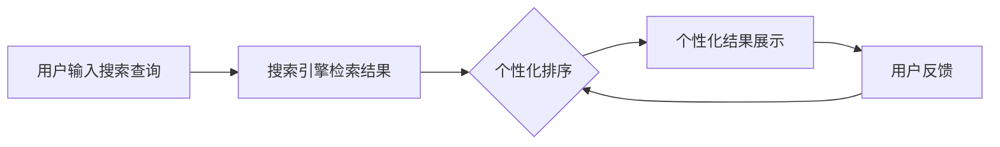

                 

## AI驱动的个性化搜索体验

**作者：禅与计算机程序设计艺术 / Zen and the Art of Computer Programming**

## 1. 背景介绍

在信息爆炸的数字时代，搜索已成为我们日常生活和工作中不可或缺的部分。然而，传统的搜索引擎往往提供的是基于关键词的匹配，无法满足用户的个性化需求。因此，个性化搜索体验应运而生，旨在提供更准确、更相关的搜索结果，提高用户体验。本文将深入探讨AI驱动的个性化搜索体验，从核心概念到具体算法，再到项目实践和实际应用场景，为读者提供全面的理解和实操指南。

## 2. 核心概念与联系

### 2.1 个性化搜索的定义

个性化搜索是指根据用户的搜索历史、偏好、兴趣等个性化信息，动态调整搜索结果的排序和展示，提供更相关、更准确的搜索体验。

### 2.2 AI在个性化搜索中的作用

AI技术， particularly machine learning和deep learning，在个性化搜索中发挥着关键作用。AI可以帮助理解用户的搜索意图，学习用户的偏好，并动态调整搜索结果。

### 2.3 个性化搜索体验的架构

个性化搜索体验的架构可以用下面的Mermaid流程图表示：



## 3. 核心算法原理 & 具体操作步骤

### 3.1 算法原理概述

个性化搜索算法的核心原理是利用用户的搜索历史、点击历史、浏览历史等数据，学习用户的偏好，并动态调整搜索结果的排序和展示。常用的个性化搜索算法包括协同过滤、内容过滤、基于用户模型的过滤等。

### 3.2 算法步骤详解

1. **数据收集**：收集用户的搜索历史、点击历史、浏览历史等数据。
2. **特征提取**：从收集的数据中提取特征，如用户搜索的关键词、点击的结果、浏览的时间等。
3. **模型训练**：使用机器学习算法，如协同过滤、内容过滤等，训练个性化搜索模型。
4. **搜索结果调整**：在用户输入搜索查询时，使用训练好的模型动态调整搜索结果的排序和展示。
5. **模型更新**：根据用户的反馈，如点击、浏览等，更新个性化搜索模型。

### 3.3 算法优缺点

**优点**：个性化搜索算法可以提供更相关、更准确的搜索结果，提高用户体验。

**缺点**：个性化搜索算法可能导致信息茧房现象，用户只接触到自己感兴趣的信息，无法接触到其他信息。此外，个性化搜索算法需要大量的用户数据，可能涉及隐私问题。

### 3.4 算法应用领域

个性化搜索算法广泛应用于搜索引擎、电子商务平台、社交媒体等领域，为用户提供个性化的搜索体验。

## 4. 数学模型和公式 & 详细讲解 & 举例说明

### 4.1 数学模型构建

个性化搜索的数学模型可以表示为：

$$R_{ij} = f(I_j, U_i, P_{ij})$$

其中，$R_{ij}$表示用户$U_i$对结果$I_j$的相关度，$I_j$表示搜索结果，$U_i$表示用户，$P_{ij}$表示用户$U_i$对结果$I_j$的偏好。

### 4.2 公式推导过程

个性化搜索模型的推导过程可以参考协同过滤算法。假设我们有用户-结果矩阵$R$，其中$R_{ij}$表示用户$U_i$对结果$I_j$的相关度。我们可以使用矩阵分解技术将$R$分解为用户特征矩阵$U$和结果特征矩阵$I$：

$$R \approx UI^T$$

其中，$U_{ik}$表示用户$U_i$对特征$k$的偏好，$I_{kj}$表示结果$I_j$对特征$k$的相关度。

### 4.3 案例分析与讲解

例如，在电子商务平台中，个性化搜索模型可以表示为：

$$R_{ij} = f(I_j, U_i, P_{ij}) = \alpha \cdot sim(I_j, U_i) + \beta \cdot P_{ij}$$

其中，$sim(I_j, U_i)$表示结果$I_j$和用户$U_i$的相似度，$P_{ij}$表示用户$U_i$对结果$I_j$的偏好。通过调整$\alpha$和$\beta$的权重，我们可以平衡相似度和偏好在个性化搜索中的作用。

## 5. 项目实践：代码实例和详细解释说明

### 5.1 开发环境搭建

个性化搜索项目的开发环境包括Python、Scikit-learn、NumPy、Pandas等常用的数据处理和机器学习库。

### 5.2 源代码详细实现

以下是个性化搜索算法的Python实现代码：

```python
import numpy as np
import pandas as pd
from sklearn.decomposition import NMF

# 读取用户-结果矩阵
R = pd.read_csv('user_result_matrix.csv', index_col=0)

# 使用NMF进行矩阵分解
nmf = NMF(n_components=50, random_state=42)
U = nmf.fit_transform(R)
I = nmf.components_

# 计算用户-结果相关度
def similarity(U, I, U_i, I_j):
    return np.dot(U_i, I_j)

# 计算用户对结果的偏好
def preference(U, I, U_i, I_j):
    return np.dot(U_i, I_j) / np.linalg.norm(U_i) * np.linalg.norm(I_j)

# 计算个性化搜索结果
def personalized_search(U, I, U_i, I_j, alpha=0.5, beta=0.5):
    return alpha * similarity(U, I, U_i, I_j) + beta * preference(U, I, U_i, I_j)

# 示例：计算用户1对结果1的相关度
U_1 = U[0]
I_1 = I[:, 0]
print(personalized_search(U, I, U_1, I_1))
```

### 5.3 代码解读与分析

代码首先读取用户-结果矩阵，然后使用NMF进行矩阵分解，得到用户特征矩阵$U$和结果特征矩阵$I$。然后定义计算相似度和偏好的函数，最后定义个性化搜索结果的计算函数。示例中计算用户1对结果1的相关度。

### 5.4 运行结果展示

运行代码后，我们可以得到用户1对结果1的相关度。通过调整$\alpha$和$\beta$的权重，我们可以平衡相似度和偏好在个性化搜索中的作用。

## 6. 实际应用场景

### 6.1 搜索引擎

个性化搜索算法可以应用于搜索引擎，为用户提供更相关、更准确的搜索结果。例如，Google的搜索结果就是根据用户的搜索历史和偏好动态调整的。

### 6.2 电子商务平台

个性化搜索算法可以应用于电子商务平台，为用户提供个性化的商品推荐。例如，Amazon的商品推荐就是根据用户的浏览历史和购买偏好动态调整的。

### 6.3 社交媒体

个性化搜索算法可以应用于社交媒体，为用户提供个性化的内容推荐。例如，Facebook的内容推荐就是根据用户的点赞历史和浏览偏好动态调整的。

### 6.4 未来应用展望

个性化搜索算法的未来应用展望包括：

* **实时个性化搜索**：利用实时数据，为用户提供实时的个性化搜索结果。
* **跨设备个性化搜索**：利用用户在不同设备上的搜索历史，为用户提供一致的个性化搜索体验。
* **语义理解**：利用自然语言处理技术，理解用户的搜索意图，提供更准确的搜索结果。

## 7. 工具和资源推荐

### 7.1 学习资源推荐

* **书籍**："Recommender Systems: The Textbook" by Lathia et al.
* **在线课程**："Recommender Systems" on Coursera by University of California, Irvine
* **论文**："The Wisdom of Crowds" by James Surowiecki

### 7.2 开发工具推荐

* **Python**：Scikit-learn, NumPy, Pandas, TensorFlow
* **Java**：Apache Mahout, Apache Spark MLlib
* **C++**：Librec, Surprise

### 7.3 相关论文推荐

* "Matrix Factorization Techniques for Recommender Systems" by Koren et al.
* "The Netflix Prize: A Case Study in Recommender Systems" by Bell et al.
* "Collaborative Filtering Revisited" by Herlocker et al.

## 8. 总结：未来发展趋势与挑战

### 8.1 研究成果总结

个性化搜索算法已经取得了显著的研究成果，为用户提供了更相关、更准确的搜索结果。然而，个性化搜索算法仍然面临着挑战。

### 8.2 未来发展趋势

未来个性化搜索算法的发展趋势包括：

* **实时个性化搜索**：利用实时数据，为用户提供实时的个性化搜索结果。
* **跨设备个性化搜索**：利用用户在不同设备上的搜索历史，为用户提供一致的个性化搜索体验。
* **语义理解**：利用自然语言处理技术，理解用户的搜索意图，提供更准确的搜索结果。

### 8.3 面临的挑战

个性化搜索算法面临的挑战包括：

* **信息茧房**：个性化搜索算法可能导致用户只接触到自己感兴趣的信息，无法接触到其他信息。
* **隐私问题**：个性化搜索算法需要大量的用户数据，可能涉及隐私问题。
* **冷启动问题**：对于新用户或新结果，个性化搜索算法无法提供个性化的搜索结果。

### 8.4 研究展望

未来个性化搜索算法的研究展望包括：

* **深度学习**：利用深度学习技术，提高个性化搜索算法的准确性和泛化能力。
* **用户反馈**：利用用户的反馈，动态调整个性化搜索算法的参数，提供更准确的搜索结果。
* **多模式学习**：利用用户的多模式数据，如搜索历史、点击历史、浏览历史等，提供更全面的个性化搜索体验。

## 9. 附录：常见问题与解答

**Q：个性化搜索算法如何处理用户的隐私问题？**

A：个性化搜索算法可以使用匿名化技术，如K-anonymity和L-diversity，保护用户的隐私。此外，个性化搜索算法可以使用差分隐私技术，在保护用户隐私的同时提供个性化搜索结果。

**Q：个性化搜索算法如何处理冷启动问题？**

A：个性化搜索算法可以使用内容过滤技术，利用结果的特征信息，为新用户或新结果提供个性化搜索结果。此外，个性化搜索算法可以使用协同过滤技术，利用用户和结果的相似度，为新用户或新结果提供个性化搜索结果。

**Q：个性化搜索算法如何处理信息茧房问题？**

A：个性化搜索算法可以使用多样性推荐技术，为用户推荐与其兴趣相关但又不相同的信息。此外，个性化搜索算法可以使用探索性推荐技术，为用户推荐与其兴趣无关但又有价值的信息。

**Q：个性化搜索算法如何处理结果的时效性问题？**

A：个性化搜索算法可以使用实时数据，为用户提供实时的个性化搜索结果。此外，个性化搜索算法可以使用时效性推荐技术，为用户推荐时效性高的信息。

**Q：个性化搜索算法如何处理结果的多样性问题？**

A：个性化搜索算法可以使用多样性推荐技术，为用户推荐与其兴趣相关但又不相同的信息。此外，个性化搜索算法可以使用多模式学习技术，利用用户的多模式数据，为用户提供更全面的个性化搜索体验。

## 结束语

个性化搜索算法为用户提供了更相关、更准确的搜索结果，提高了用户体验。然而，个性化搜索算法仍然面临着挑战，如信息茧房、隐私问题、冷启动问题等。未来个性化搜索算法的发展趋势包括实时个性化搜索、跨设备个性化搜索、语义理解等。我们期待个性化搜索算法的进一步发展，为用户提供更好的搜索体验。

**作者：禅与计算机程序设计艺术 / Zen and the Art of Computer Programming**

