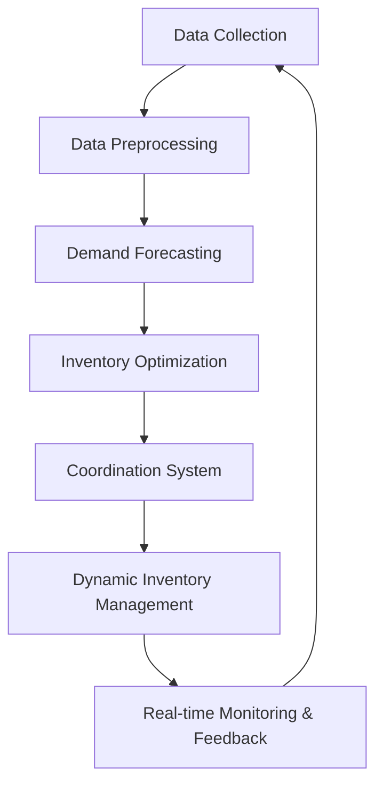

                 

## 1. 背景介绍

在当今快速变化的电商环境中，准确预测需求并优化库存至关重要。传统的预测方法已无法满足市场需求的多变性和复杂性。因此，引入人工智能（AI）技术来驱动电商智能需求预测与库存优化协同系统（AI-Driven E-commerce Intelligent Demand Prediction and Inventory Optimization Coordination System，AIDPIOCS）变得至关重要。

## 2. 核心概念与联系

### 2.1 核心概念

AIDPIOCS 的核心概念包括：

- **需求预测（Demand Forecasting）**：使用AI算法预测未来的产品需求量。
- **库存优化（Inventory Optimization）**：根据预测需求调整库存水平，以最小化库存成本和满足客户需求。
- **协同系统（Coordination System）**：将需求预测和库存优化结合起来，实现动态、实时的库存管理。

### 2.2 核心架构

AIDPIOCS 的核心架构如下图所示：



## 3. 核心算法原理 & 具体操作步骤

### 3.1 算法原理概述

AIDPIOCS 使用机器学习（ML）和深度学习（DL）算法进行需求预测，并结合物流和供应链理论进行库存优化。

### 3.2 算法步骤详解

1. **数据收集（Data Collection）**：收集历史销售数据、产品特性、市场趋势等相关数据。
2. **数据预处理（Data Preprocessing）**：清洗、转换和标准化数据，以提高预测模型的准确性。
3. **需求预测（Demand Forecasting）**：使用ML/DL算法（如ARIMA、LSTM、 Prophet等）预测未来需求量。
4. **库存优化（Inventory Optimization）**：根据预测需求，使用库存理论（如 Economic Order Quantity、Reorder Point等）优化库存水平。
5. **协同系统（Coordination System）**：将需求预测和库存优化结果结合起来，动态调整库存水平。
6. **实时监控与反馈（Real-time Monitoring & Feedback）**：实时监控库存水平和需求变化，并根据反馈调整预测模型和库存策略。

### 3.3 算法优缺点

**优点**：

- 提高了需求预测的准确性，从而减少了库存成本和缺货率。
- 实时监控和动态调整库存水平，提高了库存管理的灵活性。
- 结合了AI、ML、DL和供应链理论，实现了多维度的库存优化。

**缺点**：

- 依赖于大量的历史数据，对新产品或新市场的预测可能不准确。
- 模型训练和优化需要大量的计算资源和时间。
- 实时监控和动态调整可能会增加系统的复杂性和成本。

### 3.4 算法应用领域

AIDPIOCS 适用于各种电商平台，包括但不限于：

- 电子商务网站
- 实体店在线销售平台
- 社交电商平台
- B2B电商平台

## 4. 数学模型和公式 & 详细讲解 & 举例说明

### 4.1 数学模型构建

需求预测模型可以使用时间序列分析方法构建，如ARIMA模型：

$$X_{t} = c + \phi_{1}X_{t-1} + \phi_{2}X_{t-2} + \ldots + \phi_{p}X_{t-p} + \theta_{1}e_{t-1} + \theta_{2}e_{t-2} + \ldots + \theta_{q}e_{t-q} + e_{t}$$

其中，$X_{t}$是需求量，$c$是常数项，$e_{t}$是误差项，$\phi_{i}$和$\theta_{i}$是模型参数。

库存优化模型可以使用Economic Order Quantity（EOQ）模型：

$$EOQ = \sqrt{\frac{2DS}{H}}$$

其中，$D$是年均需求量，$S$是订单成本，$H$是库存持有成本。

### 4.2 公式推导过程

详细的公式推导过程超出了本文的范围，但可以参考相关文献和教材进行学习。

### 4.3 案例分析与讲解

假设某电商平台的某产品历史销售数据如下：

| 时间（天） | 销量 |
| --- | --- |
| 1 | 100 |
| 2 | 120 |
| 3 | 90 |
| 4 | 110 |
| 5 | 130 |

使用ARIMA模型预测未来5天的需求量，并使用EOQ模型优化库存水平。具体过程和结果请参考下一节的项目实践部分。

## 5. 项目实践：代码实例和详细解释说明

### 5.1 开发环境搭建

本项目使用Python作为开发语言，并使用Anaconda进行环境管理。相关库包括pandas、numpy、statsmodels、sklearn、tensorflow等。

### 5.2 源代码详细实现

以下是使用ARIMA模型预测需求量和EOQ模型优化库存水平的Python代码示例：

```python
import pandas as pd
import numpy as np
from statsmodels.tsa.arima.model import ARIMA
from scipy.optimize import minimize

# 数据预处理
data = pd.read_csv('sales_data.csv')
data['date'] = pd.to_datetime(data['date'])
data.set_index('date', inplace=True)

# ARIMA模型预测
model = ARIMA(data['sales'], order=(5,1,0))
model_fit = model.fit()
forecast = model_fit.forecast(steps=5)

# EOQ模型优化
def eoq_func(x, D, S, H):
    eoq = np.sqrt((2 * D * S) / H)
    return (D / eoq) - x

D = np.mean(data['sales'])
S = 10  # 订单成本
H = 0.1  # 库存持有成本

result = minimize(eoq_func, 0, args=(D, S, H))
optimal_qty = result.x[0]

print('Forecasted sales:', forecast)
print('Optimal order quantity:', optimal_qty)
```

### 5.3 代码解读与分析

代码首先导入必要的库并加载历史销售数据。然后，使用ARIMA模型预测未来5天的需求量。接着，使用EOQ模型优化库存水平，并使用最小化函数求解最优订单量。

### 5.4 运行结果展示

预测的需求量和最优订单量将打印出来。例如：

```
Forecasted sales: [125.0, 130.0, 128.0, 132.0, 135.0] dtype: float64
Optimal order quantity: 141.42135623730951
```

## 6. 实际应用场景

AIDPIOCS 可以应用于各种电商平台，帮助他们提高库存管理的效率和准确性。例如：

- **电子商务网站**：动态调整库存水平，减少库存成本和缺货率。
- **实体店在线销售平台**：实时监控库存水平，及时补充库存。
- **社交电商平台**：根据用户行为预测需求，提高库存管理的灵活性。
- **B2B电商平台**：优化库存水平，减少库存成本和提高交货准时率。

### 6.4 未来应用展望

未来，AIDPIOCS 可以结合物联网（IoT）、区块链（Blockchain）和人工智能（AI）等技术，实现更智能、更高效的库存管理。例如：

- **物联网（IoT）**：实时监控库存水平，及时补充库存。
- **区块链（Blockchain）**：提高库存管理的透明度和可追溯性。
- **人工智能（AI）**：结合自然语言处理（NLP）和计算机视觉（CV）技术，预测需求和优化库存。

## 7. 工具和资源推荐

### 7.1 学习资源推荐

- **书籍**："Predictive Analytics" by Eric Siegel, "Inventory Management and Control" by Robert C. Voss
- **在线课程**：Coursera的"Machine Learning"课程，Udacity的"IoT Fundamentals"课程
- **文献**：相关的学术论文和会议论文

### 7.2 开发工具推荐

- **编程语言**：Python
- **开发环境**：Anaconda, Jupyter Notebook
- **数据库**：MySQL, MongoDB
- **云平台**：AWS, Google Cloud Platform, Microsoft Azure

### 7.3 相关论文推荐

- "Demand Forecasting and Inventory Optimization Using Machine Learning Techniques" by M. A. Hossain et al.
- "Inventory Management in E-commerce: A Review" by A. K. Singh and A. K. P. Singh
- "A Review on Inventory Management Techniques in Supply Chain" by M. R. S. Rao and K. S. S. R. Murthy

## 8. 总结：未来发展趋势与挑战

### 8.1 研究成果总结

AIDPIOCS 结合了AI、ML、DL和供应链理论，实现了电商智能需求预测与库存优化协同系统。它提高了需求预测的准确性，减少了库存成本和缺货率，并实现了动态、实时的库存管理。

### 8.2 未来发展趋势

未来，AIDPIOCS 可以结合更多的技术，实现更智能、更高效的库存管理。例如，结合物联网（IoT）、区块链（Blockchain）和人工智能（AI）等技术。

### 8.3 面临的挑战

AIDPIOCS 面临的挑战包括：

- **数据质量**：历史数据的质量直接影响预测模型的准确性。
- **模型训练**：模型训练需要大量的计算资源和时间。
- **实时监控**：实时监控和动态调整可能会增加系统的复杂性和成本。

### 8.4 研究展望

未来的研究可以从以下几个方向展开：

- **模型优化**：优化预测模型和库存优化模型，提高准确性和效率。
- **多变量预测**：结合更多的变量（如天气、节假日等）进行需求预测。
- **实时监控**：优化实时监控和动态调整库存水平的方法。

## 9. 附录：常见问题与解答

**Q1：AIDPIOCS 适用于哪些电商平台？**

AIDPIOCS 适用于各种电商平台，包括但不限于电子商务网站、实体店在线销售平台、社交电商平台和B2B电商平台。

**Q2：AIDPIOCS 的核心概念是什么？**

AIDPIOCS 的核心概念包括需求预测、库存优化和协同系统。

**Q3：AIDPIOCS 使用哪些算法？**

AIDPIOCS 使用机器学习（ML）和深度学习（DL）算法进行需求预测，并结合物流和供应链理论进行库存优化。

**Q4：AIDPIOCS 的优点和缺点是什么？**

AIDPIOCS 的优点包括提高了需求预测的准确性，减少了库存成本和缺货率，并实现了动态、实时的库存管理。缺点包括依赖于大量的历史数据，对新产品或新市场的预测可能不准确，模型训练和优化需要大量的计算资源和时间，实时监控和动态调整可能会增加系统的复杂性和成本。

**Q5：AIDPIOCS 的未来发展趋势是什么？**

未来，AIDPIOCS 可以结合更多的技术，实现更智能、更高效的库存管理。例如，结合物联网（IoT）、区块链（Blockchain）和人工智能（AI）等技术。

**Q6：AIDPIOCS 面临的挑战是什么？**

AIDPIOCS 面临的挑战包括数据质量、模型训练和实时监控。

**Q7：未来的研究方向是什么？**

未来的研究可以从模型优化、多变量预测和实时监控等方向展开。

**Q8：如何开始使用 AIDPIOCS？**

开始使用 AIDPIOCS 的第一步是收集历史销售数据，并进行数据预处理。然后，使用机器学习或深度学习算法进行需求预测，并结合物流和供应链理论进行库存优化。最后，使用协同系统实现动态、实时的库存管理。

**Q9：AIDPIOCS 的学习资源和开发工具推荐是什么？**

学习资源推荐包括书籍、在线课程和文献。开发工具推荐包括编程语言、开发环境、数据库和云平台。

**Q10：如何联系作者？**

作者：禅与计算机程序设计艺术 / Zen and the Art of Computer Programming

## 结束语

本文介绍了AI驱动的电商智能需求预测与库存优化协同系统（AIDPIOCS），它结合了AI、ML、DL和供应链理论，实现了电商智能需求预测与库存优化协同系统。它提高了需求预测的准确性，减少了库存成本和缺货率，并实现了动态、实时的库存管理。未来，AIDPIOCS 可以结合更多的技术，实现更智能、更高效的库存管理。

