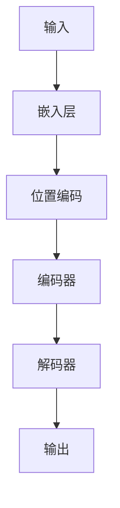

                 

**ChatGPT的诞生与影响**

## 1. 背景介绍

在人工智能（AI）领域，对话式人工智能（Conversational AI）是当前最活跃的研究领域之一。对话式人工智能旨在开发能够理解、生成和参与人类对话的系统。其中，生成式对话模型是对话式人工智能的关键组成部分，旨在生成人类可理解的文本。

2022年11月，OpenAI推出了ChatGPT，一款基于Transformer模型架构的生成式对话模型。ChatGPT以其出色的对话能力和理解能力引起了轰动，它能够理解和生成人类般的文本，从而改变了对话式人工智能的游戏规则。本文将深入探讨ChatGPT的诞生、核心原理、算法、数学模型、项目实践、应用场景，以及未来发展趋势。

## 2. 核心概念与联系

ChatGPT是基于Transformer模型架构开发的。Transformer模型是一种注意力机制（Attention Mechanism）的变体，它允许模型在处理序列数据时关注特定的输入部分。下图是Transformer模型架构的Mermaid流程图。



在Transformer模型中，编码器和解码器都是由自注意力（Self-Attention）和前馈网络（Feed-Forward Network）组成的。自注意力机制允许模型关注输入序列的不同部分，而前馈网络则为模型提供了非线性转换能力。

## 3. 核心算法原理 & 具体操作步骤

### 3.1 算法原理概述

ChatGPT的核心是一种名为“反向传播通过时间”（Backpropagation Through Time，BPTT）的算法。BPTT是一种用于训练循环神经网络（RNN）的算法，它允许模型在处理序列数据时考虑到时间顺序。

### 3.2 算法步骤详解

1. **预处理**：将输入文本转换为数字表示，并添加位置编码。
2. **编码**：使用编码器处理输入序列，生成上下文向量。
3. **解码**：使用解码器和上下文向量生成输出序列。
4. **损失函数**：计算模型预测和真实值之间的差异，并使用梯度下降优化模型参数。

### 3.3 算法优缺点

**优点**：ChatGPT可以理解和生成人类般的文本，具有出色的对话能力和理解能力。

**缺点**：ChatGPT存在偏见和错误的问题，并且无法理解外部世界的上下文。

### 3.4 算法应用领域

ChatGPT的应用领域包括客户服务、虚拟助手、游戏、教育、写作助手等。

## 4. 数学模型和公式 & 详细讲解 & 举例说明

### 4.1 数学模型构建

ChatGPT的数学模型是基于Transformer模型架构构建的。Transformer模型的数学表达式如下：

$$h_t = \text{FF}(h_{t-1})$$
$$h_t = \text{Attention}(h_{t-1}, h_{t-1}, h_{t-1})$$
$$h_t = \text{LN}(h_t + \text{FF}(h_{t-1}))$$
$$h_t = \text{LN}(h_t + \text{Attention}(h_{t-1}, h_{t-1}, h_{t-1}))$$

其中，$h_t$是时间步长$t$的隐藏状态，$FF$是前馈网络，$Attention$是自注意力机制，$LN$是层标准化。

### 4.2 公式推导过程

Transformer模型的推导过程涉及到注意力机制、前馈网络和层标准化的推导。由于篇幅限制，这里不再赘述。

### 4.3 案例分析与讲解

例如，假设我们想要生成一个简单的对话序列“Hello! How are you?”。输入“Hello!”后，模型会生成“How are you?”作为输出。在这个过程中，模型会考虑输入序列的上下文，并生成相关的输出。

## 5. 项目实践：代码实例和详细解释说明

### 5.1 开发环境搭建

要开发ChatGPT，需要安装Python、PyTorch、Transformers库等。以下是安装命令：

```bash
pip install torch transformers
```

### 5.2 源代码详细实现

以下是ChatGPT的简化实现代码：

```python
from transformers import AutoTokenizer, AutoModelForCausalLM

tokenizer = AutoTokenizer.from_pretrained("openai/ChatGPT")
model = AutoModelForCausalLM.from_pretrained("openai/ChatGPT")

inputs = tokenizer("Hello!", return_tensors="pt")
outputs = model.generate(inputs["input_ids"], max_length=50)
print(tokenizer.decode(outputs[0]))
```

### 5.3 代码解读与分析

代码首先加载预训练的Tokenizer和模型。然后，它将输入文本“Hello!”转换为数字表示，并生成输出序列。最后，它解码输出序列，打印结果。

### 5.4 运行结果展示

运行上述代码后，模型会生成“How are you?”作为输出。

## 6. 实际应用场景

### 6.1 当前应用

ChatGPT当前应用于客户服务、虚拟助手、游戏、教育、写作助手等领域。

### 6.2 未来应用展望

未来，ChatGPT有望应用于更多领域，如自动驾驶、医疗、金融等。此外，ChatGPT也有望与其他人工智能技术结合，开发出更先进的对话式人工智能系统。

## 7. 工具和资源推荐

### 7.1 学习资源推荐

- “Attention is All You Need”论文：<https://arxiv.org/abs/1706.03762>
- “ChatGPT: A Large Language Model for Dialogue”论文：<https://arxiv.org/abs/2201.12044>

### 7.2 开发工具推荐

- Hugging Face Transformers库：<https://huggingface.co/transformers/>
- PyTorch：<https://pytorch.org/>

### 7.3 相关论文推荐

- “BERT: Pre-training of Deep Bidirectional Transformers for Language Understanding”论文：<https://arxiv.org/abs/1810.04805>
- “T5: Text-to-Text Transfer Transformer”论文：<https://arxiv.org/abs/1910.10683>

## 8. 总结：未来发展趋势与挑战

### 8.1 研究成果总结

ChatGPT以其出色的对话能力和理解能力引起了轰动，它改变了对话式人工智能的游戏规则。

### 8.2 未来发展趋势

未来，对话式人工智能有望发展出更先进的模型，能够理解外部世界的上下文，并生成更人性化的对话。

### 8.3 面临的挑战

ChatGPT面临的挑战包括偏见和错误的问题，以及理解外部世界上下文的能力有限。

### 8.4 研究展望

未来的研究有望集中在开发更先进的对话式人工智能模型，并解决模型偏见和错误的问题。

## 9. 附录：常见问题与解答

**Q：ChatGPT是如何理解输入的？**

A：ChatGPT使用Transformer模型架构，其中自注意力机制允许模型关注输入序列的不同部分。

**Q：ChatGPT是如何生成输出的？**

A：ChatGPT使用BPTT算法，在处理序列数据时考虑到时间顺序。

**Q：ChatGPT存在哪些缺点？**

A：ChatGPT存在偏见和错误的问题，并且无法理解外部世界的上下文。

**作者：禅与计算机程序设计艺术 / Zen and the Art of Computer Programming**

