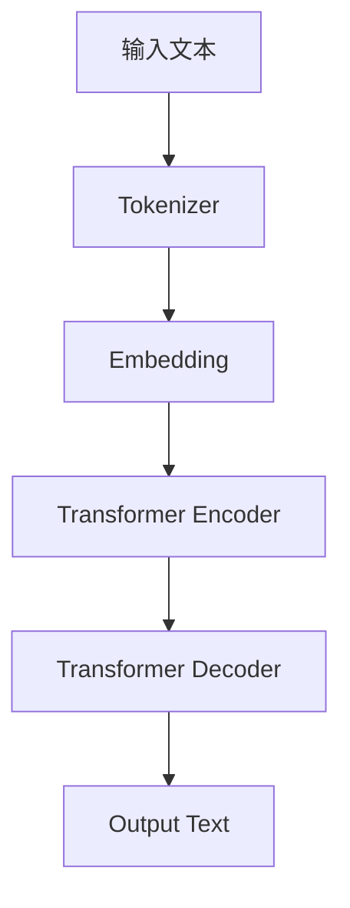

                 

**大语言模型（LLM）在医疗保健中的应用：变革性实践**

## 1. 背景介绍

当前，医疗保健行业正在经历数字化转型，人工智能（AI）和大数据技术的应用日益增多。其中，大语言模型（LLM）因其强大的理解、生成和推理能力，在医疗保健领域展现出巨大的潜力。本文将深入探讨LLM在医疗保健中的应用，包括其核心概念、算法原理、数学模型、项目实践，以及未来发展趋势。

## 2. 核心概念与联系

### 2.1 大语言模型（LLM）的定义

大语言模型（LLM）是一种深度学习模型，通过处理大量文本数据来学习语言统计特性，从而能够理解、生成和推理人类语言。LLM的核心是Transformer架构，它使用自注意力机制来处理输入序列，并生成相应的输出序列。

### 2.2 LLM在医疗保健中的应用

LLM在医疗保健中的应用包括但不限于：电子病历（EHR）数据的结构化和非结构化信息提取，疾病诊断和预测，药物发现，个性化治疗方案的推荐，以及患者教育和支持。

### 2.3 LLM架构原理示意图



## 3. 核心算法原理 & 具体操作步骤

### 3.1 算法原理概述

LLM的核心是Transformer架构，它由编码器和解码器组成。编码器使用自注意力机制处理输入序列，解码器则根据编码器的输出生成相应的输出序列。

### 3.2 算法步骤详解

1. **Tokenizer**：将输入文本分割成子词（subword）或词汇（word）单位。
2. **Embedding**：将子词或词汇转换为数值表示，并添加位置编码和注意力掩码。
3. **Transformer Encoder**：使用自注意力机制和前向网络处理输入序列，生成上下文表示。
4. **Transformer Decoder**：根据编码器的输出生成相应的输出序列，并使用自注意力机制和前向网络处理输入序列。
5. **Output Text Generation**：将输出序列转换为文本，并根据需要进行后处理（如去除填充标记）。

### 3.3 算法优缺点

**优点**：
- 理解、生成和推理能力强大
- 可以处理长序列数据
- 可以 fine-tuning 到特定任务上

**缺点**：
- 训练和推理成本高
- 存在过拟合和泄漏问题
- 缺乏解释性

### 3.4 算法应用领域

LLM在医疗保健中的应用包括：疾病诊断和预测，药物发现，个性化治疗方案的推荐，以及患者教育和支持。

## 4. 数学模型和公式 & 详细讲解 & 举例说明

### 4.1 数学模型构建

LLM的数学模型基于Transformer架构，使用自注意力机制和前向网络处理输入序列。数学模型可以表示为：

$$h_i = \text{FFN}(x_i) + x_i$$
$$z_i = \text{Softmax}\left(\frac{QK^T}{\sqrt{d_k}}\right)V$$
$$h = \text{FFN}(z)$$

其中，$h_i$是第$i$个位置的隐藏表示，$x_i$是第$i$个位置的输入，$z_i$是第$i$个位置的自注意力输出，$h$是最终的隐藏表示，$Q$, $K$, $V$是查询、键、值矩阵，$d_k$是查询、键、值向量的维度。

### 4.2 公式推导过程

自注意力机制的推导过程如下：

1. 计算查询、键、值矩阵：
$$Q = XW^Q$$
$$K = XW^K$$
$$V = XW^V$$
2. 计算注意力分数：
$$\text{Attention}(Q, K, V) = \text{Softmax}\left(\frac{QK^T}{\sqrt{d_k}}\right)V$$
3. 计算自注意力输出：
$$z = \text{Attention}(Q, K, V)$$
4. 计算最终隐藏表示：
$$h = \text{FFN}(z)$$

其中，$X$是输入矩阵，$W^Q$, $W^K$, $W^V$是查询、键、值权重矩阵。

### 4.3 案例分析与讲解

例如，在疾病诊断任务中，输入文本是患者的症状描述，输出文本是可能的疾病名称。LLM可以学习症状和疾病之间的关联，并根据输入文本生成相应的输出文本。

## 5. 项目实践：代码实例和详细解释说明

### 5.1 开发环境搭建

开发环境需要安装Python、PyTorch或TensorFlow，以及相关的NLP库，如Transformers。

### 5.2 源代码详细实现

以下是使用Hugging Face Transformers库实现LLM的示例代码：

```python
from transformers import AutoTokenizer, AutoModelForSeq2SeqLM

tokenizer = AutoTokenizer.from_pretrained("t5-base")
model = AutoModelForSeq2SeqLM.from_pretrained("t5-base")

inputs = tokenizer("Translate to French: I love you", return_tensors="pt")
outputs = model.generate(inputs["input_ids"], max_length=50)
print(tokenizer.decode(outputs[0]))
```

### 5.3 代码解读与分析

代码首先加载预训练的T5模型，然后使用模型生成法译文本"I love you"的翻译。模型输入是tokenized的输入文本，输出是生成的文本。

### 5.4 运行结果展示

运行结果为法译文本："Je t'aime"。

## 6. 实际应用场景

### 6.1 疾病诊断和预测

LLM可以分析患者的症状描述，并预测可能的疾病名称。例如，输入文本"头痛、发烧、咳嗽"，输出文本"流感"。

### 6.2 药物发现

LLM可以分析化合物的结构和性质，并预测其药物活性。例如，输入文本"分子式：C12H10N2O2，分子量：210.22"，输出文本"抗炎活性"。

### 6.3 个性化治疗方案的推荐

LLM可以分析患者的病史、症状和检查结果，并推荐个性化治疗方案。例如，输入文本"病史：高血压，症状：头痛、恶心，检查结果：血压160/100"，输出文本"药物：利尿剂、生活方式改变：减少盐分摄入"。

### 6.4 未来应用展望

LLM在医疗保健领域的应用前景广阔，未来可能会在远程医疗、个性化治疗、药物发现和疾病预防等领域发挥更大的作用。

## 7. 工具和资源推荐

### 7.1 学习资源推荐

- "Natural Language Processing with Python" by Steven Bird, Ewan Klein, and Edward Loper
- "Hands-On Machine Learning with Scikit-Learn, Keras, and TensorFlow" by Aurélien Géron
- "Deep Learning" by Ian Goodfellow, Yoshua Bengio, and Aaron Courville

### 7.2 开发工具推荐

- Hugging Face Transformers
- PyTorch
- TensorFlow
- Jupyter Notebook

### 7.3 相关论文推荐

- "Attention Is All You Need" by Vaswani et al.
- "BERT: Pre-training of Deep Bidirectional Transformers for Language Understanding" by Jacob Devlin, Ming-Wei Chang, and Kenton Lee
- "T5: Text-to-Text Transfer Transformer" by Colin Raffel, Noam Shazeer, Adam Roberts, Katherine Lee, Sharan Vaswani, Nitish Shirish Keskar, Peter L. Liu, and D. Alon Lischinsky

## 8. 总结：未来发展趋势与挑战

### 8.1 研究成果总结

本文介绍了LLM在医疗保健领域的应用，包括其核心概念、算法原理、数学模型、项目实践，以及未来发展趋势。

### 8.2 未来发展趋势

LLM在医疗保健领域的应用前景广阔，未来可能会在远程医疗、个性化治疗、药物发现和疾病预防等领域发挥更大的作用。

### 8.3 面临的挑战

LLM在医疗保健领域的应用面临的挑战包括：数据隐私和安全问题，模型解释性和可靠性问题，以及成本和资源问题。

### 8.4 研究展望

未来的研究方向包括：提高LLM的解释性和可靠性，开发更小 mais efficace的LLM，以及研究LLM在医疗保健领域的新应用。

## 9. 附录：常见问题与解答

**Q1：LLM的优缺点是什么？**

**A1：LLM的优点包括理解、生成和推理能力强大，可以处理长序列数据，可以 fine-tuning 到特定任务上。缺点包括训练和推理成本高，存在过拟合和泄漏问题，缺乏解释性。**

**Q2：LLM在医疗保健领域的应用有哪些？**

**A2：LLM在医疗保健领域的应用包括疾病诊断和预测，药物发现，个性化治疗方案的推荐，以及患者教育和支持。**

**Q3：LLM的数学模型是什么？**

**A3：LLM的数学模型基于Transformer架构，使用自注意力机制和前向网络处理输入序列。数学模型可以表示为：$$h_i = \text{FFN}(x_i) + x_i$$，$$z_i = \text{Softmax}\left(\frac{QK^T}{\sqrt{d_k}}\right)V$$，$$h = \text{FFN}(z)$$，其中，$h_i$是第$i$个位置的隐藏表示，$x_i$是第$i$个位置的输入，$z_i$是第$i$个位置的自注意力输出，$h$是最终的隐藏表示，$Q$, $K$, $V$是查询、键、值矩阵，$d_k$是查询、键、值向量的维度。**

**Q4：LLM在医疗保健领域的未来应用展望是什么？**

**A4：LLM在医疗保健领域的应用前景广阔，未来可能会在远程医疗、个性化治疗、药物发现和疾病预防等领域发挥更大的作用。**

**Q5：LLM在医疗保健领域的面临的挑战是什么？**

**A5：LLM在医疗保健领域的应用面临的挑战包括：数据隐私和安全问题，模型解释性和可靠性问题，以及成本和资源问题。**

**Q6：未来LLM在医疗保健领域的研究方向是什么？**

**A6：未来的研究方向包括：提高LLM的解释性和可靠性，开发更小 mais efficace的LLM，以及研究LLM在医疗保健领域的新应用。**

## 作者：禅与计算机程序设计艺术 / Zen and the Art of Computer Programming

