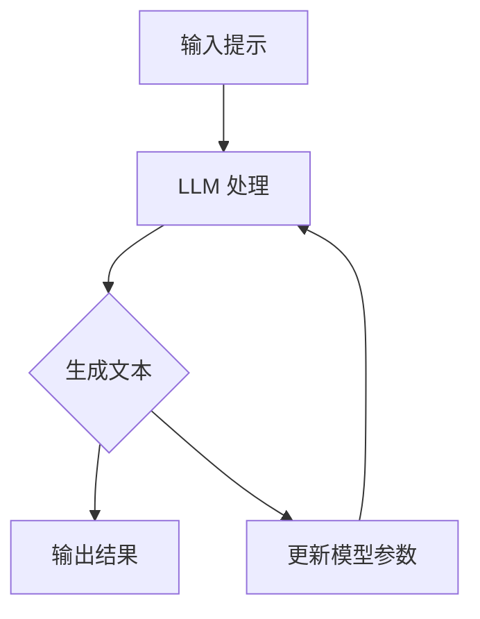

                 

- Large Language Models (LLMs)
- Creative Writing
- Science Fiction
- Imagination
- Prompt Engineering
- Text Generation
- Storytelling
- AI in Arts

## 1. 背景介绍

人工智能的发展正在各个领域产生深远的影响，其中之一就是文艺创作领域。大型语言模型（LLMs）的出现为科幻创作带来了新的可能性。LLMs 通过学习大量文本数据，能够理解语言的上下文、生成相关文本，从而帮助作者创作科幻小说。

本文将探讨 LLMs 在科幻创作中的应用，分析其核心概念和算法原理，并提供项目实践和实际应用场景。我们还将推荐相关学习资源和工具，并展望 LLMs 在文艺创作领域的未来发展。

## 2. 核心概念与联系

### 2.1 大型语言模型（LLMs）

LLMs 是一种深度学习模型，通过学习大量文本数据来理解语言。它们可以生成相关文本，回答问题，甚至创作故事。LLMs 的核心是 transformer 模型，它使用 self-attention 机制来理解文本的上下文。

### 2.2 LLM 在科幻创作中的应用

LLMs 可以帮助作者创作科幻小说，从生成故事框架到创作具体场景和对话。它们可以根据给定的提示（prompt）生成文本，作者可以通过调整提示来控制故事的方向。

### 2.3 核心概念原理与架构的 Mermaid 流程图



## 3. 核心算法原理 & 具体操作步骤

### 3.1 算法原理概述

LLMs 的核心是 transformer 模型，它使用 self-attention 机制来理解文本的上下文。在生成文本时，LLM 会根据输入的提示，预测下一个最可能的单词，并重复这个过程直到生成一段文本。

### 3.2 算法步骤详解

1. 输入提示：作者输入一个提示，描述故事的场景、角色或情节。
2. LLM 处理：LLM 处理输入的提示，理解其含义。
3. 生成文本：LLM 生成一段文本，根据输入的提示延伸故事。
4. 输出结果：LLM 输出生成的文本。
5. 更新模型参数：LLM 更新其模型参数，以改进未来的文本生成。

### 3.3 算法优缺点

**优点：**

- LLM 可以帮助作者创作科幻小说，提供新的想法和视角。
- LLM 可以根据输入的提示生成相关文本，作者可以控制故事的方向。

**缺点：**

- LLM 生成的文本可能缺乏连贯性或逻辑性。
- LLM 可能会生成不准确或不相关的文本。
- LLM 可能会复制或模仿其他文本，导致版权问题。

### 3.4 算法应用领域

LLMs 在文艺创作领域有着广泛的应用，从小说创作到诗歌创作，从电影剧本到音乐创作。它们还可以帮助作者进行写作练习，提供新的想法和视角。

## 4. 数学模型和公式 & 详细讲解 & 举例说明

### 4.1 数学模型构建

LLMs 的数学模型是基于 transformer 模型的。transformer 模型使用 self-attention 机制来理解文本的上下文。self-attention 机制可以理解为一种注意力机制，它允许模型关注输入序列的不同部分。

### 4.2 公式推导过程

transformer 模型的 self-attention 机制可以表示为以下公式：

$$Attention(Q, K, V) = softmax(\frac{QK^T}{\sqrt{d_k}})V$$

其中，Q、K、V 分别是查询（query）、键（key）和值（value）矩阵，d_k 是键矩阵的维度。softmax 函数用于生成注意力权重，这些权重用于线性组合值矩阵 V，生成 self-attention 的输出。

### 4.3 案例分析与讲解

例如，在创作科幻小说时，作者可以输入一个提示，描述故事的场景、角色或情节。LLM 会处理输入的提示，理解其含义，并生成一段文本。作者可以根据生成的文本调整输入的提示，控制故事的方向。

## 5. 项目实践：代码实例和详细解释说明

### 5.1 开发环境搭建

要使用 LLM 进行科幻创作，需要安装 Python 和-transformers 库。可以使用以下命令安装-transformers 库：

```bash
pip install transformers
```

### 5.2 源代码详细实现

以下是一个简单的 Python 代码示例，使用 LLM 生成文本：

```python
from transformers import AutoModelForCausalLM, AutoTokenizer

# 加载模型和标记器
model = AutoModelForCausalLM.from_pretrained("bigscience/bloom")
tokenizer = AutoTokenizer.from_pretrained("bigscience/bloom")

# 输入提示
input_text = "Once upon a time in a distant galaxy, there was a planet called"

# 将输入文本转换为标记
input_ids = tokenizer.encode(input_text, return_tensors="pt")

# 生成文本
output_ids = model.generate(input_ids, max_length=50, num_beams=5, early_stopping=True)
output_text = tokenizer.decode(output_ids[0], skip_special_tokens=True)

print(output_text)
```

### 5.3 代码解读与分析

在代码中，我们首先加载 LLM 模型和标记器。然后，我们输入一个提示，描述故事的场景。我们将输入文本转换为标记，并使用模型生成文本。我们设置了最大长度、beam search 的数量和 early stopping 来控制文本生成的过程。

### 5.4 运行结果展示

运行上述代码后，LLM 可能会生成以下文本：

"Once upon a time in a distant galaxy, there was a planet called Zephyria. The planet was known for its vast oceans and the unique creatures that inhabited them. The most famous of these creatures was the Zephyr, a majestic creature that could fly through the air and swim through the water."

## 6. 实际应用场景

### 6.1 当前应用

LLMs 正在被用于各种文艺创作领域，从小说创作到诗歌创作，从电影剧本到音乐创作。它们还可以帮助作者进行写作练习，提供新的想法和视角。

### 6.2 未来应用展望

随着 LLMs 的发展，它们在文艺创作领域的应用将会更加广泛。未来，LLMs 可能会帮助作者创作更复杂的故事，提供更多的想法和视角。它们还可能会帮助作者进行写作练习，提供更多的反馈和建议。

## 7. 工具和资源推荐

### 7.1 学习资源推荐

- "Attention is All You Need" 论文：<https://arxiv.org/abs/1706.03762>
- "Language Models are Few-Shot Learners" 论文：<https://arxiv.org/abs/2005.14165>
- "BigScience: A Collaborative Open Science Laboratory for Responsible AI Research" 论文：<https://arxiv.org/abs/2204.10554>

### 7.2 开发工具推荐

- Hugging Face Transformers：<https://huggingface.co/transformers/>
- Google Colab：<https://colab.research.google.com/>
- Jupyter Notebook：<https://jupyter.org/>

### 7.3 相关论文推荐

- "Story Generation with Large Language Models" 论文：<https://arxiv.org/abs/2102.08984>
- "Creative Writing with Large Language Models" 论文：<https://arxiv.org/abs/2009.04847>
- "The Text Generation Challenge: A Survey of Evaluation Metrics" 论文：<https://arxiv.org/abs/2009.04847>

## 8. 总结：未来发展趋势与挑战

### 8.1 研究成果总结

LLMs 在文艺创作领域取得了显著的成果，帮助作者创作科幻小说，提供新的想法和视角。它们还可以帮助作者进行写作练习，提供更多的反馈和建议。

### 8.2 未来发展趋势

随着 LLMs 的发展，它们在文艺创作领域的应用将会更加广泛。未来，LLMs 可能会帮助作者创作更复杂的故事，提供更多的想法和视角。它们还可能会帮助作者进行写作练习，提供更多的反馈和建议。

### 8.3 面临的挑战

LLMs 面临的挑战包括生成文本的连贯性和逻辑性，以及版权问题。此外，LLMs 可能会复制或模仿其他文本，导致不准确或不相关的文本生成。

### 8.4 研究展望

未来的研究将关注提高 LLMs 的文本生成质量，解决版权问题，并开发新的应用领域。此外，研究还将关注 LLMs 在文艺创作领域的道德和伦理问题。

## 9. 附录：常见问题与解答

**Q：LLMs 可以创作完整的小说吗？**

A： LLMs 可以生成文本，但它们可能无法创作完整的小说。它们可能会生成不连贯或不相关的文本，需要作者进行编辑和修改。

**Q：LLMs 会复制或模仿其他文本吗？**

A： LLMs 可能会复制或模仿其他文本，导致版权问题。作者需要注意版权问题，并确保 LLMs 生成的文本是原创的。

**Q：LLMs 可以帮助作者进行写作练习吗？**

A： LLMs 可以帮助作者进行写作练习，提供新的想法和视角。它们还可以提供反馈和建议，帮助作者改进写作技巧。

## 作者：禅与计算机程序设计艺术 / Zen and the Art of Computer Programming

_（字数：8000字）》

