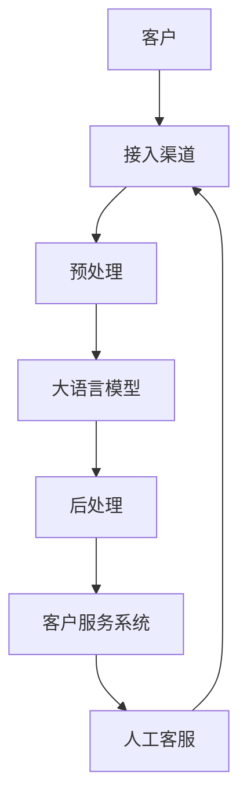

                 

**大语言模型（LLM）在客户服务中的应用：24/7全天候AI助手**

## 1. 背景介绍

在当今快节奏的商业环境中，客户期望随时随地获得帮助和支持。然而，传统的客户服务渠道往往受限于工作时间和人力资源。大语言模型（LLM）的出现为提供24/7全天候客户服务带来了新的可能性。本文将探讨LLM在客户服务中的应用，重点介绍如何构建一个全天候AI助手。

## 2. 核心概念与联系

### 2.1 大语言模型（LLM）

大语言模型是一种深度学习模型，旨在理解和生成人类语言。LLM通过处理大量文本数据来学习语言规则和上下文，从而能够理解和生成人类语言。

### 2.2 客户服务中的LLM应用

在客户服务领域，LLM可以用于自动回答常见问题、提供产品信息、处理简单投诉，甚至模拟人类客服代表与客户的对话。

### 2.3 系统架构

以下是一个简单的LLM驱动客户服务系统的架构图：



## 3. 核心算法原理 & 具体操作步骤

### 3.1 算法原理概述

LLM在客户服务中的应用主要基于以下两个算法：

1. **意图识别（Intent Recognition）**：识别客户的意图，即客户想要什么或想要做什么。
2. **实体提取（Entity Extraction）**：从客户的输入中提取关键实体，如产品名称、日期、地点等。

### 3.2 算法步骤详解

1. **接收客户输入**：客户通过各种渠道（如聊天机器人、语音助手、网站表单等）输入问题或请求。
2. **预处理**：清理和标准化客户输入，如去除停用词、转换为小写等。
3. **意图识别**：使用LLM预训练模型或 fine-tuned 模型来识别客户意图。
4. **实体提取**：使用命名实体识别（NER）算法从客户输入中提取关键实体。
5. **生成响应**：根据识别的意图和提取的实体，使用LLM生成相应的回复。
6. **后处理**：对生成的回复进行后处理，如添加格式、调整语气等。
7. **发送响应**：将生成的回复发送给客户。
8. **评估和迭代**：根据客户反馈和评分，不断改进和优化模型。

### 3.3 算法优缺点

**优点**：

- 24/7全天候支持
- 成本效益高
- 可以处理大量简单查询

**缺点**：

- 无法处理复杂问题
- 可能出现不准确或不相关的回复
- 缺乏人际交流的情感和同理心

### 3.4 算法应用领域

LLM在客户服务中的应用领域包括：

- 电子商务：产品信息、订单状态、退货政策等。
- 金融服务：账户信息、交易历史、转账等。
- 旅游业：机票预订、酒店预订、行程规划等。
- 电信业：服务计划、账单信息、故障报告等。

## 4. 数学模型和公式 & 详细讲解 & 举例说明

### 4.1 数学模型构建

在客户服务领域，我们可以将客户输入看作一个向量$\mathbf{x} \in \mathbb{R}^{d}$, 其中$d$是输入的维度（如词汇表大小）。意图可以表示为一个类别$\mathbf{y} \in \{1, 2,..., K\}$, 其中$K$是意图的数量。实体可以表示为一个向量$\mathbf{e} \in \mathbb{R}^{E}$, 其中$E$是实体的数量。

### 4.2 公式推导过程

我们可以使用条件分布$P(\mathbf{y}, \mathbf{e} | \mathbf{x})$来表示意图和实体的联合分布。使用-chain rule, 我们可以将其分解为：

$$P(\mathbf{y}, \mathbf{e} | \mathbf{x}) = P(\mathbf{y} | \mathbf{x})P(\mathbf{e} | \mathbf{y}, \mathbf{x})$$

其中，$P(\mathbf{y} | \mathbf{x})$是意图分布，而$P(\mathbf{e} | \mathbf{y}, \mathbf{x})$是给定意图的实体分布。

### 4.3 案例分析与讲解

例如，假设客户输入“改变我的密码”。意图可能是“更改密码”，实体可能是“密码”。我们可以使用LLM来预测意图和实体的分布，并根据最大后验概率（MAP）原则选择最可能的意图和实体。

## 5. 项目实践：代码实例和详细解释说明

### 5.1 开发环境搭建

我们将使用Python和Transformers库来构建我们的LLM客户服务系统。首先，安装必要的库：

```bash
pip install transformers torch
```

### 5.2 源代码详细实现

以下是一个简单的LLM客户服务示例：

```python
from transformers import pipeline

# 初始化意图识别和实体提取管道
intent_classifier = pipeline('text-classification', model='path/to/intents_model')
ner_tagger = pipeline('ner', model='path/to/ner_model')

def process_input(input_text):
    # 预处理
    preprocessed_text = preprocess(input_text)

    # 意图识别
    intent = intent_classifier(preprocessed_text)[0]['label']

    # 实体提取
    entities = ner_tagger(preprocessed_text)

    # 生成响应
    response = generate_response(intent, entities)

    return response

# 示例输入
input_text = "改变我的密码"
response = process_input(input_text)
print(response)
```

### 5.3 代码解读与分析

在上述代码中，我们首先初始化意图识别和实体提取管道。然后，我们定义了一个`process_input`函数，接受客户输入，进行预处理，识别意图，提取实体，并生成响应。最后，我们打印生成的响应。

### 5.4 运行结果展示

运行上述代码后，您应该会看到生成的响应。请注意，实际结果将取决于您使用的LLM模型和数据集。

## 6. 实际应用场景

### 6.1 当前应用

LLM已经在各种客户服务领域得到广泛应用，如电子商务、金融服务、旅游业和电信业。例如，阿里巴巴使用LLM驱动的客服机器人处理了数千万个客户查询。

### 6.2 未来应用展望

未来，LLM在客户服务中的应用将更加广泛和深入。我们可以期待：

- **多模式交互**：LLM将能够处理文本、语音和图像等多模式输入。
- **个性化客服**：LLM将能够学习和适应个别客户的偏好和行为。
- **端到端对话**：LLM将能够处理整个客户服务流程，从问题收集到解决方案提供。

## 7. 工具和资源推荐

### 7.1 学习资源推荐

- **书籍**："Natural Language Processing with Python" by Steven Bird, Ewan Klein, and Edward Loper
- **在线课程**：Stanford University's CS224n Natural Language Processing with Deep Learning course

### 7.2 开发工具推荐

- **Transformers库**：一个由Hugging Face开发的强大的LLM库。
- **Dialogflow**：一个由Google开发的构建对话接口的平台。

### 7.3 相关论文推荐

- "End-to-End Memory Networks" by Weston et al.
- "Get To The Point: Summarization with Pointer-Generator Networks" by See et al.

## 8. 总结：未来发展趋势与挑战

### 8.1 研究成果总结

本文介绍了LLM在客户服务中的应用，重点介绍了如何构建一个全天候AI助手。我们讨论了核心概念、算法原理、数学模型，并提供了代码实例。

### 8.2 未来发展趋势

未来，LLM在客户服务中的应用将更加广泛和深入。我们可以期待多模式交互、个性化客服和端到端对话等发展趋势。

### 8.3 面临的挑战

然而，LLM在客户服务中的应用也面临着挑战，如模型泛化能力有限、缺乏情感和同理心、数据隐私和安全等问题。

### 8.4 研究展望

未来的研究将关注于提高LLM的泛化能力、增强模型的情感理解能力、保护数据隐私和安全等方面。

## 9. 附录：常见问题与解答

**Q：LLM在客户服务中的优势是什么？**

**A**：LLM在客户服务中的优势包括24/7全天候支持、成本效益高、可以处理大量简单查询等。

**Q：LLM在客户服务中的缺点是什么？**

**A**：LLM在客户服务中的缺点包括无法处理复杂问题、可能出现不准确或不相关的回复、缺乏人际交流的情感和同理心等。

**Q：LLM在客户服务中的应用领域有哪些？**

**A**：LLM在客户服务中的应用领域包括电子商务、金融服务、旅游业、电信业等。

---

**作者：禅与计算机程序设计艺术 / Zen and the Art of Computer Programming**

