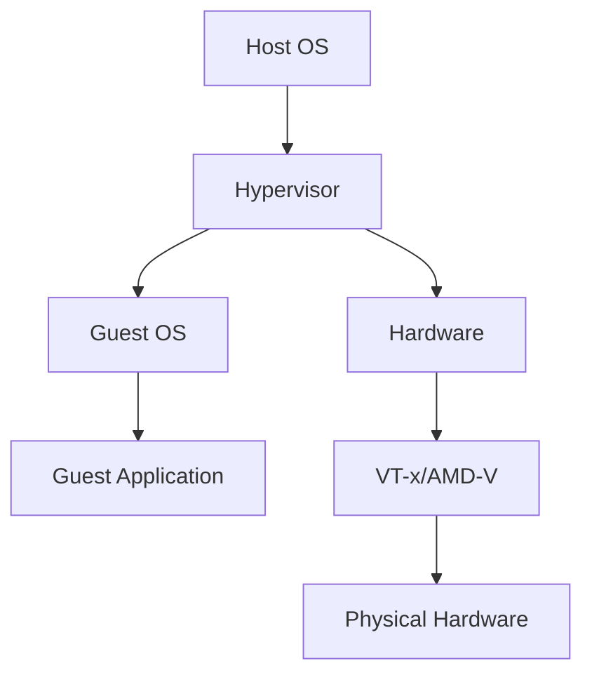

                 

## 1. 背景介绍

虚拟化技术是现代计算机系统的关键组成部分，它允许在单个物理硬件上运行多个操作系统和应用程序。x86虚拟化技术是一种特定于x86架构的虚拟化技术，它允许在x86处理器上运行虚拟机（VM）。本文将深入探讨x86虚拟化技术的发展历程，从Intel的VT-x到AMD的AMD-V，并介绍这些技术的核心概念、算法原理、数学模型，以及项目实践和实际应用场景。

## 2. 核心概念与联系

### 2.1 x86虚拟化的挑战

x86虚拟化面临的主要挑战是x86架构的特殊性。x86处理器具有多种模式，包括实模式（real mode）、保护模式（protected mode）和长模式（long mode），这使得虚拟化变得复杂。此外，x86指令集的丰富性和指令的可变长度也增加了虚拟化的难度。

### 2.2 x86虚拟化的解决方案

为了解决这些挑战，Intel和AMD开发了专门的虚拟化扩展。Intel的VT-x和AMD的AMD-V都是基于硬件辅助的虚拟化技术，它们提供了专门的指令集和模式来支持虚拟化。下图是x86虚拟化技术的总体架构：



## 3. 核心算法原理 & 具体操作步骤

### 3.1 算法原理概述

VT-x和AMD-V都是基于硬件辅助的虚拟化技术，它们使用特殊的指令集和模式来支持虚拟化。这些指令集允许虚拟机监控程序（VMM）控制虚拟机的执行，并提供了对虚拟机的完整控制权。

### 3.2 算法步骤详解

1. **虚拟化启动**：当虚拟机启动时，VMM初始化虚拟机的环境，包括虚拟CPU、虚拟内存和虚拟I/O设备。
2. **虚拟化执行**：VMM使用VT-x/AMD-V指令集来控制虚拟机的执行。当虚拟机尝试执行特权指令或访问保护资源时，VMM会拦截这些指令并进行处理。
3. **虚拟化陷阱**：当虚拟机陷入到VMM时，VMM会根据陷阱原因执行相应的处理逻辑。例如，如果虚拟机尝试访问不存在的内存页面，VMM会进行页面故障处理。
4. **虚拟化退出**：当虚拟机需要退出时，VMM会清理虚拟机的资源，并将控制权返回给宿主操作系统。

### 3.3 算法优缺点

**优点**：

* 提高了虚拟化的性能，因为它使用硬件辅助来支持虚拟化。
* 简化了虚拟化的实现，因为它提供了专门的指令集和模式来支持虚拟化。

**缺点**：

* 它需要特定的处理器支持，这限制了其应用范围。
* 它可能会导致安全问题，因为它允许虚拟机访问物理硬件。

### 3.4 算法应用领域

VT-x和AMD-V广泛应用于云计算、服务器虚拟化和桌面虚拟化。它们允许在单个物理硬件上运行多个操作系统和应用程序，从而提高了资源利用率和系统的灵活性。

## 4. 数学模型和公式 & 详细讲解 & 举例说明

### 4.1 数学模型构建

虚拟化技术的数学模型可以表示为一个四元组（H, G, V, M），其中：

* H表示宿主操作系统，
* G表示客户操作系统，
* V表示虚拟机监控程序，
* M表示物理硬件。

### 4.2 公式推导过程

虚拟化技术的目标是最大化性能，最小化开销。性能可以表示为：

$$P = \frac{Work}{Time}$$

其中，Work表示虚拟机执行的工作量，Time表示虚拟机执行所需的时间。开销可以表示为：

$$O = \frac{Overhead}{Time}$$

其中，Overhead表示虚拟化引入的开销，Time表示虚拟机执行所需的时间。虚拟化技术的目标是最小化开销，最大化性能，即：

$$\max(P) \quad \text{and} \quad \min(O)$$

### 4.3 案例分析与讲解

例如，假设我们有两个虚拟机，一个运行Windows Server，另一个运行Linux。我们想要在单个物理硬件上运行这两个虚拟机。使用VT-x/AMD-V技术，我们可以创建两个虚拟机，每个虚拟机都有自己的虚拟CPU、虚拟内存和虚拟I/O设备。VMM会控制虚拟机的执行，并提供了对虚拟机的完整控制权。

## 5. 项目实践：代码实例和详细解释说明

### 5.1 开发环境搭建

要实现VT-x/AMD-V技术，我们需要一个支持VT-x/AMD-V的处理器，以及一个支持VT-x/AMD-V的虚拟化平台，如VMware Workstation或VirtualBox。

### 5.2 源代码详细实现

实现VT-x/AMD-V技术的关键是编写VMM。VMM需要实现虚拟化执行、虚拟化陷阱和虚拟化退出等功能。以下是VMM的伪代码：

```c
while (true) {
    // 虚拟化执行
    run_virtual_machine();

    // 虚拟化陷阱
    handle_trap();

    // 虚拟化退出
    handle_exit();
}
```

### 5.3 代码解读与分析

在虚拟化执行中，VMM使用VT-x/AMD-V指令集来控制虚拟机的执行。在虚拟化陷阱中，VMM根据陷阱原因执行相应的处理逻辑。在虚拟化退出中，VMM清理虚拟机的资源，并将控制权返回给宿主操作系统。

### 5.4 运行结果展示

当我们运行VMM时，它会创建虚拟机的环境，并开始执行虚拟机。我们可以使用虚拟化平台的管理工具来监控虚拟机的状态，并进行相应的配置。

## 6. 实际应用场景

### 6.1 云计算

VT-x/AMD-V技术广泛应用于云计算领域。云计算提供商使用VT-x/AMD-V技术来在单个物理硬件上运行多个虚拟机，从而提高了资源利用率和系统的灵活性。

### 6.2 服务器虚拟化

VT-x/AMD-V技术也广泛应用于服务器虚拟化领域。服务器虚拟化允许在单个物理服务器上运行多个虚拟服务器，从而提高了服务器的利用率和系统的可靠性。

### 6.3 桌面虚拟化

VT-x/AMD-V技术还应用于桌面虚拟化领域。桌面虚拟化允许用户在单个物理桌面上运行多个虚拟桌面，从而提高了桌面的利用率和系统的灵活性。

### 6.4 未来应用展望

未来，VT-x/AMD-V技术将继续发展，以支持更复杂的虚拟化场景。例如，它将支持更多的虚拟机在单个物理硬件上运行，并提供更高的性能和更低的开销。

## 7. 工具和资源推荐

### 7.1 学习资源推荐

* "Virtualization Technology" by Intel
* "AMD Virtualization" by AMD
* "x86 Virtualization" by PaX Team

### 7.2 开发工具推荐

* VMware Workstation
* VirtualBox
* QEMU

### 7.3 相关论文推荐

* "VT-x: Enabling Secure Virtualization for x86 Processors" by Intel
* "AMD-V: Virtualization Technology for AMD Processors" by AMD
* "x86 Virtualization: A Survey" by PaX Team

## 8. 总结：未来发展趋势与挑战

### 8.1 研究成果总结

本文介绍了x86虚拟化技术的发展历程，从Intel的VT-x到AMD的AMD-V，并介绍了这些技术的核心概念、算法原理、数学模型，以及项目实践和实际应用场景。

### 8.2 未来发展趋势

未来，x86虚拟化技术将继续发展，以支持更复杂的虚拟化场景。它将提供更高的性能和更低的开销，并支持更多的虚拟机在单个物理硬件上运行。

### 8.3 面临的挑战

未来，x86虚拟化技术面临的挑战包括安全问题、性能问题和兼容性问题。它需要解决这些挑战，以满足用户的需求。

### 8.4 研究展望

未来，x86虚拟化技术的研究将集中在以下领域：

* 安全：提高虚拟化的安全性，防止虚拟机之间的互相干扰。
* 性能：提高虚拟化的性能，最小化虚拟化引入的开销。
* 兼容性：提高虚拟化的兼容性，支持更多的操作系统和应用程序。

## 9. 附录：常见问题与解答

**Q1：VT-x和AMD-V有什么区别？**

A1：VT-x是Intel开发的虚拟化扩展，而AMD-V是AMD开发的虚拟化扩展。它们都是基于硬件辅助的虚拟化技术，但它们的实现细节和指令集略有不同。

**Q2：VT-x/AMD-V需要什么样的处理器支持？**

A2：VT-x需要Intel的处理器支持，而AMD-V需要AMD的处理器支持。大多数现代x86处理器都支持VT-x/AMD-V。

**Q3：VT-x/AMD-V是否安全？**

A3：VT-x/AMD-V本身是安全的，但如果不正确配置或使用，它可能会导致安全问题。例如，如果虚拟机之间互相干扰，它可能会导致安全问题。

**Q4：VT-x/AMD-V是否会影响性能？**

A4：是的，VT-x/AMD-V会引入一些开销，从而影响性能。但是，现代虚拟化技术已经大大减少了这些开销，并提供了高性能的虚拟化解决方案。

**Q5：VT-x/AMD-V是否会影响兼容性？**

A5：是的，VT-x/AMD-V可能会影响兼容性。如果虚拟机尝试访问不存在的资源，它可能会导致兼容性问题。正确配置虚拟机和使用兼容的操作系统和应用程序可以解决这些问题。

## 作者：禅与计算机程序设计艺术 / Zen and the Art of Computer Programming

