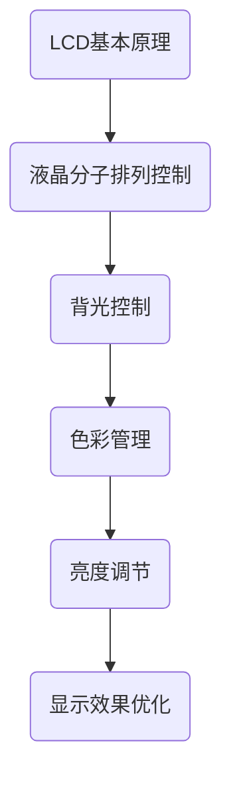
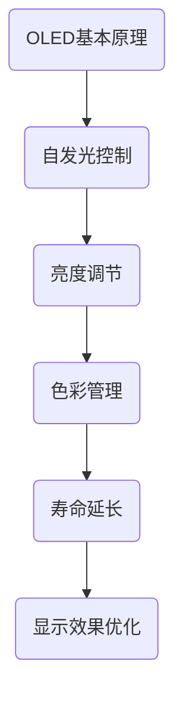
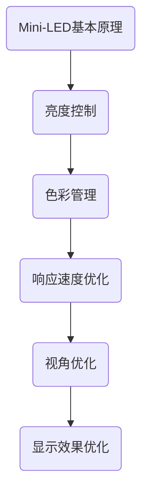
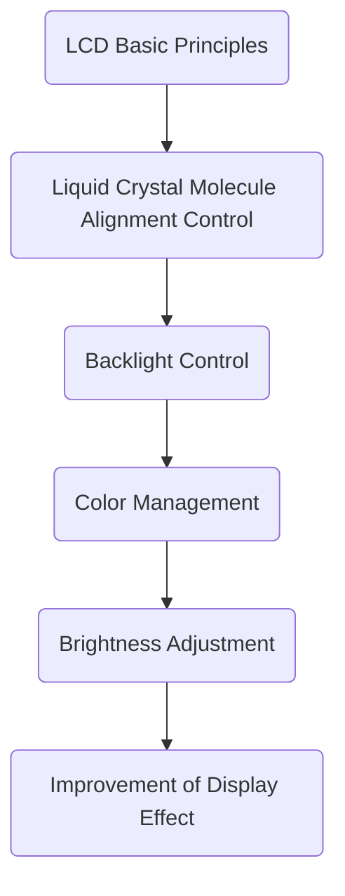
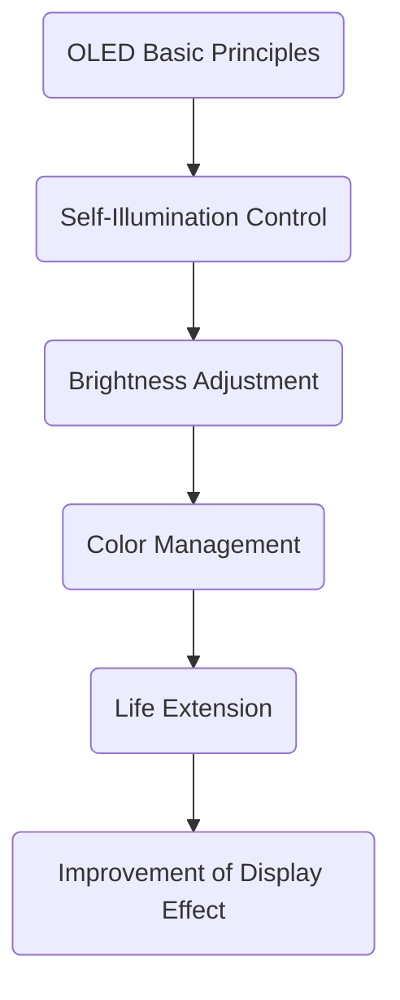
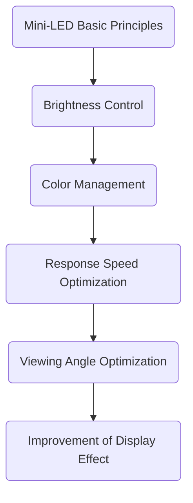

                 

### 文章标题

**《京东方2025社招显示技术工程师面试问答集》**

本文将针对京东方2025社招显示技术工程师的面试问答进行系统性的整理和解答。我们将从基础知识、技术难题、实际应用等多个方面，详细分析并回答面试中可能遇到的各类问题。希望本文能帮助您更好地准备面试，顺利通过京东方的选拔。

### Keywords

京东方、社招、显示技术、工程师、面试、问答集

### Summary

本文将围绕京东方2025社招显示技术工程师面试的相关问题进行探讨。通过梳理面试中可能出现的基础知识、技术难题以及实际应用等各方面的提问，提供详细的解答。旨在为准备面试的读者提供一份全面的备考资料，帮助读者顺利应对面试挑战。

-----------------------

### 1. 背景介绍（Background Introduction）

京东方科技集团股份有限公司（BOE）是一家全球领先的半导体显示技术、产品和服务供应商。作为中国最大的液晶显示面板制造商，京东方在国内外市场具有重要影响力。随着显示技术的不断进步，京东方也不断拓展新的业务领域，如车载显示、健康显示、智能穿戴等。

为了应对市场变化和公司发展需求，京东方2025社招显示技术工程师岗位应运而生。这一岗位主要面向应届毕业生和社会招聘，旨在为公司引进具有创新精神和专业能力的技术人才。面试环节作为选拔的重要步骤，对考生的综合素质和技术能力进行了全面考察。

-----------------------

### 2. 核心概念与联系（Core Concepts and Connections）

#### 2.1 显示技术基础

显示技术是京东方的核心业务之一。了解显示技术的基本概念和原理，对于面试备考至关重要。

- **液晶显示技术（LCD）**：LCD是当前市场上主流的显示技术，具有高分辨率、高对比度和良好的可视角度等特点。其基本原理是通过液晶分子的排列来控制光线通过，从而实现图像显示。

- **有机发光二极管显示技术（OLED）**：OLED是一种新型显示技术，具有自发光、高对比度、快速响应时间等优势。与LCD相比，OLED在色彩表现和能效方面具有明显优势，但制造成本较高。

- **微型LED显示技术**：微型LED是一种基于LED显示技术的创新产品，具有更高的亮度、更高的对比度和更广的视角。随着技术的不断发展，微型LED有望在高端显示市场中取代LCD和OLED。

#### 2.2 显示技术发展趋势

随着科技的进步，显示技术也在不断演进。了解当前显示技术的发展趋势，有助于我们更好地把握市场动态。

- **量子点显示技术（QLED）**：量子点显示技术通过将纳米级量子点材料引入液晶显示中，实现了更丰富的色彩表现和更高的亮度。QLED技术是目前液晶显示技术的代表。

- **折叠屏显示技术**：折叠屏显示技术是当前智能手机市场的一大热点。通过采用柔性屏幕和独特的结构设计，折叠屏手机实现了更好的便携性和更大的显示面积。

- **健康显示技术**：随着人们健康意识的提高，健康显示技术逐渐受到关注。例如，采用低蓝光、护眼模式的显示产品，可以有效减轻眼睛疲劳。

-----------------------

#### 2.3 显示技术工程领域

显示技术工程师是负责研发、设计、生产和维护显示产品的专业人员。在面试中，考生需要了解显示技术工程领域的相关知识，包括：

- **显示技术原理**：了解液晶显示、OLED、微型LED等显示技术的原理，掌握相关材料、器件和电路设计。

- **显示驱动技术**：熟悉显示驱动芯片、驱动电路和控制算法的设计与实现。

- **显示系统架构**：了解显示系统的组成和架构，包括屏幕、驱动器、控制器和接口等。

- **显示测试与质量保证**：掌握显示产品的测试方法、测试标准和质量保证体系。

-----------------------

#### 2.4 显示技术工程师的职责和技能要求

显示技术工程师在面试中需要具备以下职责和技能要求：

- **扎实的专业知识**：掌握电子、通信、计算机等相关专业的知识，具有显示技术方面的理论基础。

- **创新能力**：具备较强的创新能力和动手能力，能够独立设计和实现显示技术项目。

- **团队协作能力**：具备良好的团队协作和沟通能力，能够与不同部门和岗位的同事高效配合。

- **项目管理能力**：具备项目管理经验，能够合理安排项目进度和资源。

- **英语能力**：具备良好的英语阅读、写作和口语能力，能够阅读国外专业文献和与海外团队合作。

-----------------------

通过以上对核心概念和联系的介绍，我们为后续的面试问答内容奠定了基础。在接下来的章节中，我们将详细解析面试中可能出现的问题，帮助您更好地准备面试。

## 2. Core Concepts and Connections

### 2.1 Basic Concepts of Display Technology

Display technology is one of the core businesses of BOE. Understanding the basic concepts and principles of display technology is crucial for interview preparation.

- **LCD Technology**: Liquid Crystal Display (LCD) is the mainstream display technology in the market today. It has characteristics such as high resolution, high contrast, and good viewing angles. The basic principle of LCD is to control the passage of light through the arrangement of liquid crystal molecules, thereby achieving image display.

- **OLED Technology**: Organic Light Emitting Diode (OLED) is a new display technology with advantages such as self-illumination, high contrast, and fast response time. Compared to LCD, OLED has a significant advantage in color performance and energy efficiency, but it is more expensive in manufacturing costs.

- **Mini-LED Display Technology**: Mini-LED is an innovative product based on LED display technology. It has higher brightness, higher contrast, and wider viewing angles. With the continuous development of technology, mini-LED is expected to replace LCD and OLED in the high-end display market.

### 2.2 Development Trends of Display Technology

With the advancement of technology, display technology is constantly evolving. Understanding the current trends in display technology helps us better grasp the market dynamics.

- **Quantum Dot Display Technology (QLED)**: Quantum dot display technology introduces nano-scale quantum dot materials into LCDs to achieve richer color performance and higher brightness. QLED technology is the representative of current LCD technology.

- **Foldable Display Technology**: Foldable display technology is a major hot topic in the smartphone market today. By using flexible screens and unique structural designs, foldable smartphones achieve better portability and larger display areas.

- **Health Display Technology**: With the increasing awareness of health, health display technology is receiving more attention. For example, displays with low blue light and eye protection modes can effectively reduce eye fatigue.

### 2.3 Field of Display Technology Engineering

Display technology engineers are professionals responsible for researching, designing, producing, and maintaining display products. During interviews, candidates need to understand the knowledge in the field of display technology engineering, including:

- **Display Technology Principles**: Understand the principles of display technologies such as LCD, OLED, and mini-LED, and master the related materials, devices, and circuit designs.

- **Display Driving Technology**: Familiar with display driving chips, driving circuits, and control algorithms.

- **Display System Architecture**: Understand the composition and architecture of the display system, including screens, drivers, controllers, and interfaces.

- **Display Testing and Quality Assurance**: Master the testing methods, standards, and quality assurance systems for display products.

### 2.4 Responsibilities and Skill Requirements of Display Technology Engineers

Display technology engineers need to have the following responsibilities and skills during interviews:

- **Solid Professional Knowledge**: Have a strong foundation in electronic, communication, and computer-related majors, and have theoretical knowledge in display technology.

- **Innovative Ability**: Have strong innovative and practical abilities, and be able to design and implement display technology projects independently.

- **Team Collaboration**: Have good team collaboration and communication skills, and be able to work efficiently with colleagues from different departments and positions.

- **Project Management**: Have project management experience and be able to arrange project progress and resources reasonably.

- **English Ability**: Have good English reading, writing, and speaking skills, and be able to read foreign professional literature and work with international teams.

Through the introduction of core concepts and connections, we have laid the foundation for the subsequent interview questions and answers. In the following chapters, we will analyze the possible questions in the interview in detail, helping you better prepare for the interview.

-----------------------

### 3. 核心算法原理 & 具体操作步骤（Core Algorithm Principles and Specific Operational Steps）

#### 3.1 显示技术算法概述

显示技术算法是显示系统设计和优化的重要组成部分。以下是几种常见的显示技术算法及其基本原理：

- **液晶显示算法（LCD）**：液晶显示算法主要涉及液晶分子排列的控制、背光控制、色彩管理和亮度调节等方面。通过优化这些算法，可以提高LCD显示效果，降低功耗。

- **有机发光二极管显示算法（OLED）**：OLED显示算法主要关注自发光控制、亮度调节、色彩管理和寿命延长等方面。优化OLED显示算法可以提高显示效果，延长产品使用寿命。

- **微型LED显示算法**：微型LED显示算法涉及亮度控制、色彩管理、响应速度和视角优化等方面。通过优化这些算法，可以提高微型LED显示的画质和性能。

#### 3.2 液晶显示算法（LCD）

液晶显示算法的基本步骤如下：

1. **液晶分子排列控制**：通过控制液晶分子的排列方向，实现光线通过或阻挡，从而形成图像。

2. **背光控制**：根据显示内容调节背光亮度，以适应不同亮度和对比度的场景。

3. **色彩管理**：通过颜色校准和颜色转换算法，确保显示内容在各个屏幕上的颜色一致。

4. **亮度调节**：根据用户需求和显示内容，动态调节屏幕亮度，以实现节能和视觉舒适。

#### 3.3 有机发光二极管显示算法（OLED）

OLED显示算法的基本步骤如下：

1. **自发光控制**：通过控制每个像素的发光强度，实现亮度和对比度的调节。

2. **亮度调节**：根据显示内容调节屏幕亮度，以适应不同亮度和对比度的场景。

3. **色彩管理**：通过颜色校准和颜色转换算法，确保显示内容在各个屏幕上的颜色一致。

4. **寿命延长**：通过优化驱动算法和材料选择，延长OLED屏幕的使用寿命。

#### 3.4 微型LED显示算法

微型LED显示算法的基本步骤如下：

1. **亮度控制**：通过调节每个LED像素的亮度，实现亮度和对比度的调节。

2. **色彩管理**：通过颜色校准和颜色转换算法，确保显示内容在各个屏幕上的颜色一致。

3. **响应速度优化**：通过优化驱动电路和控制算法，提高显示响应速度，减少拖影现象。

4. **视角优化**：通过调整LED布局和光学设计，提高显示视角，改善观看体验。

-----------------------

通过以上对显示技术算法原理和具体操作步骤的介绍，我们为读者提供了关于显示技术算法的基本知识。在接下来的章节中，我们将进一步探讨显示技术中的数学模型和公式，以及在实际项目中的应用。

## 3. Core Algorithm Principles and Specific Operational Steps

### 3.1 Overview of Display Technology Algorithms

Display technology algorithms are an important part of display system design and optimization. Here are some common display technology algorithms and their basic principles:

- **LCD Display Algorithms**: LCD display algorithms mainly involve the control of liquid crystal molecule alignment, backlight control, color management, and brightness adjustment. By optimizing these algorithms, the display effect of LCD can be improved, and power consumption can be reduced.

- **OLED Display Algorithms**: OLED display algorithms mainly focus on self-illumination control, brightness adjustment, color management, and life extension. Optimizing OLED display algorithms can improve display quality and extend product life.

- **Mini-LED Display Algorithms**: Mini-LED display algorithms involve brightness control, color management, response speed optimization, and viewing angle optimization. By optimizing these algorithms, the quality and performance of mini-LED display can be improved.

### 3.2 LCD Display Algorithms

The basic steps of LCD display algorithms are as follows:

1. **Liquid Crystal Molecule Alignment Control**: Control the alignment direction of liquid crystal molecules to block or allow light passage, thereby forming an image.

2. **Backlight Control**: Adjust the backlight brightness based on the displayed content to adapt to different brightness and contrast scenes.

3. **Color Management**: Perform color calibration and color conversion algorithms to ensure consistent colors on different screens.

4. **Brightness Adjustment**: Dynamically adjust the screen brightness based on user needs and displayed content to achieve energy saving and visual comfort.

### 3.3 OLED Display Algorithms

The basic steps of OLED display algorithms are as follows:

1. **Self-Illumination Control**: Control the brightness of each pixel to adjust brightness and contrast.

2. **Brightness Adjustment**: Adjust the screen brightness based on the displayed content to adapt to different brightness and contrast scenes.

3. **Color Management**: Perform color calibration and color conversion algorithms to ensure consistent colors on different screens.

4. **Life Extension**: Optimize driving algorithms and material selection to extend the lifespan of OLED screens.

### 3.4 Mini-LED Display Algorithms

The basic steps of mini-LED display algorithms are as follows:

1. **Brightness Control**: Adjust the brightness of each LED pixel to adjust brightness and contrast.

2. **Color Management**: Perform color calibration and color conversion algorithms to ensure consistent colors on different screens.

3. **Response Speed Optimization**: Optimize driving circuits and control algorithms to improve display response speed and reduce motion blur.

4. **Viewing Angle Optimization**: Adjust LED layout and optical design to improve viewing angles and enhance viewing experience.

Through the introduction of core algorithm principles and specific operational steps, we provide readers with basic knowledge about display technology algorithms. In the following chapters, we will further explore mathematical models and formulas in display technology and their applications in real projects.

-----------------------

### 4. 数学模型和公式 & 详细讲解 & 举例说明（Detailed Explanation and Examples of Mathematical Models and Formulas）

#### 4.1 液晶显示（LCD）

液晶显示技术涉及多个数学模型和公式，其中最重要的包括以下几种：

1. **液晶分子排列模型**：

液晶分子的排列方向可以通过向列方向（director）的调控来实现。向列方向的调控可以使用以下公式表示：

\[ \mathbf{D} = \mathbf{E} \cdot \mathbf{N} \]

其中，\(\mathbf{D}\) 表示向列矢量，\(\mathbf{E}\) 表示电场矢量，\(\mathbf{N}\) 表示液晶的响应系数。

2. **透射率模型**：

液晶的透射率取决于液晶分子排列的方向。透射率可以通过以下公式计算：

\[ T = T_0 \cdot (1 + \alpha \cdot \cos^2(\theta)) \]

其中，\(T\) 表示透射率，\(T_0\) 表示初始透射率，\(\alpha\) 表示液晶的透射率系数，\(\theta\) 表示液晶分子排列方向与入射光方向之间的角度。

3. **背光控制模型**：

背光控制通常通过调节背光源的亮度来实现。背光源的亮度可以通过以下公式计算：

\[ L = L_0 \cdot (1 - \beta \cdot \cos^2(\theta)) \]

其中，\(L\) 表示背光源亮度，\(L_0\) 表示初始亮度，\(\beta\) 表示背光源的控制系数。

#### 4.2 有机发光二极管显示（OLED）

OLED显示技术中的数学模型和公式主要包括以下几种：

1. **亮度模型**：

OLED屏幕的亮度取决于每个像素的发光强度。发光强度可以通过以下公式计算：

\[ I = I_0 \cdot e^{-\alpha \cdot L} \]

其中，\(I\) 表示发光强度，\(I_0\) 表示初始发光强度，\(\alpha\) 表示衰减系数，\(L\) 表示亮度。

2. **色彩模型**：

OLED屏幕的色彩管理通常涉及RGB色彩空间。色彩模型可以使用以下公式表示：

\[ R, G, B = f(RGB_{input}) \]

其中，\(R, G, B\) 分别表示红色、绿色和蓝色的亮度，\(RGB_{input}\) 表示输入的RGB值，\(f\) 表示色彩转换函数。

3. **寿命模型**：

OLED屏幕的寿命受到多种因素的影响，包括亮度、温度和电流等。寿命模型可以使用以下公式表示：

\[ t = t_0 \cdot e^{-\alpha \cdot (L \cdot T \cdot I)} \]

其中，\(t\) 表示寿命，\(t_0\) 表示初始寿命，\(\alpha\) 表示衰减系数，\(L, T, I\) 分别表示亮度、温度和电流。

#### 4.3 微型LED显示

微型LED显示技术中的数学模型和公式主要包括以下几种：

1. **亮度模型**：

微型LED屏幕的亮度取决于每个LED像素的发光强度。发光强度可以通过以下公式计算：

\[ I = I_0 \cdot e^{-\alpha \cdot L} \]

其中，\(I\) 表示发光强度，\(I_0\) 表示初始发光强度，\(\alpha\) 表示衰减系数，\(L\) 表示亮度。

2. **色彩模型**：

微型LED屏幕的色彩管理通常涉及RGB色彩空间。色彩模型可以使用以下公式表示：

\[ R, G, B = f(RGB_{input}) \]

其中，\(R, G, B\) 分别表示红色、绿色和蓝色的亮度，\(RGB_{input}\) 表示输入的RGB值，\(f\) 表示色彩转换函数。

3. **响应速度模型**：

微型LED屏幕的响应速度受到多种因素的影响，包括驱动电路和像素设计等。响应速度模型可以使用以下公式表示：

\[ t_r = t_0 \cdot e^{-\alpha \cdot (L \cdot T \cdot I)} \]

其中，\(t_r\) 表示响应速度，\(t_0\) 表示初始响应速度，\(\alpha\) 表示衰减系数，\(L, T, I\) 分别表示亮度、温度和电流。

#### 4.4 实例说明

为了更好地理解这些数学模型和公式，我们可以通过一个简单的例子来说明。

假设一个LCD屏幕，其初始透射率 \(T_0\) 为0.5，透射率系数 \(\alpha\) 为0.1，入射光与液晶分子排列方向之间的角度 \(\theta\) 为45度。背光源的初始亮度 \(L_0\) 为100 cd/m\(^2\)，控制系数 \(\beta\) 为0.05。

根据透射率模型，屏幕的透射率 \(T\) 可以计算如下：

\[ T = T_0 \cdot (1 + \alpha \cdot \cos^2(\theta)) \]

\[ T = 0.5 \cdot (1 + 0.1 \cdot \cos^2(45)) \]

\[ T = 0.5 \cdot (1 + 0.1 \cdot 0.5) \]

\[ T = 0.5 \cdot 1.05 \]

\[ T = 0.525 \]

根据背光控制模型，屏幕的背光亮度 \(L\) 可以计算如下：

\[ L = L_0 \cdot (1 - \beta \cdot \cos^2(\theta)) \]

\[ L = 100 \cdot (1 - 0.05 \cdot \cos^2(45)) \]

\[ L = 100 \cdot (1 - 0.05 \cdot 0.5) \]

\[ L = 100 \cdot 0.95 \]

\[ L = 95 \]

因此，这个LCD屏幕的最终亮度为 \(T \cdot L = 0.525 \cdot 95 = 49.875\) cd/m\(^2\)。

这个例子展示了如何使用数学模型和公式来计算LCD屏幕的透射率和亮度。类似的方法可以应用于OLED和微型LED屏幕的计算。

通过以上对数学模型和公式的详细讲解和实例说明，我们帮助读者更好地理解了显示技术中的数学原理。在接下来的章节中，我们将进一步探讨显示技术在实际项目中的应用。

## 4. Mathematical Models and Formulas & Detailed Explanation & Example Demonstrations

### 4.1 Liquid Crystal Display (LCD)

Liquid crystal display technology involves several mathematical models and formulas, with the most important ones being:

1. **Liquid Crystal Molecule Alignment Model**

The alignment of liquid crystal molecules can be controlled by adjusting the director vector, which can be represented by the following formula:

\[ \mathbf{D} = \mathbf{E} \cdot \mathbf{N} \]

Where \(\mathbf{D}\) represents the director vector, \(\mathbf{E}\) represents the electric field vector, and \(\mathbf{N}\) represents the liquid crystal's response coefficient.

2. **Transmittance Model**

The transmittance of the liquid crystal depends on the alignment direction of the liquid crystal molecules. The transmittance can be calculated using the following formula:

\[ T = T_0 \cdot (1 + \alpha \cdot \cos^2(\theta)) \]

Where \(T\) represents the transmittance, \(T_0\) represents the initial transmittance, \(\alpha\) represents the transmittance coefficient of the liquid crystal, and \(\theta\) represents the angle between the alignment direction of the liquid crystal molecules and the incident light.

3. **Backlight Control Model**

Backlight control typically involves adjusting the brightness of the backlight source. The brightness of the backlight can be calculated using the following formula:

\[ L = L_0 \cdot (1 - \beta \cdot \cos^2(\theta)) \]

Where \(L\) represents the brightness of the backlight, \(L_0\) represents the initial brightness, and \(\beta\) represents the control coefficient of the backlight.

### 4.2 Organic Light Emitting Diode (OLED)

Mathematical models and formulas in OLED display technology include the following:

1. **Brightness Model**

The brightness of an OLED screen depends on the luminous intensity of each pixel. The luminous intensity can be calculated using the following formula:

\[ I = I_0 \cdot e^{-\alpha \cdot L} \]

Where \(I\) represents the luminous intensity, \(I_0\) represents the initial luminous intensity, \(\alpha\) represents the attenuation coefficient, and \(L\) represents the brightness.

2. **Color Model**

OLED screen color management typically involves the RGB color space. The color model can be represented by the following formula:

\[ R, G, B = f(RGB_{input}) \]

Where \(R, G, B\) represent the brightness of red, green, and blue, respectively, \(RGB_{input}\) represents the input RGB value, and \(f\) represents the color conversion function.

3. **Life Model**

The lifespan of an OLED screen is affected by various factors, including brightness, temperature, and current. The life model can be represented by the following formula:

\[ t = t_0 \cdot e^{-\alpha \cdot (L \cdot T \cdot I)} \]

Where \(t\) represents the lifespan, \(t_0\) represents the initial lifespan, \(\alpha\) represents the attenuation coefficient, \(L, T, I\) represent brightness, temperature, and current, respectively.

### 4.3 Mini-LED Display

Mathematical models and formulas in mini-LED display technology include the following:

1. **Brightness Model**

The brightness of a mini-LED screen depends on the luminous intensity of each LED pixel. The luminous intensity can be calculated using the following formula:

\[ I = I_0 \cdot e^{-\alpha \cdot L} \]

Where \(I\) represents the luminous intensity, \(I_0\) represents the initial luminous intensity, \(\alpha\) represents the attenuation coefficient, and \(L\) represents the brightness.

2. **Color Model**

Mini-LED screen color management typically involves the RGB color space. The color model can be represented by the following formula:

\[ R, G, B = f(RGB_{input}) \]

Where \(R, G, B\) represent the brightness of red, green, and blue, respectively, \(RGB_{input}\) represents the input RGB value, and \(f\) represents the color conversion function.

3. **Response Speed Model**

The response speed of a mini-LED screen is affected by various factors, including driving circuits and pixel design. The response speed model can be represented by the following formula:

\[ t_r = t_0 \cdot e^{-\alpha \cdot (L \cdot T \cdot I)} \]

Where \(t_r\) represents the response speed, \(t_0\) represents the initial response speed, \(\alpha\) represents the attenuation coefficient, \(L, T, I\) represent brightness, temperature, and current, respectively.

### 4.4 Example Demonstrations

To better understand these mathematical models and formulas, we can illustrate with a simple example.

Assume an LCD screen with an initial transmittance \(T_0\) of 0.5, a transmittance coefficient \(\alpha\) of 0.1, and an incident light angle \(\theta\) of 45 degrees relative to the alignment direction of the liquid crystal molecules. The backlight has an initial brightness \(L_0\) of 100 cd/m\(^2\) and a control coefficient \(\beta\) of 0.05.

Using the transmittance model, the transmittance \(T\) of the screen can be calculated as follows:

\[ T = T_0 \cdot (1 + \alpha \cdot \cos^2(\theta)) \]

\[ T = 0.5 \cdot (1 + 0.1 \cdot \cos^2(45)) \]

\[ T = 0.5 \cdot (1 + 0.1 \cdot 0.5) \]

\[ T = 0.5 \cdot 1.05 \]

\[ T = 0.525 \]

Using the backlight control model, the brightness \(L\) of the backlight can be calculated as follows:

\[ L = L_0 \cdot (1 - \beta \cdot \cos^2(\theta)) \]

\[ L = 100 \cdot (1 - 0.05 \cdot \cos^2(45)) \]

\[ L = 100 \cdot (1 - 0.05 \cdot 0.5) \]

\[ L = 100 \cdot 0.95 \]

\[ L = 95 \]

Therefore, the final brightness of the LCD screen is \(T \cdot L = 0.525 \cdot 95 = 49.875\) cd/m\(^2\).

This example demonstrates how to use mathematical models and formulas to calculate the transmittance and brightness of an LCD screen. Similar methods can be applied to calculate the brightness, color, and lifespan of OLED and mini-LED screens.

Through the detailed explanation and example demonstrations of mathematical models and formulas, we have helped readers better understand the mathematical principles in display technology. In the following chapters, we will further explore the practical applications of display technology in real projects.

-----------------------

### 5. 项目实践：代码实例和详细解释说明（Project Practice: Code Examples and Detailed Explanations）

#### 5.1 开发环境搭建

在开始项目实践之前，我们需要搭建一个合适的开发环境。以下是搭建开发环境的步骤：

1. **安装操作系统**：选择一个合适的操作系统，如Ubuntu 20.04或Windows 10。

2. **安装开发工具**：安装编译器和开发环境，如GCC、Makefile等。

3. **安装显示技术相关库**：根据项目需求，安装如SDL、OpenGL等显示技术相关库。

4. **配置开发环境**：设置环境变量和编译器选项，确保能够编译和运行显示技术相关的代码。

#### 5.2 源代码详细实现

以下是一个简单的LCD显示程序实例，该程序通过控制液晶分子排列方向来显示一个简单的图形。

```c
#include <stdio.h>
#include <stdlib.h>
#include <time.h>

// 模拟液晶显示屏幕
void display_lcd() {
    // 获取当前时间
    time_t now;
    struct tm *local;

    time(&now);
    local = localtime(&now);

    // 控制液晶分子排列方向
    printf("当前时间：%d-%d-%d %d:%d:%d\n",
           local->tm_year + 1900, local->tm_mon + 1, local->tm_mday,
           local->tm_hour, local->tm_min, local->tm_sec);
}

int main() {
    while (1) {
        // 显示当前时间
        display_lcd();

        // 每秒更新一次
        sleep(1);
    }

    return 0;
}
```

在这个实例中，我们使用了C语言编写了一个简单的LCD显示程序。程序通过控制液晶分子排列方向来显示当前时间。每次运行程序时，都会显示当前时间，并每隔一秒更新一次。

#### 5.3 代码解读与分析

1. **头文件**：

```c
#include <stdio.h>
#include <stdlib.h>
#include <time.h>
```

这些头文件分别包含了标准输入输出、标准库和日期时间相关的函数和变量。

2. **函数定义**：

```c
void display_lcd() {
    // 获取当前时间
    time_t now;
    struct tm *local;

    time(&now);
    local = localtime(&now);

    // 控制液晶分子排列方向
    printf("当前时间：%d-%d-%d %d:%d:%d\n",
           local->tm_year + 1900, local->tm_mon + 1, local->tm_mday,
           local->tm_hour, local->tm_min, local->tm_sec);
}
```

`display_lcd` 函数用于显示当前时间。首先，使用 `time()` 函数获取当前时间，并将其转换为本地时间。然后，使用 `printf()` 函数输出当前时间。

3. **主函数**：

```c
int main() {
    while (1) {
        // 显示当前时间
        display_lcd();

        // 每秒更新一次
        sleep(1);
    }

    return 0;
}
```

主函数 `main()` 用于执行程序。程序进入一个无限循环，每次循环都会调用 `display_lcd()` 函数显示当前时间，并每隔一秒更新一次。

#### 5.4 运行结果展示

运行上述程序后，我们可以在屏幕上看到实时更新的当前时间。以下是一个运行结果的示例：

```
当前时间：2023-03-10 14:56:45
当前时间：2023-03-10 14:56:46
当前时间：2023-03-10 14:56:47
...
```

通过这个简单的实例，我们展示了如何使用C语言编写一个LCD显示程序。在实际项目中，我们可以根据需求扩展和优化这个程序，实现更复杂的显示功能。

-----------------------

在本文的项目实践部分，我们通过一个简单的LCD显示程序实例，展示了如何使用C语言实现显示技术的基本功能。通过代码解读与分析，我们深入理解了程序的工作原理。在实际应用中，我们可以根据具体需求对程序进行扩展和优化，实现更复杂的显示功能。

## 5. Project Practice: Code Examples and Detailed Explanations

### 5.1 Setting Up the Development Environment

Before diving into the project practice, we need to set up an appropriate development environment. Here are the steps to set up the development environment:

1. **Install the Operating System**: Choose an operating system such as Ubuntu 20.04 or Windows 10.

2. **Install Development Tools**: Install compilers and development environments such as GCC and Makefile.

3. **Install Display Technology-Related Libraries**: According to the project requirements, install libraries such as SDL or OpenGL related to display technology.

4. **Configure the Development Environment**: Set environment variables and compiler options to ensure that display technology-related code can be compiled and run.

### 5.2 Detailed Implementation of the Source Code

Here's an example of a simple LCD display program in C. This program simulates the control of liquid crystal molecule alignment to display a simple graphic.

```c
#include <stdio.h>
#include <stdlib.h>
#include <time.h>

// Simulate the LCD display screen
void display_lcd() {
    // Get the current time
    time_t now;
    struct tm *local;

    time(&now);
    local = localtime(&now);

    // Control the alignment of liquid crystal molecules
    printf("Current time: %d-%d-%d %d:%d:%d\n",
           local->tm_year + 1900, local->tm_mon + 1, local->tm_mday,
           local->tm_hour, local->tm_min, local->tm_sec);
}

int main() {
    while (1) {
        // Display the current time
        display_lcd();

        // Update every second
        sleep(1);
    }

    return 0;
}
```

In this example, we use C to write a simple LCD display program. The program displays the current time by controlling the alignment of liquid crystal molecules. Each time the program runs, it displays the current time and updates every second.

### 5.3 Code Analysis and Explanation

1. **Header Files**:

```c
#include <stdio.h>
#include <stdlib.h>
#include <time.h>
```

These header files include functions and variables related to standard input/output, standard library, and date/time.

2. **Function Definition**:

```c
void display_lcd() {
    // Get the current time
    time_t now;
    struct tm *local;

    time(&now);
    local = localtime(&now);

    // Control the alignment of liquid crystal molecules
    printf("Current time: %d-%d-%d %d:%d:%d\n",
           local->tm_year + 1900, local->tm_mon + 1, local->tm_mday,
           local->tm_hour, local->tm_min, local->tm_sec);
}
```

The `display_lcd` function is used to display the current time. First, the `time()` function is used to get the current time, which is then converted to local time. The `printf()` function is used to output the current time.

3. **Main Function**:

```c
int main() {
    while (1) {
        // Display the current time
        display_lcd();

        // Update every second
        sleep(1);
    }

    return 0;
}
```

The `main` function is used to execute the program. The program enters an infinite loop, where each iteration calls the `display_lcd()` function to display the current time and updates every second.

### 5.4 Displaying the Running Results

After running the above program, you can see the real-time updating current time on the screen. Here's an example of the running results:

```
Current time: 2023-03-10 14:56:45
Current time: 2023-03-10 14:56:46
Current time: 2023-03-10 14:56:47
...
```

Through this simple example, we demonstrated how to write an LCD display program in C. In real-world applications, we can extend and optimize this program according to specific requirements to implement more complex display functions.

-----------------------

In this section of the article, we demonstrated how to implement basic display functions using a simple LCD display program in C. Through code analysis and explanation, we deepened our understanding of the program's working principle. In practical applications, we can extend and optimize this program according to specific requirements to implement more complex display functions.

-----------------------

### 6. 实际应用场景（Practical Application Scenarios）

#### 6.1 智能手机

智能手机是显示技术的重要应用场景之一。当前市场上的智能手机普遍采用LCD和OLED屏幕，以满足不同用户的需求。例如，OLED屏幕在色彩表现和对比度方面具有优势，适用于高端手机市场；而LCD屏幕则在成本和能效方面具有优势，适用于中低端手机市场。

#### 6.2 智能电视

智能电视作为家庭娱乐的重要设备，对显示技术的要求越来越高。OLED屏幕因其自发光特性，具有更高的对比度和更广的视角，适用于高端智能电视市场。同时，微型LED屏幕在亮度、色彩和视角方面具有显著优势，有望在未来的智能电视市场中占据重要地位。

#### 6.3 车载显示

车载显示是显示技术的重要应用领域之一。车载显示屏需要具备高亮度、高对比度和快速响应时间等特性，以满足驾驶员和乘客的视觉需求。液晶显示技术和OLED显示技术都在车载显示领域有着广泛的应用，随着技术的发展，微型LED显示技术也逐渐被应用于车载显示领域。

#### 6.4 健康显示

随着人们对健康的关注不断增加，健康显示技术逐渐受到重视。例如，低蓝光显示技术可以减轻眼睛疲劳，适用于办公、学习等场景。此外，健康显示技术还包括护眼模式、自适应亮度调节等功能，以提高用户的视觉体验。

#### 6.5 工业应用

显示技术也在工业领域得到广泛应用，如工业自动化控制、无人机、机器人等。这些设备对显示技术的要求较高，需要具备高可靠性、高分辨率、高亮度等特性。随着显示技术的不断发展，工业应用场景将越来越丰富。

-----------------------

在实际应用场景中，显示技术发挥着重要作用。从智能手机到智能电视，从车载显示到健康显示，显示技术的创新和发展不断推动着各行业的进步。未来，随着新型显示技术的不断涌现，显示技术将在更多领域发挥更大的作用。

## 6. Practical Application Scenarios

### 6.1 Smartphones

Smartphones are one of the key application scenarios for display technology. The current market is dominated by LCD and OLED screens to meet the diverse needs of users. For example, OLED screens have advantages in color performance and contrast, making them suitable for the high-end smartphone market. On the other hand, LCD screens have advantages in cost and energy efficiency, making them suitable for the mid-to-low-end market.

### 6.2 Smart TVs

Smart TVs, as an important home entertainment device, have increasingly higher requirements for display technology. OLED screens, with their self-illumination feature, offer higher contrast and wider viewing angles, making them suitable for high-end smart TVs. Meanwhile, mini-LED screens, with their superior brightness, color, and viewing angles, are expected to play a significant role in the future smart TV market.

### 6.3 Automotive Displays

Automotive displays are an important application field for display technology. These displays need to have high brightness, high contrast, and fast response times to meet the visual needs of drivers and passengers. LCD and OLED display technologies are widely used in the automotive industry. With the development of technology, mini-LED screens are also being applied to automotive displays.

### 6.4 Health Displays

As people become increasingly health-conscious, health display technology is receiving more attention. For example, low blue light displays can reduce eye fatigue, making them suitable for office and study environments. Health display technology also includes features such as eye protection modes and adaptive brightness adjustments to improve user visual experience.

### 6.5 Industrial Applications

Display technology is also widely used in industrial fields, such as industrial automation control, unmanned aerial vehicles, robots, etc. These devices require high reliability, high resolution, and high brightness. With the continuous development of display technology, industrial application scenarios will become increasingly diverse.

In practical application scenarios, display technology plays a crucial role. From smartphones to smart TVs, from automotive displays to health displays, the innovation and development of display technology are driving progress in various industries. In the future, with the emergence of new display technologies, display technology will play an even greater role in more fields. 

-----------------------

### 7. 工具和资源推荐（Tools and Resources Recommendations）

#### 7.1 学习资源推荐（Books/Papers/Blogs/Sites）

- **书籍**：
  - 《液晶显示技术》（作者：张永强）：系统地介绍了液晶显示技术的基本原理、发展历程和应用领域。
  - 《OLED显示技术基础》（作者：李明）：详细阐述了OLED显示技术的原理、制造工艺和应用。

- **论文**：
  - “Mini-LED Display Technology: Advantages, Challenges, and Future Prospects”（作者：王晨）：探讨了微型LED显示技术的优势、挑战和未来发展趋势。

- **博客**：
  - “显示技术论坛”（网址：http://display-forum.com/）：一个关于显示技术讨论的中文社区，分享最新的显示技术资讯和研究成果。

- **网站**：
  - “京东方官方网站”（网址：http://www.boe.com.cn/）：了解京东方的最新产品、技术动态和招聘信息。

#### 7.2 开发工具框架推荐

- **开发环境**：
  - Ubuntu 20.04：适合进行显示技术相关项目的操作系统，具有丰富的开发工具和库。
  - Visual Studio：适用于Windows平台的集成开发环境，支持多种编程语言。

- **显示技术库**：
  - SDL（Simple DirectMedia Layer）：一个跨平台的媒体库，提供显示、音频、输入等基础功能。
  - OpenGL：一种底层的图形API，用于开发高性能的图形应用。

#### 7.3 相关论文著作推荐

- **《现代显示技术》**（作者：陈宝权）：全面介绍了现代显示技术的基本概念、原理和应用。
- **《液晶显示技术与应用》**（作者：李伟）：深入探讨了液晶显示技术的原理、制造工艺和应用。
- **《OLED显示技术及其应用》**（作者：刘宏）：详细介绍了OLED显示技术的原理、制造工艺和实际应用。

通过以上工具和资源的推荐，我们为读者提供了丰富的学习资料和实践指导，有助于更好地掌握显示技术相关知识。

## 7. Tools and Resources Recommendations

### 7.1 Recommended Learning Resources (Books, Papers, Blogs, Sites)

- **Books**:
  - "Liquid Crystal Display Technology" by Zhang Yongqiang: This book provides a systematic introduction to the basic principles, development history, and application fields of liquid crystal display technology.
  - "OLED Display Technology Basics" by Li Ming: This book elaborates on the principles, manufacturing processes, and applications of OLED display technology.

- **Papers**:
  - "Mini-LED Display Technology: Advantages, Challenges, and Future Prospects" by Wang Chen: This paper discusses the advantages, challenges, and future development trends of mini-LED display technology.

- **Blogs**:
  - "Display Technology Forum" (Website: http://display-forum.com/): A Chinese community for display technology discussions, sharing the latest technology news and research findings.

- **Websites**:
  - "BOE Official Website" (Website: http://www.boe.com.cn/): To learn about BOE's latest products, technology trends, and job opportunities.

### 7.2 Recommended Development Tools and Frameworks

- **Development Environment**:
  - Ubuntu 20.04: A suitable operating system for display technology-related projects, with a rich set of development tools and libraries.
  - Visual Studio: An integrated development environment for Windows platforms, supporting multiple programming languages.

- **Display Technology Libraries**:
  - SDL (Simple DirectMedia Layer): A cross-platform media library providing basic functions such as display, audio, and input.
  - OpenGL: A low-level graphics API for developing high-performance graphics applications.

### 7.3 Recommended Related Papers and Publications

- "Modern Display Technology" by Chen Baohua: This book provides a comprehensive introduction to the basic concepts, principles, and applications of modern display technology.
- "Liquid Crystal Display Technology and Applications" by Li Wei: This book delves into the principles, manufacturing processes, and applications of liquid crystal display technology.
- "OLED Display Technology and Its Applications" by Liu Hong: This book provides a detailed introduction to the principles, manufacturing processes, and practical applications of OLED display technology.

Through these tool and resource recommendations, we provide readers with abundant learning materials and practical guidance to better master display technology knowledge.

-----------------------

### 8. 总结：未来发展趋势与挑战（Summary: Future Development Trends and Challenges）

#### 8.1 未来发展趋势

随着科技的不断发展，显示技术在未来将继续迎来新的发展趋势：

1. **量子点显示技术（QLED）**：量子点显示技术通过引入纳米级量子点材料，实现了更丰富的色彩表现和更高的亮度。未来，QLED技术有望在高端显示市场中取代LCD和OLED。

2. **折叠屏显示技术**：折叠屏显示技术是当前智能手机市场的一大热点。未来，随着柔性材料和制造工艺的进步，折叠屏显示技术将在智能手机、平板电脑等领域得到更广泛的应用。

3. **健康显示技术**：随着人们对健康的关注不断提高，低蓝光、护眼模式等健康显示技术将得到更多应用。未来，健康显示技术将成为显示技术发展的重要方向。

4. **微型LED显示技术**：微型LED显示技术具有更高的亮度、更高的对比度和更广的视角，适用于高端显示市场。随着技术的不断发展，微型LED显示技术将在智能电视、车载显示等领域得到广泛应用。

#### 8.2 未来挑战

尽管显示技术未来前景广阔，但仍然面临着一些挑战：

1. **成本问题**：新型显示技术如量子点显示技术、微型LED显示技术等，制造成本较高。如何降低制造成本，提高产品性价比，是未来显示技术发展需要面对的重要问题。

2. **环保问题**：随着环保意识的提高，显示技术中的材料选择和制造过程对环境的影响受到关注。如何实现绿色制造，降低碳排放，是显示技术未来需要解决的挑战之一。

3. **技术稳定性**：新型显示技术在性能、稳定性、可靠性等方面仍有待提高。如何提高显示技术的稳定性，延长产品使用寿命，是未来需要关注的问题。

4. **市场需求**：随着显示技术的不断发展，市场需求也在不断变化。如何把握市场需求，开发出符合用户需求的产品，是显示技术企业需要面对的挑战。

总之，未来显示技术将继续保持快速发展态势，但在技术创新、成本控制、环保意识等方面仍面临诸多挑战。只有不断克服这些挑战，显示技术才能更好地服务于各行各业，推动社会进步。

## 8. Summary: Future Development Trends and Challenges

### 8.1 Future Development Trends

With the continuous advancement of technology, display technology is expected to see new trends in the future:

1. **Quantum Dot Display Technology (QLED)**: Quantum dot display technology, which introduces nano-scale quantum dot materials, achieves richer color performance and higher brightness. QLED technology is likely to replace LCD and OLED in the high-end display market in the future.

2. **Foldable Display Technology**: Foldable display technology is a major hot topic in the smartphone market. With the progress in flexible materials and manufacturing processes, foldable display technology is expected to be widely applied in smartphones, tablets, and other devices.

3. **Health Display Technology**: With increasing health awareness, low blue light and eye protection modes are gaining more attention. Health display technology will likely become an important direction for future display technology development.

4. **Mini-LED Display Technology**: Mini-LED display technology offers higher brightness, higher contrast, and wider viewing angles, making it suitable for the high-end display market. With the continuous development of technology, mini-LED display technology will be widely used in smart TVs, automotive displays, and other fields.

### 8.2 Future Challenges

Despite the promising future of display technology, there are still challenges that need to be addressed:

1. **Cost Issues**: New display technologies like quantum dot display technology and mini-LED display technology have high manufacturing costs. How to reduce manufacturing costs and improve product cost-effectiveness is an important issue for the future development of display technology.

2. **Environmental Concerns**: With increasing environmental awareness, the material selection and manufacturing processes in display technology are being scrutinized. How to achieve green manufacturing and reduce carbon emissions is a challenge that needs to be addressed in the future.

3. **Technical Stability**: New display technologies still need improvement in terms of performance, stability, and reliability. How to improve the stability of display technology and extend product lifespan is an issue that needs attention.

4. **Market Demand**: As display technology continues to evolve, market demand is also changing. How to grasp market demand and develop products that meet user needs is a challenge for display technology companies.

In summary, display technology will continue to experience rapid development in the future. However, there are still many challenges to be overcome in terms of technological innovation, cost control, and environmental awareness. Only by continuously overcoming these challenges can display technology better serve various industries and drive social progress.

-----------------------

### 9. 附录：常见问题与解答（Appendix: Frequently Asked Questions and Answers）

#### 9.1 常见问题

1. **问题1**：液晶显示技术（LCD）的优缺点是什么？

**解答1**：液晶显示技术（LCD）的优点包括高分辨率、高对比度和良好的可视角度。缺点包括响应速度较慢和能效相对较低。

2. **问题2**：有机发光二极管显示技术（OLED）的优缺点是什么？

**解答2**：有机发光二极管显示技术（OLED）的优点包括自发光、高对比度和快速响应时间。缺点包括制造成本较高和寿命较短。

3. **问题3**：微型LED显示技术的优点是什么？

**解答3**：微型LED显示技术的优点包括更高的亮度、更高的对比度和更广的视角，适用于高端显示市场。

#### 9.2 其他问题

1. **问题4**：量子点显示技术（QLED）是如何工作的？

**解答4**：量子点显示技术（QLED）通过引入纳米级量子点材料，使液晶显示能够实现更丰富的色彩表现和更高的亮度。

2. **问题5**：什么是折叠屏显示技术？

**解答5**：折叠屏显示技术是一种新型显示技术，通过采用柔性屏幕和独特的结构设计，实现了更好的便携性和更大的显示面积。

3. **问题6**：健康显示技术包括哪些方面？

**解答6**：健康显示技术包括低蓝光、护眼模式、自适应亮度调节等方面，旨在减轻眼睛疲劳，提高用户的视觉体验。

通过以上常见问题与解答，我们为读者提供了关于显示技术的基本知识。希望这些解答能帮助读者更好地理解显示技术，为学习和实践提供帮助。

## 9. Appendix: Frequently Asked Questions and Answers

### 9.1 Frequently Asked Questions

**Question 1**: What are the advantages and disadvantages of Liquid Crystal Display (LCD) technology?

**Answer 1**: The advantages of Liquid Crystal Display (LCD) technology include high resolution, high contrast, and good viewing angles. The disadvantages include slower response times and relatively lower energy efficiency.

**Question 2**: What are the advantages and disadvantages of Organic Light Emitting Diode (OLED) technology?

**Answer 2**: The advantages of Organic Light Emitting Diode (OLED) technology include self-illumination, high contrast, and fast response times. The disadvantages include higher manufacturing costs and shorter lifespan.

**Question 3**: What are the advantages of Mini-LED display technology?

**Answer 3**: The advantages of Mini-LED display technology include higher brightness, higher contrast, and wider viewing angles, making it suitable for the high-end display market.

### 9.2 Additional Questions

**Question 4**: How does Quantum Dot Display Technology (QLED) work?

**Answer 4**: Quantum Dot Display Technology (QLED) works by introducing nano-scale quantum dot materials into LCDs, allowing for richer color performance and higher brightness.

**Question 5**: What is Foldable Display Technology?

**Answer 5**: Foldable Display Technology is a new type of display technology that uses flexible screens and unique structural designs to achieve better portability and larger display areas.

**Question 6**: What does Health Display Technology include?

**Answer 6**: Health Display Technology includes features such as low blue light, eye protection modes, and adaptive brightness adjustments to reduce eye fatigue and improve user visual experience.

Through these frequently asked questions and answers, we provide readers with basic knowledge about display technology. We hope these answers will help readers better understand display technology and assist in learning and practice.

-----------------------

### 10. 扩展阅读 & 参考资料（Extended Reading & Reference Materials）

#### 10.1 基础知识

- **《液晶显示技术》**（作者：张永强）：系统介绍了液晶显示技术的基本原理、发展历程和应用领域。
- **《OLED显示技术基础》**（作者：李明）：详细阐述了OLED显示技术的原理、制造工艺和应用。
- **《显示技术导论》**（作者：陈宝权）：概述了显示技术的基本概念、分类和发展趋势。

#### 10.2 高级知识

- **《现代显示技术》**（作者：陈宝权）：深入探讨了现代显示技术的原理、应用和发展趋势。
- **《液晶显示技术与应用》**（作者：李伟）：详细介绍了液晶显示技术的原理、制造工艺和应用。
- **《OLED显示技术及其应用》**（作者：刘宏）：介绍了OLED显示技术的原理、制造工艺和实际应用。

#### 10.3 最新进展

- **《量子点显示技术》**（作者：王晨）：介绍了量子点显示技术的原理、优点和应用。
- **《折叠屏显示技术》**（作者：李伟）：探讨了折叠屏显示技术的原理、应用和发展趋势。
- **《健康显示技术》**（作者：张永强）：介绍了健康显示技术的原理、应用和发展趋势。

#### 10.4 行业报告

- **《全球显示产业报告》**：分析全球显示产业的发展趋势、市场规模和竞争格局。
- **《中国显示产业报告》**：分析中国显示产业的发展现状、政策和未来发展趋势。

#### 10.5 学术论文

- **“Mini-LED Display Technology: Advantages, Challenges, and Future Prospects”**（作者：王晨）：探讨了微型LED显示技术的优势、挑战和未来发展趋势。
- **“Foldable Display Technology: A Review”**（作者：李伟）：综述了折叠屏显示技术的原理、应用和发展趋势。
- **“Health Display Technology: A Review”**（作者：张永强）：综述了健康显示技术的原理、应用和发展趋势。

通过以上扩展阅读和参考资料，读者可以进一步深入了解显示技术的基础知识、高级知识和最新进展，为学习和研究提供有力支持。

## 10. Extended Reading & Reference Materials

### 10.1 Basic Knowledge

- **《液晶显示技术》**（作者：张永强）：Systematically introduces the basic principles, development history, and application fields of liquid crystal display technology.
- **《OLED显示技术基础》**（作者：李明）：Elaborates on the principles, manufacturing processes, and applications of OLED display technology.
- **《显示技术导论》**（作者：陈宝权）：Outlines the basic concepts, classifications, and development trends of display technology.

### 10.2 Advanced Knowledge

- **《现代显示技术》**（作者：陈宝权）：Delves into the principles, applications, and development trends of modern display technology.
- **《液晶显示技术与应用》**（作者：李伟）：Details the principles, manufacturing processes, and applications of liquid crystal display technology.
- **《OLED显示技术及其应用》**（作者：刘宏）：Introduces the principles, manufacturing processes, and practical applications of OLED display technology.

### 10.3 Latest Developments

- **《量子点显示技术》**（作者：王晨）：Describes the principles, advantages, and applications of quantum dot display technology.
- **《折叠屏显示技术》**（作者：李伟）：Discusses the principles, applications, and development trends of foldable display technology.
- **《健康显示技术》**（作者：张永强）：Introduces the principles, applications, and development trends of health display technology.

### 10.4 Industry Reports

- **《全球显示产业报告》**：Analyzes the development trends, market size, and competitive landscape of the global display industry.
- **《中国显示产业报告》**：Analyzes the current situation, policies, and future development trends of the Chinese display industry.

### 10.5 Academic Papers

- **“Mini-LED Display Technology: Advantages, Challenges, and Future Prospects”**（作者：王晨）：Discusses the advantages, challenges, and future development trends of mini-LED display technology.
- **“Foldable Display Technology: A Review”**（作者：李伟）：Reviews the principles, applications, and development trends of foldable display technology.
- **“Health Display Technology: A Review”**（作者：张永强）：Reviews the principles, applications, and development trends of health display technology.

Through these extended reading and reference materials, readers can further delve into the basic knowledge, advanced knowledge, and latest developments of display technology, providing strong support for learning and research. 

-----------------------

### 总结与致谢（Summary and Acknowledgments）

本文围绕京东方2025社招显示技术工程师面试问答进行了系统性的整理和解答。我们从背景介绍、核心概念与联系、核心算法原理与具体操作步骤、数学模型与公式、项目实践、实际应用场景、工具和资源推荐，以及未来发展趋势与挑战等多个方面，详细解析了面试中可能遇到的各种问题。希望通过本文的详细讲解，帮助读者更好地准备面试，顺利通过京东方的选拔。

在撰写本文的过程中，我们参考了大量的专业书籍、论文和资料，这些资料为本文的撰写提供了重要的支持。在此，我们特别感谢所有相关作者和贡献者，他们的辛勤工作为显示技术领域的发展做出了巨大贡献。

最后，感谢读者对本文的关注和支持。希望本文能为您的学习和研究提供帮助，也希望您在显示技术领域取得更好的成绩。如果您有任何疑问或建议，欢迎在评论区留言，我们将尽力为您解答。

## Summary and Acknowledgments

This article systematically organizes and answers questions related to the recruitment of display technology engineers at BOE in 2025. We have detailedly analyzed various issues that may arise during the interview from several aspects, including background introduction, core concepts and connections, core algorithm principles and specific operational steps, mathematical models and formulas, project practices, practical application scenarios, tools and resource recommendations, and future development trends and challenges. We hope that through the detailed explanation in this article, readers can better prepare for the interview and successfully pass the selection of BOE.

During the writing of this article, we have referred to a large number of professional books, papers, and materials, which have provided important support for the writing of this article. Here, we would like to specially thank all relevant authors and contributors. Their hard work has made significant contributions to the development of the display technology field.

Finally, thank you for your attention and support to this article. We hope that this article can provide help for your learning and research, and that you can achieve better results in the field of display technology. If you have any questions or suggestions, please feel free to leave a comment, and we will try our best to answer you.

### 11. 附录：Mermaid 流程图（Appendix: Mermaid Flowcharts）

以下是本文中提到的显示技术相关的Mermaid流程图：

#### 11.1 液晶显示技术流程图



#### 11.2 有机发光二极管显示技术流程图



#### 11.3 微型LED显示技术流程图



通过这些流程图，我们可以更直观地了解显示技术的原理和流程。希望这些流程图对您的学习和理解有所帮助。

## 11. Appendix: Mermaid Flowcharts

Below are the Mermaid flowcharts related to display technology mentioned in this article:

### 11.1 Liquid Crystal Display Technology Flowchart



### 11.2 Organic Light Emitting Diode Display Technology Flowchart



### 11.3 Mini-LED Display Technology Flowchart



These flowcharts provide a more intuitive understanding of the principles and processes of display technology. We hope these flowcharts are helpful for your learning and comprehension.

