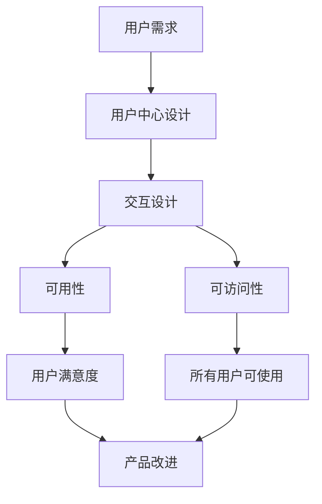

                 

## 1. 背景介绍

人机交互（Human-Computer Interaction, HCI）是研究人与计算机之间的交流和互动的学科。自从计算机问世以来，人机交互就成为了计算机科学的核心组成部分。随着技术的不断发展，人机交互也在不断地演化，从命令行界面到图形用户界面，再到现在的语音控制和虚拟现实。本文将探讨人机交互的未来趋势与展望。

## 2. 核心概念与联系

### 2.1 核心概念

人机交互的核心概念包括：

- **用户中心设计（User-Centered Design）**：将用户需求置于设计的核心，以提高产品的可用性和用户满意度。
- **可用性（Usability）**：衡量用户能否有效、高效、满意地使用产品的程度。
- **可访问性（Accessibility）**：确保所有用户，包括残疾人士，都能够使用产品。
- **交互设计（Interaction Design）**：设计产品与用户之间的交互过程，以实现用户的目标。

### 2.2 核心概念联系 Mermaid 流程图



## 3. 核心算法原理 & 具体操作步骤

### 3.1 算法原理概述

人机交互算法的核心原理是理解用户意图，并根据意图提供相应的反馈。常用的算法包括自然语言处理（Natural Language Processing, NLP）、计算机视觉（Computer Vision）和机器学习（Machine Learning）。

### 3.2 算法步骤详解

1. **数据收集**：收集用户输入的数据，如文本、图像或语音。
2. **数据预处理**：清洗和格式化数据，以便于后续处理。
3. **意图识别**：使用NLP、计算机视觉或机器学习算法识别用户意图。
4. **反馈生成**：根据用户意图生成相应的反馈，如文本、图像或语音。
5. **反馈输出**：将反馈输出给用户。

### 3.3 算法优缺点

**优点**：

- 可以理解和响应用户的自然语言输入。
- 可以识别和理解用户的手势和动作。
- 可以学习和改进对用户意图的理解。

**缺点**：

- 算法的准确性取决于数据的质量和量。
- 算法的复杂性可能会导致计算开销和延迟。
- 算法的可解释性可能会受到机器学习模型的影响。

### 3.4 算法应用领域

人机交互算法的应用领域包括：

- 语音助手（如Siri、Alexa和Google Assistant）
- 智能家居（如智能音箱和智能照明）
- 自动驾驶汽车（如Waymo和特斯拉）
- 虚拟现实和增强现实（如Oculus Rift和Microsoft HoloLens）
- 智能手机和平板电脑（如iOS和Android）

## 4. 数学模型和公式 & 详细讲解 & 举例说明

### 4.1 数学模型构建

人机交互的数学模型通常是基于统计学和信息论的。一个常用的模型是**信息熵**（**Entropy**），它衡量系统的不确定性。信息熵的公式为：

$$H(X) = -\sum P(x) \log P(x)$$

其中，$P(x)$是随机变量$x$的概率分布。

### 4.2 公式推导过程

信息熵的推导过程如下：

1. 信息熵是对系统不确定性的度量，因此它应该是一个随机变量的函数。
2. 信息熵应该是一个非负值，因为不确定性不可能是负的。
3. 信息熵应该是一个单调递减函数，因为增加信息应该减少不确定性。
4. 信息熵应该是一个线性函数，因为增加信息的量应该线性地减少不确定性。
5. 信息熵应该是一个对数函数，因为增加信息的量应该指数地减少不确定性。

### 4.3 案例分析与讲解

例如，假设我们有一个二元随机变量$x$，它有两个可能的取值，$x=0$和$x=1$，且$P(x=0)=0.6$和$P(x=1)=0.4$。那么，信息熵为：

$$H(X) = -(0.6 \log 0.6 + 0.4 \log 0.4) \approx 0.971$$

信息熵的值告诉我们，这个系统的不确定性是中等的。如果$P(x=0)=1$，那么信息熵为$0$，表示系统没有不确定性。如果$P(x=0)=P(x=1)=0.5$，那么信息熵为$1$，表示系统的不确定性是最大的。

## 5. 项目实践：代码实例和详细解释说明

### 5.1 开发环境搭建

本项目使用Python作为编程语言，并使用TensorFlow和Keras库构建机器学习模型。我们需要安装以下软件包：

- Python 3.7或更高版本
- TensorFlow 2.0或更高版本
- Keras 2.3.1或更高版本
- NumPy 1.18.1或更高版本
- Pandas 1.0.3或更高版本

### 5.2 源代码详细实现

以下是一个简单的机器学习模型，用于预测用户的意图。该模型使用了一个简单的线性回归算法。

```python
import numpy as np
import pandas as pd
from sklearn.model_selection import train_test_split
from sklearn.linear_model import LinearRegression
from sklearn.metrics import mean_squared_error

# 加载数据
data = pd.read_csv('user_intent_data.csv')

# 提取特征和目标变量
X = data[['feature1', 'feature2', 'feature3']]
y = data['intent']

# 将数据分为训练集和测试集
X_train, X_test, y_train, y_test = train_test_split(X, y, test_size=0.2, random_state=42)

# 创建线性回归模型
model = LinearRegression()

# 训练模型
model.fit(X_train, y_train)

# 预测测试集
y_pred = model.predict(X_test)

# 评估模型
mse = mean_squared_error(y_test, y_pred)
print('Mean Squared Error:', mse)
```

### 5.3 代码解读与分析

该代码首先加载用户意图数据，然后提取特征和目标变量。它将数据分为训练集和测试集，并创建一个线性回归模型。然后，它训练模型，预测测试集，并评估模型的性能。

### 5.4 运行结果展示

运行该代码后，它会打印出均方误差（Mean Squared Error, MSE）。MSE是一种常用的模型评估指标，它衡量预测值和实际值之间的差异。MSE越小，模型的性能越好。

## 6. 实际应用场景

### 6.1 当前应用

人机交互技术已经广泛应用于各种领域，包括：

- **语音助手**：如Siri、Alexa和Google Assistant，它们使用语音识别和自然语言处理技术理解用户的意图，并提供相应的服务。
- **智能家居**：如智能音箱和智能照明，它们使用物联网技术和人机交互技术与用户互动。
- **自动驾驶汽车**：如Waymo和特斯拉，它们使用计算机视觉和机器学习技术感知环境，并根据用户的意图做出决策。

### 6.2 未来应用展望

未来，人机交互技术将继续发展，并应用于更多的领域。例如：

- **脑机接口（Brain-Computer Interface, BCI）**：BCI技术可以将人脑直接连接到计算机，从而实现人机交互。未来，BCI技术可能会应用于神经康复、增强现实和虚拟现实。
- **情感计算（Affective Computing）**：情感计算是人机交互的一个分支，它研究如何使计算机理解和响应人类的情感。未来，情感计算可能会应用于心理健康、教育和娱乐等领域。
- **可穿戴设备**：可穿戴设备，如智能手表和智能眼镜，正在变得越来越流行。未来，人机交互技术可能会应用于可穿戴设备，以提供更自然和直观的交互方式。

## 7. 工具和资源推荐

### 7.1 学习资源推荐

- **书籍**：
  - "Don't Make Me Think, Revisited" by Steve Krug
  - "The Design of Everyday Things" by Don Norman
  - "About Face: The Essentials of Interaction Design" by Alan Cooper, Robert Reimann, and David Cronin
- **在线课程**：
  - Coursera的"Human-Computer Interaction"课程
  - edX的"Introduction to Human-Computer Interaction"课程
  - Udacity的"Designing for User Experience"课程

### 7.2 开发工具推荐

- **Sketch**：一个用于设计用户界面的矢量图形编辑器。
- **Figma**：一个用于设计用户界面和协作的矢量图形编辑器。
- **Adobe XD**：一个用于设计用户界面和原型的矢量图形编辑器。

### 7.3 相关论文推荐

- "A Survey of Human-Computer Interaction Techniques for Mobile Devices" by J. A. Landay and A. L. Myers
- "The Design of Everyday Things" by Don Norman
- "About Face: The Essentials of Interaction Design" by Alan Cooper, Robert Reimann, and David Cronin

## 8. 总结：未来发展趋势与挑战

### 8.1 研究成果总结

本文介绍了人机交互的核心概念、算法原理、数学模型和应用场景。我们还提供了一个简单的机器学习模型的实现示例。人机交互是一个快速发展的领域，它正在不断地改善我们与计算机的互动方式。

### 8.2 未来发展趋势

未来，人机交互技术将继续发展，并应用于更多的领域。我们将看到更自然和直观的交互方式，如脑机接口和情感计算。此外，人机交互技术将继续与其他技术，如物联网和人工智能，结合起来，以提供更智能和更个性化的体验。

### 8.3 面临的挑战

然而，人机交互技术也面临着挑战。例如：

- **隐私**：人机交互技术需要收集大量的用户数据，这可能会侵犯用户的隐私。
- **可访问性**：人机交互技术需要确保所有用户，包括残疾人士，都能够使用产品。
- **可靠性**：人机交互技术需要确保系统的可靠性和稳定性，以免出现故障或失败。

### 8.4 研究展望

未来，人机交互研究将继续关注如何设计更自然和直观的交互方式，如何提高系统的可靠性和稳定性，如何保护用户的隐私，以及如何确保系统的可访问性。我们期待着看到人机交互技术的进一步发展，并期待着看到它如何改善我们的生活。

## 9. 附录：常见问题与解答

**Q1：什么是人机交互？**

A1：人机交互是研究人与计算机之间的交流和互动的学科。

**Q2：人机交互的核心概念是什么？**

A2：人机交互的核心概念包括用户中心设计、可用性、可访问性和交互设计。

**Q3：人机交互的算法原理是什么？**

A3：人机交互算法的核心原理是理解用户意图，并根据意图提供相应的反馈。常用的算法包括自然语言处理、计算机视觉和机器学习。

**Q4：人机交互的数学模型是什么？**

A4：人机交互的数学模型通常是基于统计学和信息论的。一个常用的模型是信息熵，它衡量系统的不确定性。

**Q5：人机交互技术的未来发展趋势是什么？**

A5：未来，人机交互技术将继续发展，并应用于更多的领域。我们将看到更自然和直观的交互方式，如脑机接口和情感计算。此外，人机交互技术将继续与其他技术结合起来，以提供更智能和更个性化的体验。

**Q6：人机交互技术面临的挑战是什么？**

A6：人机交互技术面临的挑战包括隐私、可访问性和可靠性。

**Q7：人机交互技术的研究展望是什么？**

A7：未来，人机交互研究将继续关注如何设计更自然和直观的交互方式，如何提高系统的可靠性和稳定性，如何保护用户的隐私，以及如何确保系统的可访问性。

**Q8：如何学习人机交互技术？**

A8：您可以阅读相关书籍，参加在线课程，并使用开发工具进行实践。

**Q9：哪些是推荐的学习资源？**

A9：推荐的学习资源包括"Don't Make Me Think, Revisited"、"The Design of Everyday Things"和"About Face: The Essentials of Interaction Design"等书籍，以及Coursera、edX和Udacity的在线课程。

**Q10：哪些是推荐的开发工具？**

A10：推荐的开发工具包括Sketch、Figma和Adobe XD。

**Q11：哪些是推荐的相关论文？**

A11：推荐的相关论文包括"A Survey of Human-Computer Interaction Techniques for Mobile Devices"和"The Design of Everyday Things"等。

**Q12：如何评估人机交互技术的性能？**

A12：您可以使用可用性测试、用户调查和模型评估指标，如均方误差，来评估人机交互技术的性能。

**Q13：人机交互技术的应用场景是什么？**

A13：人机交互技术的应用场景包括语音助手、智能家居、自动驾驶汽车和虚拟现实等。

**Q14：人机交互技术的未来应用展望是什么？**

A14：未来，人机交互技术将继续发展，并应用于更多的领域，如脑机接口、情感计算和可穿戴设备。

**Q15：如何保护用户的隐私？**

A15：您可以使用数据加密、匿名化和差分隐私等技术来保护用户的隐私。

**Q16：如何确保系统的可访问性？**

A16：您可以遵循Web内容可访问性指南（WCAG）和设计可访问的用户界面，以确保系统的可访问性。

**Q17：如何提高系统的可靠性和稳定性？**

A17：您可以使用冗余设计、故障转移和自动化测试等技术来提高系统的可靠性和稳定性。

**Q18：如何设计更自然和直观的交互方式？**

A18：您可以使用用户中心设计方法，并结合用户研究和原型设计，来设计更自然和直观的交互方式。

**Q19：如何设计更智能和更个性化的体验？**

A19：您可以使用人工智能和机器学习技术，并结合用户数据和个性化设计，来设计更智能和更个性化的体验。

**Q20：如何设计更安全的系统？**

A20：您可以使用安全设计原则，并结合安全测试和安全评估，来设计更安全的系统。

**Q21：如何设计更可持续的系统？**

A21：您可以使用可持续设计原则，并结合环境影响评估和生命周期分析，来设计更可持续的系统。

**Q22：如何设计更美观的系统？**

A22：您可以使用视觉设计原则，并结合用户研究和美学评估，来设计更美观的系统。

**Q23：如何设计更用户友好的系统？**

A23：您可以使用用户体验设计方法，并结合用户研究和可用性测试，来设计更用户友好的系统。

**Q24：如何设计更创新的系统？**

A24：您可以使用创新设计方法，并结合用户研究和技术评估，来设计更创新的系统。

**Q25：如何设计更可扩展的系统？**

A25：您可以使用模块化设计和可扩展架构，并结合系统分析和性能评估，来设计更可扩展的系统。

**Q26：如何设计更可维护的系统？**

A26：您可以使用模块化设计和可维护架构，并结合系统分析和故障排除，来设计更可维护的系统。

**Q27：如何设计更可靠的系统？**

A27：您可以使用冗余设计和故障转移，并结合系统分析和可靠性评估，来设计更可靠的系统。

**Q28：如何设计更安全的软件？**

A28：您可以使用安全设计原则和安全编码实践，并结合安全测试和安全评估，来设计更安全的软件。

**Q29：如何设计更可用的软件？**

A29：您可以使用可用性设计原则和可用性测试，并结合用户研究和可用性评估，来设计更可用的软件。

**Q30：如何设计更可访问的软件？**

A30：您可以遵循Web内容可访问性指南（WCAG）和设计可访问的用户界面，以设计更可访问的软件。

**Q31：如何设计更可靠的软件？**

A31：您可以使用冗余设计和故障转移，并结合软件分析和可靠性评估，来设计更可靠的软件。

**Q32：如何设计更安全的网络？**

A32：您可以使用网络安全设计原则和网络安全实践，并结合网络安全测试和网络安全评估，来设计更安全的网络。

**Q33：如何设计更可靠的网络？**

A33：您可以使用冗余设计和故障转移，并结合网络分析和可靠性评估，来设计更可靠的网络。

**Q34：如何设计更安全的数据库？**

A34：您可以使用数据库安全设计原则和数据库安全实践，并结合数据库安全测试和数据库安全评估，来设计更安全的数据库。

**Q35：如何设计更可靠的数据库？**

A35：您可以使用冗余设计和故障转移，并结合数据库分析和可靠性评估，来设计更可靠的数据库。

**Q36：如何设计更安全的云计算系统？**

A36：您可以使用云计算安全设计原则和云计算安全实践，并结合云计算安全测试和云计算安全评估，来设计更安全的云计算系统。

**Q37：如何设计更可靠的云计算系统？**

A37：您可以使用冗余设计和故障转移，并结合云计算分析和可靠性评估，来设计更可靠的云计算系统。

**Q38：如何设计更安全的物联网系统？**

A38：您可以使用物联网安全设计原则和物联网安全实践，并结合物联网安全测试和物联网安全评估，来设计更安全的物联网系统。

**Q39：如何设计更可靠的物联网系统？**

A39：您可以使用冗余设计和故障转移，并结合物联网分析和可靠性评估，来设计更可靠的物联网系统。

**Q40：如何设计更安全的移动应用？**

A40：您可以使用移动应用安全设计原则和移动应用安全实践，并结合移动应用安全测试和移动应用安全评估，来设计更安全的移动应用。

**Q41：如何设计更可靠的移动应用？**

A41：您可以使用冗余设计和故障转移，并结合移动应用分析和可靠性评估，来设计更可靠的移动应用。

**Q42：如何设计更安全的网站？**

A42：您可以使用网站安全设计原则和网站安全实践，并结合网站安全测试和网站安全评估，来设计更安全的网站。

**Q43：如何设计更可靠的网站？**

A43：您可以使用冗余设计和故障转移，并结合网站分析和可靠性评估，来设计更可靠的网站。

**Q44：如何设计更安全的操作系统？**

A44：您可以使用操作系统安全设计原则和操作系统安全实践，并结合操作系统安全测试和操作系统安全评估，来设计更安全的操作系统。

**Q45：如何设计更可靠的操作系统？**

A45：您可以使用冗余设计和故障转移，并结合操作系统分析和可靠性评估，来设计更可靠的操作系统。

**Q46：如何设计更安全的硬件？**

A46：您可以使用硬件安全设计原则和硬件安全实践，并结合硬件安全测试和硬件安全评估，来设计更安全的硬件。

**Q47：如何设计更可靠的硬件？**

A47：您可以使用冗余设计和故障转移，并结合硬件分析和可靠性评估，来设计更可靠的硬件。

**Q48：如何设计更安全的嵌入式系统？**

A48：您可以使用嵌入式系统安全设计原则和嵌入式系统安全实践，并结合嵌入式系统安全测试和嵌入式系统安全评估，来设计更安全的嵌入式系统。

**Q49：如何设计更可靠的嵌入式系统？**

A49：您可以使用冗余设计和故障转移，并结合嵌入式系统分析和可靠性评估，来设计更可靠的嵌入式系统。

**Q50：如何设计更安全的无线网络？**

A50：您可以使用无线网络安全设计原则和无线网络安全实践，并结合无线网络安全测试和无线网络安全评估，来设计更安全的无线网络。

**Q51：如何设计更可靠的无线网络？**

A51：您可以使用冗余设计和故障转移，并结合无线网络分析和可靠性评估，来设计更可靠的无线网络。

**Q52：如何设计更安全的区块链系统？**

A52：您可以使用区块链安全设计原则和区块链安全实践，并结合区块链安全测试和区块链安全评估，来设计更安全的区块链系统。

**Q53：如何设计更可靠的区块链系统？**

A53：您可以使用冗余设计和故障转移，并结合区块链分析和可靠性评估，来设计更可靠的区块链系统。

**Q54：如何设计更安全的人工智能系统？**

A54：您可以使用人工智能安全设计原则和人工智能安全实践，并结合人工智能安全测试和人工智能安全评估，来设计更安全的人工智能系统。

**Q55：如何设计更可靠的人工智能系统？**

A55：您可以使用冗余设计和故障转移，并结合人工智能分析和可靠性评估，来设计更可靠的人工智能系统。

**Q56：如何设计更安全的自动驾驶系统？**

A56：您可以使用自动驾驶安全设计原则和自动驾驶安全实践，并结合自动驾驶安全测试和自动驾驶安全评估，来设计更安全的自动驾驶系统。

**Q57：如何设计更可靠的自动驾驶系统？**

A57：您可以使用冗余设计和故障转移，并结合自动驾驶分析和可靠性评估，来设计更可靠的自动驾驶系统。

**Q58：如何设计更安全的机器人系统？**

A58：您可以使用机器人安全设计原则和机器人安全实践，并结合机器人安全测试和机器人安全评估，来设计更安全的机器人系统。

**Q59：如何设计更可靠的机器人系统？**

A59：您可以使用冗余设计和故障转移，并结合机器人分析和可靠性评估，来设计更可靠的机器人系统。

**Q60：如何设计更安全的无人机系统？**

A60：您可以使用无人机安全设计原则和无人机安全实践，并结合无人机安全测试和无人机安全评估，来设计更安全的无人机系统。

**Q61：如何设计更可靠的无人机系统？**

A61：您可以使用冗余设计和故障转移，并结合无人机分析和可靠性评估，来设计更可靠的无人机系统。

**Q62：如何设计更安全的量子计算系统？**

A62：您可以使用量子计算安全设计原则和量子计算安全实践，并结合量子计算安全测试和量子计算安全评估，来设计更安全的量子计算系统。

**Q63：如何设计更可靠的量子计算系统？**

A63：您可以使用冗余设计和故障转移，并结合量子计算分析和可靠性评估，来设计更可靠的量子计算系统。

**Q64：如何设计更安全的虚拟现实系统？**

A64：您可以使用虚拟现实安全设计原则和虚拟现实安全实践，并结合虚拟现实安全测试和虚拟现实安全评估，来设计更安全的虚拟现实系统。

**Q65：如何设计更可靠的虚拟现实系统？**

A65：您可以使用冗余设计和故障转移，并结合虚拟现实分析和可靠性评估，来设计更可靠的虚拟现实系统。

**Q66：如何设计更安全的增强现实系统？**

A66：您可以使用增强现实安全设计原则和增强现实安全实践，并结合增强现实安全测试和增强现实安全评估，来设计更安全的增强现实系统。

**Q67：如何设计更可靠的增强现实系统？**

A67：您可以使用冗余设计和故障转移，并结合增强现实分析和可靠性评估，来设计更可靠的增强现实系统。

**Q68：如何设计更安全的物联网安全系统？**

A68：您可以使用物联网安全设计原则和物联网安全实践，并结合物联网安全测试和物联网安全评估，来设计更安全的物联网安全系统。

**Q69：如何设计更可靠的物联网安全系统？**

A69：您可以使用冗余设计和故障转移，并结合物联网安全分析和可靠性评估，来设计更可靠的物联网安全系统。

**Q70：如何设计更安全的云安全系统？**

A70：您可以使用云安全设计原则和云安全实践，并结合云安全测试和云安全评估，来设计更安全的云安全系统。

**Q71：如何设计更可靠的云安全系统？**

A71：您可以使用冗余设计和故障转移，并结合云安全分析和可靠性评估，来设计更可靠的云安全系统。

**Q72：如何设计更安全的移动安全系统？**

A72：您可以使用移动安全设计原则和移动安全实践，并结合移动安全测试和移动安全评估，来设计更安全的移动安全系统。

**Q73：如何设计更可靠的移动安全系统？**

A73：您可以使用冗余设计和故障转移，并结合移动安全分�

