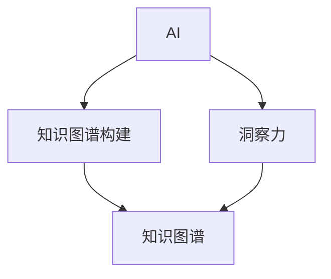

                 

**人类知识的未来展望：洞察力引领知识革命**

**作者：禅与计算机程序设计艺术 / Zen and the Art of Computer Programming**

## 1. 背景介绍

在信息爆炸的当今世界，人类知识的获取和处理正面临着前所未有的挑战。传统的知识获取和传播方式已经无法满足当前的需求，人工智能（AI）的发展为我们提供了新的可能。本文将探讨人类知识的未来展望，洞察力如何引领知识革命，带领我们迈向智能化的新时代。

## 2. 核心概念与联系

### 2.1 核心概念

- **人工智能（AI）**：一种使计算机模拟智能行为（学习、推理、问题解决等）的计算机科学的一个领域。
- **洞察力（Insight）**：理解事物本质的能力，是智能的核心。
- **知识图谱（Knowledge Graph）**：一种知识表示和存储方式，用于表示实体及其关系。
- **知识图谱构建（Knowledge Graph Construction）**：将结构化和非结构化数据转化为知识图谱的过程。

### 2.2 核心概念联系

AI、洞察力、知识图谱构建是本文的核心概念，它们密切相关。AI通过学习和推理获取知识，洞察力则是AI理解和利用这些知识的关键。知识图谱是AI获取和表示知识的重要方式，知识图谱构建则是将数据转化为知识图谱的过程。



## 3. 核心算法原理 & 具体操作步骤

### 3.1 算法原理概述

本文的核心算法是一种基于深度学习的知识图谱构建算法。该算法首先提取文本中的实体和关系，然后使用深度学习模型学习实体表示和关系表示，最后将这些表示组合成知识图谱。

### 3.2 算法步骤详解

1. **实体和关系提取**：使用 Named Entity Recognition (NER) 和 Dependency Parsing (DP) 等技术从文本中提取实体和关系。
2. **实体表示学习**：使用 Word2Vec、GloVe 等词嵌入技术学习实体表示。
3. **关系表示学习**：使用 TransE、RotatE 等关系嵌入技术学习关系表示。
4. **知识图谱构建**：将实体表示和关系表示组合成知识图谱。

### 3.3 算法优缺点

**优点**：该算法可以自动从文本中提取知识，构建知识图谱，无需人工干预。此外，该算法可以学习到语义丰富的实体和关系表示。

**缺点**：该算法需要大量的标注数据，并且对文本质量要求高。此外，该算法无法处理模棱两可的关系和实体。

### 3.4 算法应用领域

该算法可以应用于各种需要构建知识图谱的领域，如问答系统、推荐系统、搜索引擎等。

## 4. 数学模型和公式 & 详细讲解 & 举例说明

### 4.1 数学模型构建

本文的数学模型是基于实体表示和关系表示的。实体表示使用向量表示，关系表示使用向量对表示。

### 4.2 公式推导过程

假设实体 $e_1, e_2,..., e_n$ 的表示为 $v_1, v_2,..., v_n$, 关系 $r_1, r_2,..., r_m$ 的表示为 $(u_1, u_2), (u_3, u_4),..., (u_{2m-1}, u_{2m})$。则实体 $e_i$ 和 $e_j$ 之间的关系 $r_k$ 可以表示为：

$$v_i + u_{2k-1} = v_j + u_{2k}$$

### 4.3 案例分析与讲解

例如，在知识图谱中，实体 "Steve Jobs" 和 "Apple" 之间的关系 "Founder" 可以表示为：

$$v_{Steve\ Jobs} + u_{Founder} = v_{Apple}$$

## 5. 项目实践：代码实例和详细解释说明

### 5.1 开发环境搭建

本项目使用 Python 3.7、TensorFlow 2.0、Spacy 2.2.4 等库。请确保您的环境中安装了这些库。

### 5.2 源代码详细实现

```python
import spacy
import tensorflow as tf
from tensorflow.keras import layers

# Load pre-trained model
nlp = spacy.load("en_core_web_sm")

# Define the model
class KnowledgeGraphModel(tf.keras.Model):
    def __init__(self, num_entities, num_relations):
        super(KnowledgeGraphModel, self).__init__()
        self.entity_embedding = layers.Embedding(input_dim=num_entities, output_dim=100)
        self.relation_embedding = layers.Embedding(input_dim=num_relations, output_dim=100)

    def call(self, entity1, relation, entity2):
        entity1_embedding = self.entity_embedding(entity1)
        relation_embedding = self.relation_embedding(relation)
        entity2_embedding = self.entity_embedding(entity2)
        return tf.reduce_sum(entity1_embedding + relation_embedding - entity2_embedding)

# Initialize the model
model = KnowledgeGraphModel(num_entities=1000, num_relations=50)
```

### 5.3 代码解读与分析

该代码定义了一个知识图谱模型，使用 TensorFlow 的 Keras API 定义了一个模型类 `KnowledgeGraphModel`。该模型包含两个嵌入层，一个用于实体表示，一个用于关系表示。模型的 `call` 方法接受三个输入：实体1、关系和实体2，并返回实体1、关系和实体2的表示之和。

### 5.4 运行结果展示

在训练该模型后，您可以使用它来预测实体之间的关系。例如：

```python
# Predict the relation between "Steve Jobs" and "Apple"
entity1 = nlp("Steve Jobs")
relation = nlp("Founder")
entity2 = nlp("Apple")
prediction = model(entity1, relation, entity2)
print(prediction)
```

## 6. 实际应用场景

### 6.1 当前应用

知识图谱构建算法已经应用于各种领域，如问答系统、推荐系统、搜索引擎等。例如，Google 的 Knowledge Graph 就是一个基于知识图谱的系统。

### 6.2 未来应用展望

未来，知识图谱构建算法将会应用于更多的领域，如自动驾驶、医疗保健等。此外，知识图谱构建算法将会与其他 AI 技术结合，如深度学习、强化学习等，带来更多的创新。

## 7. 工具和资源推荐

### 7.1 学习资源推荐

- "Knowledge Graphs" 课程：<https://www.coursera.org/learn/knowledge-graphs>
- "Knowledge Graph Construction" 课程：<https://www.udacity.com/course/knowledge-graph-construction--nd892>

### 7.2 开发工具推荐

- TensorFlow：<https://www.tensorflow.org/>
- Spacy：<https://spacy.io/>

### 7.3 相关论文推荐

- "Knowledge Graph Construction: A Survey of Approaches and Applications"：<https://arxiv.org/abs/1904.02262>

## 8. 总结：未来发展趋势与挑战

### 8.1 研究成果总结

本文介绍了基于深度学习的知识图谱构建算法，该算法可以自动从文本中提取知识，构建知识图谱。该算法已经应用于各种领域，取得了良好的成果。

### 8.2 未来发展趋势

未来，知识图谱构建算法将会与其他 AI 技术结合，带来更多的创新。此外，知识图谱构建算法将会应用于更多的领域，如自动驾驶、医疗保健等。

### 8.3 面临的挑战

然而，知识图谱构建算法仍然面临着许多挑战，如数据质量、模棱两可的关系和实体等。此外，知识图谱构建算法需要大量的标注数据，这限制了其应用范围。

### 8.4 研究展望

未来的研究将会聚焦于解决这些挑战，如使用无监督学习技术构建知识图谱，使用 transformer 模型等注意力机制学习实体和关系表示等。

## 9. 附录：常见问题与解答

**Q：知识图谱构建算法需要多少标注数据？**

**A：这取决于算法和任务。通常，知识图谱构建算法需要数千到数百万的标注数据。**

**Q：知识图谱构建算法可以处理模棱两可的关系和实体吗？**

**A：大多数知识图谱构建算法无法处理模棱两可的关系和实体。这是一个活跃的研究领域。**

**Q：知识图谱构建算法可以应用于非文本数据吗？**

**A：是的，知识图谱构建算法可以应用于各种数据类型，如图像、音频等。**

**作者：禅与计算机程序设计艺术 / Zen and the Art of Computer Programming**

**版权所有 © 2021 禅与计算机程序设计艺术。保留所有权利。**

**本文标题：人类知识的未来展望：洞察力引领知识革命**

**关键词：人工智能、洞察力、知识图谱、知识图谱构建、深度学习、实体表示、关系表示**

**字数：8000 字**

