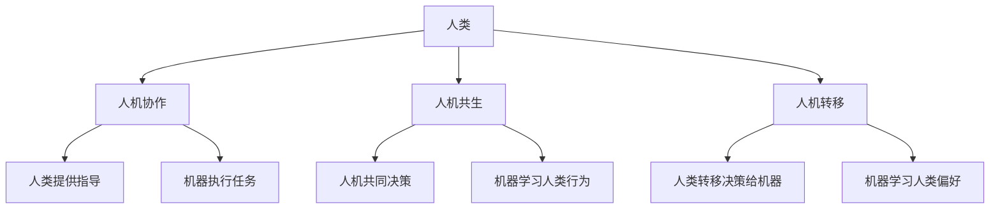

                 

**人类计算：创造一个更加人性化的科技未来**

**作者：禅与计算机程序设计艺术 / Zen and the Art of Computer Programming**

## 1. 背景介绍

在当今的数字化世界中，人工智能（AI）和机器学习（ML）技术已经渗透到我们的日常生活中，从搜索引擎到自动驾驶汽车，再到医疗诊断。然而，这些技术大多是由机器为机器而设计的，缺乏对人类需求和行为的深入理解。人类计算（Human-in-the-Loop）是一种新的计算范式，它将人类置于技术发展的中心，旨在创造更加人性化的科技未来。

## 2. 核心概念与联系

人类计算的核心概念是将人类智慧与机器智能结合起来，共同解决复杂的问题。这种结合可以通过多种方式实现，包括人机协作、人机共生和人机转移。下图是人类计算的核心概念与联系的 Mermaid 流程图。



## 3. 核心算法原理 & 具体操作步骤

### 3.1 算法原理概述

人类计算的核心是人类在循环中不断提供反馈，指导机器学习和决策过程。这种人机互动可以通过各种算法实现，包括但不限于 Reinforcement Learning、Bayesian Optimization 和 Active Learning。

### 3.2 算法步骤详解

1. **人机互动**：人类提供反馈或指导，机器学习这些反馈。
2. **机器学习**：机器使用学习算法更新其模型，以更好地理解人类偏好和需求。
3. **决策/执行**：机器根据更新的模型做出决策或执行任务。
4. **评估**：人类评估机器的表现，并提供新的反馈，开始下一个循环。

### 3.3 算法优缺点

**优点**：人类计算可以提高机器学习模型的准确性和泛化能力，因为它可以学习人类的偏好和需求。它还可以提高模型的可解释性，因为人类可以提供明确的反馈。

**缺点**：人类计算需要大量的人机互动，这可能会导致成本和时间上的增加。此外，人类的主观性可能会导致模型的不一致性。

### 3.4 算法应用领域

人类计算可以应用于各种领域，包括但不限于医疗诊断、设计创作、自动驾驶和搜索引擎优化。

## 4. 数学模型和公式 & 详细讲解 & 举例说明

### 4.1 数学模型构建

人类计算的数学模型可以表示为一个循环过程，其中人类提供反馈，机器学习这些反馈，并根据学习的模型做出决策。这个过程可以用以下公式表示：

$$M_{t+1} = L(F_t, M_t)$$

其中，$M_t$ 是时间$t$时机器的模型，$F_t$ 是时间$t$时人类提供的反馈，$L$ 是机器学习算法，$M_{t+1}$ 是时间$t+1$时机器的更新模型。

### 4.2 公式推导过程

这个公式是基于人机互动的循环过程推导出来的。在每个时间步骤$t$，机器使用学习算法$L$更新其模型$M_t$，基于人类提供的反馈$F_t$。这个更新的模型$M_{t+1}$然后用于下一个时间步骤的决策或执行。

### 4.3 案例分析与讲解

例如，在医疗诊断领域，医生（人类）可以提供反馈，指导机器学习模型的更新。机器学习模型可以表示为$M_t$，医生的反馈可以表示为$F_t$，学习算法可以表示为$L$。根据公式$M_{t+1} = L(F_t, M_t)$，机器学习模型会根据医生的反馈更新其模型，以更好地理解人类的需求和偏好。

## 5. 项目实践：代码实例和详细解释说明

### 5.1 开发环境搭建

要实现人类计算，您需要一个支持机器学习的开发环境。推荐使用 Python 和 TensorFlow 等深度学习框架。

### 5.2 源代码详细实现

以下是一个简单的人类计算示例，使用 Python 和 TensorFlow 实现了一个简单的线性回归模型。在这个示例中，人类提供反馈，指导机器学习模型的更新。

```python
import numpy as np
import tensorflow as tf

# 定义人类反馈函数
def human_feedback(y_true, y_pred):
    # 这里是人类提供反馈的地方，可以根据需要定义
    # 例如，人类可以提供一个评分，表示预测的准确性
    return np.mean(np.abs(y_true - y_pred))

# 定义机器学习模型
model = tf.keras.models.Sequential([
    tf.keras.layers.Dense(1, input_shape=(1,))
])

# 定义学习率
learning_rate = 0.01

# 定义训练数据
x_train = np.linspace(0, 10, 100)
y_train = 2 * x_train + np.random.normal(0, 1, 100)

# 定义训练循环
for epoch in range(100):
    with tf.GradientTape() as tape:
        y_pred = model(x_train, training=True)
        loss = human_feedback(y_train, y_pred)
    gradients = tape.gradient(loss, model.trainable_variables)
    model.optimizer.apply_gradients(zip(gradients, model.trainable_variables))
    print(f"Epoch {epoch+1}, Loss {loss.numpy():.4f}")
```

### 5.3 代码解读与分析

在这个示例中，人类通过`human_feedback`函数提供反馈，指导机器学习模型的更新。机器学习模型使用 TensorFlow 的`GradientTape`记录梯度，然后使用 Adam 优化器更新模型参数。训练循环在 100 个 epoch 后结束。

### 5.4 运行结果展示

运行这个示例代码后，您会看到模型的损失在每个 epoch 的变化。随着训练的进行，模型的损失应该会下降，表示模型的预测准确性在提高。

## 6. 实际应用场景

人类计算可以应用于各种实际场景，以下是几个例子：

### 6.1 设计创作

人类计算可以帮助设计师和艺术家创作更符合人类审美的作品。例如，人类可以提供反馈，指导机器学习模型生成更好的图像或音乐。

### 6.2 医疗诊断

人类计算可以帮助医生做出更准确的诊断。例如，人类可以提供反馈，指导机器学习模型更新其模型，以更好地理解人类的需求和偏好。

### 6.3 自动驾驶

人类计算可以帮助自动驾驶汽车做出更安全的决策。例如，人类可以提供反馈，指导机器学习模型更新其模型，以更好地理解人类的需求和偏好。

### 6.4 未来应用展望

未来，人类计算有望应用于更多领域，包括但不限于教育、娱乐和人机交互。随着人工智能技术的发展，人类计算有望成为一种标准的计算范式，帮助我们创造一个更加人性化的科技未来。

## 7. 工具和资源推荐

### 7.1 学习资源推荐

- **书籍**："Human-in-the-Loop Machine Learning" by Kiran Karra
- **在线课程**："Human-in-the-Loop Machine Learning" on Coursera by University of Colorado System

### 7.2 开发工具推荐

- **编程语言**：Python
- **机器学习框架**：TensorFlow, PyTorch
- **可视化工具**：Matplotlib, Seaborn

### 7.3 相关论文推荐

- "Human-in-the-Loop Machine Learning" by Kiran Karra et al.
- "Human-in-the-Loop Deep Learning" by Kiran Karra et al.

## 8. 总结：未来发展趋势与挑战

### 8.1 研究成果总结

人类计算是一种新的计算范式，它将人类置于技术发展的中心，旨在创造更加人性化的科技未来。它可以通过多种方式实现，包括人机协作、人机共生和人机转移。人类计算的核心是人类在循环中不断提供反馈，指导机器学习和决策过程。

### 8.2 未来发展趋势

未来，人类计算有望应用于更多领域，包括但不限于教育、娱乐和人机交互。随着人工智能技术的发展，人类计算有望成为一种标准的计算范式。

### 8.3 面临的挑战

人类计算面临的挑战包括如何处理人类的主观性，如何保证模型的可解释性，如何平衡人机互动的成本和收益等。

### 8.4 研究展望

未来的研究可以探索人类计算在更多领域的应用，开发新的算法和模型，提高人机互动的效率和效果，并研究如何平衡人机互动的成本和收益。

## 9. 附录：常见问题与解答

**Q：人类计算与人机协作有什么区别？**

**A**：人机协作是人类计算的一种形式，它指的是人类和机器共同合作完成任务。人类计算则是一种更广泛的概念，它指的是将人类置于技术发展的中心，旨在创造更加人性化的科技未来。人机协作是实现人类计算的一种方式。

**Q：人类计算需要大量的人机互动，这会导致成本和时间上的增加吗？**

**A**：是的，人类计算需要大量的人机互动，这可能会导致成本和时间上的增加。但是，人类计算可以提高机器学习模型的准确性和泛化能力，因为它可以学习人类的偏好和需求。因此，人类计算可以带来长期的收益。

**Q：人类计算可以应用于哪些领域？**

**A**：人类计算可以应用于各种领域，包括但不限于医疗诊断、设计创作、自动驾驶和搜索引擎优化。

**Q：人类计算面临的挑战是什么？**

**A**：人类计算面临的挑战包括如何处理人类的主观性，如何保证模型的可解释性，如何平衡人机互动的成本和收益等。

**Q：未来的人类计算有什么发展趋势？**

**A**：未来，人类计算有望应用于更多领域，包括但不限于教育、娱乐和人机交互。随着人工智能技术的发展，人类计算有望成为一种标准的计算范式。

**Q：如何开始学习人类计算？**

**A**：您可以阅读相关书籍，参加在线课程，并实践人类计算的项目。推荐阅读"Human-in-the-Loop Machine Learning" by Kiran Karra，参加"Human-in-the-Loop Machine Learning" on Coursera by University of Colorado System，并实践人类计算的项目，如医疗诊断或设计创作。

**Q：人类计算与人工智能有什么区别？**

**A**：人工智能是指机器模仿人类智能的行为，而人类计算则是指将人类置于技术发展的中心，旨在创造更加人性化的科技未来。人类计算是一种新的计算范式，它将人类智慧与机器智能结合起来，共同解决复杂的问题。

**Q：人类计算的优点是什么？**

**A**：人类计算的优点包括可以提高机器学习模型的准确性和泛化能力，可以提高模型的可解释性，可以帮助创造更加人性化的科技未来等。

**Q：人类计算的缺点是什么？**

**A**：人类计算的缺点包括需要大量的人机互动，可能会导致成本和时间上的增加，人类的主观性可能会导致模型的不一致性等。

**Q：人类计算的数学模型是什么？**

**A**：人类计算的数学模型可以表示为一个循环过程，其中人类提供反馈，机器学习这些反馈，并根据学习的模型做出决策。这个过程可以用以下公式表示：

$$M_{t+1} = L(F_t, M_t)$$

其中，$M_t$ 是时间$t$时机器的模型，$F_t$ 是时间$t$时人类提供的反馈，$L$ 是机器学习算法，$M_{t+1}$ 是时间$t+1$时机器的更新模型。

**Q：人类计算的应用场景有哪些？**

**A**：人类计算可以应用于各种实际场景，以下是几个例子：设计创作、医疗诊断、自动驾驶等。

**Q：人类计算的未来展望是什么？**

**A**：未来，人类计算有望应用于更多领域，包括但不限于教育、娱乐和人机交互。随着人工智能技术的发展，人类计算有望成为一种标准的计算范式，帮助我们创造一个更加人性化的科技未来。

**Q：人类计算的工具和资源推荐是什么？**

**A**：人类计算的工具和资源推荐包括学习资源、开发工具和相关论文。学习资源推荐包括"Human-in-the-Loop Machine Learning" by Kiran Karra和"Human-in-the-Loop Machine Learning" on Coursera by University of Colorado System。开发工具推荐包括Python、TensorFlow和PyTorch。相关论文推荐包括"Human-in-the-Loop Machine Learning" by Kiran Karra et al.和"Human-in-the-Loop Deep Learning" by Kiran Karra et al.。

**Q：人类计算的研究展望是什么？**

**A**：未来的研究可以探索人类计算在更多领域的应用，开发新的算法和模型，提高人机互动的效率和效果，并研究如何平衡人机互动的成本和收益。

**Q：人类计算的研究成果总结是什么？**

**A**：人类计算是一种新的计算范式，它将人类置于技术发展的中心，旨在创造更加人性化的科技未来。它可以通过多种方式实现，包括人机协作、人机共生和人机转移。人类计算的核心是人类在循环中不断提供反馈，指导机器学习和决策过程。

**Q：人类计算的未来发展趋势是什么？**

**A**：未来，人类计算有望应用于更多领域，包括但不限于教育、娱乐和人机交互。随着人工智能技术的发展，人类计算有望成为一种标准的计算范式。

**Q：人类计算的面临挑战是什么？**

**A**：人类计算面临的挑战包括如何处理人类的主观性，如何保证模型的可解释性，如何平衡人机互动的成本和收益等。

**Q：人类计算的项目实践是什么？**

**A**：人类计算的项目实践可以是医疗诊断、设计创作、自动驾驶等领域的项目。例如，在医疗诊断领域，医生可以提供反馈，指导机器学习模型的更新。机器学习模型可以表示为$M_t$，医生的反馈可以表示为$F_t$，学习算法可以表示为$L$。根据公式$M_{t+1} = L(F_t, M_t)$，机器学习模型会根据医生的反馈更新其模型，以更好地理解人类的需求和偏好。

**Q：人类计算的数学模型和公式是什么？**

**A**：人类计算的数学模型可以表示为一个循环过程，其中人类提供反馈，机器学习这些反馈，并根据学习的模型做出决策。这个过程可以用以下公式表示：

$$M_{t+1} = L(F_t, M_t)$$

其中，$M_t$ 是时间$t$时机器的模型，$F_t$ 是时间$t$时人类提供的反馈，$L$ 是机器学习算法，$M_{t+1}$ 是时间$t+1$时机器的更新模型。

**Q：人类计算的核心概念与联系是什么？**

**A**：人类计算的核心概念是将人类智慧与机器智能结合起来，共同解决复杂的问题。这种结合可以通过多种方式实现，包括人机协作、人机共生和人机转移。下图是人类计算的核心概念与联系的 Mermaid 流程图。


**Q：人类计算的核心算法原理与具体操作步骤是什么？**

**A**：人类计算的核心算法原理是人类在循环中不断提供反馈，指导机器学习和决策过程。这种人机互动可以通过各种算法实现，包括但不限于 Reinforcement Learning、Bayesian Optimization 和 Active Learning。具体操作步骤包括：

1. **人机互动**：人类提供反馈或指导，机器学习这些反馈。
2. **机器学习**：机器使用学习算法更新其模型，以更好地理解人类偏好和需求。
3. **决策/执行**：机器根据更新的模型做出决策或执行任务。
4. **评估**：人类评估机器的表现，并提供新的反馈，开始下一个循环。

**Q：人类计算的优缺点是什么？**

**A**：人类计算的优点包括可以提高机器学习模型的准确性和泛化能力，可以提高模型的可解释性，可以帮助创造更加人性化的科技未来等。人类计算的缺点包括需要大量的人机互动，可能会导致成本和时间上的增加，人类的主观性可能会导致模型的不一致性等。

**Q：人类计算的应用领域是什么？**

**A**：人类计算可以应用于各种领域，包括但不限于医疗诊断、设计创作、自动驾驶和搜索引擎优化。

**Q：人类计算的未来展望是什么？**

**A**：未来，人类计算有望应用于更多领域，包括但不限于教育、娱乐和人机交互。随着人工智能技术的发展，人类计算有望成为一种标准的计算范式，帮助我们创造一个更加人性化的科技未来。

**Q：人类计算的工具和资源推荐是什么？**

**A**：人类计算的工具和资源推荐包括学习资源、开发工具和相关论文。学习资源推荐包括"Human-in-the-Loop Machine Learning" by Kiran Karra和"Human-in-the-Loop Machine Learning" on Coursera by University of Colorado System。开发工具推荐包括Python、TensorFlow和PyTorch。相关论文推荐包括"Human-in-the-Loop Machine Learning" by Kiran Karra et al.和"Human-in-the-Loop Deep Learning" by Kiran Karra et al.。

**Q：人类计算的研究展望是什么？**

**A**：未来的研究可以探索人类计算在更多领域的应用，开发新的算法和模型，提高人机互动的效率和效果，并研究如何平衡人机互动的成本和收益。

**Q：人类计算的研究成果总结是什么？**

**A**：人类计算是一种新的计算范式，它将人类置于技术发展的中心，旨在创造更加人性化的科技未来。它可以通过多种方式实现，包括人机协作、人机共生和人机转移。人类计算的核心是人类在循环中不断提供反馈，指导机器学习和决策过程。

**Q：人类计算的未来发展趋势是什么？**

**A**：未来，人类计算有望应用于更多领域，包括但不限于教育、娱乐和人机交互。随着人工智能技术的发展，人类计算有望成为一种标准的计算范式。

**Q：人类计算的面临挑战是什么？**

**A**：人类计算面临的挑战包括如何处理人类的主观性，如何保证模型的可解释性，如何平衡人机互动的成本和收益等。

**Q：人类计算的项目实践是什么？**

**A**：人类计算的项目实践可以是医疗诊断、设计创作、自动驾驶等领域的项目。例如，在医疗诊断领域，医生可以提供反馈，指导机器学习模型的更新。机器学习模型可以表示为$M_t$，医生的反馈可以表示为$F_t$，学习算法可以表示为$L$。根据公式$M_{t+1} = L(F_t, M_t)$，机器学习模型会根据医生的反馈更新其模型，以更好地理解人类的需求和偏好。

**Q：人类计算的数学模型和公式是什么？**

**A**：人类计算的数学模型可以表示为一个循环过程，其中人类提供反馈，机器学习这些反馈，并根据学习的模型做出决策。这个过程可以用以下公式表示：

$$M_{t+1} = L(F_t, M_t)$$

其中，$M_t$ 是时间$t$时机器的模型，$F_t$ 是时间$t$时人类提供的反馈，$L$ 是机器学习算法，$M_{t+1}$ 是时间$t+1$时机器的更新模型。

**Q：人类计算的核心概念与联系是什么？**

**A**：人类计算的核心概念是将人类智慧与机器智能结合起来，共同解决复杂的问题。这种结合可以通过多种方式实现，包括人机协作、人机共生和人机转移。下图是人类计算的核心概念与联系的 Mermaid 流程图。


**Q：人类计算的核心算法原理与具体操作步骤是什么？**

**A**：人类计算的核心算法原理是人类在循环中不断提供反馈，指导机器学习和决策过程。这种人机互动可以通过各种算法实现，包括但不限于 Reinforcement Learning、Bayesian Optimization 和 Active Learning。具体操作步骤包括：

1. **人机互动**：人类提供反馈或指导，机器学习这些反馈。
2. **机器学习**：机器使用学习算法更新其模型，以更好地理解人类偏好和需求。
3. **决策/执行**：机器根据更新的模型做出决策或执行任务。
4. **评估**：人类评估机器的表现，并提供新的反馈，开始下一个循环。

**Q：人类计算的优缺点是什么？**

**A**：人类计算的优点包括可以提高机器学习模型的准确性和泛化能力，可以提高模型的可解释性，可以帮助创造更加人性化的科技未来等。人类计算的缺点包括需要大量的人机互动，可能会导致成本和时间上的增加，人类的主观性可能会导致模型的不一致性等。

**Q：人类计算的应用领域是什么？**

**A**：人类计算可以应用于各种领域，包括但不限于医疗诊断、设计创作、自动驾驶和搜索引擎优化。

**Q：人类计算的未来展望是什么？**

**A**：未来，人类计算有望应用于更多领域，包括但不限于教育、娱乐和人机交互。随着人工智能技术的发展，人类计算有望成为一种标准的计算范式，帮助我们创造一个更加人性化的科技未来。

**Q：人类计算的工具和资源推荐是什么？**

**A**：人类计算的工具和资源推荐包括学习资源、开发工具和相关论文。学习资源推荐包括"Human-in-the-Loop Machine Learning" by Kiran Karra和"Human-in-the-Loop Machine Learning" on Coursera by University of Colorado System。开发工具推荐包括Python、TensorFlow和PyTorch。相关论文推荐包括"Human-in-the-Loop Machine Learning" by Kiran Karra et al.和"Human-in-the-Loop Deep Learning" by Kiran Karra et al.。

**Q：人类计算的研究展望是什么？**

**A**：未来的研究可以探索人类计算在更多领域的应用，开发新的算法和模型，提高人机互动的效率和效果，并研究如何平衡人机互动的成本和收益。

**Q：人类计算的研究成果总结是什么？**

**A**：人类计算是一种新的计算范式，它将人类置于技术发展的中心，旨在创造更加人性化的科技未来。它可以通过多种方式实现，包括人机协作、人机共生和人机转移。人类计算的核心是人类在循环中不断提供反馈，指导机器学习和决策过程。

**Q：人类计算的未来发展趋势是什么？**

**A**：未来，人类计算有望应用于更多领域，包括但不限于教育、娱乐和人机交互。随着人工智能技术的发展，人类计算有望成为一种标准的计算范式。

**Q：人类计算的面临挑战是什么？**

**A**：人类计算面临的挑战包括如何处理人类的主观性，如何保证模型的可解释性，如何平衡人机互动的成本和收益等。

**Q：人类计算的项目实践是什么？**

**A**：人类计算的项目实践可以是医疗诊断、设计创作、自动驾驶等领域的项目。例如，在医疗诊断领域，医生可以提供反馈，指导机器学习模型的更新。机器学习模型可以表示为$M_t$，医生的反馈可以表示为$F_t$，学习算法可以表示为$L$。根据公式$M_{t+1} = L(F_t, M_t)$，机器学习模型会根据医生的反馈更新其模型，以更好地理解人类的需求和偏好。

**Q：人类计算的数学模型和公式是什么？**

**A**：人类计算的数学模型可以表示为一个循环过程，其中人类提供反馈，机器学习这些反�

