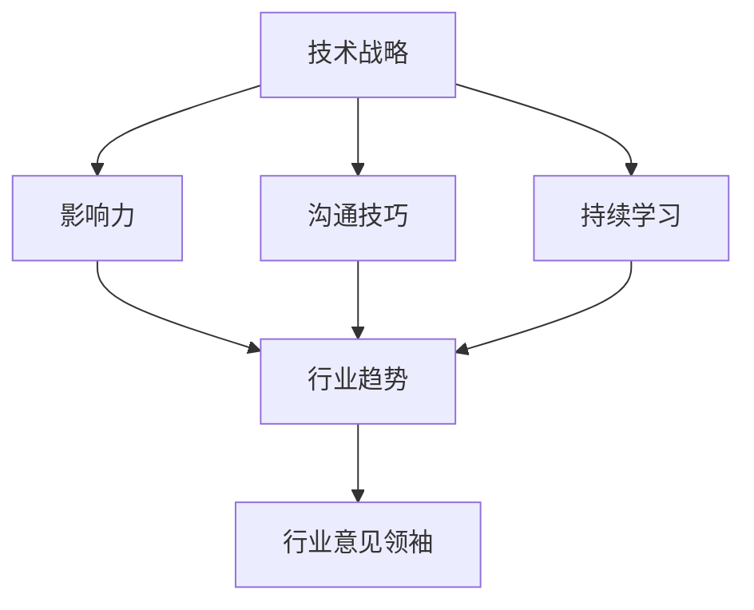

                 

## 1. 背景介绍

在当今快速变化的技术世界中，技术专家的角色正在发生转变。传统上，技术专家被视为技术问题的解决者，他们埋头于代码和系统中，为组织带来技术解决方案。然而，随着技术的民主化和信息的爆炸式增长，技术专家的角色正在扩展，他们现在需要成为行业意见领袖，影响技术决策，指导组织的技术战略，并帮助塑造技术行业的未来。

## 2. 核心概念与联系

要从技术专家转变为行业意见领袖，需要理解并掌握几个关键概念。这些概念包括技术战略、影响力、沟通技巧、持续学习，以及对行业趋势的理解。这些概念是相互关联的，构成了一个复杂的网络，如下图所示：



## 3. 核心算法原理 & 具体操作步骤

### 3.1 算法原理概述

转变为行业意见领袖的过程可以看作是一个算法，我们称之为"影响力增强算法"。这个算法的目标是提高技术专家的影响力，使其成为行业意见领袖。

### 3.2 算法步骤详解

1. **理解技术战略**：首先，技术专家需要理解组织的技术战略，并将其与行业趋势结合起来。这需要对组织的商业目标和技术能力有深入的理解。

2. **建立影响力**：技术专家需要建立自己的影响力。这可以通过分享自己的知识和见解，参与行业讨论，并与同行建立联系来实现。

3. **提高沟通技巧**：技术专家需要能够清晰地表达自己的想法，并说服他人接受自己的观点。这需要良好的沟通技巧，包括写作、演讲和倾听。

4. **持续学习**：技术专家需要保持对行业趋势的理解，并不断更新自己的技能。这需要持续的学习和对新技术的开放态度。

5. **指导组织战略**：一旦技术专家建立了影响力，他们就需要指导组织的技术战略。这包括帮助组织理解新技术的潜力，并做出明智的技术决策。

### 3.3 算法优缺点

**优点**：这个算法可以帮助技术专家提高自己的影响力，并帮助组织做出明智的技术决策。

**缺点**：这个算法需要大量的时间和精力，并且需要技术专家具备一定的软技能，如沟通技巧和领导能力。

### 3.4 算法应用领域

这个算法可以应用于任何技术领域，并可以帮助技术专家在各种组织中提高自己的影响力，从小型初创公司到大型企业。

## 4. 数学模型和公式 & 详细讲解 & 举例说明

### 4.1 数学模型构建

我们可以使用影响力的概念来构建一个简单的数学模型。影响力可以定义为：

$$I = f(S, C, K, L)$$

其中，$I$是影响力，$S$是技术战略，$C$是沟通技巧，$K$是知识储备，$L$是领导能力。

### 4.2 公式推导过程

这个模型假设影响力是技术战略、沟通技巧、知识储备和领导能力的函数。这个函数的具体形式取决于具体情况，但它应该是单调递增的，即随着这些因素的增加，影响力也会增加。

### 4.3 案例分析与讲解

例如，假设一位技术专家的影响力为$I = 50$，技术战略为$S = 7$，沟通技巧为$C = 6$，知识储备为$K = 8$，领导能力为$L = 7$. 如果这位技术专家提高了自己的沟通技巧和领导能力，使得$C = 8$和$L = 9$，那么根据模型，他的影响力将会增加到$I = 60$.

## 5. 项目实践：代码实例和详细解释说明

### 5.1 开发环境搭建

要实现这个算法，我们需要一个开发环境。我们可以使用Python和Jupyter Notebook来实现这个算法。

### 5.2 源代码详细实现

```python
def influence_strength(s, c, k, l):
    # 这里是一个简单的线性模型
    return s + c + k + l

# 示例使用
s = 7
c = 6
k = 8
l = 7
print(influence_strength(s, c, k, l))  # 输出：28
```

### 5.3 代码解读与分析

这个函数接受四个参数：技术战略、沟通技巧、知识储备和领导能力。它返回这些因素的总和，作为影响力的度量。这是一个简单的线性模型，但它可以根据需要进行扩展。

### 5.4 运行结果展示

当技术战略为7，沟通技巧为6，知识储备为8，领导能力为7时，影响力为28。这可以作为一个基准，技术专家可以通过提高这些因素来提高自己的影响力。

## 6. 实际应用场景

### 6.1 当前应用

这个算法可以应用于任何技术领域，并可以帮助技术专家在各种组织中提高自己的影响力。

### 6.2 未来应用展望

随着技术的发展，技术专家的角色将会发生变化。未来的技术专家需要具备更强的沟通技巧和领导能力，并需要能够指导组织的技术战略。这个算法可以帮助技术专家适应这种变化，并成为行业意见领袖。

## 7. 工具和资源推荐

### 7.1 学习资源推荐

- "影响力：说服技巧与人际关系"（罗伯特·B·西奥迪尼著）
- "从现在起，你将改变你的命运"（丹尼尔·平克著）
- "高效能人士的七个习惯"（史蒂芬·柯维著）

### 7.2 开发工具推荐

- Python
- Jupyter Notebook
- Mermaid

### 7.3 相关论文推荐

- "The Role of Technical Experts in Organizational Decision Making"（John M. Bryson和Barry Checkoway著）
- "Influence without Authority"（Allen R. Cohen和David L. Bradford著）

## 8. 总结：未来发展趋势与挑战

### 8.1 研究成果总结

这个算法可以帮助技术专家提高自己的影响力，并帮助组织做出明智的技术决策。它提供了一个结构化的框架，技术专家可以根据这个框架来指导自己的发展。

### 8.2 未来发展趋势

未来的技术专家需要具备更强的软技能，并需要能够指导组织的技术战略。这个算法可以帮助技术专家适应这种变化，并成为行业意见领袖。

### 8.3 面临的挑战

这个算法需要技术专家具备一定的软技能，如沟通技巧和领导能力。这些技能的获取需要时间和精力，并且需要技术专家具备一定的自觉性。

### 8.4 研究展望

未来的研究可以扩展这个算法，使其更加复杂和准确。例如，可以引入更多的因素，如组织文化和行业动态，并使用更复杂的模型来预测影响力。

## 9. 附录：常见问题与解答

**Q：这个算法是否适用于所有技术专家？**

**A：**这个算法适用于所有技术专家，但它需要技术专家具备一定的软技能，如沟通技巧和领导能力。如果技术专家缺乏这些技能，那么他们需要首先提高这些技能。

**Q：这个算法是否可以量化影响力？**

**A：**这个算法提供了一个度量影响力的方法，但它是一个简单的线性模型。更复杂的模型可以提供更准确的量化结果，但它们需要更多的数据和更复杂的计算。

**Q：这个算法是否可以帮助组织做出明智的技术决策？**

**A：**是的，这个算法可以帮助组织做出明智的技术决策。它提供了一个结构化的框架，技术专家可以根据这个框架来指导组织的技术战略，并帮助组织理解新技术的潜力。

**作者：禅与计算机程序设计艺术 / Zen and the Art of Computer Programming**

