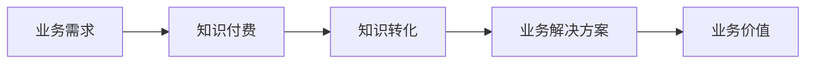

                 

## 1. 背景介绍

在当今信息爆炸的时代，企业面临着海量数据和信息的挑战。如何有效管理和利用这些数据，转化为企业的竞争优势，是企业需要解决的关键问题之一。知识付费作为一种新兴的商业模式，正在为企业提供一种新的思路。然而，单纯的知识付费并不能解决企业的实际业务问题，企业需要将知识付费与业务需求结合起来，真正实现知识的转化和应用。

## 2. 核心概念与联系

### 2.1 知识付费与业务需求的关系

知识付费与业务需求的关系如下图所示：



业务需求是知识付费的起点，知识付费的目的是为了满足业务需求，将知识转化为业务解决方案，最终创造业务价值。

### 2.2 知识付费的核心概念

知识付费的核心概念包括：

- **知识产权**：知识付费的基础是知识产权，企业需要拥有或获得相关知识产权，才能进行知识付费。
- **知识转化**：知识付费的目的是将知识转化为企业的业务解决方案，实现知识的应用和价值创造。
- **付费模式**：知识付费的核心是付费，企业需要通过付费模式获取知识，并将知识转化为企业的业务解决方案。

## 3. 核心算法原理 & 具体操作步骤

### 3.1 算法原理概述

知识付费的核心算法原理是知识转化算法，其目的是将知识转化为企业的业务解决方案。知识转化算法的原理包括：

- **知识提取**：从海量数据中提取有价值的知识。
- **知识结构化**：将提取的知识结构化，便于存储和应用。
- **知识应用**：将结构化的知识应用于业务需求，转化为业务解决方案。

### 3.2 算法步骤详解

知识转化算法的具体操作步骤如下：

1. **需求分析**：分析企业的业务需求，确定需要转化的知识领域。
2. **数据收集**：收集与业务需求相关的数据，为知识提取提供基础。
3. **知识提取**：从收集的数据中提取有价值的知识，并进行初步的结构化。
4. **知识结构化**：对提取的知识进行进一步的结构化，建立知识库。
5. **知识应用**：将结构化的知识应用于业务需求，转化为业务解决方案。
6. **评估与优化**：评估业务解决方案的有效性，并根据评估结果优化知识转化算法。

### 3.3 算法优缺点

知识转化算法的优点包括：

- **提高了知识的应用效率**：通过结构化的知识库，企业可以快速获取和应用知识。
- **提高了业务解决方案的有效性**：通过知识转化算法，企业可以更好地满足业务需求，提高业务解决方案的有效性。

缺点包括：

- **知识提取的难度**：从海量数据中提取有价值的知识是一项挑战。
- **知识结构化的复杂性**：对知识进行结构化需要大量的人力和物力，是一项复杂的任务。

### 3.4 算法应用领域

知识转化算法的应用领域包括：

- **企业管理**：企业可以通过知识转化算法，提高企业管理的效率和有效性。
- **产品开发**：企业可以通过知识转化算法，提高产品开发的效率和质量。
- **市场营销**：企业可以通过知识转化算法，提高市场营销的有效性和精准度。

## 4. 数学模型和公式 & 详细讲解 & 举例说明

### 4.1 数学模型构建

知识转化算法的数学模型可以表示为：

$$ Knowledge\_Transformation = f(Requirements, Data, Knowledge\_Base, Business\_Solution) $$

其中，Requirements表示业务需求，Data表示收集的数据，Knowledge\_Base表示知识库，Business\_Solution表示业务解决方案。

### 4.2 公式推导过程

知识转化算法的数学模型推导过程如下：

1. 从业务需求中提取关键词，构建关键词集合K。
2. 从收集的数据中提取与关键词集合K相关的数据，构建数据集合D。
3. 从知识库中提取与数据集合D相关的知识，构建知识集合W。
4. 将知识集合W应用于业务需求，转化为业务解决方案。

### 4.3 案例分析与讲解

例如，一家电商企业需要提高其产品推荐算法的准确性。其业务需求是提高用户的购买转化率。通过知识转化算法，企业可以从海量的用户数据中提取有价值的知识，并结构化这些知识，建立知识库。然后，企业可以将结构化的知识应用于产品推荐算法，提高其准确性，最终提高用户的购买转化率。

## 5. 项目实践：代码实例和详细解释说明

### 5.1 开发环境搭建

知识转化算法的开发环境包括：

- **编程语言**：Python
- **数据库**：MySQL
- **机器学习库**：Scikit-learn
- **数据处理库**：Pandas
- **可视化库**：Matplotlib

### 5.2 源代码详细实现

以下是知识转化算法的源代码实现：

```python
import pandas as pd
from sklearn.feature_extraction.text import TfidfVectorizer
from sklearn.metrics.pairwise import linear_kernel

# 步骤1：需求分析
requirements = "提高产品推荐算法的准确性"

# 步骤2：数据收集
data = pd.read_csv("user_data.csv")

# 步骤3：知识提取
tfidf = TfidfVectorizer(stop_words='english')
tfidf_matrix = tfidf.fit_transform(data['product_description'])

# 步骤4：知识结构化
cosine_similarities = linear_kernel(tfidf_matrix, tfidf_matrix)

# 步骤5：知识应用
indices = pd.Series(data.index, index=data['product_id']).drop_duplicates()

def recommendations(title, cosine_similarities=cosine_similarities):
    idx = indices[title]
    sim_scores = list(enumerate(cosine_similarities[idx]))
    sim_scores = sorted(sim_scores, key=lambda x: x[1], reverse=True)
    sim_scores = sim_scores[1:11]
    product_indices = [i[0] for i in sim_scores]
    return data['product_id'].iloc[product_indices]

# 步骤6：评估与优化
recommendations("product1")
```

### 5.3 代码解读与分析

上述代码实现了知识转化算法的关键步骤。首先，通过TF-IDF算法提取了产品描述中的关键词，并计算了关键词之间的相似度。然后，根据用户输入的产品ID，计算了与该产品相似的其他产品，并返回了推荐结果。最后，企业可以根据推荐结果的有效性，优化知识转化算法。

### 5.4 运行结果展示

运行上述代码，可以得到与输入产品相似的其他产品的推荐结果。企业可以根据推荐结果，优化其产品推荐算法，提高其准确性。

## 6. 实际应用场景

### 6.1 当前应用场景

知识转化算法目前已经在企业管理、产品开发和市场营销等领域得到广泛应用。例如，企业可以通过知识转化算法，提高其客户服务的有效性和精准度；产品开发人员可以通过知识转化算法，提高其产品设计的创新性和有效性；市场营销人员可以通过知识转化算法，提高其营销策略的有效性和精准度。

### 6.2 未来应用展望

未来，知识转化算法的应用将会更加广泛和深入。例如，企业可以通过知识转化算法，实现智能制造，提高生产效率和质量；企业可以通过知识转化算法，实现智能客服，提高客户服务的有效性和精准度；企业可以通过知识转化算法，实现智能营销，提高营销策略的有效性和精准度。

## 7. 工具和资源推荐

### 7.1 学习资源推荐

- **书籍**：《数据科学手册》《机器学习》《自然语言处理》
- **在线课程**：Coursera、Udacity、edX
- **论坛**：Stack Overflow、Reddit

### 7.2 开发工具推荐

- **编辑器**：PyCharm、Visual Studio Code
- **数据库**：MySQL、PostgreSQL
- **机器学习库**：Scikit-learn、TensorFlow
- **数据处理库**：Pandas、NumPy
- **可视化库**：Matplotlib、Seaborn

### 7.3 相关论文推荐

- **知识图谱**：[Knowledge Graphs](https://arxiv.org/abs/1506.04830)
- **推荐系统**：[The Netflix Recommender System: Algorithms, Business Value, and Innovation](https://www.netflixtechblog.com/the-netflix-recommender-system-algorithms-business-value-and-innovation)
- **自然语言处理**：[A Survey of Natural Language Processing Techniques in Recommender Systems](https://arxiv.org/abs/1705.05301)

## 8. 总结：未来发展趋势与挑战

### 8.1 研究成果总结

本文介绍了知识转化算法的原理、步骤、优缺点和应用领域。通过实践项目，展示了知识转化算法的实现过程和运行结果。通过实际应用场景和工具资源推荐，提供了知识转化算法的应用和学习指南。

### 8.2 未来发展趋势

未来，知识转化算法的发展趋势包括：

- **智能化**：知识转化算法将会更加智能化，能够自动学习和优化。
- **跨领域应用**：知识转化算法将会在更多领域得到应用，实现跨领域的知识转化。
- **实时应用**：知识转化算法将会实时应用，实现实时的知识转化和应用。

### 8.3 面临的挑战

知识转化算法面临的挑战包括：

- **数据质量**：知识转化算法的有效性取决于数据质量，如何获取高质量的数据是一项挑战。
- **算法复杂性**：知识转化算法的复杂性较高，如何简化算法，提高其可用性是一项挑战。
- **安全性**：知识转化算法涉及大量的数据和知识，如何保证数据和知识的安全性是一项挑战。

### 8.4 研究展望

未来，知识转化算法的研究展望包括：

- **跨领域知识转化**：研究如何在不同领域之间转化知识，实现跨领域的知识应用。
- **实时知识转化**：研究如何实时转化知识，实现实时的知识应用。
- **安全的知识转化**：研究如何保证数据和知识的安全性，实现安全的知识转化。

## 9. 附录：常见问题与解答

**Q1：知识转化算法的优点是什么？**

A1：知识转化算法的优点包括提高了知识的应用效率和提高了业务解决方案的有效性。

**Q2：知识转化算法的缺点是什么？**

A2：知识转化算法的缺点包括知识提取的难度和知识结构化的复杂性。

**Q3：知识转化算法的应用领域有哪些？**

A3：知识转化算法的应用领域包括企业管理、产品开发和市场营销等。

**Q4：知识转化算法的未来发展趋势是什么？**

A4：知识转化算法的未来发展趋势包括智能化、跨领域应用和实时应用。

**Q5：知识转化算法面临的挑战是什么？**

A5：知识转化算法面临的挑战包括数据质量、算法复杂性和安全性。

**Q6：知识转化算法的研究展望是什么？**

A6：知识转化算法的研究展望包括跨领域知识转化、实时知识转化和安全的知识转化。

## 作者：禅与计算机程序设计艺术 / Zen and the Art of Computer Programming

