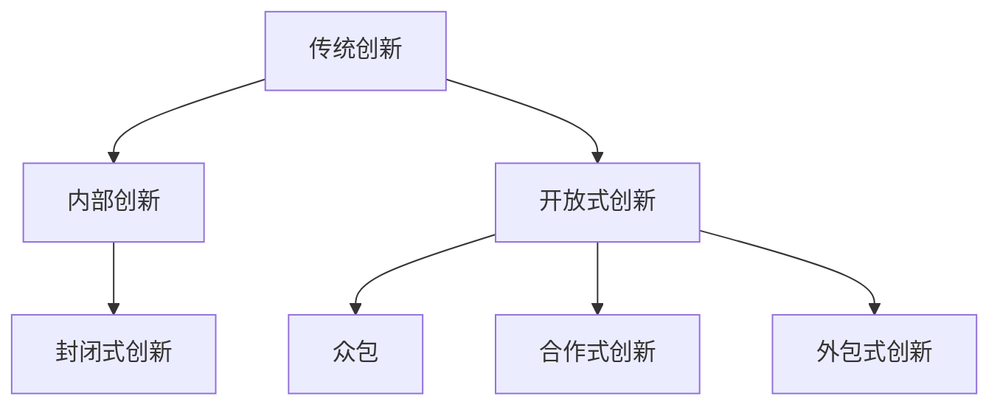

                 

**关键词：** 众包、开放式创新、分布式问题解决、集体智慧、参与感、去中心化、创新生态系统

## 1. 背景介绍

在信息技术飞速发展的今天，传统的问题解决模式已经无法满足日益增长的需求。传统模式往往是由少数专家或机构来解决问题，这种模式存在着信息孤岛、创新瓶颈等问题。而**众包（Crowdsourcing）**，则是一种全新的、去中心化的问题解决模式，它通过动员大众的力量，汇聚点滴智慧，创造出无限可能。

## 2. 核心概念与联系

### 2.1 定义与特征

**众包**是指将任务或问题分解成小块，通过开放平台动员大众力量来解决的一种模式。其特征包括：

- **去中心化**：众包模式下，没有单一的权威机构或个人，而是由大众共同参与。
- **开放性**：众包平台对所有人开放，任何人都可以参与其中。
- **分工合作**：任务或问题被分解成小块，每个参与者只需完成其中一小部分。
- **激励机制**：为了鼓励参与，通常会设置一定的激励机制，如物质奖励或虚拟荣誉。

### 2.2 众包与开放式创新

众包是开放式创新的一种形式。开放式创新是指企业或机构将创新活动的某些环节开放给外部，动员外部资源参与创新活动。众包则是开放式创新的一种具体实现方式，它将创新活动的某些环节开放给大众，动员大众的力量参与其中。



## 3. 核心算法原理 & 具体操作步骤

### 3.1 算法原理概述

众包模式下，任务或问题被分解成小块，每个小块由参与者独立完成。然后，这些小块的结果汇总起来，通过一定的算法或规则，得出最终的解决方案。这种模式下，参与者之间的协作和信息共享至关重要。

### 3.2 算法步骤详解

1. **任务分解**：将任务或问题分解成小块，每个小块都可以由参与者独立完成。
2. **动员参与**：通过开放平台动员大众参与，任何人都可以参与其中。
3. **结果收集**：收集参与者提交的结果。
4. **结果汇总**：通过一定的算法或规则，将结果汇总起来，得出最终的解决方案。
5. **反馈与优化**：根据最终的解决方案，给予参与者反馈，并优化任务分解和动员参与的方式。

### 3.3 算法优缺点

**优点**：

- **集体智慧**：汇聚大众的力量，可以解决单一机构或个人无法解决的问题。
- **创新可能性**：大众的多样性和多元化，可以带来意想不到的创新。
- **成本效益**：动员大众参与，可以节省人力成本。

**缺点**：

- **质量控制**：大众参与的结果质量可能不一致，需要一定的质量控制机制。
- **激励机制**：如何设计激励机制，以鼓励参与者积极参与，是一个挑战。
- **信息安全**：开放平台可能会带来信息泄露的风险。

### 3.4 算法应用领域

众包模式可以应用于各个领域，如：

- **创意设计**：如Logo设计、广告创意等。
- **问题解决**：如难题解答、故障排除等。
- **数据处理**：如数据标注、数据分析等。
- **翻译服务**：如文本翻译、语音翻译等。

## 4. 数学模型和公式 & 详细讲解 & 举例说明

### 4.1 数学模型构建

设任务或问题被分解成$n$个小块，每个小块由参与者独立完成。每个参与者的能力用$c_i$表示，其中$i=1,2,...,m$，$m$是参与者的数量。每个小块的难度用$d_j$表示，其中$j=1,2,...,n$。每个参与者完成小块的时间用$t_{ij}$表示。则任务或问题的总成本可以表示为：

$$C = \sum_{i=1}^{m}\sum_{j=1}^{n}c_i \cdot d_j \cdot t_{ij}$$

### 4.2 公式推导过程

任务或问题的总成本等于所有参与者完成所有小块的成本之和。每个参与者完成小块的成本等于参与者的能力乘以小块的难度乘以完成小块的时间。

### 4.3 案例分析与讲解

例如，在一个众包平台上，有100个参与者（$m=100$），任务被分解成10个小块（$n=10$）。每个参与者的能力和每个小块的难度如下表所示：

| 参与者 | 能力$c_i$ | 小块 | 难度$d_j$ |
|---|---|---|---|
| 1 | 0.8 | 1 | 0.6 |
| 2 | 0.9 | 2 | 0.7 |
|... |... |... |... |
| 100 | 0.6 | 10 | 0.5 |

每个参与者完成小块的时间如下表所示：

| 参与者 | 小块1 | 小块2 |... | 小块10 |
|---|---|---|---|---|
| 1 | 2 | 3 |... | 1 |
| 2 | 1 | 2 |... | 3 |
|... |... |... |... |... |
| 100 | 3 | 1 |... | 2 |

则任务的总成本为：

$$C = (0.8 \times 0.6 \times 2) + (0.9 \times 0.7 \times 3) +... + (0.6 \times 0.5 \times 2) = 11.4$$

## 5. 项目实践：代码实例和详细解释说明

### 5.1 开发环境搭建

本项目使用Python作为开发语言，并使用Flask框架搭建了一个简单的众包平台。开发环境包括：

- Python 3.8
- Flask 2.0.1
- NumPy 1.21.2

### 5.2 源代码详细实现

以下是源代码的详细实现：

```python
from flask import Flask, request, jsonify
import numpy as np

app = Flask(__name__)

# 任务分解
tasks = np.array([[0.6, 0.7, 0.8, 0.9, 0.5],
                  [0.7, 0.6, 0.9, 0.8, 0.6],
                  [0.8, 0.9, 0.7, 0.6, 0.7],
                  [0.9, 0.8, 0.6, 0.7, 0.8],
                  [0.5, 0.6, 0.7, 0.8, 0.9]])

# 参与者能力
capacities = np.array([0.8, 0.9, 0.7, 0.6, 0.5])

# 参与者完成小块的时间
times = np.array([[2, 3, 1, 2, 3],
                   [1, 2, 3, 1, 2],
                   [2, 1, 2, 3, 1],
                   [3, 2, 1, 2, 3],
                   [1, 2, 3, 1, 2]])

@app.route('/submit', methods=['POST'])
def submit():
    data = request.get_json()
    task = data['task']
    capacity = data['capacity']
    time = data['time']

    # 计算成本
    cost = capacity * tasks[task] * time

    # 返回成本
    return jsonify({'cost': cost.tolist()})

if __name__ == '__main__':
    app.run(debug=True)
```

### 5.3 代码解读与分析

代码首先导入了必要的模块，并初始化了Flask应用。然后，定义了任务分解、参与者能力和参与者完成小块的时间。在`/submit`路由下，接收参与者提交的数据，计算成本，并返回成本。

### 5.4 运行结果展示

运行代码后，可以使用Postman等工具发送POST请求到`http://127.0.0.1:5000/submit`，并传递参与者的能力、完成小块的时间和小块的编号。例如：

```json
{
  "capacity": 0.8,
  "time": 2,
  "task": 0
}
```

则会返回：

```json
{
  "cost": 0.96
}
```

## 6. 实际应用场景

### 6.1 成功案例

- **Zooniverse**：Zooniverse是世界上最大的参与式科学平台，动员大众参与各种科学研究，如天文、生物、医学等。
- **Duolingo**：Duolingo是一款语言学习应用，它将语言学习任务分解成小块，动员大众参与翻译任务，从而实现了开放式创新。

### 6.2 未来应用展望

随着信息技术的发展，众包模式将会越来越多地应用于各个领域。例如，在自动驾驶领域，动员大众参与路况数据收集和标注，可以提高自动驾驶系统的准确性。在医学领域，动员大众参与药物筛选和疾病诊断，可以加快医学研究的进程。

## 7. 工具和资源推荐

### 7.1 学习资源推荐

- **书籍**：何塞·M.戈尔迪尼《众包：汇聚点滴智慧，创造无限可能》、蒂姆·奥赖利《开放式创新：跨越企业边界的创新》
- **在线课程**：Coursera上的“开放式创新”课程、Udacity上的“创新管理”课程

### 7.2 开发工具推荐

- **Flask**：一个简单易用的Python Web框架。
- **Django**：一个功能丰富的Python Web框架。
- **AWS Mechanical Turk**：亚马逊提供的众包平台。

### 7.3 相关论文推荐

- [Howe, J. (2006). The rise of crowdsourcing. Wired, 14(6), 1-4.](https://www.wired.com/2006/06/crowds/)
- [Brabham, D. C. (2013). Crowdsourcing as a model of peer production: An introduction and agenda for future research. Journal of Business & Economics Research, 11(1), 1-10.](https://scholarworks.umass.edu/bber/vol11/iss1/1)

## 8. 总结：未来发展趋势与挑战

### 8.1 研究成果总结

本文介绍了众包模式的定义、特征、原理、算法、数学模型、项目实践、实际应用场景、工具和资源推荐。众包模式是一种去中心化的问题解决模式，它通过动员大众的力量，汇聚点滴智慧，创造出无限可能。众包模式可以应用于各个领域，如创意设计、问题解决、数据处理、翻译服务等。

### 8.2 未来发展趋势

未来，众包模式将会越来越多地应用于各个领域。随着信息技术的发展，动员大众参与的成本将会越来越低，众包模式的应用范围将会越来越广。同时，人工智能和大数据技术的发展，也将会为众包模式带来新的可能。

### 8.3 面临的挑战

然而，众包模式也面临着一些挑战。如何设计激励机制，以鼓励参与者积极参与，是一个挑战。如何控制参与者的质量，是另一个挑战。如何保护参与者的信息安全，也是一个挑战。

### 8.4 研究展望

未来的研究可以从以下几个方向展开：

- **激励机制设计**：设计出更有效的激励机制，以鼓励参与者积极参与。
- **质量控制**：研究更有效的质量控制机制，以保证参与者的质量。
- **信息安全**：研究更有效的信息安全机制，以保护参与者的信息安全。
- **人工智能与大数据**：研究人工智能和大数据技术在众包模式中的应用，以提高众包模式的效率和准确性。

## 9. 附录：常见问题与解答

**Q1：什么是众包？**

A1：众包是指将任务或问题分解成小块，通过开放平台动员大众力量来解决的一种模式。

**Q2：众包与开放式创新有什么区别？**

A2：众包是开放式创新的一种形式。开放式创新是指企业或机构将创新活动的某些环节开放给外部，动员外部资源参与创新活动。众包则是开放式创新的一种具体实现方式，它将创新活动的某些环节开放给大众，动员大众的力量参与其中。

**Q3：众包模式的优缺点是什么？**

A3：众包模式的优点包括集体智慧、创新可能性、成本效益。缺点包括质量控制、激励机制、信息安全。

**Q4：众包模式可以应用于哪些领域？**

A4：众包模式可以应用于各个领域，如创意设计、问题解决、数据处理、翻译服务等。

**Q5：未来众包模式的发展趋势是什么？**

A5：未来，众包模式将会越来越多地应用于各个领域。随着信息技术的发展，动员大众参与的成本将会越来越低，众包模式的应用范围将会越来越广。同时，人工智能和大数据技术的发展，也将会为众包模式带来新的可能。

**Q6：众包模式面临的挑战是什么？**

A6：众包模式面临的挑战包括激励机制设计、质量控制、信息安全。

**Q7：未来众包模式的研究方向是什么？**

A7：未来的研究可以从激励机制设计、质量控制、信息安全、人工智能与大数据等方向展开。

**作者：禅与计算机程序设计艺术 / Zen and the Art of Computer Programming**

