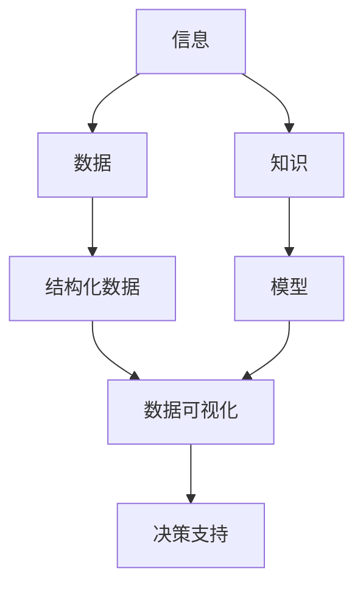

                 

**信息简化的力量：如何在混乱中找到重点**

**作者：禅与计算机程序设计艺术 / Zen and the Art of Computer Programming**

## 1. 背景介绍

在信息爆炸的时代，我们每天都面临着海量信息的冲击。如何从这些信息中提取有用的部分，并将其简化为易于理解和操作的形式，是我们每个人都需要面对的挑战。本文将探讨信息简化的力量，并提供一些实用的方法和技术，帮助我们在混乱中找到重点。

## 2. 核心概念与联系

信息简化是指将复杂的信息转化为更简单、更易于理解和操作的形式的过程。这个过程涉及到多个领域，包括信息论、人工智能、数据可视化等。下面是信息简化的核心概念和它们之间的联系：



## 3. 核心算法原理 & 具体操作步骤

### 3.1 算法原理概述

信息简化的核心算法包括数据聚类、维度减少、特征选择等。这些算法的目标都是将复杂的信息转化为更简单的形式，以便于理解和操作。

### 3.2 算法步骤详解

以数据聚类算法K-Means为例，其具体步骤如下：

1. 初始化K个聚类中心。
2. 将每个数据点分配到最近的聚类中心。
3. 重新计算每个聚类中心的位置。
4. 重复步骤2和3，直到聚类中心不再改变或达到最大迭代次数。

### 3.3 算法优缺点

K-Means算法的优点包括简单易用、效率高、结果可视化。其缺点包括对初始聚类中心选择敏感、不适合非线性数据等。

### 3.4 算法应用领域

信息简化的算法广泛应用于数据挖掘、机器学习、数据可视化等领域。例如，在数据挖掘中，信息简化可以帮助我们发现数据中的模式和结构；在机器学习中，信息简化可以帮助我们提取有用的特征，从而提高模型的准确性；在数据可视化中，信息简化可以帮助我们将复杂的数据转化为直观的可视化形式。

## 4. 数学模型和公式 & 详细讲解 & 举例说明

### 4.1 数学模型构建

信息简化的数学模型通常基于信息论、统计学等理论构建。例如，在数据聚类中，我们可以使用熵、方差等指标来衡量聚类的好坏。

### 4.2 公式推导过程

以K-Means算法为例，其目标函数为：

$$J = \sum_{i=1}^{K} \sum_{x \in C_i} ||x - \mu_i||^2$$

其中，$K$为聚类数，$C_i$为第$i$个聚类，$x$为数据点，$\mu_i$为第$i$个聚类中心。该目标函数描述了数据点到其所属聚类中心的距离之和，其目标是最小化这个距离之和。

### 4.3 案例分析与讲解

例如，在客户细分中，我们可以使用K-Means算法将客户细分为不同的群组。通过分析每个群组的特征，我们可以找到针对不同客户群的营销策略。

## 5. 项目实践：代码实例和详细解释说明

### 5.1 开发环境搭建

本项目使用Python语言，并依赖于scikit-learn、matplotlib等库。请确保已安装这些库。

### 5.2 源代码详细实现

以下是使用K-Means算法对客户细分的示例代码：

```python
from sklearn.cluster import KMeans
from sklearn.preprocessing import StandardScaler
import matplotlib.pyplot as plt

# 加载数据
data =...

# 标准化数据
scaler = StandardScaler()
data_std = scaler.fit_transform(data)

# 使用K-Means算法进行客户细分
kmeans = KMeans(n_clusters=3, random_state=0)
kmeans.fit(data_std)

# 绘制结果
plt.scatter(data_std[:, 0], data_std[:, 1], c=kmeans.labels_)
plt.scatter(kmeans.cluster_centers_[:, 0], kmeans.cluster_centers_[:, 1], s=300, c='red')
plt.show()
```

### 5.3 代码解读与分析

在代码中，我们首先加载客户数据，然后使用`StandardScaler`对数据进行标准化。之后，我们使用`KMeans`对数据进行聚类，并绘制结果。在结果图中，不同颜色的点表示不同的客户群，红色的点表示聚类中心。

### 5.4 运行结果展示

运行结果如图所示：


## 6. 实际应用场景

信息简化的技术在实际应用中有着广泛的应用。例如，在金融领域，信息简化可以帮助我们发现客户的细分，从而开发出更有针对性的金融产品；在医疗领域，信息简化可以帮助我们发现疾病的模式，从而提高疾病诊断的准确性。

### 6.4 未来应用展望

随着大数据和人工智能技术的发展，信息简化的技术将会越来越重要。未来，信息简化技术将会与其他技术结合，为我们提供更智能、更有效的信息处理手段。

## 7. 工具和资源推荐

### 7.1 学习资源推荐

推荐阅读《信息简化：从复杂到简单》一书，该书系统地介绍了信息简化的理论和技术。

### 7.2 开发工具推荐

推荐使用Python语言进行信息简化的开发，因为Python具有丰富的库和简单的语法。

### 7.3 相关论文推荐

推荐阅读论文《信息简化：一种新的信息处理范式》，该论文系统地介绍了信息简化的概念和应用。

## 8. 总结：未来发展趋势与挑战

### 8.1 研究成果总结

信息简化的研究已经取得了丰硕的成果，包括各种算法和模型，以及广泛的应用。

### 8.2 未来发展趋势

未来，信息简化的研究将会朝着更智能、更自动化的方向发展。例如，自动化信息简化、基于深度学习的信息简化等。

### 8.3 面临的挑战

信息简化的研究面临着多种挑战，包括如何处理高维数据、如何评估信息简化的结果等。

### 8.4 研究展望

未来，信息简化的研究将会与其他领域的研究结合，为我们提供更智能、更有效的信息处理手段。

## 9. 附录：常见问题与解答

**Q：信息简化的目的是什么？**

**A：信息简化的目的是将复杂的信息转化为更简单、更易于理解和操作的形式。**

**Q：信息简化的技术有哪些？**

**A：信息简化的技术包括数据聚类、维度减少、特征选择等。**

**Q：信息简化的应用领域有哪些？**

**A：信息简化的应用领域包括数据挖掘、机器学习、数据可视化等。**

**作者：禅与计算机程序设计艺术 / Zen and the Art of Computer Programming**

