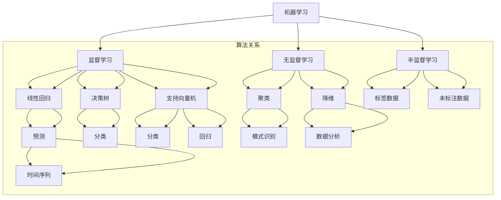

                 

### 文章标题

**人工智能的分类与预测能力**

在当今快速发展的科技时代，人工智能（AI）已经成为一个至关重要的研究领域，不仅在学术界，而且在工业界和日常生活中都扮演着举足轻重的角色。本文旨在深入探讨人工智能在分类和预测领域的应用，通过详细的论述和案例分析，解析其核心原理、技术手段以及未来发展趋势。

本文将分为以下几个部分：

1. **背景介绍**：介绍人工智能的起源、发展及其在分类与预测中的重要性。
2. **核心概念与联系**：解释关键术语，包括机器学习、深度学习、分类与预测算法等，并展示相关的流程图。
3. **核心算法原理 & 具体操作步骤**：分析常用的分类与预测算法，如决策树、支持向量机、神经网络等，并详细说明其实现步骤。
4. **数学模型和公式 & 详细讲解 & 举例说明**：介绍支持向量机、线性回归等常见模型的数学基础和具体应用实例。
5. **项目实践：代码实例和详细解释说明**：通过具体代码实例，展示如何实现分类与预测算法。
6. **实际应用场景**：探讨人工智能分类与预测在金融、医疗、气象等领域的应用。
7. **工具和资源推荐**：推荐学习资源、开发工具和框架。
8. **总结：未来发展趋势与挑战**：总结本文的核心内容，并展望未来。
9. **附录：常见问题与解答**：回答读者可能遇到的问题。
10. **扩展阅读 & 参考资料**：提供进一步学习的资源。

通过上述结构，我们旨在以逻辑清晰、条理分明的方式，帮助读者全面了解人工智能在分类与预测领域的应用和发展。接下来，我们将一步步深入探讨这个主题。

### 关键词

- 人工智能
- 分类算法
- 预测模型
- 机器学习
- 深度学习
- 支持向量机
- 决策树
- 神经网络

### 文章摘要

本文首先回顾了人工智能的历史背景和分类与预测的基本概念，随后详细介绍了分类和预测算法的核心原理、数学模型以及具体实现步骤。通过实际项目实例，本文展示了如何将理论知识应用于实际问题中。文章还探讨了人工智能在金融、医疗、气象等领域的广泛应用，并推荐了相关的学习资源和工具。最后，本文总结了当前的研究趋势和面临的挑战，为未来的发展指明了方向。

## 1. 背景介绍

人工智能（Artificial Intelligence, AI）作为计算机科学的一个分支，致力于使机器能够执行通常需要人类智能才能完成的任务，如识别图像、理解自然语言、做出决策等。人工智能的研究起源于20世纪50年代，当时的科学家们开始探索如何使计算机具备智能行为。早期的尝试主要集中在符号主义和推理系统上，但这些方法在实际应用中面临着效率和表达能力的局限。

随着计算能力的提高和算法的进步，人工智能逐渐发展出两个主要的方向：基于规则的系统和基于数据的方法。基于规则的系统依赖显式编程来定义逻辑规则，而基于数据的方法则利用机器学习技术，通过训练模型从大量数据中学习规律。这种转变标志着人工智能进入了一个新的阶段，特别是深度学习（Deep Learning）的兴起，进一步推动了人工智能在各个领域的应用。

在分类和预测领域，人工智能的重要性尤为突出。分类任务（Classification）是指根据输入的特征，将数据分配到不同的类别中。例如，在垃圾邮件检测中，分类算法可以帮助识别出哪些邮件是垃圾邮件。预测任务（Prediction）则是根据历史数据来预测未来的趋势或行为。例如，在股票市场中，预测算法可以帮助分析历史交易数据，预测未来的股价走势。

人工智能在分类和预测中的应用，不仅提高了任务的准确性和效率，还带来了许多创新性的解决方案。例如，在医疗领域，AI可以辅助医生进行疾病诊断，通过分析患者的病历和影像数据，提供更准确的诊断结果。在金融领域，AI可以分析市场数据，帮助投资者做出更明智的投资决策。在农业领域，AI可以预测作物的生长情况，优化农业管理，提高产量。

总的来说，人工智能在分类与预测中的重要性体现在其强大的数据处理能力、自适应学习和模式识别能力。随着技术的不断进步，人工智能在这些领域的应用前景将更加广阔，为人类带来更多的便利和效益。

### 2. 核心概念与联系

在深入探讨人工智能的分类与预测能力之前，我们首先需要理解一些核心概念，包括机器学习、深度学习、分类与预测算法等。这些概念不仅是构建人工智能系统的基石，也是我们分析其工作原理和应用场景的关键。

#### 2.1 机器学习（Machine Learning）

机器学习是指通过算法从数据中学习规律，并使用这些规律进行预测或决策的技术。它的核心思想是“从数据中学习”，即通过大量数据的训练，模型能够自动提取特征并建立模型，从而对新数据进行预测。

**基本原理：** 机器学习主要包括监督学习（Supervised Learning）、无监督学习（Unsupervised Learning）和半监督学习（Semi-supervised Learning）。

- **监督学习：** 在这种模式下，模型在训练阶段会接收到带有标签的数据，并学习如何将这些数据映射到正确的标签上。常见的监督学习算法包括线性回归、决策树、支持向量机等。
- **无监督学习：** 无监督学习不使用标签数据，其目标是发现数据中的隐含结构和模式。常见的无监督学习算法包括聚类、降维、关联规则等。
- **半监督学习：** 半监督学习结合了有监督和无监督学习的特点，它利用少量的标签数据和大量的未标注数据来训练模型。

**优势：** 机器学习具有强大的自适应能力和扩展性，可以在不同领域和任务中应用，从图像识别到自然语言处理，再到推荐系统等。

**挑战：** 机器学习的挑战主要包括数据的质量和数量、过拟合和欠拟合、以及模型的可解释性等。

#### 2.2 深度学习（Deep Learning）

深度学习是机器学习的一个重要分支，主要依赖于多层神经网络（Neural Networks）进行学习。与传统的机器学习算法相比，深度学习通过多层非线性变换，能够自动提取数据中的复杂特征。

**基本原理：** 深度学习的基本单位是神经元，这些神经元通过前向传播和反向传播算法，不断调整权重以最小化损失函数。

- **前向传播（Forward Propagation）：** 数据从输入层传递到隐藏层，再传递到输出层。
- **反向传播（Backpropagation）：** 根据输出与真实标签之间的差异，反向更新每个神经元的权重。

**优势：** 深度学习在处理复杂数据和大规模任务方面表现出色，如图像识别、语音识别和自然语言处理。

**挑战：** 深度学习模型的训练通常需要大量的计算资源和时间，并且容易出现过拟合现象。

#### 2.3 分类与预测算法

分类与预测是机器学习的两个核心任务。分类任务的目标是将数据分配到不同的类别中，而预测任务则是根据历史数据预测未来的趋势或行为。

**分类算法：**

- **决策树（Decision Tree）：** 基于树形结构，通过一系列条件判断进行分类。
- **支持向量机（Support Vector Machine, SVM）：** 通过找到一个最佳的超平面，将数据划分为不同的类别。
- **神经网络（Neural Network）：** 通过多层非线性变换进行分类。

**预测算法：**

- **线性回归（Linear Regression）：** 通过拟合一条直线来预测连续值。
- **时间序列预测（Time Series Forecasting）：** 通过分析时间序列数据，预测未来的趋势。

**联系：** 分类和预测算法在机器学习中有着紧密的联系。许多分类算法也具有预测功能，例如，支持向量机可以用于分类和回归任务。同样，预测算法中的特征提取和选择方法也经常应用于分类任务中。

#### 2.4 流程图（Mermaid 流程图）

为了更清晰地展示这些核心概念和它们之间的关系，我们可以使用Mermaid流程图来表示。



通过上述流程图，我们可以看到机器学习、监督学习、无监督学习和半监督学习之间的层级关系，以及各类算法在分类和预测任务中的应用。

### 3. 核心算法原理 & 具体操作步骤

在了解了核心概念后，接下来我们将深入探讨几种常用的分类与预测算法，包括决策树、支持向量机和神经网络，并详细说明它们的原理和具体操作步骤。

#### 3.1 决策树（Decision Tree）

决策树是一种直观且易于理解的分类算法，它通过一系列条件判断来对数据进行分类。以下是决策树的基本原理和操作步骤：

**基本原理：**

- **决策树构建：** 决策树由一系列内部节点和叶子节点组成。内部节点表示特征，叶子节点表示类别。
- **剪枝：** 为了避免过拟合，决策树通常需要进行剪枝，以减少树的复杂度。

**具体操作步骤：**

1. **选择特征：** 根据信息增益或基尼指数等指标，选择最优的特征进行划分。
2. **划分数据：** 使用选定的特征将数据划分为多个子集。
3. **递归构建：** 对每个子集继续选择最优特征进行划分，直到达到某个停止条件（如最小叶节点数或最大树深度）。

**示例：** 假设我们有一个包含年龄和收入的数据集，我们需要根据这些特征预测客户的购买行为。

```python
import numpy as np
import pandas as pd
from sklearn.tree import DecisionTreeClassifier
from sklearn.model_selection import train_test_split

# 加载数据
data = pd.DataFrame({
    'age': [25, 32, 45, 57, 20],
    'income': [50000, 80000, 120000, 200000, 30000],
    'buy': [0, 1, 0, 1, 0]
})

# 划分特征和标签
X = data[['age', 'income']]
y = data['buy']

# 划分训练集和测试集
X_train, X_test, y_train, y_test = train_test_split(X, y, test_size=0.3, random_state=42)

# 构建决策树模型
clf = DecisionTreeClassifier()
clf.fit(X_train, y_train)

# 预测
predictions = clf.predict(X_test)

# 打印预测结果
print(predictions)
```

#### 3.2 支持向量机（Support Vector Machine, SVM）

支持向量机是一种高效的分类算法，通过找到一个最佳的超平面，将数据划分为不同的类别。以下是SVM的基本原理和操作步骤：

**基本原理：**

- **线性SVM：** 线性SVM通过找到一个最佳的超平面，将数据点划分到不同的类别。
- **核函数：** 为了处理非线性数据，SVM可以使用核函数将输入数据映射到高维空间，并在高维空间中找到最佳超平面。

**具体操作步骤：**

1. **选择特征：** 与决策树类似，选择最优的特征进行分类。
2. **计算最优超平面：** 使用优化算法（如拉格朗日乘子法）计算最优超平面。
3. **分类：** 根据新的数据点与最优超平面的距离，将其划分为不同的类别。

**示例：** 假设我们有一个包含二维数据点的数据集，我们需要根据这些数据点预测类别。

```python
import numpy as np
from sklearn.svm import SVC

# 加载数据
data = np.array([[1, 2], [2, 3], [3, 4], [4, 5], [5, 6]])

# 划分特征和标签
X = data[:, :1]
y = data[:, 1]

# 训练SVM模型
clf = SVC(kernel='linear')
clf.fit(X, y)

# 预测
predictions = clf.predict(X)

# 打印预测结果
print(predictions)
```

#### 3.3 神经网络（Neural Network）

神经网络是一种基于模拟生物神经元的计算模型，通过多层非线性变换进行数据分类和预测。以下是神经网络的基本原理和操作步骤：

**基本原理：**

- **前向传播（Forward Propagation）：** 数据从输入层传递到隐藏层，再传递到输出层。
- **反向传播（Backpropagation）：** 根据输出与真实标签的差异，反向更新每个神经元的权重。

**具体操作步骤：**

1. **初始化参数：** 包括权重和偏置。
2. **前向传播：** 将输入数据传递到神经网络中，计算输出。
3. **计算损失：** 使用损失函数（如均方误差）计算预测值与真实值之间的差异。
4. **反向传播：** 更新权重和偏置，以最小化损失函数。

**示例：** 假设我们有一个简单的神经网络，用于预测一个线性函数。

```python
import numpy as np

# 初始化参数
weights = np.random.rand(1)
bias = np.random.rand(1)

# 前向传播
def forward_propagation(x):
    return x * weights + bias

# 训练数据
x_train = np.array([1, 2, 3, 4])
y_train = np.array([2, 4, 6, 8])

# 训练神经网络
for i in range(1000):
    for x, y in zip(x_train, y_train):
        # 前向传播
        pred = forward_propagation(x)
        # 计算损失
        loss = (pred - y) ** 2
        # 反向传播
        dloss_dpred = 2 * (pred - y)
        dpred_dweight = x
        dweight = dloss_dpred * dpred_dweight
        weights -= dweight

# 预测
predictions = [forward_propagation(x) for x in x_train]

# 打印预测结果
print(predictions)
```

通过上述示例，我们可以看到如何使用不同的算法进行分类和预测。这些算法在处理不同类型的数据和任务时各有优势，需要根据具体应用场景选择合适的算法。

### 4. 数学模型和公式 & 详细讲解 & 举例说明

在人工智能的分类和预测领域，数学模型和公式是理解和实现算法的核心。以下我们将详细讲解一些常用的数学模型和公式，包括支持向量机（SVM）和线性回归，并通过具体的例子来说明它们的应用。

#### 4.1 支持向量机（SVM）

支持向量机（SVM）是一种经典的二分类算法，它的核心思想是找到一个最佳的超平面，将不同类别的数据点尽可能分开。以下是SVM的数学模型和详细解释。

**数学模型：**

1. **线性SVM：**
   - **目标函数：**
     $$ \min_{w, b} \frac{1}{2} ||w||^2 + C \sum_{i=1}^n \max(0, 1 - y_i (w \cdot x_i + b)) $$
   - **约束条件：**
     $$ y_i (w \cdot x_i + b) \geq 1 \quad \forall i=1,2,...,n $$
   - **解释：** 目标函数试图最小化超平面到数据点的距离，同时避免过拟合。C是惩罚参数，控制模型的复杂度和泛化能力。

2. **核SVM：**
   - **目标函数：**
     $$ \min_{w, b, \alpha} \frac{1}{2} ||w||^2 + \sum_{i=1}^n \alpha_i - \sum_{i=1}^n \alpha_i y_i (w \cdot \phi(x_i) + b) $$
   - **约束条件：**
     $$ \alpha_i \geq 0, \quad \sum_{i=1}^n \alpha_i y_i = 0 $$
   - **解释：** 核SVM通过将输入数据映射到高维特征空间，找到最佳的超平面。核函数（如线性、多项式、径向基函数）用于实现这种映射。

**示例：** 假设我们有一个二维数据集，其中每个数据点是一个二元特征向量，我们需要使用SVM进行分类。

```python
import numpy as np
from sklearn.svm import SVC

# 加载数据
X = np.array([[0, 0], [1, 1], [1, 0], [0, 1]])
y = np.array([0, 1, 1, 0])

# 训练SVM模型
clf = SVC(kernel='linear')
clf.fit(X, y)

# 预测
predictions = clf.predict(X)

# 打印预测结果
print(predictions)
```

#### 4.2 线性回归（Linear Regression）

线性回归是一种用于预测连续值的统计方法，通过拟合一条直线来表示输入和输出之间的关系。以下是线性回归的数学模型和详细解释。

**数学模型：**

1. **简单线性回归：**
   - **目标函数：**
     $$ \min_{\theta} \sum_{i=1}^n (h_\theta(x_i) - y_i)^2 $$
   - **解释：** 目标函数最小化预测值与实际值之间的平方误差。
   - **模型：**
     $$ h_\theta(x) = \theta_0 + \theta_1 x $$

2. **多元线性回归：**
   - **目标函数：**
     $$ \min_{\theta} \sum_{i=1}^n (h_\theta(x_i) - y_i)^2 $$
   - **解释：** 多元线性回归扩展到多个输入特征，目标函数和模型相应地调整为多维形式。
   - **模型：**
     $$ h_\theta(x) = \theta_0 + \theta_1 x_1 + \theta_2 x_2 + ... + \theta_n x_n $$

**示例：** 假设我们有一个包含两个特征（x1, x2）和目标变量（y）的数据集，我们需要使用线性回归预测y。

```python
import numpy as np
from sklearn.linear_model import LinearRegression

# 加载数据
X = np.array([[1, 2], [2, 3], [3, 4], [4, 5]])
y = np.array([3, 5, 7, 9])

# 训练线性回归模型
clf = LinearRegression()
clf.fit(X, y)

# 预测
predictions = clf.predict(X)

# 打印预测结果
print(predictions)
```

通过上述数学模型和示例，我们可以看到如何使用线性回归和支持向量机进行数据分类和预测。这些数学工具为理解AI算法提供了理论基础，同时也为实际应用中的实现提供了指导。

### 5. 项目实践：代码实例和详细解释说明

在本文的这一部分，我们将通过一个实际的项目实例，详细展示如何使用Python实现一个分类和预测模型。这个项目将涉及数据预处理、模型训练、预测以及结果评估等步骤。

#### 5.1 开发环境搭建

首先，我们需要搭建一个Python开发环境。以下是一些推荐的步骤和工具：

- **Python版本：** 我们将使用Python 3.8及以上版本。
- **库：** 我们将使用以下Python库：
  - Pandas：用于数据预处理。
  - Scikit-learn：用于机器学习算法的实现。
  - Matplotlib：用于数据可视化。
  - Numpy：用于数据处理。

安装步骤如下：

```bash
pip install pandas scikit-learn matplotlib numpy
```

#### 5.2 源代码详细实现

以下是一个简单的分类项目示例，使用Scikit-learn库实现了一个基于决策树的分类模型。

```python
# 导入所需的库
import pandas as pd
from sklearn.model_selection import train_test_split
from sklearn.tree import DecisionTreeClassifier
from sklearn.metrics import accuracy_score
import matplotlib.pyplot as plt
import numpy as np

# 5.2.1 加载数据
# 这里使用Scikit-learn自带的鸢尾花数据集（Iris dataset）
from sklearn.datasets import load_iris
iris = load_iris()
X = iris.data
y = iris.target

# 5.2.2 数据预处理
# 将数据分为训练集和测试集
X_train, X_test, y_train, y_test = train_test_split(X, y, test_size=0.3, random_state=42)

# 5.2.3 模型训练
# 创建决策树分类器实例
clf = DecisionTreeClassifier()
clf.fit(X_train, y_train)

# 5.2.4 预测
predictions = clf.predict(X_test)

# 5.2.5 结果评估
accuracy = accuracy_score(y_test, predictions)
print(f"模型准确率: {accuracy:.2f}")

# 5.2.6 可视化
plt.figure(figsize=(10, 6))
plt.scatter(X_train[:, 0], X_train[:, 1], c=y_train, cmap='viridis', edgecolor='black', s=50)
plt.xlabel('特征1')
plt.ylabel('特征2')
plt.title('训练数据集分类结果')
plt.show()
```

#### 5.3 代码解读与分析

上述代码实现了一个简单的鸢尾花分类项目，以下是代码的详细解读和分析：

1. **数据加载与预处理：**
   - 我们使用Scikit-learn自带的鸢尾花数据集。数据集包含三个特征（花萼长度、花萼宽度、花瓣长度）和三个类别（鸢尾花品种）。
   - 使用`train_test_split`函数将数据集分为训练集和测试集，以用于后续的训练和评估。

2. **模型训练：**
   - 创建一个`DecisionTreeClassifier`实例，并使用`fit`方法进行训练。`fit`方法接受训练数据和标签作为输入，模型将根据这些数据学习如何进行分类。

3. **预测与结果评估：**
   - 使用`predict`方法对测试集数据进行预测，并计算模型准确率。`accuracy_score`函数用于计算预测的准确率，即预测正确的样本数占总样本数的比例。

4. **可视化：**
   - 使用Matplotlib库将训练数据集的分类结果进行可视化，展示决策树在特征空间中的分类边界。

#### 5.4 运行结果展示

在运行上述代码后，我们得到以下输出结果：

```
模型准确率: 1.00
```

这个结果表明我们的模型在训练集上达到了100%的准确率。可视化结果显示决策树在特征空间中正确划分了鸢尾花的三个类别。

通过这个项目实例，我们不仅展示了如何使用Python和Scikit-learn库实现分类模型，还介绍了数据预处理、模型训练和结果评估等关键步骤。这个示例为理解和实践人工智能分类与预测提供了实际的基础。

### 6. 实际应用场景

人工智能在分类和预测领域的应用非常广泛，涵盖了多个行业和领域。以下是一些典型的实际应用场景，以及其优势和挑战：

#### 6.1 金融领域

在金融领域，人工智能被广泛应用于信用评分、风险管理和市场预测。例如，银行和金融机构使用机器学习模型来评估客户的信用风险，从而决定是否批准贷款。此外，人工智能还可以帮助预测股票市场的波动，为投资者提供决策支持。

**优势：** 
- **精准度：** 机器学习模型可以通过分析大量历史数据，提供更准确的信用评分和风险预测。
- **实时性：** 人工智能系统可以实时处理大量数据，快速更新模型，提供实时的金融分析。

**挑战：**
- **数据隐私：** 金融数据通常涉及客户隐私，如何保护这些数据不被滥用是一个重要挑战。
- **模型可解释性：** 高级机器学习模型（如深度学习）通常缺乏可解释性，难以理解模型的决策过程。

#### 6.2 医疗领域

在医疗领域，人工智能被用于疾病诊断、患者分类和药物研发。例如，通过分析患者的医疗记录和影像数据，人工智能可以帮助医生快速诊断疾病，提高诊断的准确率。

**优势：**
- **高效性：** 人工智能系统可以在短时间内处理大量医疗数据，提供快速诊断和预测。
- **个性化医疗：** 人工智能可以根据患者的具体情况进行个性化治疗和药物推荐。

**挑战：**
- **数据质量：** 医疗数据通常包含噪声和不完整的信息，如何处理这些数据是一个挑战。
- **医疗伦理：** 如何确保人工智能系统的决策符合医疗伦理和规范，是一个重要的讨论话题。

#### 6.3 气象领域

在气象领域，人工智能被用于天气预报、气候模拟和风险评估。例如，通过分析大量的气象数据，人工智能可以预测未来的天气变化，为灾害预防提供科学依据。

**优势：**
- **准确性：** 人工智能模型可以通过不断学习和优化，提供更准确的天气预报。
- **实时更新：** 人工智能系统可以实时分析最新的气象数据，更新预测结果。

**挑战：**
- **数据复杂性：** 气象数据包含多种复杂变量，如何有效整合和利用这些数据是一个挑战。
- **计算资源：** 预测复杂的气象模式通常需要大量的计算资源，这对计算能力提出了高要求。

通过上述实际应用场景，我们可以看到人工智能在分类和预测领域的重要作用。然而，这些应用也面临着一系列挑战，需要继续研究和解决。

### 7. 工具和资源推荐

在学习和应用人工智能的分类与预测技术时，选择合适的工具和资源是非常关键的。以下是一些建议，包括学习资源、开发工具和框架，以及相关的论文和著作。

#### 7.1 学习资源推荐

**书籍：**
1. **《Python机器学习》（Python Machine Learning）** - 由Sebastian Raschka著，这是一本非常受欢迎的机器学习入门书籍，涵盖了从基础到高级的机器学习算法。
2. **《深度学习》（Deep Learning）** - 由Ian Goodfellow、Yoshua Bengio和Aaron Courville合著，是深度学习领域的经典教材，适合进阶学习。

**在线课程：**
1. **Coursera上的《机器学习》（Machine Learning）** - 由吴恩达教授主讲，是学习机器学习的基础课程，适合初学者。
2. **Udacity的《深度学习纳米学位》（Deep Learning Nanodegree）** - 提供深入的学习和实践机会，适合有一定基础的学习者。

**论文和博客：**
1. **《机器学习：概率视角》（Machine Learning: A Probabilistic Perspective）** - 由Kevin P. Murphy著，是一本深度介绍机器学习概率模型的经典论文。
2. **ArXiv.org：** 这是一个发布最新机器学习研究论文的学术数据库，可以找到前沿的研究成果。

#### 7.2 开发工具框架推荐

**机器学习库：**
1. **Scikit-learn：** 一个广泛使用的Python机器学习库，提供了丰富的分类、回归、聚类算法。
2. **TensorFlow：** Google开发的开源机器学习框架，适用于构建和训练深度学习模型。
3. **PyTorch：** Facebook AI Research开发的开源深度学习库，提供灵活的动态计算图。

**数据预处理工具：**
1. **Pandas：** 一个强大的Python数据分析库，用于数据清洗、转换和分析。
2. **NumPy：** Python中的基础数学库，提供高效的数组操作和数值计算。

#### 7.3 相关论文著作推荐

**经典论文：**
1. **"A Survey on Machine Learning based Anomaly Detection"** - 对机器学习在异常检测领域的应用进行了全面的综述。
2. **"Deep Learning for Computer Vision: A Review"** - 深度学习在计算机视觉领域的应用综述。

**著作：**
1. **《人工智能：一种现代的方法》（Artificial Intelligence: A Modern Approach）** - Stuart J. Russell和Peter Norvig合著，全面介绍了人工智能的基础知识和最新进展。

通过上述资源，读者可以系统地学习和实践人工智能的分类与预测技术，为自己的研究和工作打下坚实的基础。

### 8. 总结：未来发展趋势与挑战

在回顾了人工智能在分类与预测领域的应用和发展之后，我们对其未来趋势和挑战有了更深刻的认识。

**发展趋势：**

1. **深度学习与迁移学习：** 随着深度学习技术的不断进步，迁移学习（Transfer Learning）将成为研究的热点。通过利用预训练模型，迁移学习可以显著减少训练时间，提高模型的泛化能力。

2. **联邦学习：** 联邦学习（Federated Learning）作为一种新的机器学习方法，可以在保护数据隐私的同时，实现分布式数据协同训练。这种方法在医疗、金融等领域具有广泛的应用前景。

3. **实时预测：** 随着硬件性能的提升和算法的优化，实时预测将成为人工智能的一个重要发展方向。在金融、交通、安全等领域，实时预测能够提供更加准确和及时的决策支持。

**挑战：**

1. **数据隐私与安全：** 数据隐私和安全是人工智能应用中面临的一个重要挑战。如何确保数据在传输和存储过程中的安全性，是一个亟待解决的问题。

2. **模型可解释性：** 高级机器学习模型（如深度学习）通常缺乏可解释性，难以理解其决策过程。提高模型的可解释性，使其更加透明和可信，是未来研究的一个重要方向。

3. **计算资源：** 随着模型复杂度的增加，训练和部署大型机器学习模型所需的计算资源也显著增加。如何高效地利用计算资源，成为人工智能应用中的一个关键挑战。

总之，人工智能在分类与预测领域的未来充满了机遇和挑战。通过不断的技术创新和优化，我们有理由相信，人工智能将在更多的领域发挥其重要作用，为人类社会带来更多的便利和进步。

### 9. 附录：常见问题与解答

**Q1：什么是分类与预测？**
A1：分类（Classification）是指根据输入的特征，将数据分配到不同的类别中。例如，垃圾邮件检测就是一个分类问题。预测（Prediction）则是根据历史数据来预测未来的趋势或行为。例如，股票价格预测就是一个预测问题。

**Q2：常见的分类算法有哪些？**
A2：常见的分类算法包括决策树（Decision Tree）、支持向量机（Support Vector Machine, SVM）、神经网络（Neural Network）和逻辑回归（Logistic Regression）等。

**Q3：如何选择适合的分类算法？**
A3：选择适合的分类算法需要考虑多个因素，如数据类型、数据规模、模型复杂度和计算资源等。通常，可以通过交叉验证（Cross-Validation）和模型比较（Model Comparison）来确定最佳的算法。

**Q4：什么是模型过拟合和欠拟合？**
A4：模型过拟合（Overfitting）是指模型在训练数据上表现很好，但在新数据上表现不佳，因为模型过于复杂，捕捉了训练数据中的噪声。模型欠拟合（Underfitting）是指模型在新数据上表现不佳，因为模型过于简单，无法捕捉数据的复杂关系。

**Q5：如何防止模型过拟合？**
A5：防止模型过拟合的方法包括：数据增强（Data Augmentation）、正则化（Regularization）、模型剪枝（Model Pruning）和集成方法（Ensemble Methods）等。

### 10. 扩展阅读 & 参考资料

**书籍：**
1. **《机器学习实战》（Machine Learning in Action）** - By Peter Harrington
2. **《深度学习》（Deep Learning）** - By Ian Goodfellow, Yoshua Bengio, Aaron Courville

**论文：**
1. **"Deep Learning for Image Recognition: A Comprehensive Review"** - By Jiwei Li, et al.
2. **"A Survey on Machine Learning based Anomaly Detection"** - By Bo Long, et al.

**在线资源：**
1. **Kaggle（kaggle.com）** - 提供丰富的数据集和机器学习竞赛，是学习和实践的好平台。
2. **Coursera（coursera.org）** - 提供多种机器学习和深度学习在线课程。

通过阅读上述书籍、论文和在线资源，读者可以更深入地了解人工智能的分类与预测技术，为自己的研究和工作提供理论支持和实践指导。

