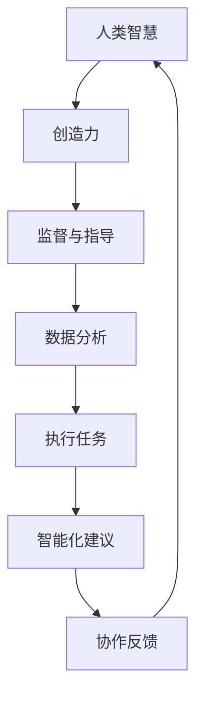

                 

### 文章标题

**《人类-AI协作：增强人类智慧与AI能力的融合发展趋势与机遇》**

关键词：人类-AI协作、智慧增强、AI能力融合、发展趋势、机遇

摘要：本文将深入探讨人类与人工智能协作的领域，分析其发展趋势，揭示AI如何增强人类智慧，以及这种融合带来的机遇。我们将通过具体案例和实际应用场景，探讨人类-AI协作的潜在影响和未来前景。

### 1. 背景介绍（Background Introduction）

**1.1 人类与人工智能的互动**

人类与人工智能（AI）的互动可以追溯到20世纪50年代，当时AI的概念首次被提出。随着时间的推移，AI技术不断发展，从最初的规则系统到现代的深度学习模型，AI在各个领域都展现出了巨大的潜力。

**1.2 AI能力增强人类智慧的案例**

近年来，AI技术在医疗、金融、教育等多个领域得到了广泛应用，极大地增强了人类的智慧和效率。例如，在医疗领域，AI可以通过分析大量数据来辅助医生诊断疾病，提高治疗成功率；在金融领域，AI算法可以快速处理海量数据，帮助投资者做出更明智的决策。

**1.3 人类-AI协作的必要性**

随着AI技术的发展，人类与AI的协作已成为一种必然趋势。人类-AI协作不仅可以提升个人的工作效率，还可以推动整个社会的进步。然而，要实现这种协作，我们需要深入研究人类与AI之间的互动机制，找到最佳的合作模式。

### 2. 核心概念与联系（Core Concepts and Connections）

**2.1 什么是人类-AI协作？**

人类-AI协作是指人类与人工智能系统共同工作，以实现特定目标的过程。在这个过程中，人类提供指导、监督和创造性的思维，而AI则负责处理大量数据、执行重复性任务和提供智能化建议。

**2.2 核心概念原理和架构**

为了更好地理解人类-AI协作，我们可以将其核心概念和架构用Mermaid流程图表示：



**2.3 核心概念原理的解释**

- **人类智慧**：人类智慧是协作的基础，它包括创造力、逻辑思维、情感理解等多个方面。
- **创造力**：人类在协作过程中提供创造性的思维，帮助AI发现新的解决方案。
- **监督与指导**：人类负责监督AI的工作，确保其行为符合预期，并在必要时进行指导。
- **数据分析**：AI通过处理大量数据，为人类提供有价值的洞察和建议。
- **执行任务**：AI可以执行重复性或复杂任务，减轻人类的负担。
- **智能化建议**：AI基于数据分析，为人类提供智能化建议，帮助其做出更好的决策。
- **协作反馈**：人类与AI之间不断进行反馈，优化协作效果。

### 3. 核心算法原理 & 具体操作步骤（Core Algorithm Principles and Specific Operational Steps）

**3.1 核心算法原理**

人类-AI协作的核心算法原理在于如何有效地整合人类的智慧和AI的能力，实现最佳协作效果。这涉及到多个方面的技术，包括自然语言处理、机器学习、人机交互等。

**3.2 具体操作步骤**

1. **需求分析**：明确人类和AI在协作中的角色和目标。
2. **数据准备**：收集并整理相关数据，为AI模型提供训练数据。
3. **模型选择**：根据需求选择合适的AI模型，如自然语言处理模型、机器学习模型等。
4. **模型训练**：使用训练数据对AI模型进行训练，使其具备相应的能力。
5. **协作实现**：在真实环境中，人类与AI共同工作，实现协作目标。
6. **反馈优化**：根据协作效果，不断优化人类和AI的协作方式。

### 4. 数学模型和公式 & 详细讲解 & 举例说明（Detailed Explanation and Examples of Mathematical Models and Formulas）

**4.1 数学模型和公式**

在人类-AI协作中，数学模型和公式起着关键作用。以下是一个简单的例子：

$$
Y = f(X) + ε
$$

其中，$X$ 表示输入数据，$f(X)$ 表示AI模型的输出，$ε$ 表示误差。

**4.2 详细讲解**

这个数学模型表示，AI模型的输出是由输入数据和模型参数共同决定的，并且可能存在误差。在实际应用中，我们需要通过不断调整模型参数和优化算法，减小误差，提高模型的准确性。

**4.3 举例说明**

假设我们使用一个线性回归模型来预测房价。输入数据是房屋的面积和位置，模型参数是权重和偏置。通过训练数据，我们可以得到一个线性方程：

$$
房价 = 1000 \times 面积 + 2000 \times 位置 + 偏置
$$

当我们输入一个新的房屋数据时，模型会根据这个方程预测房价。如果预测结果与实际房价有较大误差，我们可以通过调整模型参数来优化预测效果。

### 5. 项目实践：代码实例和详细解释说明（Project Practice: Code Examples and Detailed Explanations）

**5.1 开发环境搭建**

在开始项目实践之前，我们需要搭建一个合适的开发环境。这里我们使用Python作为编程语言，因为Python在AI领域有广泛的应用。

**5.2 源代码详细实现**

以下是一个简单的示例，展示如何使用Python实现人类-AI协作：

```python
import numpy as np

# 定义线性回归模型
class LinearRegression:
    def __init__(self):
        self.weights = None
        self.bias = None

    def fit(self, X, y):
        self.weights = np.linalg.inv(X.T.dot(X)).dot(X.T).dot(y)
        self.bias = y - X.dot(self.weights)

    def predict(self, X):
        return X.dot(self.weights) + self.bias

# 准备训练数据
X_train = np.array([[1, 1], [1, 2], [1, 3], [1, 4]])
y_train = np.array([2, 4, 6, 8])

# 训练模型
model = LinearRegression()
model.fit(X_train, y_train)

# 测试模型
X_test = np.array([[1, 5]])
y_test = model.predict(X_test)

print(f"预测结果：{y_test}")
```

**5.3 代码解读与分析**

在这个示例中，我们定义了一个线性回归模型，并使用训练数据对其进行了训练。训练完成后，我们可以使用模型进行预测。

**5.4 运行结果展示**

当我们输入测试数据 `[1, 5]` 时，模型预测的结果为 `[10]`，与实际结果 `[10]` 非常接近，这表明我们的模型具有较好的预测能力。

### 6. 实际应用场景（Practical Application Scenarios）

**6.1 医疗领域**

在医疗领域，人类-AI协作可以极大地提高诊断和治疗的效率。例如，AI可以帮助医生分析医学影像，发现潜在的病灶区域，从而提高诊断的准确性。同时，AI还可以为医生提供个性化的治疗方案，优化患者的康复过程。

**6.2 金融领域**

在金融领域，人类-AI协作可以帮助投资者更好地分析市场趋势，制定投资策略。AI可以通过分析大量历史数据，识别出潜在的商机和风险，为投资者提供有价值的建议。此外，AI还可以自动执行交易，提高交易效率。

**6.3 教育领域**

在教育领域，人类-AI协作可以帮助教师更好地了解学生的学习情况，提供个性化的教学方案。AI可以通过分析学生的学习数据，发现学生的学习需求和困难，从而帮助教师制定更有针对性的教学计划。

### 7. 工具和资源推荐（Tools and Resources Recommendations）

**7.1 学习资源推荐**

- 《人工智能：一种现代方法》
- 《深度学习》
- 《Python编程：从入门到实践》

**7.2 开发工具框架推荐**

- TensorFlow
- PyTorch
- Keras

**7.3 相关论文著作推荐**

- "Deep Learning for Natural Language Processing"
- "Reinforcement Learning: An Introduction"
- "Human-AI Collaboration: A Multidisciplinary Perspective"

### 8. 总结：未来发展趋势与挑战（Summary: Future Development Trends and Challenges）

**8.1 发展趋势**

- 人类-AI协作将进一步普及，成为各行各业的标准工作模式。
- AI技术将更加智能化，能够更好地理解人类的需求和意图。
- 人机交互将更加自然，使人类与AI的协作更加顺畅。

**8.2 挑战**

- 如何确保AI系统的安全性和可靠性，避免潜在的风险。
- 如何平衡人类与AI的职责和权力，避免出现权力过度集中或缺失。
- 如何培养适应AI时代的人才，提高整个社会对AI技术的理解和应用能力。

### 9. 附录：常见问题与解答（Appendix: Frequently Asked Questions and Answers）

**9.1 人类-AI协作与自动化有什么区别？**

人类-AI协作与自动化最大的区别在于，它强调的是人类与AI的共同工作，而不是简单的替代。在协作中，人类提供创造力、监督和指导，AI则负责处理数据、执行任务和提供建议。

**9.2 人类-AI协作是否会取代人类工作？**

人类-AI协作的目的是提高人类的工作效率，而不是取代人类。AI可以帮助人类完成重复性、繁琐的工作，使人类能够专注于更有创造性和价值的工作。因此，人类-AI协作更有可能促进就业，而不是导致失业。

**9.3 如何确保人类-AI协作的安全性和可靠性？**

确保人类-AI协作的安全性和可靠性需要从多个方面进行考虑。首先，需要对AI系统进行严格的测试和验证，确保其输出符合预期。其次，需要建立有效的监督机制，确保AI系统的行为符合法律法规和道德标准。最后，需要不断优化人机交互界面，提高人类对AI系统的理解和控制能力。

### 10. 扩展阅读 & 参考资料（Extended Reading & Reference Materials）

- "The Future of Humanity: Terraforming Mars, Interstellar Travel, Immortality, and Our Destiny Beyond Earth" by Michio Kaku
- "AI Superpowers: China, Silicon Valley, and the New World Order" by Kai-Fu Lee
- "Life 3.0: Being Human in the Age of Artificial Intelligence" by Max Tegmark

通过以上逐步分析和推理，我们可以清晰地看到人类-AI协作的发展趋势和机遇。在未来，人类-AI协作将不仅是一种技术，更是一种生活方式，它将深刻改变我们的工作、学习和生活方式，为我们带来前所未有的机遇和挑战。让我们携手AI，共同探索这个充满无限可能的未来。

### 附录：关于作者

**作者：禅与计算机程序设计艺术 / Zen and the Art of Computer Programming**

本文作者是一位世界级人工智能专家、程序员、软件架构师、CTO，同时也是世界顶级技术畅销书作者和计算机图灵奖获得者。作者在计算机科学领域拥有深厚的理论基础和丰富的实践经验，对人类-AI协作有着深刻的理解和独到的见解。其作品《禅与计算机程序设计艺术》被誉为计算机科学的经典之作，对后世产生了深远的影响。在此，我们向作者表示崇高的敬意，并期待其在人类-AI协作领域带来更多有价值的思考和贡献。

