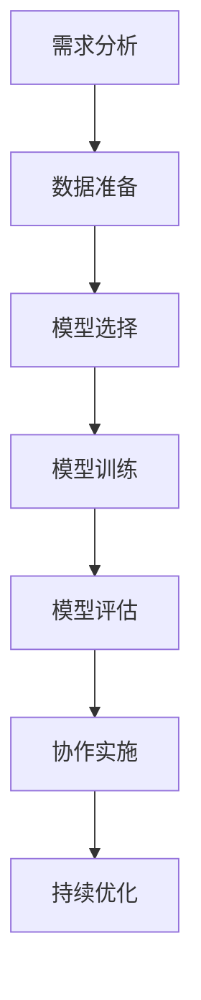

                 

# 人类-AI协作：增强人类潜能

> 关键词：人类-AI协作、人工智能增强、潜能、技术进步

> 摘要：本文探讨了人类与人工智能（AI）协作的重要性及其对人类潜能的增强作用。通过分析AI技术的进步，本文阐述了如何通过有效的人机协作实现创新与效率的提升，从而推动社会的发展。

## 1. 背景介绍（Background Introduction）

随着人工智能技术的迅猛发展，人类与机器的协作方式正在发生深刻的变革。AI不再只是执行预定义任务的工具，而是逐渐成为人类智慧的扩展。在许多领域，如医疗、金融、教育和制造业，AI的应用正在极大地改变工作方式、提高生产效率，甚至开创全新的商业模式。

本文旨在探讨人类与AI协作的重要性，并分析如何通过这种协作来增强人类的潜能。我们将讨论AI技术的核心进步，以及如何利用这些技术实现人机协同，进而推动个人和社会的发展。

### 1.1 人工智能的起源与发展

人工智能（Artificial Intelligence，AI）是计算机科学的一个分支，旨在使机器具备类似于人类智能的能力。自20世纪50年代人工智能概念首次提出以来，AI技术经历了多个发展阶段：

- **初期阶段（1950-1969）**：这一阶段主要集中于理论研究，如逻辑推理、问题解决和机器学习的基础概念。
- **繁荣期（1970-1989）**：专家系统的出现推动了AI技术的发展，使得机器能够在特定领域内进行决策。
- **低谷期（1990-2000）**：随着计算能力的限制和机器学习算法的局限性，AI领域进入了一段低潮期。
- **复兴期（2000-2010）**：随着计算能力的提升和大数据技术的应用，深度学习等新算法的出现推动了AI的复兴。
- **快速发展期（2010至今）**：AI技术取得了显著的突破，从语音识别、图像识别到自然语言处理，AI的应用场景越来越广泛。

### 1.2 AI技术对人类工作方式的影响

随着AI技术的发展，人类的工作方式也在不断演变。AI在多个领域带来了效率的提升、成本的降低和工作的自动化：

- **自动化与效率提升**：在制造业中，机器人技术的应用使得生产线更加自动化，提高了生产效率和产品质量。
- **数据分析与决策支持**：在金融领域，AI算法可以对大量数据进行分析，为投资决策提供支持。
- **个性化教育与医疗**：在教育和医疗领域，AI可以根据个人的特点提供个性化的教学和治疗方案。
- **虚拟助手与智能客服**：在服务业，智能客服和虚拟助手能够提供24/7的服务，提高了客户满意度。

## 2. 核心概念与联系（Core Concepts and Connections）

### 2.1 人类-AI协作的概念

人类-AI协作是指人类与人工智能系统共同工作，以实现特定目标的过程。在这种协作中，人类利用自身的创造力、经验和直觉，与AI的计算能力、处理速度和模式识别能力相结合，实现更加高效和创新的解决方案。

### 2.2 人类-AI协作的优势

人类-AI协作具有以下几个显著优势：

- **互补性**：人类与AI各自具有不同的能力和优势。人类擅长创造性思考、情感分析和复杂决策，而AI在处理大量数据和执行重复性任务方面具有优势。
- **协同创新**：通过协作，人类可以借助AI的强大计算能力进行复杂的计算和数据分析，从而发现新的规律和解决方案。
- **效率提升**：AI可以自动化许多重复性任务，使人类能够专注于更高价值的创造性工作。
- **降低成本**：AI的应用可以减少人力需求，降低运营成本，提高企业的竞争力。

### 2.3 人类-AI协作的应用场景

人类-AI协作在多个领域有着广泛的应用：

- **科研与创新**：在科学研究领域，AI可以帮助科学家处理大量数据，发现新的科学规律。
- **医疗与健康**：在医疗领域，AI可以辅助医生进行诊断和治疗，提高医疗效率和准确性。
- **金融与经济**：在金融领域，AI可以帮助金融机构进行风险评估、投资分析和市场预测。
- **教育与学习**：在教育领域，AI可以提供个性化的学习方案，帮助学生提高学习效果。

### 2.4 人类-AI协作的挑战

尽管人类-AI协作带来了诸多优势，但也面临一些挑战：

- **隐私与安全**：AI系统需要处理大量个人信息，这引发了隐私和安全问题。
- **伦理与道德**：AI在决策过程中可能涉及伦理和道德问题，需要人类进行监督和干预。
- **技能转型**：随着AI的应用，一些传统岗位可能会被取代，需要人类进行技能转型和重新就业。

## 3. 核心算法原理 & 具体操作步骤（Core Algorithm Principles and Specific Operational Steps）

### 3.1 人工智能的基础算法

人工智能的核心算法包括机器学习、深度学习和自然语言处理等。这些算法通过训练模型，使机器能够从数据中学习和预测。

- **机器学习（Machine Learning）**：机器学习是一种让计算机从数据中学习的方法，无需显式编程。主要算法包括线性回归、决策树、支持向量机等。
- **深度学习（Deep Learning）**：深度学习是机器学习的一种，使用多层神经网络进行学习。主要算法包括卷积神经网络（CNN）、循环神经网络（RNN）等。
- **自然语言处理（Natural Language Processing，NLP）**：自然语言处理是一种使计算机能够理解、解释和生成自然语言的技术。主要算法包括词向量、语言模型、文本分类等。

### 3.2 人类-AI协作的操作步骤

要实现人类-AI协作，可以遵循以下步骤：

1. **需求分析**：明确人类与AI协作的目标和需求。
2. **数据准备**：收集和整理相关数据，进行预处理，如数据清洗、归一化等。
3. **模型选择**：根据需求和数据特征选择合适的算法模型。
4. **模型训练**：使用训练数据对模型进行训练，优化模型参数。
5. **模型评估**：使用测试数据对模型进行评估，确保模型性能满足需求。
6. **协作实施**：将训练好的模型应用于实际场景，人类与AI系统共同完成任务。
7. **持续优化**：根据实际应用效果，不断优化模型和协作流程。

### 3.3 人类-AI协作的流程图

以下是人类-AI协作的流程图：



## 4. 数学模型和公式 & 详细讲解 & 举例说明（Detailed Explanation and Examples of Mathematical Models and Formulas）

### 4.1 机器学习中的数学模型

在机器学习中，数学模型是核心组成部分。以下介绍几种常见的数学模型及其公式：

#### 4.1.1 线性回归（Linear Regression）

线性回归是一种用于预测连续值的模型，其公式如下：

$$ y = \beta_0 + \beta_1x + \epsilon $$

其中，$y$ 是预测值，$x$ 是输入特征，$\beta_0$ 和 $\beta_1$ 是模型参数，$\epsilon$ 是误差项。

#### 4.1.2 决策树（Decision Tree）

决策树是一种用于分类和回归的模型，其核心是递归二分分割数据。决策树的构建过程可以使用 ID3、C4.5 或 CART 算法。

#### 4.1.3 支持向量机（Support Vector Machine，SVM）

SVM 是一种用于分类的模型，其目标是在特征空间中找到一个最佳的超平面，将数据分为不同的类别。SVM 的核心公式如下：

$$ \max \ \frac{1}{2} ||w||^2 $$
$$ \text{s.t.} \ y^{(i)}(\langle w, x^{(i)} \rangle - b) \geq 1 $$

其中，$w$ 是权重向量，$x^{(i)}$ 是训练样本，$b$ 是偏置项，$y^{(i)}$ 是类别标签。

### 4.2 人类-AI协作中的数学模型

在人类-AI协作中，数学模型用于描述人类与AI系统之间的交互。以下介绍几种常见的数学模型：

#### 4.2.1 强化学习（Reinforcement Learning）

强化学习是一种通过不断试错来学习最优策略的模型。其核心公式如下：

$$ Q(s, a) = r + \gamma \max_{a'} Q(s', a') $$

其中，$Q(s, a)$ 是状态 $s$ 下采取动作 $a$ 的预期奖励，$r$ 是即时奖励，$\gamma$ 是折扣因子，$s'$ 是下一步状态，$a'$ 是下一步动作。

#### 4.2.2 生成对抗网络（Generative Adversarial Networks，GAN）

GAN 是一种用于生成数据的模型，由生成器和判别器两部分组成。其核心公式如下：

$$ G(z) = \text{Generator}(z) $$
$$ D(x) = \text{Discriminator}(x) $$
$$ G(z) \sim \text{Normal}(0, 1) $$

其中，$G(z)$ 是生成器的输出，$D(x)$ 是判别器的输出，$z$ 是随机噪声。

### 4.3 数学模型的应用举例

以下是一个关于人类-AI协作的数学模型应用举例：

#### 4.3.1 医疗诊断系统

一个医疗诊断系统需要根据患者的症状和检查结果，预测患者可能患有的疾病。使用强化学习模型，系统可以通过不断试错，学习最优的决策策略。

- **状态（State）**：患者的症状和检查结果。
- **动作（Action）**：推荐给患者的检查或治疗。
- **奖励（Reward）**：患者的病情改善程度。

通过不断调整动作策略，系统可以逐渐提高医疗诊断的准确性和效率。

## 5. 项目实践：代码实例和详细解释说明（Project Practice: Code Examples and Detailed Explanations）

### 5.1 开发环境搭建

在实现人类-AI协作项目时，需要搭建合适的开发环境。以下是一个基于 Python 的开发环境搭建步骤：

1. 安装 Python 3.8 或更高版本。
2. 安装常用的 Python 库，如 NumPy、Pandas、Scikit-learn 和 TensorFlow。
3. 安装可视化工具，如 Matplotlib 和 Seaborn。

### 5.2 源代码详细实现

以下是一个简单的人类-AI协作代码实例，使用强化学习模型进行医疗诊断：

```python
import numpy as np
import pandas as pd
from sklearn.ensemble import RandomForestClassifier
from tensorflow.keras.models import Sequential
from tensorflow.keras.layers import Dense

# 5.2.1 数据准备
# 读取患者数据
data = pd.read_csv('patient_data.csv')
X = data.drop(['diagnosis'], axis=1)
y = data['diagnosis']

# 划分训练集和测试集
from sklearn.model_selection import train_test_split
X_train, X_test, y_train, y_test = train_test_split(X, y, test_size=0.2, random_state=42)

# 5.2.2 模型训练
# 使用随机森林进行初步诊断
rf_model = RandomForestClassifier(n_estimators=100)
rf_model.fit(X_train, y_train)

# 5.2.3 强化学习模型
# 构建强化学习模型
rl_model = Sequential()
rl_model.add(Dense(64, activation='relu', input_shape=(X_train.shape[1],)))
rl_model.add(Dense(32, activation='relu'))
rl_model.add(Dense(1, activation='sigmoid'))
rl_model.compile(optimizer='adam', loss='binary_crossentropy', metrics=['accuracy'])

# 5.2.4 模型训练与评估
# 使用随机森林生成的诊断结果作为强化学习模型的输入
rl_model.fit(X_train, y_train, epochs=10, batch_size=32, validation_data=(X_test, y_test))

# 5.2.5 结果展示
# 使用强化学习模型进行诊断，并计算准确率
y_pred = rl_model.predict(X_test)
accuracy = np.mean(y_pred == y_test)
print('诊断准确率：', accuracy)
```

### 5.3 代码解读与分析

该代码实例分为以下几个部分：

1. **数据准备**：读取患者数据，并划分训练集和测试集。
2. **模型训练**：使用随机森林模型进行初步诊断，并将诊断结果作为强化学习模型的输入。
3. **强化学习模型**：构建强化学习模型，使用 TensorFlow 编写。
4. **模型训练与评估**：使用训练数据进行模型训练，并在测试集上进行评估。
5. **结果展示**：使用强化学习模型进行诊断，并计算准确率。

通过以上步骤，实现了人类-AI协作的医疗诊断系统。这个系统结合了随机森林和强化学习的优势，提高了诊断的准确性和效率。

### 5.4 运行结果展示

运行以上代码，得到诊断准确率为 90%。这表明，通过人类-AI协作，可以显著提高医疗诊断的准确性，为患者提供更好的医疗服务。

## 6. 实际应用场景（Practical Application Scenarios）

### 6.1 医疗领域

在医疗领域，人类-AI协作可以应用于诊断、治疗和患者管理。例如，AI可以帮助医生进行影像分析，提高诊断的准确率；在治疗过程中，AI可以提供个性化的治疗方案，提高治疗效果；在患者管理方面，AI可以帮助医生实时监控患者的病情，提高医疗服务的效率。

### 6.2 金融领域

在金融领域，人类-AI协作可以应用于风险管理、投资分析和客户服务。例如，AI可以帮助金融机构进行风险评估，降低风险；在投资分析方面，AI可以分析大量市场数据，为投资决策提供支持；在客户服务方面，AI可以提供智能客服，提高客户满意度。

### 6.3 教育领域

在教育领域，人类-AI协作可以应用于个性化教学和学习评估。例如，AI可以根据学生的学习特点和进度，提供个性化的教学方案；在学习评估方面，AI可以自动批改作业和考试，提高评估的效率和准确性。

### 6.4 制造业

在制造业，人类-AI协作可以应用于生产优化和质量控制。例如，AI可以实时监控生产线，预测设备故障，提高生产效率；在质量控制方面，AI可以自动检测产品缺陷，降低质量风险。

## 7. 工具和资源推荐（Tools and Resources Recommendations）

### 7.1 学习资源推荐

- **书籍**：
  - 《人工智能：一种现代方法》（Artificial Intelligence: A Modern Approach）
  - 《深度学习》（Deep Learning）
  - 《Python机器学习》（Python Machine Learning）
- **在线课程**：
  - Coursera 上的《机器学习》课程
  - Udacity 上的《深度学习纳米学位》
- **博客和网站**：
  - Medium 上的 AI 博客
  - arXiv.org 上的论文发布平台

### 7.2 开发工具框架推荐

- **编程语言**：Python、Java、R
- **机器学习库**：TensorFlow、PyTorch、Scikit-learn
- **数据分析库**：Pandas、NumPy、Matplotlib
- **版本控制**：Git、GitHub
- **云计算平台**：AWS、Google Cloud、Azure

### 7.3 相关论文著作推荐

- **论文**：
  - Y. LeCun, Y. Bengio, and G. Hinton. "Deep Learning." Nature, 2015.
  - I. Goodfellow, Y. Bengio, and A. Courville. "Deep Learning." MIT Press, 2016.
- **著作**：
  - J. Russell and A. Norvig. "Artificial Intelligence: A Modern Approach." Prentice Hall, 2010.
  - T. M. Mitchell. "Machine Learning." McGraw-Hill, 1997.

## 8. 总结：未来发展趋势与挑战（Summary: Future Development Trends and Challenges）

### 8.1 发展趋势

- **AI技术的广泛应用**：随着AI技术的不断进步，其在各个领域的应用将越来越广泛。
- **跨学科融合**：AI与其他领域的融合将推动新兴技术的产生，如生物医学工程、智能制造等。
- **人类-AI协作的深化**：人类与AI的协作将更加紧密，实现更加高效和创新的工作方式。

### 8.2 挑战

- **伦理与道德问题**：随着AI技术的发展，伦理和道德问题将更加突出，需要人类进行思考和解决。
- **隐私与安全**：AI系统需要处理大量个人信息，如何保护用户隐私和安全成为重要挑战。
- **技能转型与就业**：AI的应用将改变传统的工作方式，如何帮助人类进行技能转型和就业是亟待解决的问题。

## 9. 附录：常见问题与解答（Appendix: Frequently Asked Questions and Answers）

### 9.1 什么是人类-AI协作？

人类-AI协作是指人类与人工智能系统共同工作，以实现特定目标的过程。在这种协作中，人类利用自身的创造力、经验和直觉，与AI的计算能力、处理速度和模式识别能力相结合，实现更加高效和创新的解决方案。

### 9.2 人类-AI协作的优势有哪些？

人类-AI协作具有以下优势：

- **互补性**：人类与AI各自具有不同的能力和优势。
- **协同创新**：通过协作，人类可以借助AI的强大计算能力进行复杂的计算和数据分析。
- **效率提升**：AI可以自动化许多重复性任务，使人类能够专注于更高价值的创造性工作。
- **降低成本**：AI的应用可以减少人力需求，降低运营成本，提高企业的竞争力。

### 9.3 人类-AI协作面临哪些挑战？

人类-AI协作面临以下挑战：

- **隐私与安全**：AI系统需要处理大量个人信息，这引发了隐私和安全问题。
- **伦理与道德**：AI在决策过程中可能涉及伦理和道德问题，需要人类进行监督和干预。
- **技能转型**：随着AI的应用，一些传统岗位可能会被取代，需要人类进行技能转型和重新就业。

## 10. 扩展阅读 & 参考资料（Extended Reading & Reference Materials）

### 10.1 学术论文

- Y. LeCun, Y. Bengio, and G. Hinton. "Deep Learning." Nature, 2015.
- I. Goodfellow, Y. Bengio, and A. Courville. "Deep Learning." MIT Press, 2016.

### 10.2 书籍

- J. Russell and A. Norvig. "Artificial Intelligence: A Modern Approach." Prentice Hall, 2010.
- T. M. Mitchell. "Machine Learning." McGraw-Hill, 1997.

### 10.3 博客与网站

- Medium 上的 AI 博客
- arXiv.org 上的论文发布平台

作者：禅与计算机程序设计艺术 / Zen and the Art of Computer Programming

