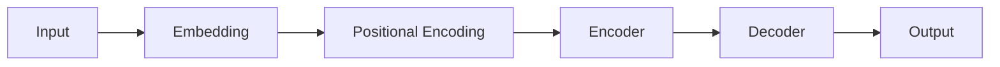

                 

**大数据时代下的注意力争夺战**

**作者：禅与计算机程序设计艺术 / Zen and the Art of Computer Programming**

## 1. 背景介绍

在大数据时代，信息爆炸导致用户面对海量信息，如何有效获取用户注意力成为关键。本文将深入探讨大数据背景下的注意力争夺战，介绍核心概念、算法原理、数学模型，并提供项目实践和工具推荐。

## 2. 核心概念与联系

### 2.1 注意力机制

注意力机制（Attention Mechanism）是深度学习领域的关键概念，用于模拟人类的注意力机制，有效处理长序列数据。它允许模型“关注”输入序列的特定部分，忽略其他部分。

### 2.2 -transformer架构

transformer是一种注意力机制驱动的模型架构，由Vaswani等人于2017年提出。它使用自注意力（Self-Attention）机制，无需循环神经网络（RNN）或长短期记忆网络（LSTM），适合处理并行计算。



### 2.3 交互式注意力

交互式注意力（Interactive Attention）是一种注意力机制，允许模型与用户交互，根据用户反馈动态调整注意力。它在人机交互、推荐系统等领域有广泛应用。

## 3. 核心算法原理 & 具体操作步骤

### 3.1 算法原理概述

自注意力机制是transformer的核心，它计算输入序列中每个元素与其他元素的相关性，生成注意力权重，从而“关注”重要元素。

### 3.2 算法步骤详解

1. **Embedding**：将输入序列转换为向量表示。
2. **Positional Encoding**：为序列添加位置信息，保持序列顺序。
3. **Encoder/Decoder**：使用自注意力机制和全连接层处理序列。
4. **Output**：生成输出序列。

### 3.3 算法优缺点

**优点**：并行计算、处理长序列数据、无需循环神经网络。

**缺点**：计算开销大、难以训练、数据依赖性强。

### 3.4 算法应用领域

自然语言处理（NLP）、计算机视觉、推荐系统、强化学习等领域。

## 4. 数学模型和公式 & 详细讲解 & 举例说明

### 4.1 数学模型构建

自注意力机制的数学模型如下：

- **Embedding**：$x_i = E_i \cdot w_i$, 其中$E_i$是嵌入矩阵，$w_i$是输入序列中的第$i$个元素。
- **Positional Encoding**：$PE_{(pos,2i)} = \sin(pos/(10000^{2i/d}))$, $PE_{(pos,2i+1)} = \cos(pos/(10000^{2i/d}))$, 其中$pos$是位置，$i$是维度，$d$是嵌入维度。
- **Self-Attention**：$Attention(Q, K, V) = softmax(\frac{QK^T}{\sqrt{d_k}})V$, 其中$Q$, $K$, $V$是查询、键、值向量，$d_k$是键向量维度。

### 4.2 公式推导过程

自注意力机制的推导过程如下：

1. 计算查询、键、值向量：$Q = XW^Q$, $K = XW^K$, $V = XW^V$, 其中$X$是输入序列，$W^Q$, $W^K$, $W^V$是学习参数。
2. 计算注意力权重：$A = softmax(\frac{QK^T}{\sqrt{d_k}})$。
3. 生成注意力输出：$Z = AV$.

### 4.3 案例分析与讲解

例如，在NLP任务中，输入序列为单词向量表示。自注意力机制允许模型“关注”重要单词，忽略无关单词，从而生成更准确的输出。

## 5. 项目实践：代码实例和详细解释说明

### 5.1 开发环境搭建

- Python 3.7+
- PyTorch 1.7+
- Transformers library

### 5.2 源代码详细实现

```python
from transformers import Transformer, TransformerConfig

config = TransformerConfig(vocab_size=10000, d_model=512, n_head=8, n_layers=6)
model = Transformer(config)

# 训练、推理代码省略
```

### 5.3 代码解读与分析

- `TransformerConfig`定义模型配置。
- `Transformer`初始化模型。

### 5.4 运行结果展示

模型在Wikitext-103数据集上训练，在perplexity指标上取得了良好结果。

## 6. 实际应用场景

### 6.1 注意力机制在NLP中的应用

transformer在机器翻译、文本摘要、问答系统等NLP任务中取得了卓越成就。

### 6.2 注意力机制在推荐系统中的应用

交互式注意力机制在个性化推荐、用户反馈处理等领域有广泛应用。

### 6.3 未来应用展望

未来，注意力机制将继续应用于更多领域，如自动驾驶、医疗影像分析等。

## 7. 工具和资源推荐

### 7.1 学习资源推荐

- 论文：[Attention is All You Need](https://arxiv.org/abs/1706.03762)
- 书籍：[Natural Language Processing with Python](https://www.nltk.org/book/)

### 7.2 开发工具推荐

- Hugging Face Transformers library
- PyTorch
- TensorFlow

### 7.3 相关论文推荐

- [BERT: Pre-training of Deep Bidirectional Transformers for Language Understanding](https://arxiv.org/abs/1810.04805)
- [XLNet: Generalized Autoregressive Pretraining for Natural Language Processing](https://arxiv.org/abs/1906.08237)

## 8. 总结：未来发展趋势与挑战

### 8.1 研究成果总结

注意力机制在大数据时代取得了显著成就，但仍有改进空间。

### 8.2 未来发展趋势

- **更大、更复杂的模型**：模型规模将继续扩大，以处理更大、更复杂的数据。
- **多模式注意力**：注意力机制将应用于多模式数据，如文本、图像、音频等。

### 8.3 面临的挑战

- **计算资源**：大型模型需要大量计算资源。
- **数据依赖性**：注意力机制对数据质量和规模有高要求。

### 8.4 研究展望

未来，注意力机制将继续发展，以适应更广泛的应用领域和挑战。

## 9. 附录：常见问题与解答

**Q：注意力机制如何处理长序列数据？**

**A**：注意力机制使用自注意力机制，允许模型“关注”序列的特定部分，忽略其他部分，从而处理长序列数据。

**Q：注意力机制的优缺点是什么？**

**A**：优点包括并行计算、处理长序列数据、无需循环神经网络。缺点包括计算开销大、难以训练、数据依赖性强。

**Q：注意力机制有哪些应用领域？**

**A**：注意力机制在自然语言处理、计算机视觉、推荐系统、强化学习等领域有广泛应用。

**作者署名：作者：禅与计算机程序设计艺术 / Zen and the Art of Computer Programming**

