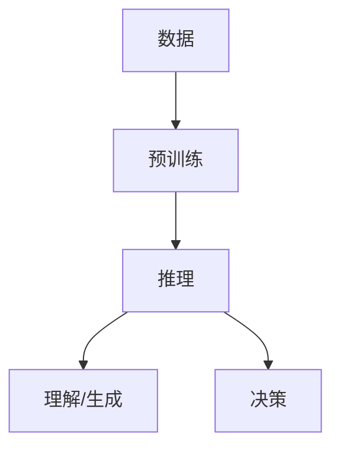

                 

## 1. 背景介绍

在当今的信息时代，数据量呈指数级增长，如何从中提取有用的信息和知识，并进行推理以做出决策，成为一项关键的挑战。大模型（Large Models）的出现，为解决这一挑战提供了新的可能。大模型是指具有数十亿甚至数千亿参数的模型，通过学习大量数据，它们能够理解和生成人类语言，并展示出惊人的推理能力。

本文将深入探讨大模型的核心概念、算法原理、数学模型，并通过项目实践和实际应用场景，展示大模型在知识和推理领域的应用。我们还将提供工具和资源推荐，并就未来发展趋势和挑战进行总结。

## 2. 核心概念与联系

### 2.1 核心概念

- **大模型（Large Models）**：具有数十亿甚至数千亿参数的模型，通过学习大量数据，它们能够理解和生成人类语言，并展示出惊人的推理能力。
- **Transformer模型**：大多数大模型都是基于Transformer架构构建的，它使用自注意力机制（Self-Attention）和位置编码（Positional Encoding）来处理序列数据。
- **预训练（Pre-training）**：大模型通常先在大量数据上进行预训练，学习语言的统计规律，然后再在特定任务上进行微调（Fine-tuning）。
- **推理（Inference）**：大模型通过学习数据中的模式，能够进行推理，即在给定输入的情况下，预测输出的可能性。

### 2.2 核心概念联系

大模型的核心是Transformer模型，它通过自注意力机制来理解输入序列中的上下文关系。预训练阶段，大模型学习语言的统计规律，如单词的上下文关系和语法结构。在推理阶段，大模型使用这些学习到的规律，对输入进行理解和生成。

以下是大模型核心概念的Mermaid流程图：



## 3. 核心算法原理 & 具体操作步骤

### 3.1 算法原理概述

大模型的核心算法是Transformer模型，它使用自注意力机制来处理序列数据。自注意力机制允许模型在处理序列时，关注序列中的其他位置，从而理解上下文关系。

### 3.2 算法步骤详解

1. **输入表示**：将输入序列（如文本）转换为向量表示，通常使用词嵌入（Word Embedding）和位置编码。
2. **编码器**：使用多个Transformer编码器块（Encoder Layer）来处理输入序列。每个编码器块包含多头自注意力（Multi-Head Self-Attention）和前向网络（Feed-Forward Network）。
3. **解码器**：在生成任务（如文本生成）中，使用Transformer解码器块（Decoder Layer）来生成输出序列。解码器块类似于编码器块，但它使用自注意力机制和源-目标注意力机制（Source-Target Attention）来关注输入序列和目标序列。
4. **输出**：使用线性层（Linear Layer）和softmax函数，生成输出序列的可能性分布。

### 3.3 算法优缺点

**优点**：

- 可以理解和生成人类语言，展示出惊人的推理能力。
- 可以在各种任务上进行微调，如文本分类、命名实体识别、机器翻译等。
- 可以通过自注意力机制理解上下文关系。

**缺点**：

- 训练大模型需要大量的计算资源和数据。
- 存在过拟合的风险，需要进行正则化和微调来减轻。
- 存在偏见和不公平的问题，需要进行特别的处理。

### 3.4 算法应用领域

大模型的应用领域包括但不限于：

- 文本生成：如机器翻译、文本摘要、文本完成等。
- 文本理解：如文本分类、命名实体识别、问答系统等。
- 代码生成：如代码补全、代码解释等。
- 多模式推理：如图文生成、图文理解等。

## 4. 数学模型和公式 & 详细讲解 & 举例说明

### 4.1 数学模型构建

大模型的数学模型是基于Transformer模型构建的。给定输入序列$x=(x_1, x_2,..., x_n)$，大模型的目标是学习参数$\theta$，使得输出序列$y=(y_1, y_2,..., y_m)$的可能性分布$P(y|x;\theta)$最大化。

### 4.2 公式推导过程

大模型的数学模型可以表示为：

$$P(y|x;\theta) = \prod_{t=1}^{m}P(y_t|y_{<t}, x;\theta)$$

其中，$y_{<t}$表示$y$的前$t-1$个元素。大模型使用自注意力机制和前向网络来计算$P(y_t|y_{<t}, x;\theta)$。

自注意力机制可以表示为：

$$Attention(Q, K, V) = softmax\left(\frac{QK^T}{\sqrt{d_k}}\right)V$$

其中，$Q$, $K$, $V$都是输入序列的向量表示，分别表示查询（Query）、键（Key）和值（Value）。$d_k$是键的维度。

前向网络可以表示为：

$$FFN(x) = max(0, xW_1 + b_1)W_2 + b_2$$

其中，$W_1$, $W_2$, $b_1$, $b_2$都是学习参数。

### 4.3 案例分析与讲解

例如，在机器翻译任务中，输入序列$x$是源语言的句子，输出序列$y$是目标语言的句子。大模型的目标是学习参数$\theta$，使得输出序列$y$是源语言句子的正确翻译。

在训练过程中，大模型使用交叉熵损失函数来更新参数$\theta$：

$$L(\theta) = -\sum_{t=1}^{m}\log P(y_t|y_{<t}, x;\theta)$$

## 5. 项目实践：代码实例和详细解释说明

### 5.1 开发环境搭建

大模型的开发需要强大的计算资源，通常需要GPU加速。我们推荐使用如下开发环境：

- Python 3.7+
- PyTorch 1.7+或TensorFlow 2.4+
- CUDA 10.1+（如果使用GPU加速）
- Transformers库（Hugging Face提供的Transformer模型库）

### 5.2 源代码详细实现

以下是大模型训练和推理的伪代码：

**训练**

```python
from transformers import Trainer, TrainingArguments

# 加载预训练模型
model = AutoModelForMaskedLM.from_pretrained("bert-base-uncased")

# 定义训练参数
training_args = TrainingArguments(
    output_dir="./results",
    num_train_epochs=3,
    per_device_train_batch_size=16,
    per_device_eval_batch_size=64,
    warmup_steps=500,
    weight_decay=0.01,
    logging_dir="./logs",
)

# 定义数据集
dataset = load_dataset("wikitext", "wikitext-103-raw-v1")

# 创建Trainer对象
trainer = Trainer(
    model=model,
    args=training_args,
    train_dataset=dataset["train"],
    eval_dataset=dataset["validation"],
)

# 训练模型
trainer.train()
```

**推理**

```python
from transformers import pipeline

# 加载预训练模型
model = AutoModelForMaskedLM.from_pretrained("./results")

# 创建文本生成管道
generator = pipeline("fill-mask", model=model)

# 生成文本
output = generator("The cat sat on the <mask>.")
print(output)
```

### 5.3 代码解读与分析

在训练过程中，我们使用Hugging Face的Transformers库来加载预训练模型，定义训练参数，加载数据集，并创建Trainer对象来训练模型。

在推理过程中，我们使用预训练模型创建文本生成管道，并使用该管道生成文本。

### 5.4 运行结果展示

训练完成后，模型会保存到指定的输出目录。在推理过程中，模型会生成文本，如"The cat sat on the mat."。

## 6. 实际应用场景

### 6.1 文本生成

大模型可以用于文本生成任务，如机器翻译、文本摘要、文本完成等。例如，在文本完成任务中，大模型可以生成续写给定文本的下一句。

### 6.2 文本理解

大模型可以用于文本理解任务，如文本分类、命名实体识别、问答系统等。例如，在文本分类任务中，大模型可以预测给定文本的类别。

### 6.3 未来应用展望

大模型的未来应用包括但不限于：

- 代码生成：大模型可以用于生成代码，如代码补全、代码解释等。
- 多模式推理：大模型可以用于多模式推理任务，如图文生成、图文理解等。
- 知识图谱：大模型可以用于构建和更新知识图谱。

## 7. 工具和资源推荐

### 7.1 学习资源推荐

- **文献**：[Attention is All You Need](https://arxiv.org/abs/1706.03762)，[BERT: Pre-training of Deep Bidirectional Transformers for Language Understanding](https://arxiv.org/abs/1810.04805)
- **课程**：Stanford CS224n Natural Language Processing with Deep Learning
- **书籍**：[Natural Language Processing with Python](https://www.nltk.org/book/)，[Hands-On Machine Learning with Scikit-Learn, Keras, and TensorFlow](https://www.oreilly.com/library/view/hands-on-machine-learning/9781492032632/)

### 7.2 开发工具推荐

- **开发环境**：PyCharm、Jupyter Notebook
- **库**：Transformers、PyTorch、TensorFlow
- **硬件**：NVIDIA GPU（如Tesla V100、RTX 3090）

### 7.3 相关论文推荐

- [T5: Text-to-Text Transfer Transformer](https://arxiv.org/abs/1910.10683)
- [RoBERTa: A Robustly Optimized BERT Pretraining Approach](https://arxiv.org/abs/1907.11692)
- [ALBERT: A Lite BERT for Self-supervised Learning of Language Representations](https://arxiv.org/abs/1909.11942)

## 8. 总结：未来发展趋势与挑战

### 8.1 研究成果总结

大模型在知识和推理领域取得了显著的成果，展示出惊人的理解和生成能力。它们可以在各种任务上进行微调，并可以通过自注意力机制理解上下文关系。

### 8.2 未来发展趋势

未来大模型的发展趋势包括但不限于：

- **模型规模**：大模型的规模将继续增长，以提高理解和生成能力。
- **多模式学习**：大模型将能够处理多模式数据，如文本、图像、音频等。
- **解释性AI**：大模型将能够提供解释，以帮助理解其决策过程。

### 8.3 面临的挑战

大模型面临的挑战包括但不限于：

- **计算资源**：大模型需要大量的计算资源和数据来训练。
- **过拟合**：大模型存在过拟合的风险，需要进行正则化和微调来减轻。
- **偏见和不公平**：大模型存在偏见和不公平的问题，需要进行特别的处理。

### 8.4 研究展望

未来大模型的研究将关注于提高模型的理解和生成能力，降低模型的计算资源需求，并解决模型的偏见和不公平问题。此外，大模型的多模式学习和解释性AI也将是重要的研究方向。

## 9. 附录：常见问题与解答

**Q：大模型需要多长时间来训练？**

**A：**大模型的训练时间取决于模型的规模和计算资源。通常，大模型需要数天到数周的时间来训练。

**Q：大模型需要多少计算资源？**

**A：**大模型需要大量的计算资源，通常需要GPU加速。例如，训练一个具有数十亿参数的大模型，需要数百甚至数千张GPU。

**Q：大模型是否存在偏见和不公平的问题？**

**A：**是的，大模型存在偏见和不公平的问题。这些问题通常源于训练数据中的偏见，需要进行特别的处理来减轻。

## 作者：禅与计算机程序设计艺术 / Zen and the Art of Computer Programming

**版权声明**：本文版权归作者所有，欢迎转载，但请注明出处及作者信息。

**联系方式**：您可以通过[我的个人网站](https://www.zenandart.com/)联系我，也可以关注我的[推特](https://twitter.com/zenandart)和[微博](https://weibo.com/zenandart)。

