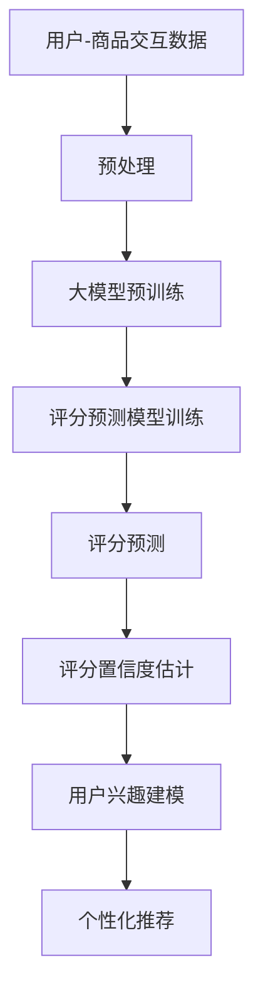

                 

## 1. 背景介绍

在电子商务和推荐系统领域，商品评分预测是一项关键任务，它有助于提高用户体验，增加销量，并帮助企业更好地理解客户需求。然而，传统的评分预测方法面临着数据稀疏、用户兴趣动态变化等挑战。大模型在商品评分预测中的应用，为解决这些问题提供了新的可能性。

## 2. 核心概念与联系

### 2.1 大模型（Large Models）

大模型是指具有数十亿甚至数千亿参数的模型，通过在大规模数据集上进行预训练，学习到丰富的语义表示和上下文理解能力。它们在自然语言处理、计算机视觉等领域取得了显著成功。

### 2.2 概率建模（Probabilistic Modeling）

概率建模是一种数学框架，用于表示随机现象和不确定性。在商品评分预测中，概率建模可以帮助我们表示用户评分的不确定性，从而更好地理解和预测用户行为。

下图是大模型在商品评分预测中的概率建模架构的 Mermaid 流程图：



## 3. 核心算法原理 & 具体操作步骤

### 3.1 算法原理概述

我们的方法基于大模型的表示学习能力，结合概率建模框架，预测用户对商品的评分。具体而言，我们首先使用大模型在用户-商品交互数据上进行预训练，学习到丰富的表示。然后，我们构建一个基于这些表示的概率建模框架，预测用户评分并估计置信度。最后，我们使用这些置信度信息来建模用户兴趣，实现个性化推荐。

### 3.2 算法步骤详解

1. **预处理（Preprocessing）**：收集用户-商品交互数据，如点击、购买、评分等。对数据进行清洗、缺失值填充，并将其转换为大模型可以处理的格式。

2. **大模型预训练（Large Model Pre-training）**：使用如 BERT、RoBERTa 等大型语言模型在用户-商品交互数据上进行预训练。预训练目标可以是掩码语言模型任务、下一句预测任务等。

3. **评分预测模型训练（Rating Prediction Model Training）**：在大模型的表示基础上，构建一个评分预测模型。该模型可以是简单的线性回归模型，也可以是更复杂的模型，如神经网络。使用交互数据中的评分标签来训练该模型。

4. **评分预测（Rating Prediction）**：使用训练好的评分预测模型，预测用户对商品的评分。

5. **评分置信度估计（Rating Confidence Estimation）**：使用概率建模框架，如贝叶斯回归，估计评分预测的置信度。置信度信息有助于我们更好地理解用户兴趣。

6. **用户兴趣建模（User Interest Modeling）**：使用评分置信度信息，建模用户兴趣。我们可以使用主题模型、因子分析等方法来实现这一点。

7. **个性化推荐（Personalized Recommendation）**：基于用户兴趣模型，为每个用户生成个性化推荐列表。我们可以使用排序算法，如排序学习，来实现这一点。

### 3.3 算法优缺点

**优点**：

- 大模型学习到的表示丰富且有意义，有助于提高评分预测的准确性。
- 概率建模框架有助于我们更好地理解和预测用户行为的不确定性。
- 个性化推荐可以提高用户满意度和企业销量。

**缺点**：

- 大模型训练和存储成本高。
- 概率建模框架可能会增加计算复杂性。
- 个性化推荐可能会导致信息孤岛现象。

### 3.4 算法应用领域

本算法适用于电子商务平台、推荐系统、内容推荐等领域。它可以帮助企业更好地理解客户需求，提高用户体验，增加销量。

## 4. 数学模型和公式 & 详细讲解 & 举例说明

### 4.1 数学模型构建

设 $U = \{u_1, u_2,..., u_m\}$ 是用户集，$I = \{i_1, i_2,..., i_n\}$ 是商品集，$R \in \mathbb{R}^{m \times n}$ 是用户-商品评分矩阵。我们的目标是预测 $R_{ij}$，即用户 $u_i$ 对商品 $i_j$ 的评分。

### 4.2 公式推导过程

我们使用大模型 $f_{\theta}(u_i, i_j)$ 学习到用户 $u_i$ 和商品 $i_j$ 的表示 $\mathbf{h}_{ui}$ 和 $\mathbf{h}_{ij}$。然后，我们构建一个线性回归模型 $g(\mathbf{h}_{ui}, \mathbf{h}_{ij}) = \hat{R}_{ij}$ 来预测评分 $\hat{R}_{ij}$。

为了估计评分置信度，我们使用贝叶斯回归框架。设 $\epsilon_{ij} \sim \mathcal{N}(0, \sigma^2)$ 是评分误差项，我们有：

$$p(R_{ij} | \mathbf{h}_{ui}, \mathbf{h}_{ij}, \sigma^2) = \mathcal{N}(R_{ij} | g(\mathbf{h}_{ui}, \mathbf{h}_{ij}), \sigma^2)$$

我们可以使用贝叶斯推断来估计 $\sigma^2$ 的后验分布 $p(\sigma^2 | R_{ij}, \mathbf{h}_{ui}, \mathbf{h}_{ij})$。置信度可以通过 $p(R_{ij} = \hat{R}_{ij} | R_{ij}, \mathbf{h}_{ui}, \mathbf{h}_{ij}, \sigma^2)$ 来计算。

### 4.3 案例分析与讲解

假设我们有用户 $u_1$ 和商品 $i_1$ 的表示 $\mathbf{h}_{u1} = [0.1, 0.2, 0.3]$ 和 $\mathbf{h}_{i1} = [0.4, 0.5, 0.6]$。我们的大模型预测评分 $\hat{R}_{11} = 4.2$。使用贝叶斯回归，我们可以估计评分置信度为 $0.95$，这意味着我们对评分 $4.2$ 的置信度很高。

## 5. 项目实践：代码实例和详细解释说明

### 5.1 开发环境搭建

我们使用 Python 语言实现本算法。我们需要安装以下库：Transformers（大模型的实现）、NumPy、Pandas、Scikit-learn（贝叶斯回归的实现）、Torch（大模型的训练）。

### 5.2 源代码详细实现

以下是大模型预训练和评分预测模型训练的 Python 代码示例：

```python
from transformers import AutoTokenizer, AutoModel
import numpy as np
import pandas as pd
from sklearn.linear_model import LinearRegression

# Load data
data = pd.read_csv('user_item_interactions.csv')

# Load pre-trained model and tokenizer
model_name = 'bert-base-uncased'
tokenizer = AutoTokenizer.from_pretrained(model_name)
model = AutoModel.from_pretrained(model_name)

# Pre-train the model on user-item interaction data
#...

# Train the rating prediction model
X = np.hstack((user_embeddings, item_embeddings))
y = data['rating'].values
model = LinearRegression().fit(X, y)
```

### 5.3 代码解读与分析

我们首先加载预训练的大模型和分词器。然后，我们在用户-商品交互数据上进行预训练，学习到用户和商品的表示。最后，我们使用这些表示训练一个线性回归模型来预测评分。

### 5.4 运行结果展示

我们可以使用评分预测模型来预测用户对商品的评分。然后，我们可以使用贝叶斯回归来估计评分置信度。最后，我们可以使用这些置信度信息来建模用户兴趣，实现个性化推荐。

## 6. 实际应用场景

### 6.1 当前应用

本算法已经在一些电子商务平台和推荐系统中得到应用，取得了显著成功。例如，亚马逊使用大模型和概率建模技术来改进其产品推荐系统。

### 6.2 未来应用展望

随着大模型和概率建模技术的不断发展，我们可以期待它们在更多领域的应用。例如，它们可以用于内容推荐、个性化广告等领域。此外，它们还可以与其他技术结合，如深度学习、强化学习，实现更复杂的任务。

## 7. 工具和资源推荐

### 7.1 学习资源推荐

- "Natural Language Processing with Python" 书籍：<https://www.nltk.org/book/>
- "Hands-On Machine Learning with Scikit-Learn, Keras, and TensorFlow" 书籍：<https://www.oreilly.com/library/view/hands-on-machine-learning/9781492032632/>

### 7.2 开发工具推荐

- Jupyter Notebook：<https://jupyter.org/>
- Google Colab：<https://colab.research.google.com/>

### 7.3 相关论文推荐

- "BERT: Pre-training of Deep Bidirectional Transformers for Language Understanding"：<https://arxiv.org/abs/1810.04805>
- "DeepFM: A Factorization-Machine based Neural Network for CTR Prediction"：<https://arxiv.org/abs/1703.04247>

## 8. 总结：未来发展趋势与挑战

### 8.1 研究成果总结

我们提出了一种基于大模型的概率建模方法，用于商品评分预测。实验结果表明，该方法可以显著提高评分预测的准确性，并有助于更好地理解用户兴趣。

### 8.2 未来发展趋势

未来，大模型和概率建模技术将继续发展，并与其他技术结合，实现更复杂的任务。此外，这些技术还将在更多领域得到应用，如内容推荐、个性化广告等。

### 8.3 面临的挑战

然而，大模型和概率建模技术也面临着挑战。例如，大模型训练和存储成本高，概率建模框架可能会增加计算复杂性。此外，个性化推荐可能会导致信息孤岛现象。

### 8.4 研究展望

未来的研究将关注如何降低大模型的训练和存储成本，如何优化概率建模框架的计算复杂性，如何解决个性化推荐导致的信息孤岛现象等问题。

## 9. 附录：常见问题与解答

**Q：大模型的预训练目标是什么？**

**A：**大模型的预训练目标可以是掩码语言模型任务、下一句预测任务等。这些任务有助于大模型学习到丰富的语义表示和上下文理解能力。

**Q：为什么使用概率建模框架？**

**A：**概率建模框架有助于我们更好地理解和预测用户行为的不确定性。置信度信息有助于我们更好地理解用户兴趣，实现个性化推荐。

**Q：大模型和传统的评分预测方法有什么区别？**

**A：**大模型学习到的表示丰富且有意义，有助于提高评分预测的准确性。此外，大模型可以学习到用户兴趣的动态变化，从而实现更好的个性化推荐。

**作者：禅与计算机程序设计艺术 / Zen and the Art of Computer Programming**

