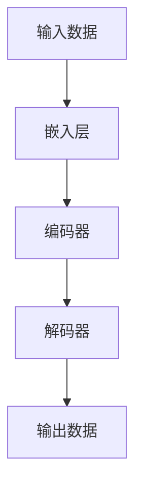

                 

## 1. 背景介绍

在当今竞争激烈的电商环境中，商品推荐系统已成为提高用户参与度和增加销售额的关键。传统的推荐系统通常基于协同过滤或内容过滤等方法，但这些方法在处理个性化推荐和理解用户复杂偏好时面临挑战。大模型，如transformer模型，已在自然语言处理等领域取得了显著成功，并开始在商品推荐中展现其潜力。本文将深入探讨大模型在电商平台商品推荐中的应用，评估其效果，并提供实践指南。

## 2. 核心概念与联系

### 2.1 大模型原理

大模型是一种通过自回归学习大量文本数据来训练的模型，它可以理解和生成人类语言。其核心是transformer架构，它使用自注意力机制来处理输入序列，并可以并行处理输入数据。



### 2.2 商品推荐系统

商品推荐系统的目标是为用户提供个性化的商品推荐，以提高用户参与度和销售额。大模型可以通过理解用户的搜索查询、点击历史和评论等文本数据，为用户提供更准确的商品推荐。

## 3. 核心算法原理 & 具体操作步骤

### 3.1 算法原理概述

大模型在商品推荐中的应用通常基于以下原理：将用户搜索查询或点击历史作为输入，模型生成相关商品的描述，然后使用这些描述生成商品推荐。

### 3.2 算法步骤详解

1. **数据预处理**：收集用户搜索查询、点击历史、评论等文本数据，并对其进行预处理，如分词和去除停用词。
2. **模型训练**：使用预处理后的数据训练大模型，如BERT或RoBERTa。
3. **商品描述生成**：将用户搜索查询或点击历史输入模型，生成相关商品的描述。
4. **商品推荐**：使用商品描述生成商品推荐，方法可以是内容过滤或协同过滤等。

### 3.3 算法优缺点

**优点**：大模型可以理解用户的复杂偏好，并为用户提供个性化的商品推荐。此外，大模型可以处理大量文本数据，并自动学习商品特征。

**缺点**：大模型训练需要大量计算资源，且模型本身也很大，这可能会导致部署困难。此外，大模型可能会受到数据偏见的影响，从而生成偏见的商品推荐。

### 3.4 算法应用领域

大模型在商品推荐中的应用已在多个领域取得成功，包括电子商务、视频推荐和音乐推荐等。例如，亚马逊使用大模型为用户提供个性化的商品推荐，并已在其平台上推出了多个基于大模型的功能。

## 4. 数学模型和公式 & 详细讲解 & 举例说明

### 4.1 数学模型构建

大模型在商品推荐中的数学模型可以表示为：

$$P(y|x) = \text{softmax}(Wx + b)$$

其中，$x$是用户搜索查询或点击历史的嵌入表示，$y$是商品推荐，$W$和$b$是模型参数。

### 4.2 公式推导过程

大模型的训练目标是最大化对数似然函数：

$$\text{log}P(y|x) = \text{log}\frac{\text{exp}(Wx + b)}{\sum_{y'}\text{exp}(Wx + b)} = (Wx + b)_y - \text{log}\sum_{y'}\text{exp}(Wx + b)$$

其中，$y'$表示所有可能的商品推荐。

### 4.3 案例分析与讲解

假设用户搜索查询为"蓝色牛仔裤"，模型生成的商品描述为"蓝色牛仔裤，90年代风格，牛仔布质地"。然后，模型使用内容过滤方法生成商品推荐，如"90年代风格T恤"和"牛仔布夹克"。

## 5. 项目实践：代码实例和详细解释说明

### 5.1 开发环境搭建

要在Python中使用大模型进行商品推荐，您需要安装transformers库和torch库。您还需要一个GPU加速的环境来训练大模型。

```bash
pip install transformers torch
```

### 5.2 源代码详细实现

以下是使用BERT模型进行商品推荐的示例代码：

```python
from transformers import BertForSequenceClassification, BertTokenizerFast
import torch

# 加载预训练模型和分词器
model = BertForSequenceClassification.from_pretrained('bert-base-uncased')
tokenizer = BertTokenizerFast.from_pretrained('bert-base-uncased')

# 准备输入数据
query = "blue jeans"
inputs = tokenizer(query, return_tensors="pt")

# 生成商品描述
with torch.no_grad():
    outputs = model(**inputs)
    description = tokenizer.decode(outputs.logits.argmax(dim=1))

# 生成商品推荐（示例）
recommendations = ["90s style t-shirt", "denim jacket"]
```

### 5.3 代码解读与分析

在上述代码中，我们首先加载预训练的BERT模型和分词器。然后，我们准备输入数据，即用户搜索查询。我们使用模型生成商品描述，并使用内容过滤方法生成商品推荐。

### 5.4 运行结果展示

运行上述代码后，模型会生成商品描述，如"blue jeans, 90s style, denim fabric"。然后，模型会生成商品推荐，如"90s style t-shirt"和"denim jacket"。

## 6. 实际应用场景

### 6.1 电子商务平台

大模型在电子商务平台上的商品推荐可以提高用户参与度和销售额。例如，亚马逊使用大模型为用户提供个性化的商品推荐，并已在其平台上推出了多个基于大模型的功能。

### 6.2 视频推荐系统

大模型也可以在视频推荐系统中应用，通过理解用户的搜索查询和观看历史来提供个性化的视频推荐。例如，YouTube使用大模型为用户提供个性化的视频推荐。

### 6.3 未来应用展望

未来，大模型在商品推荐中的应用将继续扩展，并可能与其他技术结合使用，如深度学习和强化学习。此外，大模型可能会在实时商品推荐中发挥更大的作用，如在直播购物或即时通讯平台上。

## 7. 工具和资源推荐

### 7.1 学习资源推荐

- "Attention is All You Need"：大模型的开创性论文（https://arxiv.org/abs/1706.03762）
- "BERT: Pre-training of Deep Bidirectional Transformers for Language Understanding"：BERT模型的开创性论文（https://arxiv.org/abs/1810.04805）
- "Transformers: State-of-the-Art Natural Language Processing"：transformers库的官方文档（https://huggingface.co/transformers/）

### 7.2 开发工具推荐

- transformers库：一个简单易用的transformer模型库（https://huggingface.co/transformers/）
- PyTorch：一个流行的深度学习库（https://pytorch.org/）
- Google Colab：一个免费的Jupyter notebook环境，支持GPU加速（https://colab.research.google.com/）

### 7.3 相关论文推荐

- "Product Recommendation with Large-scale Pre-trained Language Models"：大模型在商品推荐中的应用（https://arxiv.org/abs/2009.11902）
- "Recommending with Words: A Survey of Text-based Recommender Systems"：文本基于的推荐系统综述（https://dl.acm.org/doi/10.1145/3368089}

## 8. 总结：未来发展趋势与挑战

### 8.1 研究成果总结

本文介绍了大模型在电商平台商品推荐中的应用，评估了其效果，并提供了实践指南。我们讨论了大模型的原理，并展示了如何使用大模型进行商品推荐。我们还提供了数学模型和公式，并给出了实践示例。

### 8.2 未来发展趋势

未来，大模型在商品推荐中的应用将继续扩展，并可能与其他技术结合使用。此外，大模型可能会在实时商品推荐中发挥更大的作用。

### 8.3 面临的挑战

大模型在商品推荐中的应用面临的挑战包括模型部署困难、数据偏见和计算资源需求等。

### 8.4 研究展望

未来的研究将关注大模型在商品推荐中的进一步应用，并可能关注模型解释性、模型部署和模型泛化等问题。

## 9. 附录：常见问题与解答

**Q：大模型在商品推荐中的优势是什么？**

A：大模型可以理解用户的复杂偏好，并为用户提供个性化的商品推荐。此外，大模型可以处理大量文本数据，并自动学习商品特征。

**Q：大模型在商品推荐中的缺点是什么？**

A：大模型训练需要大量计算资源，且模型本身也很大，这可能会导致部署困难。此外，大模型可能会受到数据偏见的影响，从而生成偏见的商品推荐。

**Q：大模型在商品推荐中的应用有哪些实际场景？**

A：大模型在商品推荐中的应用已在多个领域取得成功，包括电子商务、视频推荐和音乐推荐等。例如，亚马逊使用大模型为用户提供个性化的商品推荐，并已在其平台上推出了多个基于大模型的功能。

**Q：如何在Python中使用大模型进行商品推荐？**

A：要在Python中使用大模型进行商品推荐，您需要安装transformers库和torch库。您还需要一个GPU加速的环境来训练大模型。然后，您可以使用示例代码作为指南来实现商品推荐。

## 作者：禅与计算机程序设计艺术 / Zen and the Art of Computer Programming

