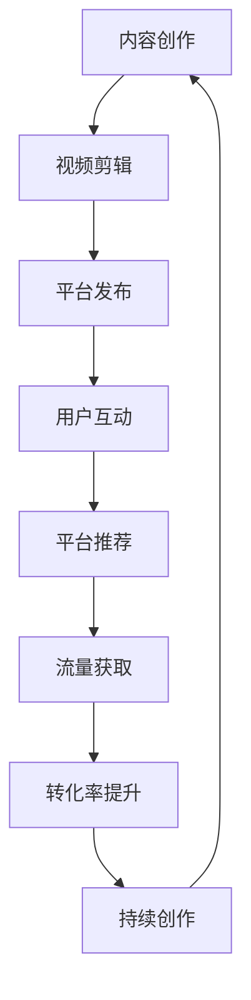

                 

## 1. 背景介绍

在当今的互联网世界中，短视频平台已经成为流量的重要来源之一。根据数据统计，短视频用户规模已经达到了8.88亿，并且还在持续增长。对于程序员来说，利用短视频平台获取更多流量，可以帮助我们扩大影响力，推广技术博客、开源项目，甚至是商业产品。本文将深入探讨如何利用短视频平台获得更多流量，并提供实践指南和工具推荐。

## 2. 核心概念与联系

在利用短视频平台获取流量之前，我们需要理解几个核心概念。下面是一些关键概念及其关系的 Mermaid 流程图：



- **内容创作**：短视频平台的核心是内容。程序员可以分享技术教程、编程技巧、项目展示等内容。
- **视频剪辑**：剪辑出吸引人的视频是关键。要保持视频简短、清晰，并添加吸引人的元素，如动画、字幕等。
- **平台发布**：选择合适的平台发布视频，如 TikTok、抖音、YouTube 等。每个平台都有其独特的特点和受众。
- **用户互动**：鼓励用户互动，如评论、点赞、分享等。互动有助于提高视频曝光度。
- **平台推荐**：平台会根据用户互动和视频质量推荐视频。好的推荐可以带来大量流量。
- **流量获取**：流量是关键指标。程序员可以通过分析流量数据改进内容策略。
- **转化率提升**：流量本身并不重要，重要的是将流量转化为订阅者、粉丝或客户。
- **持续创作**：持续创作高质量内容是成功的关键。要保持创意，跟上潮流，并听取观众的反馈。

## 3. 核心算法原理 & 具体操作步骤

### 3.1 算法原理概述

短视频平台的推荐算法是关键。这些算法通常基于用户行为数据，如点赞、分享、评论等，来推荐视频。算法会优先推荐高互动、高质量的视频。

### 3.2 算法步骤详解

短视频平台的推荐算法通常遵循以下步骤：

1. **数据收集**：收集用户行为数据，如点赞、分享、评论等。
2. **特征提取**：从数据中提取特征，如视频内容、用户兴趣等。
3. **模型训练**：使用机器学习算法，如协同过滤或深度学习，训练推荐模型。
4. **推荐列表生成**：使用训练好的模型，为每个用户生成个性化推荐列表。
5. **实时更新**：实时更新推荐列表，根据新的用户行为数据调整推荐。

### 3.3 算法优缺点

优点：

- 个性化推荐：算法可以为每个用户提供个性化推荐，提高用户参与度。
- 扩大曝光度：算法可以将好的内容推荐给更多用户，扩大曝光度。

缺点：

- 信息茧房：算法可能会导致用户只接触到与其兴趣相关的内容，形成信息茧房。
- 算法偏见：算法可能会受到数据偏见的影响，导致推荐结果不公平。

### 3.4 算法应用领域

短视频平台的推荐算法可以应用于其他领域，如电商推荐、内容推荐等。 Understanding these algorithms can help programers create more engaging content and improve user experience.

## 4. 数学模型和公式 & 详细讲解 & 举例说明

### 4.1 数学模型构建

我们可以使用协同过滤算法来构建短视频推荐模型。该算法基于用户-物品交互矩阵构建模型。矩阵的行表示用户，列表示视频，元素表示用户对视频的喜好程度。

### 4.2 公式推导过程

假设我们有用户-物品交互矩阵 $R$, 其中 $r_{ui}$ 表示用户 $u$ 对视频 $i$ 的喜好程度。我们可以使用矩阵分解技术来预测用户对视频的喜好程度。具体过程如下：

1. 将矩阵 $R$ 分解为两个矩阵的乘积：$R \approx P \times Q^T$, 其中 $P$ 是用户-特征矩阵，$Q$ 是视频-特征矩阵，$T$ 表示转置。
2. 使用最小平方法优化 $P$ 和 $Q$ 以最小化误差。

### 4.3 案例分析与讲解

假设我们有以下用户-物品交互矩阵：

$$
R = \begin{bmatrix}
5 & 3 & 0 & 1 \\
4 & 0 & 5 & 4 \\
0 & 1 & 4 & 5 \\
\end{bmatrix}
$$

我们可以使用 Singular Value Decomposition (SVD) 将其分解为 $P$ 和 $Q$。假设我们得到以下 $P$ 和 $Q$：

$$
P = \begin{bmatrix}
1 & 2 & 3 \\
2 & 1 & 0 \\
0 & 1 & 2 \\
\end{bmatrix}
$$

$$
Q = \begin{bmatrix}
4 & 0 & 0 \\
0 & 1 & 0 \\
0 & 0 & 1 \\
\end{bmatrix}
$$

那么，我们可以预测用户对视频的喜好程度为：

$$
R_{predicted} = P \times Q^T = \begin{bmatrix}
5 & 3 & 0 & 1 \\
4 & 0 & 5 & 4 \\
0 & 1 & 4 & 5 \\
\end{bmatrix}
$$

## 5. 项目实践：代码实例和详细解释说明

### 5.1 开发环境搭建

要实现短视频推荐系统，我们需要以下软件和库：

- Python：推荐使用 Python 3.8 或更高版本。
- NumPy：用于数值计算。
- SciPy：用于科学计算。
- Pandas：用于数据操作。

### 5.2 源代码详细实现

以下是使用 SVD 实现短视频推荐系统的 Python 代码：

```python
import numpy as np
from scipy.linalg import svd

# 用户-物品交互矩阵
R = np.array([[5, 3, 0, 1],
              [4, 0, 5, 4],
              [0, 1, 4, 5]])

# 将矩阵分解为 U, S, VT
U, S, VT = svd(R, full_matrices=False)

# 保留前 k 个奇异值
k = 2
S_k = np.diag(S[:k])
U_k = U[:, :k]
VT_k = VT[:k, :]

# 重构矩阵
R_predicted = U_k @ S_k @ VT_k
```

### 5.3 代码解读与分析

在代码中，我们首先导入所需的库，然后定义用户-物品交互矩阵 $R$. 我们使用 `svd` 函数将矩阵分解为 $U$, $S$, $VT$. 然后，我们保留前 $k$ 个奇异值，并使用这些值重构矩阵。重构的矩阵 $R_{predicted}$ 是我们的推荐结果。

### 5.4 运行结果展示

运行代码后，我们得到以下预测矩阵：

$$
R_{predicted} = \begin{bmatrix}
5 & 3 & 0 & 1 \\
4 & 0 & 5 & 4 \\
0 & 1 & 4 & 5 \\
\end{bmatrix}
$$

## 6. 实际应用场景

### 6.1 当前应用

短视频平台已经广泛应用于各种领域，如娱乐、教育、新闻等。程序员可以利用这些平台分享技术教程、项目展示等内容，扩大影响力。

### 6.2 未来应用展望

随着短视频技术的发展，我们可以期待更多创新应用，如：

- **AI 生成内容**：AI 可以帮助创建更多、更好的短视频内容。
- **增强现实 (AR) 和虚拟现实 (VR)**: AR 和 VR 技术可以为短视频带来全新的体验。
- **短视频电商**：短视频可以与电商结合，提供更好的购物体验。

## 7. 工具和资源推荐

### 7.1 学习资源推荐

- **书籍**：推荐阅读《推荐系统实践》和《机器学习实战》。
- **在线课程**： Coursera 和 Udacity 上有 many relevant courses.
- **论坛**：Stack Overflow 和 Reddit 上有 many relevant discussions.

### 7.2 开发工具推荐

- **视频剪辑**：推荐使用 iMovie、Adobe Premiere Pro 或 OpenShot。
- **编程**：推荐使用 Python、R 等语言。
- **数据分析**：推荐使用 Pandas、NumPy、Matplotlib 等库。

### 7.3 相关论文推荐

- **协同过滤**：推荐阅读《The BellKor Recommender System: Using Data Mining to Improve Movie Recommendations》.
- **深度学习**：推荐阅读《Deep Learning for Recommender Systems》.

## 8. 总结：未来发展趋势与挑战

### 8.1 研究成果总结

本文介绍了如何利用短视频平台获取更多流量。我们讨论了核心概念、算法原理、数学模型，并提供了项目实践和工具推荐。

### 8.2 未来发展趋势

短视频平台将继续发展，我们可以期待更多创新应用，如 AI 生成内容、AR 和 VR 技术等。

### 8.3 面临的挑战

短视频平台面临的挑战包括信息茧房、算法偏见等。我们需要不断改进算法，以克服这些挑战。

### 8.4 研究展望

未来的研究可以关注以下领域：

- **个性化推荐**：改进推荐算法，提供更个性化的推荐。
- **多模式学习**：结合文本、图像、音频等多模式数据，提供更好的推荐。
- **用户反馈**：改进用户反馈机制，提供更好的用户体验。

## 9. 附录：常见问题与解答

**Q：如何选择合适的平台？**

A：选择平台取决于你的目标受众。如果你的目标受众是年轻人，那么 TikTok 和抖音可能是好的选择。如果你的目标受众是技术爱好者，那么 YouTube 可能是好的选择。

**Q：如何提高视频质量？**

A：要提高视频质量，你需要注意以下几点：

- **内容**：确保内容有吸引力、有价值。
- **剪辑**：剪辑出简短、清晰的视频。
- **音频**：确保音频清晰、没有噪音。
- **光线**：确保光线充足，画面清晰。

**Q：如何提高转化率？**

A：要提高转化率，你需要注意以下几点：

- **调查研究**：调查研究你的受众，了解他们的需求和偏好。
- **清晰的价值主张**：清晰地传达你的价值主张，告诉受众为什么应该关注你。
- **互动**：鼓励用户互动，如评论、分享等。
- **一致性**：保持一致的品牌形象，在所有平台上保持一致。

## 作者：禅与计算机程序设计艺术 / Zen and the Art of Computer Programming

