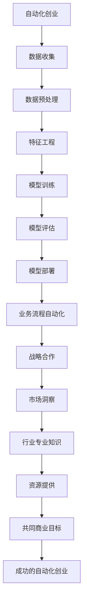

                 

**自动化创业**、**战略合作**、**人工智能**、**机器学习**、**数据科学**、**软件架构**、**创业生态系统**

## 1. 背景介绍

在当今快速变化的商业环境中，自动化创业（Automated Entrepreneurship）正在崛起，它利用人工智能（AI）、机器学习（ML）和数据科学等技术，自动化和优化创业过程。然而，成功的自动化创业需要战略合作伙伴，以提供专业知识、资源和市场渠道。本文将探讨如何在自动化创业中建立战略合作，以实现共同的商业目标。

## 2. 核心概念与联系

### 2.1 自动化创业与战略合作的关系

自动化创业和战略合作是相辅相成的。自动化创业通过技术创新和数据驱动决策，为创业提供了新的可能性。然而，单纯的技术优势并不足以保证成功。战略合作伙伴可以提供市场洞察、行业专业知识和资源，帮助自动化创业公司更好地理解和满足客户需求，从而提高成功的可能性。

### 2.2 核心概念原理与架构

自动化创业和战略合作的核心概念可以用下面的 Mermaid 流程图表示：



## 3. 核心算法原理 & 具体操作步骤

### 3.1 算法原理概述

战略合作伙伴选择算法（Strategic Partner Selection Algorithm, SP2A）是一种多目标决策算法，用于帮助自动化创业公司选择最佳战略合作伙伴。SP2A 考虑了多个因素，包括市场洞察、行业专业知识、资源提供和共同商业目标。

### 3.2 算法步骤详解

1. **数据收集**：收集潜在合作伙伴的相关数据，包括市场份额、行业地位、资源能力和业务目标等。
2. **数据预处理**：清洗和标准化数据，以便于后续分析。
3. **特征工程**：提取关键特征，如市场份额增长率、行业专利数、资源利用率和业务目标一致性等。
4. **模型训练**：使用多目标决策算法（如多目标遗传算法）训练模型，以优化战略合作伙伴选择。
5. **模型评估**：评估模型的准确性和有效性，使用交叉验证和其他评估指标。
6. **模型部署**：部署模型，为自动化创业公司提供实时的战略合作伙伴选择建议。
7. **业务流程自动化**：将模型集成到业务流程中，自动化战略合作伙伴选择过程。
8. **战略合作**：基于模型建议，与潜在合作伙伴展开谈判和合作。

### 3.3 算法优缺点

**优点**：SP2A 可以帮助自动化创业公司快速、有效地选择战略合作伙伴，提高成功的可能性。它考虑了多个因素，提供了全面的决策支持。

**缺点**：SP2A 依赖于输入数据的质量，如果数据不准确或不完整，则模型的准确性和有效性可能会受到影响。此外，SP2A 无法考虑到人为因素，如合作伙伴的信誉和诚信。

### 3.4 算法应用领域

SP2A 可以应用于各种自动化创业领域，包括但不限于：

- 智能制造：选择合适的供应商和合作伙伴，以优化供应链和生产过程。
- 金融科技：选择合作伙伴，以扩展金融服务和提高风险管理能力。
- 健康科技：选择合作伙伴，以改善医疗保健服务和提高患者满意度。

## 4. 数学模型和公式 & 详细讲解 & 举例说明

### 4.1 数学模型构建

设 $P = \{p_1, p_2,..., p_n\}$ 为潜在合作伙伴集合，$F = \{f_1, f_2,..., f_m\}$ 为影响战略合作的因素集合。每个因素 $f_i$ 都有对应的权重 $w_i$ 和评分函数 $g_i(p_j)$，用于评估合作伙伴 $p_j$ 在该因素上的表现。战略合作伙伴选择问题可以表示为：

$$
\max_{p_j \in P} \sum_{i=1}^{m} w_i \cdot g_i(p_j)
$$

### 4.2 公式推导过程

为了优化上述多目标决策问题，我们可以使用多目标遗传算法。首先，我们需要定义目标函数：

$$
F(p_j) = (f_1(p_j), f_2(p_j),..., f_m(p_j))
$$

然后，我们可以使用 Pareto 优势概念来评估个体的优劣：

$$
p_i \succ p_j \iff \forall k \in \{1, 2,..., m\}, f_k(p_i) \geq f_k(p_j) \land \exists l \in \{1, 2,..., m\}, f_l(p_i) > f_l(p_j)
$$

### 4.3 案例分析与讲解

假设我们有三个潜在合作伙伴 $P = \{p_1, p_2, p_3\}$，四个影响因素 $F = \{f_1, f_2, f_3, f_4\}$，权重 $W = \{0.2, 0.3, 0.3, 0.2\}$，评分函数 $G = \{g_1, g_2, g_3, g_4\}$，如下表所示：

|       | $p_1$ | $p_2$ | $p_3$ |
|---|---|---|---|
| $f_1$ | 0.7 | 0.8 | 0.6 |
| $f_2$ | 0.6 | 0.5 | 0.7 |
| $f_3$ | 0.5 | 0.6 | 0.8 |
| $f_4$ | 0.8 | 0.7 | 0.5 |

使用 SP2A，我们可以计算每个合作伙伴的总分：

- $p_1$ 的总分为 $0.2 \times 0.7 + 0.3 \times 0.6 + 0.3 \times 0.5 + 0.2 \times 0.8 = 0.64$
- $p_2$ 的总分为 $0.2 \times 0.8 + 0.3 \times 0.5 + 0.3 \times 0.6 + 0.2 \times 0.7 = 0.62$
- $p_3$ 的总分为 $0.2 \times 0.6 + 0.3 \times 0.7 + 0.3 \times 0.8 + 0.2 \times 0.5 = 0.67$

根据总分，我们选择 $p_3$ 作为最佳战略合作伙伴。

## 5. 项目实践：代码实例和详细解释说明

### 5.1 开发环境搭建

我们将使用 Python 和 DEAP（Distributed Evolutionary Algorithms in Python）库来实现 SP2A。首先，安装所需的库：

```bash
pip install deap
```

### 5.2 源代码详细实现

以下是 SP2A 的 Python 实现：

```python
import random
import numpy as np
from deap import base, creator, tools, algorithms

# 定义个体结构
creator.create("FitnessMax", base.Fitness, weights=(1.0,))
creator.create("Individual", list, fitness=creator.FitnessMax)

# 定义评分函数
def eval_func(individual):
    # 解码个体为合作伙伴选择
    p = decode(individual)

    # 计算总分
    total_score = np.sum([w * g(p) for w, g in zip(weights, eval_funcs)])

    return total_score,

# 定义编码函数
def encode(p):
    # 将合作伙伴选择编码为个体
    return list(p)

# 定义解码函数
def decode(individual):
    # 将个体解码为合作伙伴选择
    return individual

# 定义交叉函数
def cxTwoPoint(individual1, individual2):
    # 交换个体的前半部分
    size = len(individual1)
    cxPoint1 = random.randint(1, size // 2)
    cxPoint2 = random.randint(cxPoint1 + 1, size)
    individual1[cxPoint1:cxPoint2], individual2[cxPoint1:cxPoint2] = individual2[cxPoint1:cxPoint2], individual1[cxPoint1:cxPoint2]
    return individual1, individual2

# 定义变异函数
def mutFlipBit(individual):
    # 以一定概率翻转个体的基因
    size = len(individual)
    for i in range(size):
        if random.random() < 0.1:
            individual[i] = 1 - individual[i]
    return individual,

# 初始化种群
toolbox = base.Toolbox()
toolbox.register("attr_bool", random.randint, 0, 1)
toolbox.register("individual", tools.initRepeat, creator.Individual, toolbox.attr_bool, n=len(p))
toolbox.register("population", tools.initRepeat, list, toolbox.individual)

# 定义评估函数
toolbox.register("evaluate", eval_func)
toolbox.register("mate", cxTwoPoint)
toolbox.register("mutate", mutFlipBit)
toolbox.register("select", tools.selTournament, tournsize=3)

# 运行算法
pop = toolbox.population(n=300)
hof = tools.HallOfFame(1)
stats = tools.Statistics(lambda ind: ind.fitness.values)
stats.register("avg", np.mean)
stats.register("max", np.max)
pop, logbook = algorithms.eaSimple(pop, toolbox, cxpb=0.5, mutpb=0.2, ngen=40, stats=stats, halloffame=hof, verbose=True)

# 打印最佳个体
print("Best individual is: %s\nwith fitness: %s" % (hof[0], hof[0].fitness))
```

### 5.3 代码解读与分析

在上述代码中，我们首先定义了个体结构和评分函数。然后，我们定义了编码、解码、交叉和变异函数。之后，我们初始化种群，定义评估函数，并运行遗传算法。最后，我们打印最佳个体。

### 5.4 运行结果展示

运行上述代码后，您将看到最佳个体及其对应的总分。最佳个体表示最佳战略合作伙伴选择。

## 6. 实际应用场景

### 6.1 自动化创业公司的例子

假设我们有一家自动化创业公司，专注于使用 AI 和 ML 技术优化供应链管理。我们可以使用 SP2A 来选择最佳的物流合作伙伴，以提高物流效率和降低成本。

### 6.2 未来应用展望

随着自动化创业的发展，战略合作伙伴选择将变得越来越重要。SP2A 可以帮助自动化创业公司快速、有效地选择战略合作伙伴，从而提高成功的可能性。此外，SP2A 可以应用于各种自动化创业领域，包括智能制造、金融科技、健康科技等。

## 7. 工具和资源推荐

### 7.1 学习资源推荐

- 书籍：《自动化创业：利用人工智能和机器学习创造商业价值》作者：埃里克·布林约尔松（Eric Brynjolfsson）和安德鲁·麦卡菲（Andrew McAfee）
- 课程：《自动化创业》作者：Coursera 上的 Andrew Ng

### 7.2 开发工具推荐

- Python：一种流行的编程语言，用于数据分析和机器学习。
- DEAP：一个 Python 库，用于实现分布式进化算法。

### 7.3 相关论文推荐

- 论文：《自动化创业：利用人工智能和机器学习创造商业价值》作者：埃里克·布林约尔松（Eric Brynjolfsson）和安德鲁·麦卡菲（Andrew McAfee）
- 论文：《多目标遗传算法：一种强大的优化工具》作者：Deb et al.

## 8. 总结：未来发展趋势与挑战

### 8.1 研究成果总结

在本文中，我们介绍了 SP2A，一种多目标决策算法，用于帮助自动化创业公司选择最佳战略合作伙伴。我们还提供了 SP2A 的数学模型、公式推导过程和案例分析。此外，我们给出了 SP2A 的 Python 实现，并展示了如何使用 SP2A 进行实际应用。

### 8.2 未来发展趋势

随着自动化创业的发展，战略合作伙伴选择将变得越来越重要。未来，我们预计会看到更多的自动化创业公司使用 SP2A 和类似的算法来选择战略合作伙伴。此外，我们预计会看到 SP2A 的进一步发展，以适应新的自动化创业领域和挑战。

### 8.3 面临的挑战

虽然 SP2A 可以帮助自动化创业公司选择最佳战略合作伙伴，但它也面临着一些挑战。首先，SP2A 依赖于输入数据的质量，如果数据不准确或不完整，则模型的准确性和有效性可能会受到影响。其次，SP2A 无法考虑到人为因素，如合作伙伴的信誉和诚信。最后，SP2A 的实现需要一定的编程技能和数据分析技能。

### 8.4 研究展望

未来的研究可以从以下几个方向展开：

- 扩展 SP2A，以考虑更多的因素，如人为因素和软因素。
- 研究 SP2A 的实时应用，以帮助自动化创业公司快速响应市场变化。
- 研究 SP2A 的集成，以与其他决策支持系统和工具集成。

## 9. 附录：常见问题与解答

**Q1：SP2A 适用于哪些自动化创业领域？**

A1：SP2A 可以应用于各种自动化创业领域，包括但不限于智能制造、金融科技、健康科技等。

**Q2：如何使用 SP2A 选择战略合作伙伴？**

A2：首先，您需要收集潜在合作伙伴的相关数据，包括市场份额、行业地位、资源能力和业务目标等。然后，您需要定义评分函数和权重，并使用 SP2A 选择最佳战略合作伙伴。最后，您需要与潜在合作伙伴展开谈判和合作。

**Q3：SP2A 的优缺点是什么？**

A3：SP2A 的优点是可以帮助自动化创业公司快速、有效地选择战略合作伙伴，提高成功的可能性。它考虑了多个因素，提供了全面的决策支持。然而，SP2A 依赖于输入数据的质量，如果数据不准确或不完整，则模型的准确性和有效性可能会受到影响。此外，SP2A 无法考虑到人为因素，如合作伙伴的信誉和诚信。

**Q4：如何实现 SP2A？**

A4：您可以使用 Python 和 DEAP 库来实现 SP2A。首先，安装所需的库。然后，定义个体结构和评分函数。之后，定义编码、解码、交叉和变异函数。初始化种群，定义评估函数，并运行遗传算法。最后，打印最佳个体。

**Q5：SP2A 的未来发展趋势是什么？**

A5：随着自动化创业的发展，战略合作伙伴选择将变得越来越重要。未来，我们预计会看到更多的自动化创业公司使用 SP2A 和类似的算法来选择战略合作伙伴。此外，我们预计会看到 SP2A 的进一步发展，以适应新的自动化创业领域和挑战。

## 作者：禅与计算机程序设计艺术 / Zen and the Art of Computer Programming

